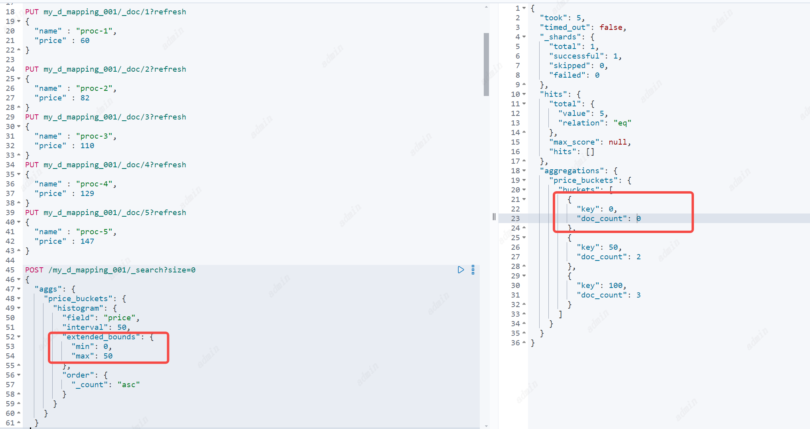
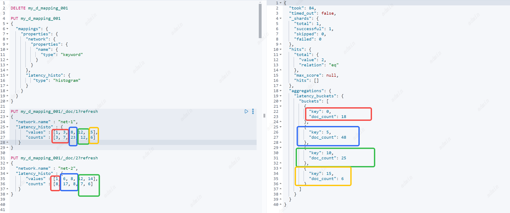

# Aggregations
聚合分为三种类型
1. Bucket Aggregations
2. Metric Aggregations
3. Pipeline Aggregations

## Bucket Aggregations
###  histogram aggregation
基于多桶值源的聚合，可应用于从文档中提取的数值或数值范围值。它动态地在这些值上构建固定大小(也称为间隔)的桶。
桶计算公式：`bucket_key = Math.floor((value - offset) / interval) * interval + offset`

日期直方图聚合，可以根据日期字段进行统计展示数据分布的直方图
参数
1. `field` : 必要参数、顶级参数，指定查询哪个字段。
2. `interval` : 选填，间隔，正浮点数
3. `min_doc_count` 选填，默认0，最小文档数，默认情况下返回所有的桶，设置这个字段后只有达到最小文档数的桶才返回，没达到不返回
4. `extended_bounds` 选填，指定构建桶的起点min和终点max，不指定就会根据实际文档构建开始和结束桶。extended_bounds也不会过滤桶如果实际文档超过min和max以实际为主，谁的范围更广取谁。可以“强制”直方图聚合在特定的最小值上开始构建桶，并继续构建桶直到最大值(即使不再有文档)。使用extended_bounds只有在min_doc_count为0时才有意义(如果min_doc_count大于0，则永远不会返回空桶)。
5. `hard_bounds` 选填，与extended_bounds相反，这个参数限制直方图桶的范围，它在开放数据范围的情况下特别有用，因为开放数据范围可能导致大量的存储桶。
6. `order ` 选填，排序可以根据桶的key或者value进行排序
7. `offset` 选填，偏移量可以指定桶开始计算的初始key，默认是0
8. `missing` 选填，缺省值，如果一个文档没有这个字段，默认情况下，它们将被忽略。设置这参数后使用缺省值进行统计。
```
PUT my_d_mapping_001
{
  "mappings": {
    "properties": {
       "name": {
         "type": "keyword"
      },
      "price": {
         "type": "long"
      }
    }
  }
}

PUT my_d_mapping_001/_doc/1?refresh
{
  "name" : "proc-1",
  "price" : 60
}

PUT my_d_mapping_001/_doc/2?refresh
{
  "name" : "proc-2",
  "price" : 82
}
PUT my_d_mapping_001/_doc/3?refresh
{
  "name" : "proc-3",
  "price" : 110
}
PUT my_d_mapping_001/_doc/4?refresh
{
  "name" : "proc-4",
  "price" : 129
}
PUT my_d_mapping_001/_doc/5?refresh
{
  "name" : "proc-5",
  "price" : 147
}


POST /my_d_mapping_001/_search?size=0
{
  "aggs": {
    "price_buckets": {
      "histogram": {
        "field": "price",
        "interval": 50,
        "extended_bounds": {
          "min": 0,
          "max": 50
        },
        "order": {
          "_count": "asc"
        }
      }
    }
  }
}

```


如果进行聚合的字段是直方图类型，那么会在直方图字段原始值范围上进行重新分桶。
```
PUT my_d_mapping_001
{
  "mappings": {
    "properties": {
      "network": {
        "properties": {
          "name": {
            "type": "keyword"
          }
        }
      },
      "latency_histo": {
         "type": "histogram"
      }
    }
  }
}

PUT my_d_mapping_001/_doc/1?refresh
{
  "network.name" : "net-1",
  "latency_histo" : {
      "values" : [1, 3, 8, 12, 15],
      "counts" : [3, 7, 23, 12, 6]
   }
}

PUT my_d_mapping_001/_doc/2?refresh
{
  "network.name" : "net-2",
  "latency_histo" : {
      "values" : [1, 6, 8, 12, 14],
      "counts" : [8, 17, 8, 7, 6]
   }
}
```

### date histogram aggregation
针对日期字段进行直方图分析，可以使用日期表达式和函数。
桶计算公式：`bucket_key = Math.floor(value / interval) * interval`
### Auto-interval date histogram aggregation