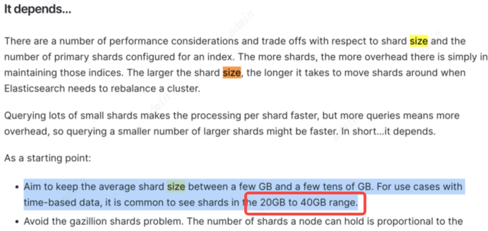

# ES实战案例

## 数据漂移

背景： 有10个ES节点（假设每个节点100GB数据），在进行ES升级时，陆续被关闭，升级完成后，启动ES节点，发现有一个节点数据量巨大，且无法启动

原因： 在节点陆续被关闭时，ES会对关闭了的节点上的数据进行重新分配，直到关闭最后一个节点时，基本上所有的数据都转移到了那个节点上，也就是发生了数据漂移。
数据漂移通常是指索引中的数据分布不均衡，导致某些节点的数据量过大，而其他节点的负载较轻。这种问题可能会影响集群性能，导致部分节点的压力过大，甚至导致节点崩溃或无法启动。为了避免这种问题，需要确保数据在集群中的分布是均衡的。
数据漂移的常见原因

1. 分片不均匀分配：默认情况下，Elasticsearch 会将数据分片分布到多个节点上，但如果节点数量不均衡，或者集群经历了频繁的节点添加或移除，可能会导致某些节点的数据量过大。
2. 文档写入模式：如果某些索引的文档写入请求集中的某个节点，这样会导致该节点的负载过重，而其他节点负载较轻。这通常与数据写入的负载均衡配置有关。
3. 硬件资源限制：某些节点可能由于硬件资源（如磁盘、内存或 CPU）不足，导致它们无法处理被分配给它们的分片，结果数据倾斜。
4. 分片大小过大：某些分片可能过大，导致数据迁移时无法均匀分配给所有节点。

排查:

1. 检查集群状态 首先，检查集群的健康状态和分片的分布情况。
   `
   GET /_cluster/health
   `

检查集群是否有任何未分配的分片。
`
GET /_cat/shards?v
`
识别是否有任何节点的数据量不均匀。

2. 手动触发分片重新分配 如果你发现某个节点上的数据量过大，可以通过手动触发分片重新分配来平衡集群中的负载。

```
   POST /_cluster/reroute
{
  "commands": [
    {
      "move": {
        "index": "your_index_name",//索引名称
        "shard": 0, 
        "from_node": "node_with_heavy_load", //从A节点转移到B节点
        "to_node": "other_node"
      }
    }
  ]
}

```
3. 启用自动分片重平衡
   Elasticsearch 在默认情况下会启用自动分片重平衡，但在某些情况下，你可能需要手动触发或确保该设置处于启用状态。
```
PUT /_cluster/settings
{
  "persistent": {
    "cluster.routing.rebalance.enable": "all"
  }
}

```

##解决ES数据倾斜：均衡处理最佳实践分享！
Elasticsearch是一个开源的分布式搜索和分析引擎，它构建在Apache Lucene库之上。它提供了一个分布式的、多租户的全文搜索引擎，可以实时地存储、检索和分析大规模的数据。今天分享ES在阿里的应用哈

1.现象：ES数据倾斜


正如各位老铁所见，这ES它不正常，贫富差距太大（有种我和马爸爸同乘电梯的即视感）：

1.分片不均衡。最大的40G，最小的2.4G，这是穷的穷死，富的富死。这种现象，在咱们老祖宗那里叫：朱门酒肉臭，路有冻死骨。

2.单分片过大。分片0号位，40G，这合理吗？这种东西会因为硬件、数据规模等的不同而不同，但符合"大数定理（在重复独立试验中，试验结果的平均数将收敛到期望值）"。

直接上官网链接：

https://www.elastic.co/guide/en/elasticsearch/reference/8.9/scalability.html





人家推荐的是20 – 40G，当然，人家也没说死要这个值，还委婉说了下：将（ElasticSearch）在外（不同的业务场景），军令（具体大小）有所不从（20G-40G）。反正参考给你了，具体怎么做，就看你了。你头铁，是你的事儿，与我何干。

这现象是怎么发生的呢？那就得先谈ES的Routing策略：

在 Elasticsearch 中，routing 是一个非常重要的概念，用于决定一个文档存储在哪一个分片上。默认情况下，Elasticsearch 会使用文档的 _id 来计算它应该路由到哪个分片。这是通过使用哈希函数对 _id 进行哈希计算，并将其结果与分片的数量取模得到的。

`shardId = hash(_id) % num_primary_shards`
也可以通过定义自定义的路由值来控制文档的分布。这可以在索引和搜索时通过指定 routing 参数来实现。自定义路由的主要好处是它允许将相关文档组织到同一分片中，这样可以提高搜索效率，因为搜索操作只需要在少数分片上执行，而不是整个索引。

而我们的业务场景属于B2B的 (公司对公司)，我们用一个公司的虚拟ID作为索引的_id，确保单客户数据都在一个分片上，查询速度更快。起初还没啥问题，但是后来发现来了一个大户，下面数据巨多，如此，便有了开头的那张图。

2.ES均衡处理
遇到以上问题，就是由盛而衰的转变。当我们NB业务（盛唐）在某次查询Timeout（安史之乱）后，就发现越来越慢了（进入了历史的转折点），那么我们接下来就需要开始处理均衡问题了（藩镇割据、外族入侵、宦官专权）。

Reindex

均衡方法有很多，最常用的是reindex，用起来超简单，先试试看。reindex 是一个非常有用的操作，它允许你将一个索引中的数据复制到另一个索引。这可能是因为多种原因，比如需要改变索引的映射（mapping）、修改分片的数量、进行数据清理、索引升级等。

reindex 操作在 Elasticsearch 中可以通过使用 _reindex API 来完成。这个 API 会从源索引（source index）读取文档，并将其写入到目标索引（destination index）。如果目标索引不存在，Elasticsearch 会自动创建它。

下面是一个简单的 reindex 操作的例子：
```
POST _reindex
{
"source": {
"index": "old_index"
},
"dest": {
"index": "new_index"
}
}
```

在这个例子中，"old_index" 是源索引，而 "new_index" 是目标索引。执行这个操作后，"old_index" 中的所有文档都会被复制到 "new_index"。

reindex 还支持更复杂的操作，比如在重新索引过程中使用脚本（script）修改数据，或者通过查询（query）参数只复制符合特定条件的文档。也可以加上routing策略的修改。
```
POST _reindex
{
"source": {
"index": "old_index",
"size": 5000 //表示每次从 old_index 中读取的文档数量。在这里，5000 表示一次读取最多 5000 个文档。如果没有指定 size，则默认是复制整个索引的数据。如果数据量较大，可以分批次读取和复制数据，以避免一次性负担过重。
},
"dest": {
"index": "new_index",
"version_type": "internal" //控制版本处理方式。在这里使用的是 internal，这意味着 Elasticsearch 会将目标索引的版本视为内部生成的，不会使用源文档中的版本信息。这通常用于确保版本号的一致性，不会产生版本冲突。
"routing": "new_routing" //表示文档在目标索引中将使用哪个路由值。Elasticsearch 使用 路由 来决定将文档存储到哪个分片。如果指定了 routing，则该文档会使用这个特定的路由值进行分配。这里的 new_routing 是自定义的路由值，意味着目标索引中的数据将按照这个路由进行分片分布。
}
}
```

用上面的配置跑一个试试，跑以后的效果还是很棒，数据一下就搞定了。然后十分激动得拒绝了此方案。测试环境CPU直接拉到警戒线（90%+），集群状态变为Yellow，这要是放生产环境跑，分分钟被吊打，喜提大礼包啊。


logstash

既然上个方法不好使，然后另辟蹊径。经过N次的验证发现，**整个过程的压力在于“写”，在Reindex过程中，会读取源Index数据，然后用reRouring后写入到新的Index中。在写的工程中，压力巨大**。所以造成了这个问题故障。

既然这样，我们能不能把读写做分离呢？咱们创建一个新的ES，然后做两个ES数据的同步，然后直接切ES库来完成均衡。感觉，好像可以感觉。那就来实际搞一波…...

创建一个新的集群或索引可以从根本上解决数据分布的问题。通过重新规划分片数、分片策略、路由策略等参数，确保新集群的负载分布更加均衡。例如：

1. 可以增加集群的节点数或分片数，以便分散数据存储负载。
2. 可以使用不同的路由策略，确保数据均匀地分布到不同的分片上。

在这里，采用Logstash来进行搬数据，搬的过程中，重新指定Routing策略。新的路由算法大概如下：

`shard_num = (hash(_routing) + hash(_id) % routing_partition_size) % num_primary_shards`
```
hash(_routing): 对文档的 _routing 字段进行哈希运算。_routing 是一个可选字段，用来为文档指定特定的路由值。如果没有显式指定 _routing 值，ES 会使用默认的路由值，通常是 _id。这个字段的目的是帮助 Elasticsearch 确定文档存储在哪个分片上。_routing 的哈希值用于决定路由到哪个分片。

hash(_id): 对文档的 _id 字段进行哈希运算。_id 是每个文档的唯一标识符。哈希该字段的目的是为了确保同一类型的文档分布均匀地分配到各个分片。_id 哈希的值影响文档分配到哪个分片。

routing_partition_size: 这是一个可选的配置参数，用来在哈希运算时对 _id 的哈希值进行模运算。它通常是一个整数，表示路由分区的大小。通过将 _id 的哈希值与该值取模，可以将数据分配到多个虚拟分区中，从而影响最终的分片计算。

num_primary_shards: 这是集群中的主分片数量。最终，文档将会存储到某个主分片（primary shard），该数量是通过计算的分片编号（shard_num）来决定的。
```

搬数据配置案例如下：
```
input {
elasticsearch {
#源elasticsearch库链接地址和端口
hosts => "es-cn-******.elasticsearch.aliyuncs.com:9200"
#源elasticsearch库索引
index => "index_name"
#源elasticsearch库连接用户名
user => "*****"
#源elasticsearch库连接密码
password => "*****"
#此处是es查询所有的数据，可以根据具体业务进行修改
query => '{"query": {"query_string": {"default_field": "_type","query": "_doc"}}}'
#每次滚动数据大小，值待定
size => 5000
#Elasticsearch 文档元数据，例如索引，类型，主键等
docinfo => true
codec => json
docinfo_fields => ["_index", "_id", "_type"]
}
}

filter{
mutate{
#移除logstash自带的字段
remove_field => "@version"
remove_field => "@timestamp"
}
}

output {
elasticsearch {
#目标elasticsearch的ip和端口
hosts => "es-cn-*****.elasticsearch.aliyuncs.com:9200"
user => "****"
password => "*****"
action => "update" #upsert 有则更新，无则插入
document_type => "%{[@metadata][_type]}" # 索引type
document_id => "%{[@metadata][_id]}" # 索引对应的id 字段
index => "new_index_name"  # 目标索引名称
routing => "%{[@metadata][_id]}"
doc_as_upsert => true
}

```

接下来测试一波，发现这东西可行。


技术方案可行性搞定后，接下来就是流程了，整个变更过程的控制，防止出现脏数据和漏数据。

如何防止出现脏数据和漏数据？
用数据版本控制和一致性机制
为了防止脏数据，可以采用以下一致性机制：
版本控制：Elasticsearch 本身支持基于版本的控制机制。每个文档都有一个版本号。在进行数据同步时，可以利用版本控制来确保文档更新的顺序和一致性。如果你有多个集群同步数据，使用版本控制可以避免出现数据冲突。
乐观并发控制 (Optimistic Concurrency Control, OCC)：通过使用 if_seq_no 和 if_primary_term 字段，ES 提供了一种乐观并发控制的方式，可以避免同步过程中出现数据丢失或更新冲突。
if_seq_no：指定同步更新的文档的版本号。
if_primary_term：指定主分片的主版本号，防止在集群重新分配分片的情况下发生数据冲突。
通过这两者的结合，可以确保在同步过程中，只有最新的数据会被写入，避免出现不一致的情况。


整体过程大概如下：
1.新ES安装；
2.进行历史数据同步；
3.应用发版本，切换新库；
4.增量数据同步（步骤2-3之间的差值）。

经过以上操作，搞定。哎呀，又可以坚持很长时间了。我们的目标是共同富裕，再努力努力，老板年末就可以换车了。
