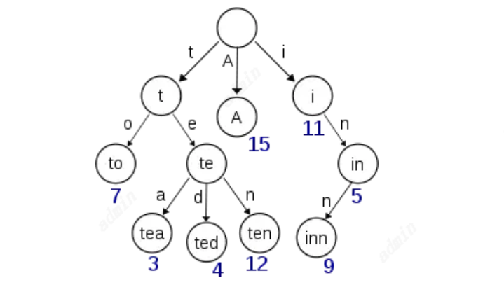
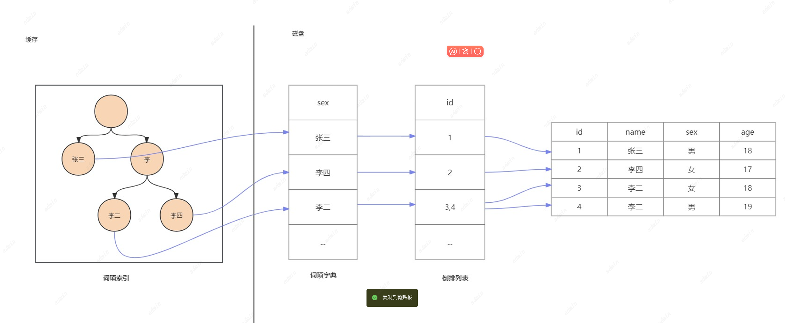

# 倒排索引
ES的倒排索引本质上是基于Lucene的倒排索引技术实现的。
将文档中的个每一个单词映射到包含该单词的所有文档的列表中，倒排索引的基本结构包括词项索引（term index）、词项字典（term dictionary）和倒排列表（posting list）。
词项索引则是对词项字典的快速查找结构

倒排索引是针对每个字段，每个字段都有自己的倒排索引。对于每个字段唯一的词叫做term（如男、女；张三、李四等）后面的数组就是倒排列表。
**倒排列表：是一个存储了所有符合某个term的文档id的数组。也就是记录了每个词项出现在哪些文档中。**
如果term非常多，那么找出特定的term一定会很慢，因为term是没有顺序的，需要将所有的过滤一遍才能找到。所以将term排序然后再用二分查找性能就会变得很快。所有的term排序后的结果就是词项字典。
**词项字典：按照顺序的存储了所有不重复的词项term。**
有了词项字典后查找复杂度就是logN了。但是磁盘的随机读操作依然很慢，所以需要尽量减少对磁盘的操作，于是需要将数据存储到缓存中，但是词项字典本身本大，于是就是引入词项索引。
例子是一个包含 "A", "to", "tea", "ted", "ten", "i", "in", 和 "inn" 的 trie 树这棵树不会包含所有的term，它包含的是term的一些前缀。

**词项索引：将词项term分类存储后记录每一类存储的位置。其数据结构是FST树。**
通过词项索引可以快速地定位到词项字典的具体的offset找到词项字典，然后再根据词项字典记录的倒排列表得到到具体的文档id列表。

与Mysql相比，Mysql只有词项字典，以b-tree的方式存储在磁盘上。每检索一个term就需要若干次的随机读操作磁盘。
Lucene通过缓存中的词项索引，快速的定位到词项字典的位置，再去磁盘上找，减少了磁盘IO。

在ES中，字段类型text（text经过分词器分词后的词项）keyword，而数值类型、日期、布尔、二进制等类型不会进行倒排索引。

1. 倒排索引与 text 和 keyword 类型：

text类型在存储时会生成倒排索引，适合用于全文检索。match
keyword类型在存储时也会生成倒排索引，但不会分词，适合用于精确匹配。term

2. text 类型与 match 搜索：

text类型会进行分词，因此适合使用match查询，因为match查询会分析输入的文本，适合用于全文检索。
而将整个keyword词完整的进行全文本搜索也是可以搜索到的。

3. keyword 类型与 term 搜索：

keyword类型不会分词，因此适合使用term查询，因为term查询不会对输入的关键词进行分析，适合用于精确匹配。
而text进行分词后每个term词项也可以用来进行term搜索。
数值、日期类型会转化为keyword类型从而可以进行term搜索。

ES倒排索引原链接https://www.elastic.co/guide/cn/elasticsearch/guide/current/inverted-index.html#inverted-index

在mapping中将字段设置`"index": "false"`，则不会对这个字段进行倒排索引

# 行式存储
ES会将文档的每个字段作为文档的一部分存储，主要是用于存储原始文档数据，也就是_source字段。这样可以让文档完整保留，便于数据的恢复和查看。也可以通过参数控制是否需要将文档加入的_source中。
然而，行式存储在处理大规模数据时，尤其是在需要对多个字段进行联合查询时，效率较低。根据索引id获取到文档内容，也可以称之为正排数据。

# 列式存储
倒排索引的检索性能是非常快的，但是在字段值排序时却不是理想的结构。
在搜索的时候，我们能通过搜索关键词快速得到结果集。
当排序的时候，我们需要倒排索引里面某个字段值的集合。换句话说，我们需要 转置 倒排索引。

转置 结构在其他系统中经常被称作 列存储 。实质上，它将所有单字段的值存储在单数据列中，这使得对其进行操作是十分高效的，例如排序。

列式存储是指对每个字段的数据独立存储，主要通过doc_value实现，默认情况下对每个字段（除了开启了分词的text类型，因为analyzed strings 暂时还不能使用 Doc Values。文本经过分析流程生成很多 Token，使得 Doc Values 不能高效运行。）都会进行列式存储。用于分析和排序。存储在磁盘上。
Doc Values是在索引时与倒排索引同时生成的，基于Segment生成并且是不可变的。这种存储方式非常适合数字类型的数据，因为它便于压缩，可以节约磁盘空间并提高性能。Doc Values可以在字段映射中启用，这意味着您可以选择性地为特定字段启用或禁用Doc Values。例如，对于不参与聚合和排序的字段，可以将doc_values设为false以节省资源
启用Doc Values后，查询、聚合、排序和脚本将正常运行，只是它们现在使用的是磁盘级字段数据而不是内存级字段数据。Doc Values适用于数字、日期、布尔、二进制和地理点字段
因为文档值被序列化到磁盘，我们可以依靠操作系统的帮助来快速访问。当 working set 远小于节点的可用内存，系统会自动将所有的文档值保存在内存中，使得其读写十分高速； 当其远大于可用内存，操作系统会自动把 Doc Values 加载到系统的页缓存中，从而避免了 jvm 堆内存溢出异常。

ES列式存储原链接
https://www.elastic.co/guide/cn/elasticsearch/guide/current/docvalues-intro.html
https://www.elastic.co/guide/cn/elasticsearch/guide/current/_deep_dive_on_doc_values.html
在mapping中将字段设置` "doc_values": false`，则不会对这个字段进行列式存储。

