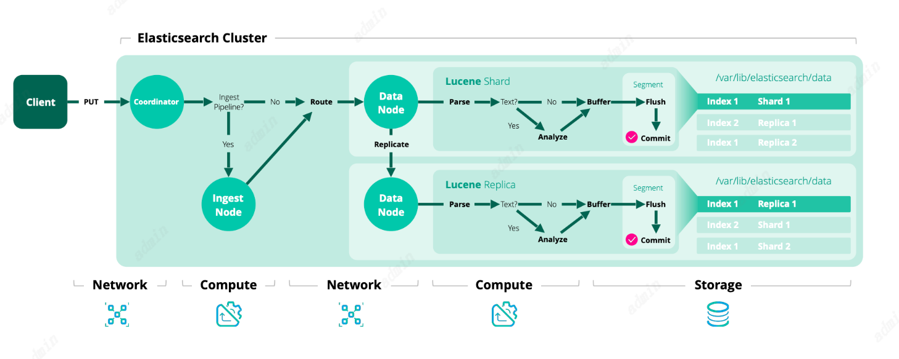

# ES简介

ES是分布式文件存储。它会将复杂的文本序列化成JSON数据，而不是进行行、列存储。如果一个ES集群有多个节点，那么被存储的文档将会分布在集群中并且可以快速的从任何一个节点搜索到它。

在ES中搜索数据是近实时的（1s内）。ES使用了一种索引结构——倒排索引，它可以支持ES可以快速的进行全文本搜索。倒排索引列出了出现在文档中的每一个唯一的词并且标记这个词出现在的每一个文档。

索引可以被认为是一个优化的文档集合，每个文档也都是许多字段的集合，它是以Key-value形式记录数据的。通常，Elasticsearch可以对每一个字段进行索引，并且每个被索引字段都有一个专用的、优化的数据结构。如：text类型的字段是用倒排索引存储的，数值类型的字段和geo字段是使用BKD树存储。这种每个字段都有不同的数据结构存储的能力使ES搜索变得很快。

ES也提供索引无结构的能力，这意味着索引不需要提前明确的结构去处理文档中的字段。当动态索引打开，ES会自动检索并为索引新增的字段。
# Index

## 分片分配策略（多活）

### 索引级分片分配筛选器

可以根据筛选器将索引分配特定的地方。通常搭配**集群范围的分配筛选**和**分配感知**一起应用。

主副分片不可以在同一个节点。

通过自定义属性（在elasticsearch.yml定义）或者内置的属性（_name`, `_host_ip`, `_publish_ip`, `_ip`, `_host`, `_id`, `_tier` and `_tier_preference），通过分片分配筛选器将索引的分片分到合适的硬件机器上。

1. 自定义属性

自定义属性：size 并给值为 meduim

```
node.attr.size: medium
```

或者在启动的时候设置

```
./bin/elasticsearch -Enode.attr.size=medium
```

2. 在索引上添加分片分配筛选器

index.routing.allocation.include.{**attribute**}

将索引分配给其{attribute}至少具有一个逗号分隔值的节点。

index.routing.allocation.require.{**attribute**}

将索引分配给{attribute}具有所有逗号分隔值的节点。

index.routing.allocation.exclude.{**attribute**}

将索引分配给{attribute}中没有逗号分隔值的节点。

如指定test索引分片要分配到size为big或者medium的节点上

```
PUT test/_settings
{
  "index.routing.allocation.include.size": "big,medium"
}
```

如指定test索引分片要分配到size为big，并且rack为rack1的节点上

也就是说明这个几点的属性size一定要为big，rack一定要为rack1，这样test的分片才会分配到上面

```
PUT test/_settings
{
  "index.routing.allocation.require.size": "big",
  "index.routing.allocation.require.rack": "rack1"
}
```

如指定test索引分片要分配到_ip为192.168.2.*节点上

```
PUT test/_settings
{
  "index.routing.allocation.include._ip": "192.168.2.*"
}
```

### 当节点离线延迟分配

当节点离开集群时，主节点会：

1. 将副本分片变为主分片
2. 副本分片替换丢失的副本
3. 剩余节点上的分片重新分配平衡

但这样的shard-shuffle会有一定的问题，比如节点很快加入回来的话这会造成资源的浪费。

所以可以通过index.unassigned.node_left.delayed_timeout来设置节点离线延迟时间。

```
PUT _all/_settings
{
  "settings": {
    "index.unassigned.node_left.delayed_timeout": "5m" //当值为0的时候，认为节点离开后就永远不会回来，es会立刻重分配
  }
}
```

这时节点离开集群时，主节点会：

1. 将副本分片变为主分片
2. 主节点将未分配的分片记录到日志中（记录什么时候开始的以及离开多久），等待延时结束。（此时集群状态时黄色，因为有未分配的副本分片）
3. 如果在延时结束前，节点回归。丢失的副本被重新分配给回归的节点
4. 如果延迟分配超时，主服务器将丢失的分片分配给另一个节点，该节点将开始恢复。如果丢失的节点重新加入集群，并且其分片的sync-id仍然与主节点相同，则将取消重新定位分片，使用已同步的分片进行恢复。

通过 health API可以监控到延时未分配的分片

```
GET _cluster/health 
```

### 索引恢复优先级

优先策略（按顺序）：

1. 通过index.priority参数设置优先级（高到低）
2. 通过索引生成日期（近到远）
3. 通过索引名字（高到低）

```
PUT index_1

PUT index_2

PUT index_3
{
  "settings": {
    "index.priority": 10
  }
}

PUT index_4
{
  "settings": {
    "index.priority": 5
  }
}
```

恢复顺序： index_3、 index_4、 index_2、 index_1

### 每个节点的总分片限制

可以设置

每个结点的分片数上限（将分配给单个节点的分片(副本和主)的最大数量。默认为unbounded。）

```
index.routing.allocation.total_shards_per_node
```

集群的分配给每个节点的分片数上限（分配给每个节点的主分片和副本分片的最大数目。默认为-1(无限制)。）

```
cluster.routing.allocation.total_shards_per_node
```

### 索引级数据层分配筛选器

创建索引时通过_tier_preferenc参数控制一个索引分片分配到哪个数据层 （data_warm,data_hot等），ES会根据数据节点角色将索引和分片分配到对应的节点

```
index.routing.allocation.include._tier_preference:data_warm
```

数据节点可以有一些角色：

1. 内容数据节点（Content data node）

存放内容层数据

通常是产品目录或文章存档等项的集合，内容相对不变所以无需做层迁移。

内容节点内的数据通常进行负责的搜索和聚合，所以节点通常针对查询性能进行了优化，cpu性能比IO能力更重要。

从弹性的角度来看，该层中的索引应该配置为使用一个或多个副本。

```
node.roles: [ data_content ]
```

1. 热数据节点（Hot data node）

存放热层数据

时序数据或者最近、最常搜索的时间序列数据放在这层。

热数据节点内的数据通常需要快速读写，所以需要更多的硬件资源和更快速的存储比如（SSDs）

从弹性的角度来看，该层中的索引应该配置为使用一个或多个副本。

```
node.roles: [ data_hot ]
```

1. 温数据节点（）

存放温层数据

使用率降低的时序数据被放在这层。温层通常保存最近几周的数据。

温层的数据也允许更细，但频率不高，所以不需要和热层一样高的配置。

从弹性的角度来看，该层中的索引应该配置为使用一个或多个副本。

```
node.roles: [ data_warm ]
```

1. 冷数据节点

存放冷层数据

存放基本上不用的数据，从温层转移过来。

仍然是可搜索的，但这一层通常针对更低的存储成本而不是搜索速度进行了优化。

为了更好地节省存储，可以在冷层上保留可搜索快照的完全挂载索引。与常规索引不同，这些完全挂载的索引不需要副本来保证可靠性。如果发生故障，它们可以从底层快照恢复数据。

快照存储库需要在冷层中使用完全挂载的索引。完全挂载的索引是只读的。

或者，您可以使用冷层来存储带有副本的常规索引，而不是使用可搜索的快照。这使您可以将较旧的数据存储在较便宜的硬件上，但与热层相比，并不会减少所需的磁盘空间。

总结：

1. 使用可搜索快照的完全挂载索引，约磁盘空间。
2. 使用副本不要求机器性能，但不能节约磁盘空间。

```
node.roles: [ data_cold ]
```

1. 冻结数据节点(Frozen data node)

存放冻结层数据

数据不再被查询，或者很少被查询，它可能会从冷层移动到冻结层.

使用部分挂载索引去存储和加载数据从快照仓库。这减少了本地存储和操作成本，同时仍然允许您搜索冻结的数据。

因为要生成快照，所以搜索比冷层还慢。

```
node.roles: [ data_frozen ]
```

## 索引阻碍Index blocks（安全性，限制某些索引读写）

可以限制一个索引都能进行什么操作。可以动态设置索引也可以使用API，一个索引一旦设置了索引阻碍，所有的分片都会生效。

#### 动态索引阻碍参数

```
//是否只读 true/false，设置为true表示索引和索引元数据为只读，设置为false表示允许写入和元数据更改
index.blocks.read_only
index.blocks.write

```

**从索引中删除文档以释放资源(而不是删除索引本身)会暂时增加索引大小，因此在节点磁盘空间不足时可能不可行。**

```
//true:不允许删除
//当磁盘利用率超过阈值时，Elasticsearch会自动添加只读允许删除的索引块;当磁盘利用率低于阈值时，Elasticsearch会自动删除该索引块
index.blocks.read_only_allow_delete
//设置为true将禁用对索引的读操作。
index.blocks.read
//设置为true将禁用对索引的数据写操作。
//与read_only不同，此设置不影响元数据。
//index.blocks.write可以调整带有写块的索引的设置，index.blocks.read_only不能调整
index.blocks.write
//设置为true将禁用索引元数据读写
index.blocks.metadata
```

#### API方式设置

```
PUT /my-index-000001/_block/write


PUT /<index>/_block/<block>
```

**block**：**metadata**、**read**、**read_only**、**write**

## 索引分片合并（优化内存碎片问题节约磁盘）

ES中的分片实际上时Lucene索引，每个Lucene索引会有很多个段组成，每个段大小是可变的，小的段会定期合并到大的段，然后小的会删除。

### 合并任务

ES使用单独的线程去执行合并任务，当任务线程满了，合并任务需要等待。

合并线程配置参数 （默认值： `Math.max(1, Math.min(4, <<node.processors, node.processors>> / 2))`）这对于一个好的固态硬盘(SSD)来说非常有效。如果索引位于旋转盘片驱动器上，则将其减小为1。

```
index.merge.scheduler.max_thread_count
```

## 相似模块//todo

在创建和更新索引时可以配置相似性。

创建相似性规则

```
PUT /index
{
  "settings": {
    "index": {
      "similarity": {
        "my_similarity": {//规则名称
          "type": "DFR", //类型
          "basic_model": "g",
          "after_effect": "l",
          "normalization": "h2",
          "normalization.h2.c": "3.0"
        }
      }
    }
  }
}
```

在某个索引上使用相似性规则

```
PUT /test_index/_mapping
{
  "properties" : {
    "title" : { "type" : "text", "similarity" : "my_similarity" }
  }
}
```

相似性类型：

| 类型                          |      |      |
| ----------------------------- | ---- | ---- |
| BM25 similarity               |      |      |
| DFR similarity                |      |      |
| DFI similarity                |      |      |
| IB similarity                 |      |      |
| LM Dirichlet similarity       |      |      |
| LM Jelinek Mercer similarity. |      |      |
| Scripted similarity           |      |      |
| Default Similarity            |      |      |

## 慢日志（排查搜索慢问题）

### 搜索查询慢日志配置-分片级别

支持分片级别的慢日志搜索。分片级慢速搜索日志允许将慢速搜索(**查询和获取**阶段)记录到专门的日志文件中。

可以设置阈值，达到阈值的查询和获取会被记录下来

```
index.search.slowlog.threshold.query.warn: 10s
index.search.slowlog.threshold.query.info: 5s
index.search.slowlog.threshold.query.debug: 2s
index.search.slowlog.threshold.query.trace: 500ms

index.search.slowlog.threshold.fetch.warn: 1s
index.search.slowlog.threshold.fetch.info: 800ms
index.search.slowlog.threshold.fetch.debug: 500ms
index.search.slowlog.threshold.fetch.trace: 200ms
```

也可以在创建索引的时候动态设置,默认的话将值设置为-1

```
PUT /my-index-000001/_settings
{
  "index.search.slowlog.threshold.query.warn": "10s",
  "index.search.slowlog.threshold.query.info": "5s",
  "index.search.slowlog.threshold.query.debug": "2s",
  "index.search.slowlog.threshold.query.trace": "500ms",
  "index.search.slowlog.threshold.fetch.warn": "1s",
  "index.search.slowlog.threshold.fetch.info": "800ms",
  "index.search.slowlog.threshold.fetch.debug": "500ms",
  "index.search.slowlog.threshold.fetch.trace": "200ms"
}
```

注意：ES搜索会现在分片内搜索再聚合结果，所以这个阈值也是限制在分片上。

慢日志文件相关配置在log4j2.properties

### 慢日志排查问题-找到慢日志的来源配置

设置记录慢日志时，是否将用户信息记录上。

```
PUT /my-index-000001/_settings
{
  "index.search.slowlog.include.user": true
}
```

选择true后，查询慢日志时，就会返回慢日志相关信息以及ES用户相关信息

```
{
  "@timestamp": "2024-02-21T12:42:37.255Z",
  "log.level": "WARN",
  "auth.type": "REALM",
  "elasticsearch.slowlog.id": "tomcat-123",
  "elasticsearch.slowlog.message": "[index6][0]",
  "elasticsearch.slowlog.search_type": "QUERY_THEN_FETCH",
  "elasticsearch.slowlog.source": "{\"query\":{\"match_all\":{\"boost\":1.0}}}",
  "elasticsearch.slowlog.stats": "[]",
  "elasticsearch.slowlog.took": "747.3micros",
  "elasticsearch.slowlog.took_millis": 0,
  "elasticsearch.slowlog.total_hits": "1 hits",
  "elasticsearch.slowlog.total_shards": 1,
  "user.name": "elastic",
  "user.realm": "reserved",
  "ecs.version": "1.2.0",
  "service.name": "ES_ECS",
  "event.dataset": "elasticsearch.index_search_slowlog",
  "process.thread.name": "elasticsearch[runTask-0][search][T#5]",
  "log.logger": "index.search.slowlog.query",
  "elasticsearch.cluster.uuid": "Ui23kfF1SHKJwu_hI1iPPQ",
  "elasticsearch.node.id": "JK-jn-XpQ3OsDUsq5ZtfGg",
  "elasticsearch.node.name": "node-0",
  "elasticsearch.cluster.name": "distribution_run"
}
```

### 慢日志查询配置-索引级别

```
index.indexing.slowlog.threshold.index.warn: 10s
index.indexing.slowlog.threshold.index.info: 5s
index.indexing.slowlog.threshold.index.debug: 2s
index.indexing.slowlog.threshold.index.trace: 500ms
index.indexing.slowlog.source: 1000
```

也可以创建索引时动态配置

```
PUT /my-index-000001/_settings
{
  "index.indexing.slowlog.threshold.index.warn": "10s",
  "index.indexing.slowlog.threshold.index.info": "5s",
  "index.indexing.slowlog.threshold.index.debug": "2s",
  "index.indexing.slowlog.threshold.index.trace": "500ms",
  "index.indexing.slowlog.source": "1000"
}
```

查找慢日志来源,默认情况下，Elasticsearch将在slowlog中记录_source的前1000个字符。

```
PUT /my-index-000001/_settings
{
//false or 0 表示不记录来源
  "index.indexing.slowlog.include.user": true
}
```

### 慢日志记录级别

```
//如果不需要记录哪个级别的日志，就将值设置成-1

PUT /my-index-000001/_settings
{
  "index.indexing.slowlog.threshold.index.warn": "-1",
  "index.indexing.slowlog.threshold.index.info": "5s",
  "index.indexing.slowlog.threshold.index.debug": "-1",
  "index.indexing.slowlog.threshold.index.trace": "-1",
  "index.indexing.slowlog.source": "1000"
}
```

## 存储

索引存储默认是根据操作系统环境，选择最合适的值索引存储。

可以指定索引存储

```
index.store.type: hybridfs
```

动态配置(**后面版本可能删除**)

```
PUT /my-index-000001 
{
  "settings": {
    "index.store.type": "hybridfs"
  }
}
```

支持的存储

| 存储类型     | 是否默认 | 是否在使用                                                   | 对应Lucene     |      |      |      |      |
| ------------ | -------- | ------------------------------------------------------------ | -------------- | ---- | ---- | ---- | ---- |
| **fs**       | 是       | 是                                                           |                |      |      |      |      |
| **simplefs** | 否       | 7。15版本被废除，8.0已经删除Elasticsearch 7.15或更高版本使用niofs作为simplefs存储类型，因为它提供了优于或等同于simplefs的性能。 |                |      |      |      |      |
| **niofs**    | 否       | 是，允许多线程；不予推荐在windows使用                        | NIOFSDirectory |      |      |      |      |
| **mmapfs**   | 否       | 内存映射会占用进程中与被映射文件大小相等的虚拟内存地址空间的一部分，所以需要足够的虚拟地址空间。 | MMapDirectory  |      |      |      |      |
| **hybridfs** | 否       | niofs和mmapfs的混合体，mmapfs类似，确保您有足够的虚拟地址空间。 |                |      |      |      |      |
|              |          |                                                              |                |      |      |      |      |
|              |          |                                                              |                |      |      |      |      |

可以通过设置node.store.allow_mmap来限制mmapfs和相关hybridfs存储类型的使用。这是一个布尔值设置，指示是否允许内存映射。默认是允许。此设置很有用，例如，如果您处于无法控制创建大量内存映射的能力的环境中，那么您需要禁用使用内存映射的能力。

### 预加载数据（提升索引的搜索性能）

ES通过index.store.preload配置将索引放到缓存中，提升索引的搜索性能，但需要注意这可能会减慢索引的打开速度，因为索引只有在数据加载到物理内存之后才可用。

**这个配置不一定会生效，因为这取决的机器的操作系统和索引的存储类型**

配置默认值是[]

[]表示不加载任何索引到缓存，

*表示所有索引加载（需要注意的是，将所有数据加载到内存是没有意义的尤其是存储字段和术语向量的文件）

推荐["nvd", "dvd", "tim", "doc", "dim"]

```
index.store.preload: ["nvd", "dvd"]
```

动态配置

```
PUT /my-index-000001
{
  "settings": {
    "index.store.preload": ["nvd", "dvd"]
  }
}
```

注意，如果索引内存过大，大于主内存，开启后这将使索引和搜索变慢（因为它会导致文件系统缓存在大型合并后重新打开时被销毁，）

## 预写日志（优化磁盘IO性能）

每次Lucene提交Lucene的修改都是在操作磁盘，因此Lucene提交花销是很昂贵的。所以每次修改操作不会直接执行而是会在每个分片都将操作记录到事务日志”translog“上，所有的索引和删除操作都会先记录到translog中。当机器异常恢复后，最近被确认的操作虽然还没做Lucene提交，也会被从translog中恢复。

每次ES刷新Lucene提交，就会生成一个新的translog日志。刷新是为了保证translog不会太大，以至于恢复时间变长。

刷新Luence提交/预写日志配置

只有当translog被同步并提交时，translog中的数据才会持久化到磁盘。所以当操作系统、JVM、磁盘、分片有问题时，会造成最后一次记录到translog后的数据丢失。


```
//translog从内存写道磁盘的频率,默认5s，不允许小于100ms
index.translog.sync_interval:5s
//更新方式默认request，request立即执行，async按照频率自动执行
//request：每次（索引、删除、更新或批量请求）后translog都会从内存写道磁盘并提交（在硬件发生故障的情况下，所有已确认的写操作都已提交到磁盘）
//async：表示在index.translog.sync_interval配置的频率下translog都会从内存写道磁盘并提交，如果发生失败，自上次自动提交以来所有已确认的写操作都将被丢弃。（这意味着会丢失数据）
index.translog.durabilit:request
//当translog大小达到阈值时也会进行从内存写道磁盘并提交,默认512mb
index.translog.flush_threshold_size:512mb
```

## 历史预留（灾备增量同步数据）

如果一个副本节点短暂离线，在它重新恢复这段时间里，会丢失一些操作，只恢复丢失的操作要比从头恢复好得多。同理，一个集群离线了再从新加入，也会错过一些操作，所以增量恢复是很重要的。

在Lucene级别只有两种写操作：一个是ES对一个索引新增文档，；一个是对一个索引删除文档。（如果是更新文档实际会执行删除旧文档保存新文档）

在删除时，ES会保存最近确定要被删除的文档（因为需要耗费资源），最终ES会将他们完全删除。

ES会将需要重发的操作放入”分片历史保存租约（ *shard history retention leases*）“中 ，每个需要重发的操作的分片副本首先要做的就是自己创建”分片历史保存租约“。（分片副本它可以是某个分片的副本也可以是使用跨集群复制时一个从索引的分片）。每一个”分片历史保存租约“都会保存这个分片没接收到的第一个操作的序号。当分片副本接收到一个新操作时，他会增加”分片历史保存租约“里的序号，这样这个操作就不会被重新获取。

一旦软删除操作没有被任何副本分片的”分片历史保存租约“持有，ElasticSearch就会丢弃这些操作。

当任何一个副本异常停止更新这个”分片历史保存租约“，ES都不会删除这些操作，以便副本恢复后继续同步。但这个””分片历史保存租约“是有存在时间限制的。如果副本不能再””分片历史保存租约“到期前恢复，为了保护ES，就会将历史数据丢弃。


```
//是否开启软删除功能（6.5.0版本后才有这个配置并在7.6.0中弃用，不赞成在禁用软删除的情况下创建索引），默认true
index.soft_deletes.enabled


//软删除保存周期 默认12h
index.soft_deletes.retention_lease.period
```


## 索引排序(提升查询准确性)

创建一个新索引时，可以配置每个Shard中的segment如何排序。

**注意：嵌套字段与索引排序不兼容，因为它们依赖于嵌套文档存储在连续的文档id中的假设，这可以通过索引排序来打破。如果在包含嵌套字段的索引上激活索引排序，将引发错误**

索引排序只能在创建索引时定义一次，不许修改和创建索引后再添加

```
//排序字段
index.sort.field
//排序顺序
index.sort.order
//排序模式 min：选择最小的值；max：选择最大的值
index.sort.mode
//排序缺省值 _last：没有这个字段的文档排在最后；_first没有这个字段的文档排在最前面
index.sort.missing
```


my-index-000001索引。根据date字段让Shard中的segment倒叙

```
PUT my-index-000001
{
  "settings": {
    "index": {
    //只有类型是boolean, numeric, date 以及 keyword（doc_values=true）的字段可以排序
      "sort.field": [ "username", "date" ], 
      "sort.order": [ "asc", "desc" ]       
    }
  },
  "mappings": {
    "properties": {
      "username": {
        "type": "keyword",
        "doc_values": true
      },
      "date": {
        "type": "date"
      }
    }
  }
}
```

### 提升查询准确性：

ES进行查询时，如根据timestamp倒叙查找前10个.此时ES会在每个分片获取前10个，然后再将结果会合返回前10个。

```
GET /events/_search
{
  "size": 10,
  "sort": [
    { "timestamp": "desc" }
  ]
}
```

这时返回的结果可能不是最符合要求的，因为分片里的数据可能不是按照timestamp倒叙排序的。所以可以设置index也是按照timestamp倒叙再分片中存储。

```
PUT events
{
  "settings": {
    "index": {
      "sort.field": "timestamp",
      "sort.order": "desc" 
    }
  },
  "mappings": {
    "properties": {
      "timestamp": {
        "type": "date"
      }
    }
  }
}
```

### 提升连词搜索效率

通过索引排序，为了提高效率，连词依赖于这样一个事实:如果任何一个子句不匹配，那么整个连词就不匹配。通过使用索引排序，我们可以将不匹配的文档放在一起，这将有助于有效地跳过不匹配连接的大范围文档id。

这个技巧只适用于低基数字段。经验法则是，您应该首先对基数低且经常用于过滤的字段进行排序。排序顺序(asc或desc)并不重要，因为我们只关心将匹配相同子句的值放在彼此靠近的位置。

例如，如果你要索引出售的汽车，按燃料类型、车身类型、制造、注册年份和最后的里程进行排序可能会很有趣。

## 索引压力

索引文档进入ES时，系统的内存和CPU就会上升。

索引压力可以由内外两种因素增加，如外部的索引请求或者内部的节点恢复和跨集群复制。所以当太多的索引在系统中工作，这会让集群变得饱和，这对其他的一些操作会产生不好的影响，比如集群之间的协调与后台运行的程序。

ES为了防止这个情况产生会监控索引的负载情况，如果达到了限制，就会拒绝新的索引创建。

### 索引阶段

外部索引操作经历三个阶段:协调、主索引和副本。

#### 读和写文档

当索引创建时会被分到分片中，每个分片都会有副本组。副本一直保持与主分片同步。主分片是所有索引操作的主要入口点。它负责验证它们并确保它们是正确的。当这个操作通过校验，主分片也会负责将这个操作同步到其他副本。

##### 基本写模型-协调阶段

ES中的索引操作首先用路由去解决副本组问题，典型的方法就是用文档id。一旦确定了复制组，操作将在内部转发到组的当前主分片。这个节阶段就是协调阶段。



##### 基本写模型-主阶段

下一个阶段就是主分片阶段，这个阶段在主分片上执行。主分片的作用是校验操作并将确认的操作转发给其他副本。因为副本可能离线，所以主分片不需要同步给所有副本。ES需要维护一个已经完成同步操作的副本的清单，这个清单叫做”同步复制清单“并由主节点维护。这个清单上的分片表示已经同步完成。

主分片需要做：

1. 校验接收的操作并拒绝掉不符合结构的请求
2. 本地执行这个写入或者删除操作，如果字段不匹配则拒绝 (Example: a keyword value is too long for indexing in Lucene).
3. 并发执行转发当前操作给”同步复制清单“中的每个副本分片
4. 所有的清单内的副本都执行操作成功后反馈给主分片，主分片将其标记为成功返回给客户端

##### 基本写模型-复制阶段

每个副本分片本地执行索引操作的阶段叫做复制阶段。

协调阶段、主阶段、复制阶段是按连续进行的，也就是说当前阶段的生命收起包含了下一阶段的生命周期。（例如，协调阶段直到每个主要阶段(可能分布在不同的主要碎片上)完成后才完成。在同步副本完成对文档的本地索引并响应副本请求之前，每个主阶段都不会完成。）

//todo https://www.elastic.co/guide/en/elasticsearch/reference/current/docs-replication.html#basic-write-model

### 内存限制

默认为hea的10%

```
indexing_pressure.memory.limit
```

在进行索引操作的时候，ES会记录这个操作从开始到结束所消耗的字节数（也就是从协调阶段到主阶段和复制阶段都完成的消耗）

，一旦在协调阶段或者主阶段所记录的消耗大于设置的limit值，那么节点就会拒绝新的索引操作。一旦复制阶段所消耗的字节数大于limit值得1.5倍，这时节点将拒绝新的索引操作，直到当前操作完成。这样可以以防止系统过载或资源耗尽，确保集群的稳定性和性能不受影响。

“indexing_pressure.memory.limit”这个配置只是针对索引操作，但除了这个操作还有其他的操作比如buffers, listeners也是需要内存的，所以设置这个值的时候要认真思考，不然会影响其他的组件工作。

### 监控API

https://www.elastic.co/guide/en/elasticsearch/reference/current/cluster-nodes-stats.html#cluster-nodes-stats-api-response-body-indexing-pressure

