# Terms 查询
可以通过terms-level-query去查询一个精确的值，例如日期范围、IP、价格或者ID。
与 full-text-query查询不同，term查询是不需要分词得，它是去精确的匹配存储在这个字段里的值。
## Exist query
返回包含查询字段的文档。
一个被索引的值可能不存在在一个文档中的理由可能是：
1. 这个字段的值是NULL或者[]
2. 这个字段在mapping中开启了配置`"index":false`以及`"doc_values":false`、
3. 这个字段在mapping中设置了`ignore_above`
4. 这个字段值是`malformed`,且在mapping中定义了`ignore_malformed`
```
POST my_d_mapping_001/_doc
{
  "my_text":"i love china"
}
POST my_d_mapping_001/_doc
{
  "my_text":null
}

GET my_d_mapping_001/_search
{
  "query": {
    "exists": {
      "field": "my_text"
    }
  }
}

```
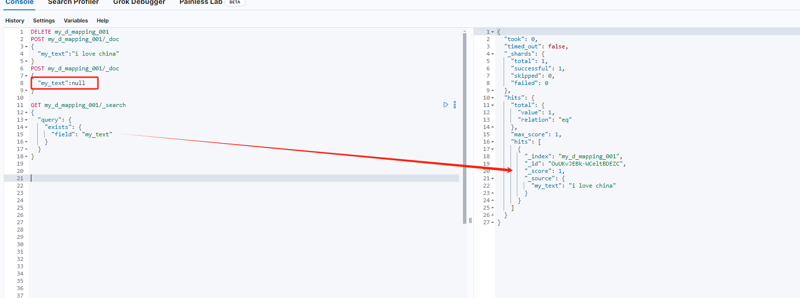
如果想要找到不存在这个字段的所有文档，可以使用must_not配合使用
```
GET my_d_mapping_001/_search
{
  "query": {
    "bool": {
      "must_not": [
        {
          "exists": {
            "field": "my_text"
          }
        }
      ]
    }
  }
}

```
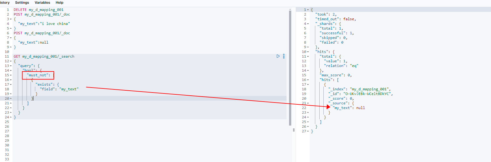
参数：
field  必填。字段名称，如果这个字段的值是null或者[]，都会被视为不存在。所以为了避免这个情况可以自定义一个空值或者给空字符串"".

## Fuzzy query
返回的文档包含搜索词的相似词，比如搜索box，文档包含fox的也会被匹配上等。
**注意：如果`search.allow_expensive_queries`设置为false，则不能使用Fuzzy query**

参数
1. filed: 必填。字段名称
2. fuzziness：选填。允许匹配的最大编辑距离。
3. max_expansions：选填。允许创建最大的变体数，默认50.需要注意的是，这个值要避免设置的过大。如果这个值很大会影响性能，尤其是prefix_length为0的时候。
4. prefix_length：选填。告知从第几个字母开始模糊，默认是0.
5. transpositions：是否支持邻位字母换位，如ab->ba。默认true
6. rewrite：选填。重写查询。
```
POST my_d_mapping_001/_doc
{
  "my_text":"three"
}
POST my_d_mapping_001/_doc
{
  "my_text":"tree"
}
POST my_d_mapping_001/_doc
{
  "my_text":null
}

GET my_d_mapping_001/_search
{
  "query": {
   "fuzzy": {
     "my_text": {
       "value": "tree",
       "fuzziness": "AUTO",
       "max_expansions":"50",
       "prefix_length":0,
       "transpositions":true,
       "rewrite":"constant_score_blended"
     }
   }
  }
}

GET my_d_mapping_001/_search
{
  "query": {
   "fuzzy": {
     "my_text": {
       "value": "tree",
       "fuzziness": "AUTO",
       "max_expansions":"50",
       "prefix_length":2,
       "transpositions":true,
       "rewrite":"constant_score_blended"
     }
   }
  }
}

```
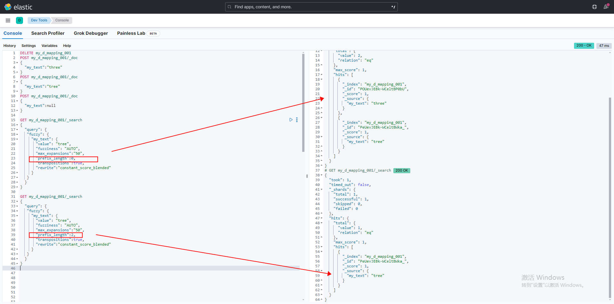

## IDS query
返回的文档都基于他们的ID，也就是根据_id字段对文档的ID进行查询。

```
POST my_d_mapping_001/_doc
{
  "my_text":"three"
}
POST my_d_mapping_001/_doc
{
  "my_text":"tree"
}
POST my_d_mapping_001/_doc
{
  "my_text":null
}

GET my_d_mapping_001/_search
{
  "query": {
   "ids": {
     "values": ["POUevJEBk-WCeltBP0bU"]
   }
  }
}

```
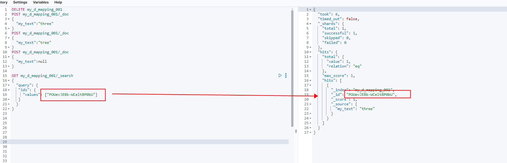

## Prefix query
返回的文档中包含指定字段且该字段的值包含指定的前缀。
**注意：如果`search.allow_expensive_queries`设置为false，则不能使用Prefix query。但是如果`index_prefixes`是开启的，则会优化查询，就不会被认为是慢的，且可以执行。因为`index_prefixes`后ES在段度的字段中索引前缀，这可以让ＥＳ以更大的索引为代价，让前缀查询更快。**


参数
1. filed: 必填。字段名称
2. rewrite：选填。重写查询
3. case_insensitive： 选填。当设置为true时，允许值与索引字段不区分ASCII大小写的匹配。（这意味着匹配的大小写敏感性取决与底层字段的映射）默认false。

```
POST my_d_mapping_001/_doc
{
  "my_text":"three"
}
POST my_d_mapping_001/_doc
{
  "my_text":"tree"
}
POST my_d_mapping_001/_doc
{
  "my_text":null
}

GET my_d_mapping_001/_search
{
  "query": {
    "prefix": {
      "my_text": {
        "value": "t",
          "case_insensitive":true
      }
    }
  }
}

GET my_d_mapping_001/_search
{
  "query": {
    "prefix": {
      "my_text": {
        "value": "TH",
          "case_insensitive":true
      }
    }
  }
}
GET my_d_mapping_001/_search
{
  "query": {
    "prefix": {
      "my_text": {
        "value": "TH",
        "case_insensitive":false
      }
    }
  }
}

```
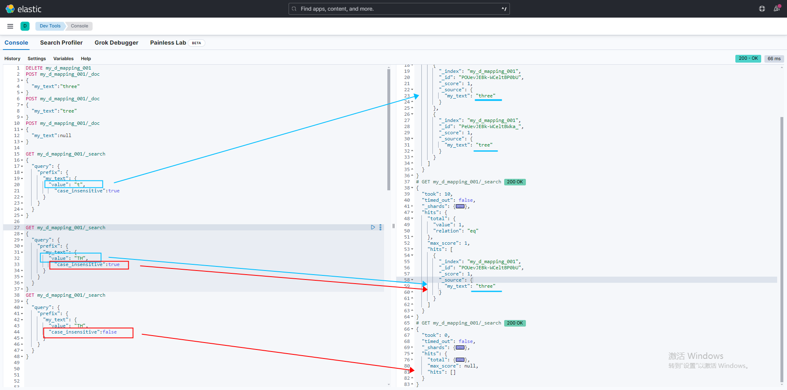

## Range query
返回的文档在查询的范围之间。
**注意：如果`search.allow_expensive_queries`设置为false，则对text或者keyword字段类型使用range查询不会执行。**


参数
1. filed: 必填。字段名称
2. gt\gte\lt\lte\：选填。大于、大于等于、小于、小于等于。如果是进行日期查询也可以使用函数公式如`now/d 表示今天，now-1d/d 表示昨天 `
3. format：选填。日期格式，会将日期字段进行转换后查询，默认条件下会按照创建索引是为date类型的字段使用的日期合适，这个字段的值会覆盖mapping的设置。
4. relation：选填。指示让range查询如何生效。
```
INTERESCTS：表示返回与查询范围有交集的文档
CONTAINS：表示返回完全包含查询范围的文档
WITHIN：表示返回完全被查询范围包含的文档

```
5. time_zone：选填。时区转换。
```
POST my_d_mapping_001/_doc
{
  "my_text":[0,1]
}
POST my_d_mapping_001/_doc
{
  "my_text":[9,20]
}
POST my_d_mapping_001/_doc
{
  "my_text":[11,20]
}
POST my_d_mapping_001/_doc
{
  "my_text":[0,20]
}


GET my_d_mapping_001/_search
{
  "query": {
  "range": {
    "my_text": {
      "gte": 0,
      "lte": 10,
      "relation":"INTERSECTS"
    }
  }
  }
}

```
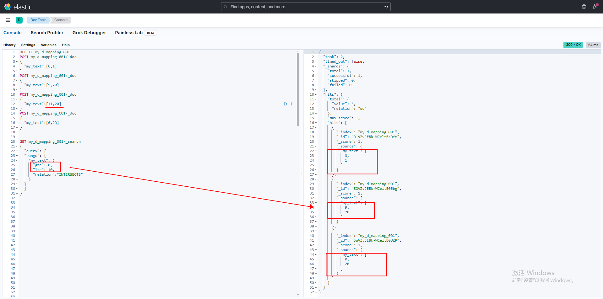

## Regexp query
正则查询：返回的文档符合正则匹配表达式。
正则表达式是一种使用占位符(称为操作符)匹配数据模式的方法。有关regexp查询支持的操作符列表，请参见正则表达式语法（https://www.elastic.co/guide/en/elasticsearch/reference/current/regexp-syntax.html）
下面的搜索返回用户。id字段包含以k开头以y结束的任何项。*运算符匹配任意长度的任何字符，包括无字符。匹配的术语包括ky、kay和kimchy。

正则表达式语法
1. ALL/"" :启用所有操作符
2. COMPLEMENT :启用~操作符.可以使用~来否定下面最短的模式`a~bc   # matches 'adc' and 'aec' but not 'abc'`
3. EMPTY :启用#操作符.#操作符不匹配任何字符串，甚至不匹配空字符串。`#|abc  # matches 'abc' but nothing else, not even an empty string`
4. INTERVAL :启用<>操作符.使用<>来控制匹配的数字范围。`foo<01-100>     # matches 'foo01', 'foo02' ... 'foo99', 'foo100'`
5. INTERSECTION :启用&操作符.使用&来进行AND操作。如果左侧和右侧的模式都匹配，则匹配成功。`aaa.+&.+bbb  # matches 'aaabbb'`
6. ANYSTRING :启用@操作符。您可以使用@来匹配任何整个字符串。`@&~(abc.+)  # matches everything except terms beginning with 'abc'`
7. NONE :不启用任何操作符。
8. 不支持^和$

参数
1. filed: 必填。字段名称
2. value：必填。查询的内容。请参见正则表达式语法
3. flags：选填。正则表达式启用可选操作符。
4. case_insensitive ：7.10.0版本后可以指定是否大小写敏感。当设置为true时，允许正则表达式值与索引字段值进行不区分大小写的匹配。默认值为false，这意味着匹配的大小写敏感性取决于底层字段的映射。
5. max_determinized_states：选填。查询所需的自动机状态的最大数目。默认为10000。
   Elasticsearch内部使用Apache Lucene来解析正则表达式。Lucene将每个正则表达式转换为包含许多确定状态的有限自动机。
   您可以使用此参数来防止该转换无意中消耗太多资源。您可能需要增加此限制以运行复杂的正则表达式。
6. rewrite：选填。用于重写查询。有关有效值和更多信息，请参见rewrite参数。
```
POST my_d_mapping_001/_doc
{
 "my_text": "my favorite food is salty apple",
  "content":"hot  apple"
}
POST my_d_mapping_001/_doc
{
 "my_text": "my favorite food is water",
  "content":"hot apple"
}
POST my_d_mapping_001/_doc
{
 "my_text": "my favorite food is salty apple",
  "content":"hot water"
}
GET my_d_mapping_001/_search
{
  "query": {
    "regexp": {
      "content": {
        "value": "w.*r",
        "flags": "ALL",
        "case_insensitive": true,
        "max_determinized_states": 10000,
        "rewrite": "constant_score_blended"
      }
    }
  }
}
```
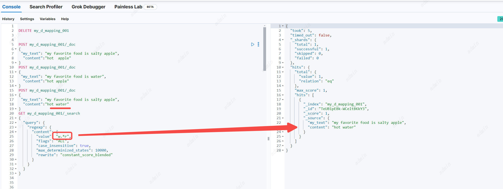

## Term  query
返回的文档包含一个确切的term词在提供的查询字段中。你可以使用term query 去查找一个文档基于一个确定的值入价格、产品id或者一个用户名。
**注意：避免使用text类型去做term查询。默认ES会将改变text类型的字段的值进行分词分析，这可能让查找的精确词在text类型的字段匹配困难，去搜索text字段可以用match query。（这一点可以参考大小学那个例子）**
默认情况下，Elasticsearch会在分析过程中更改文本字段的值。例如，默认的标准分析器更改文本字段值如下:
1. 删除大部分标点符号
2. 将剩余的内容分成单独的单词，称为标记
3. 将记号小写
为了更好地搜索文本字段，match查询还会在执行搜索之前分析您提供的搜索词。这意味着match query 是对text类型进行分词分析后的token进行搜索而不是一个确切的词。
Term  query不会对搜索的term进行分词分析。Term  query只搜索提供的确切术语。这意味着在搜索文本字段时，术语查询可能返回较差的结果或没有结果。

参数
1. filed: 必填。字段名称
2. value：必填。查询的内容。一定是一个精确的词，包括空格和大写。
3. boost：分数系数默认1.0
：7.10.0版本后可以指定是否大小写敏感。当设置为true时，允许值与索引字段值进行不区分ASCII大小写的匹配。默认值为false，这意味着匹配的大小写敏感性取决于底层字段的映射。

```
PUT my_d_mapping_001
{
  "mappings": {
    "properties": {
      "my_text":{
        "type": "text"
      },
      "my_keyword":{
        "type": "keyword"
        
      }
    }
  }
}
  
  
POST my_d_mapping_001/_doc
{
  "my_text": "My favorite food is salty apple",
  "my_keyword": "My favorite food is salty apple"
}
GET my_d_mapping_001/_search
{
  "query": {
    "match": {
      "my_text": "my favorite"
    }
  }
}
GET my_d_mapping_001/_search
{
  "query": {
    "term": {
      "my_text": {
        "value": "my favorite"
      }
    }
  }
}
GET my_d_mapping_001/_search
{
  "query": {
    "term": {
      "my_keyword": {
        "value": "my favorite food is salty apple"
      }
    }
  }
}

GET my_d_mapping_001/_search
{
  "query": {
    "term": {
      "my_keyword": {
        "value": "My favorite food is salty apple"
      }
    }
  }
}

GET my_d_mapping_001/_search
{
  "query": {
    "term": {
      "my_keyword": {
        "value": "my favorite food is salty apple",
        "case_insensitive":true
      }
    }
  }
}


  
```
查询text字段类型，使用term和match的区别。
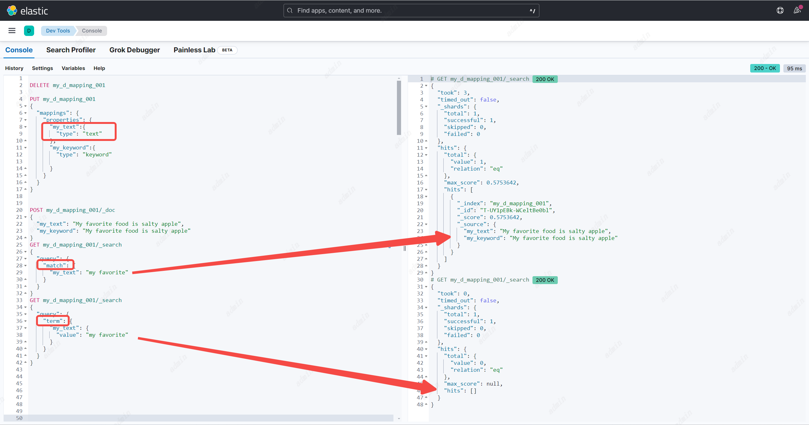

对比大小写敏感参数， "case_insensitive":true
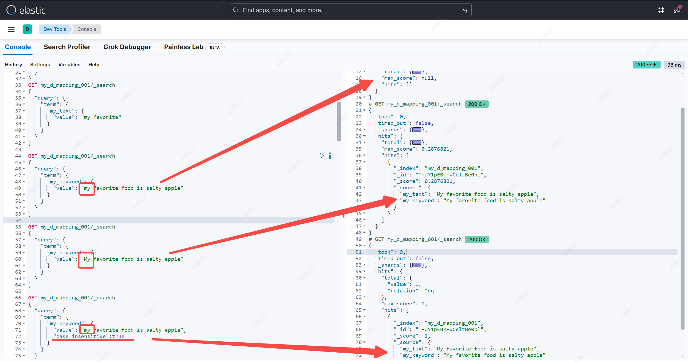

进行term query时，大小写（除非使用case_insensitive参数）以及空格都必须保持完全一致
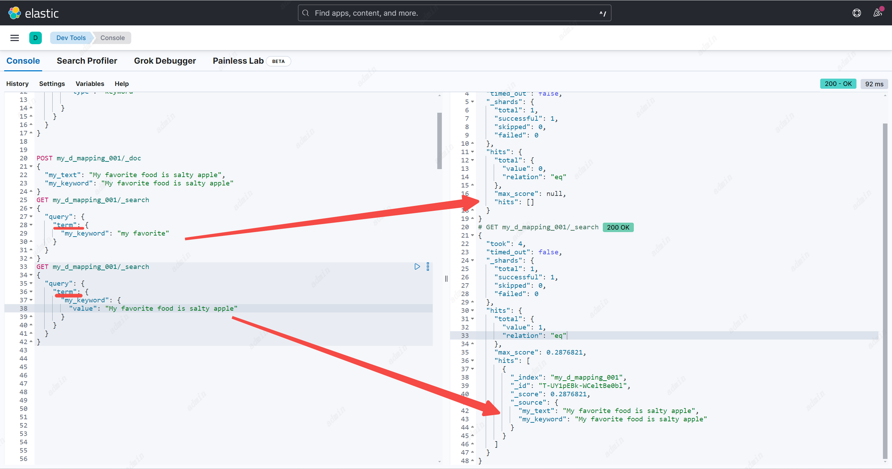


## Terms  query
返回的文档包含一个或多个确切的term词在提供的查询字段中。基本和 Term query一样，除了可以搜索多个值。
根据以下情况，Elasticsearch可能不会返回关键词查询的高亮显示结果:
1. 高亮类型
2. 查询的term是数字

**默认情况下，Elasticsearch限制查询最多65,536个术语。这包括使用terms查找获取的terms。您可以使用索引更改此限制。max_terms_count设置。**


参数
1. filed: 必填。字段名称，值是个数组。
2. boost：分数系数默认1.0
```

PUT my_d_mapping_001
{
  "mappings": {
    "properties": {
      "my_text":{
        "type": "text"
      },
      "my_keyword":{
        "type": "keyword"
        
      }
    }
  }
}
  
  
POST my_d_mapping_001/_doc/1
{
  "my_text": "My favorite food is salty apple and pear",
  "my_keyword": ["apple","pear"]
}
POST my_d_mapping_001/_doc/2
{
  "my_text": "My favorite food is salty apple",
  "my_keyword": ["apple"]
}
POST my_d_mapping_001/_doc/3
{
  "my_text": "My favorite food is salty pear",
  "my_keyword": ["pear"]
}
GET my_d_mapping_001/_search
{
  "query": {
    "terms": {
      "my_keyword": ["apple","pear"]
    }
  }
}
```
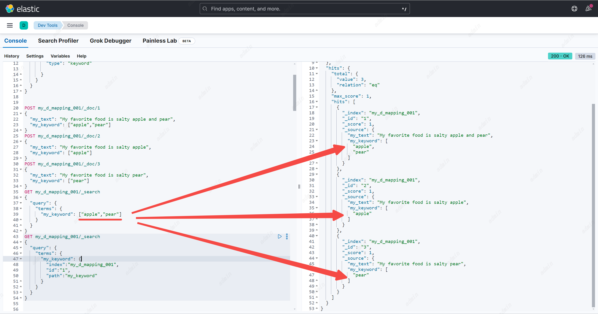

### terms lookup
terms查找获取现有文档的字段值。然后Elasticsearch使用这些值作为搜索项。这在搜索大量术语时很有帮助。
**要运terms查找，必须启用字段的_source。不能使用跨集群搜索在远程索引上运行术语查找。**
**为了减少网络流量，如果可能的话，术语查找将从本地数据节点上的分片获取文档的值。如果您的术语数据不是很大，请考虑使用具有单个主分片的索引，该索引在所有适用的数据节点上完全复制，以最小化网络流量。**

参数
1. index： 必填。索引
2. id：必填。要从中获取字段值的文档的ID。
3. path：必填。要从中获取字段值的字段名。Elasticsearch使用这些值作为查询的搜索项。
4. routing：选填。要从中获取词值的文档的自定义路由值。如果在索引文档时提供了自定义路由值，则需要此参数。
```
GET my_d_mapping_001/_search
{
  "query": {
    "terms": {
      "my_keyword": {
        "index":"my_d_mapping_001",
        "id":"2",
        "path":"my_keyword"
      }
    }
  }
}

```
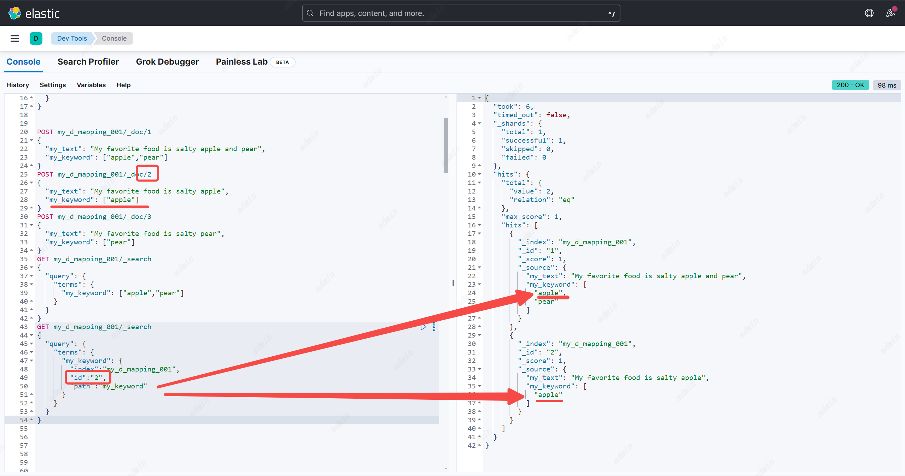