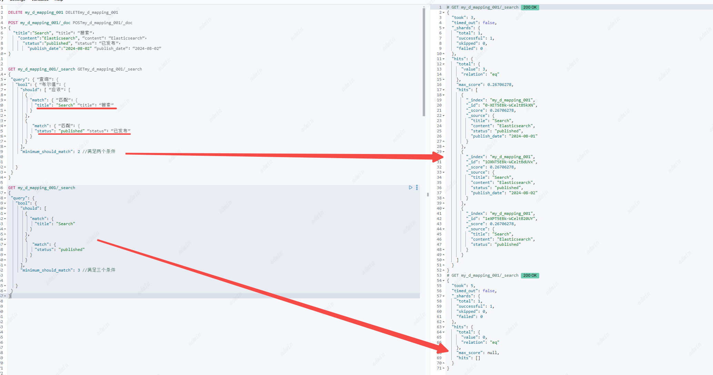
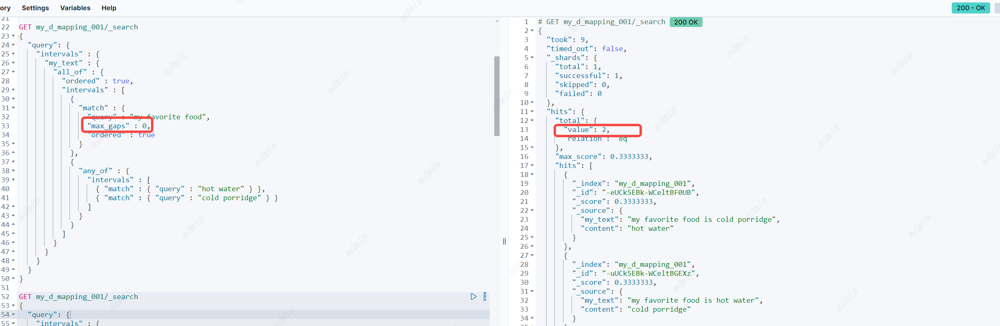
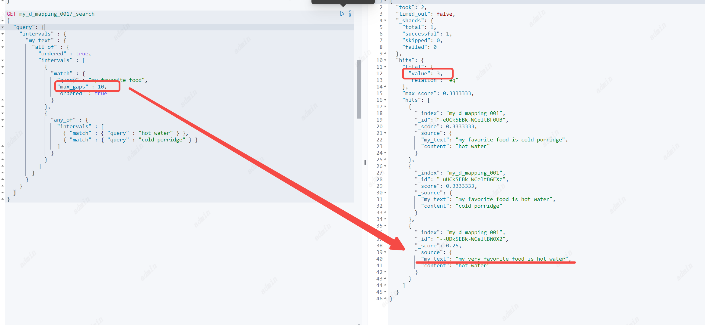
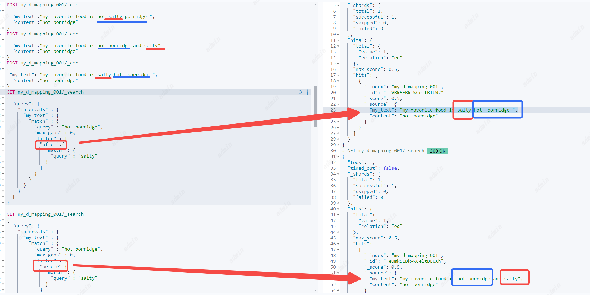

# Query context和 Filter context（查询上下文和过滤器上下文）
Query context更倾向于**查询更匹配的文档**，相关性分数在 `_score` 字段中展示。
Filter context更倾向于**查询匹配查询的文档**，也就是查询出来的文档一定是完全符合查询条件的，所以不会有相关性分数的计算。
## 相关性分数（Relevance scores）
ElasticSearch搜索出来的结果是根据相关性分数进行排序的，这个指标表示每一个匹配上的文档与查询的匹配度高低。
相关性分数是一个正浮点数，search的API中"_score"元数据字段里返回。"_score"值越高，说明文档相关性越高。每一个query类型都可以计算不同的相关性分数，分数的计算也取决于查询子句是在查询上下文中运行还是在过滤器上下文中运行。
Query context中为查询计算的分数表示为单精度浮点数;它们只有 24 位的精度。超过有效值精度的分数计算将被转换为精度损失的浮点数。

| 类型             | 含义            | 相关性分数 | 是否缓存                   | 生效参数                                                                              |
|----------------|---------------|-------|------------------------|-----------------------------------------------------------------------------------|
| Query context  | 查询更匹配查询条件的文档      | 有     | 否                      | `query` 参数                                                                        |
| Filter context | 过滤完全满足查询条件的文档 | 无，返回0 | 是，最近的过滤查询会被自动缓存，提升查询性能 | `bool`查询中的`filter`和`must_not`等参数；`constant_score`查询中的`filter`参数; `filter`聚合 |

一个查询子句中既包含Query context 也包含 Filter context，Query context 将匹配度高的文档打分排序，Filter context会过滤掉不匹配的文档，但Filter context不会影响匹配文档的分数。
# 复合查询
## Bool Query
一个查询可以通过bool组合其他的查询去匹配文档。bool查询是映射lucene的`BooleanQuery`。bool 查询由一个或多个子查询构成，
子查询的类型：
1. must ：非必填。返回的文档必须匹配上这个查询条件，并且将对分数产生影响。
2. filter：非必填。返回的文档必须匹配上这个查询条件，忽略分数，并且查询结果通常会被缓存。
3. should：非必填。返回的文档可能匹配上这个查询条件
4. must_not：非必填。返回的文档必须不匹配上这个查询条件，忽略分数，并且查询结果通常会被缓存。

参数：
1. minimum_should_match：非必填。与should子查询一起使用，指定should子查询至少匹配上的子查询条件数量或者百分比。当bool查询中，有一个should子查询，且没有must和filter子查询时，minimum_should_match默认值是1，其他都是0.

2. boost：非必填。分数系数，默认1

## Boosting query
返回与肯定查询匹配的文档，同时降低也与否定查询匹配的文档的相关性分数。 您可以使用提升查询来降级某些文档，而无需将它们从搜索结果中排除。
子查询的类型：
1. positive：必填。肯定查询，返回的文档必须匹配上这个查询条件，满足肯定查询的文档分数不变
2. negative：必填。否定查询，返回的文档如果匹配上这个查询条件，该文档分数会乘以否定系数（negative_boost）

参数：
1. negative_boost：必填。否定分数系数，0-1之间的浮点数，


## Constant score query
常量分数查询是filter 查询的封装，每一个返回的文档的相关性分数都是参数`boost`设置的值
子查询的类型：
1. filter：必填。返回的文档必须匹配上这个查询条件，分数为`boost`设置的值，ES会自动缓存常用的过滤器查询。

参数：
1. boost：非必填。默认值1.0，0-1之间的浮点数，


## Disjunction max query
分离最大值查询：返回与一个或多个包装查询（称为查询子句或子句）匹配的文档。如果返回的文档匹配多个子查询，那么`dis_max`查询会将匹配的所有子条件中最高的分数分配这个文档，以及加上`tie_breaker`参数中的分数。

子查询的类型：
1. queries：必填。查询对象数组。可以包括一个或多个子查询。返回的文档匹配上这里面的一个或多个查询。如果一个文档匹配上了多个查询条件，那么文档最终相关性分数给匹配分数最高的值。

参数：
1. tie_breaker：非必填。默认值0.0，0-1之间的浮点数，

如果一个文档匹配上了多个子查询，那么`dis_max`查询会按照以下方式计算相关性分数
1. 取匹配条件分数最高的分数
2. 将任何其他匹配子句的分数乘以`tie_breaker`值。
3. 将最高分数添加到相乘的分数中。
如果`tie_breaker`值大于 0.0，则所有匹配子句都计算在内，但得分最高的子句计数最多。

## Function score query
本质上是定义各个过滤条件的权重从而自定义返回的分数。

分数计算规则：
1. 首先根据query语句进行查询
2. 得到符合query语句的文档，根据functions中定义的filter过滤符合的文档，得到匹配的文档初始分数filterScore为weight* `Function score` 如果没有指定`Function score` 默认为1。
3. 如果设置了max_boost，filterScore>max_boost则按照max_boost设置的数值返回
4. 如果一个文档满足多个条件也就是有多个filterScore，则根据score_mode字段计算当前文档的initScore
5. boost为基础系数，根据boost_mode字段和initScore计算最终分数finallyScore
6. 如果设置了min_score，finallyScore大于min_score，则返回这条文档。

子查询类型：
1. query：与正常的query一样
2. functions： 
• script_score：通过脚本从文档中的数值类型的字段来定义分数
• weight:给满足函数的文档得分进行权重赋值，计算方式：分数*权重
• random_score：随机分数，默认情况下分数是[0,1)且每次搜索分数都不固定，如果希望固定通过seed和field两个字段，最终分数的计算会基于seed
                 位于同一分片内且具有相同`field`值的文档将获得相同的分数，因此通常希望为所有文档使用具有唯一值的字段。`field`推荐的默认值为`_seq_no`,但更新文档也会更新`_seq_no`所以最终的分数也会被更新 
• field_value_factor：与script_score类型，但是可以避免脚本的开销，适合需要根据字段值进行简单的分数计算。
                       包含参数：field文档中的字段名、factor影响因子默认为1、modifier计算方式（none, log, log1p, log2p, ln, ln1p, ln2p, square, sqrt, or reciprocal. 默认 to none.）、missing缺省值 
• decay functions: 衰减函数// todo


参数：
1. score_mode：根据定义的函数对每个文档进行评分。参数score_mode指定如何组合计算分数，类型有：multiply、sum、avg、first、max、min。如 一个文档符合函数A score=10， weight=2 ，函数B score=20，weight=3，此时score_mode为sum，那么分数为（10*2+20*3）/(2+3)
2. weight：可以用来矫正函数中每个过滤条件的得分，公式是weight*文档得分
3. boost_mode：指定boost系数的值如何与函数得分组合计算分数，，类型有：multiply、sum、avg、first、max、min。
4. min_score：最终返回时会过滤掉最终得分比min_score值小的文档

# 全文本查询
可以查询被分词器分词的text类型的字段。查询的内容通过同一个分词器（在索引期间对字段指定了的分词器）进行处理后进行搜索，
## intervals query
间隔查询，允许对匹配词的顺序和接近度进行细粒度控制。
```
POST my_d_mapping_001/_doc
{
  "my_text":"my favorite food is cold porridge",
  "content":"hot water"
}

POST my_d_mapping_001/_doc
{
  "my_text":"my favorite food is hot water",
  "content":"cold porridge"
}
 
POST my_d_mapping_001/_doc
{
  "my_text":"my very favorite food is hot water",
  "content":"hot water"
}
 
GET my_d_mapping_001/_search
{
  "query": {
    "intervals" : {
      "my_text" : {
        "all_of" : {
          "ordered" : true,
          "intervals" : [
            {
              "match" : {
                "query" : "my favorite food",
                "max_gaps" : 0,
                "ordered" : true
              }
            },
            {
              "any_of" : {
                "intervals" : [
                  { "match" : { "query" : "hot water" } },
                  { "match" : { "query" : "cold porridge" } }
                ]
              }
            }
          ]
        }
      }
    }
  }
}
```


参数
1. `field` : 必要参数、顶级参数，指定查询哪个字段。
2. match : 用于构造查询指定的匹配规则。 
```
内含参数：
`query` 必填，指定查询的文本内容。
`max_gaps` 选填，最大间隔数，用于标识查询的文本内容可以有多大的间隙，默认是-1，表示只要查询的字段中包含查询文本分此后的词即可。0表示必须紧挨着。n表示可以分隔成n隔间；
`ordered` 选填，默认false，表示是否匹配项必须按指定的顺序出现
`analyzer` 选填，指定使用哪个分词器分词，默认使用`field`使用的分词器
`filter` 选填，可以继续包含`filter`过滤条件
`use_field`选填， 如果指定查询的字段就换成`use_field`指定的字段，`analyzer`也是用这个字段的分词器作为默认分词器。
```
3. prefix : 前缀匹配
最多只能指定128个terms查修
```
内含参数：
`prefix`  必填，指定查询的前缀字符串
`analyzer` 选填，指定使用哪个分词器分词，默认使用`field`使用的分词器
`use_field`选填， 如果指定查询的字段就换成`use_field`指定的字段，`analyzer`也是用这个字段的分词器作为默认分词器。
```
4. wildcard ：  通配符查询
   最多只能指定128个terms查修
```
内含参数：
`wildcard`  必填，可以使用`? *` 进行模糊查询。（避免以*或?开头。这可能会增加查找匹配项所需的迭代，并降低搜索性能。）
`analyzer` 选填，指定使用哪个分词器分词，默认使用`field`使用的分词器
`use_field`选填， 如果指定查询的字段就换成`use_field`指定的字段，`analyzer`也是用这个字段的分词器作为默认分词器。
```
5. fuzzy ： 相似词查询
定义相似词查询规则，可以搜索出与查询内容相似的词所在的文档，最多只能指定128个terms查修
```
内含参数：
`term`  必填，term查询
`prefix_length` 选填，默认值0，指定可变字符的开始位置
`transpositions`选填，默认值true,指定是否可以交换字符顺序
`fuzziness`选填，默认值auto,指定可变字符的长度
`analyzer` 选填，指定使用哪个分词器分词，默认使用`field`使用的分词器
`use_field`选填， 如果指定查询的字段就换成`use_field`指定的字段，`analyzer`也是用这个字段的分词器作为默认分词器。
```
6. all_of ： 全部匹配
表示以下所含的所有规则都要匹配
```
`intervals`  必填，是个数组。里面是子规则条件，返回的文档要满足里面所有的子规则
`max_gaps` 选填，最大间隔数，用于标识查询的文本内容可以有多大的间隙，默认是-1，表示只要查询的字段中包含查询文本分此后的词即可。0表示必须紧挨着。n表示可以分隔成n隔间；
`ordered` 选填，默认false，表示是否匹配项必须按指定的顺序出现
`filter` 选填，可以继续包含`filter`过滤条件
```
7. any_of ： 任意匹配
表示以下所含的所有规则只要匹配任意一个或多个
```
`intervals`  必填，是个数组。里面是子规则条件，返回的文档要满足里面任意一个的子规则
`filter` 选填，可以继续包含`filter`过滤条件
```
8. filter ： 过滤器
基于前面的查询过滤出满足的文档
```
`after`  选填，查询，返回在query的文本内容前包含after指定的文本的文档
`before` 选填，查询，返回在query的文本内容后包含after指定的文本的文档
`containing` 选填，查询，返回在query的文本内容中包含containing指定的文本的文档
`not_containing` 选填，查询，返回在query的文本内容中不包含not_containing指定的文本的文档
`contained_by` 选填，查询，返回在query的文本内容且被涵盖在contained_by指定的文本的文档
`not_contained_by` 选填，查询，返回在query的文本内容且不被涵盖在not_contained_by指定的文本的文档
## 以下两个没懂
`overlapping` 选填，查询，返回在query的文本内容且与overlapping指定的文本重合的文档
`not_overlapping` 选填，查询，返回在query的文本内容且与overlapping指定的文本不重合的文档
`script` 选填，查询，返回在query的文本内容且满足脚本内容的文档
```
after、before示例
```
POST my_d_mapping_001/_doc
{
  "my_text":"my favorite food is hot salty porridge ",
  "content":"hot porridge"
}
POST my_d_mapping_001/_doc
{
  "my_text":"my favorite food is hot porridge and salty",
  "content":"hot porridge"
}
POST my_d_mapping_001/_doc
{
 "my_text": "my favorite food is salty hot  porridge ",
  "content":"hot porridge"
}
GET my_d_mapping_001/_search
{
  "query": {
    "intervals" : {
      "my_text" : {
        "match" : {
          "query" : "hot porridge",
          "max_gaps" : 0,
          "filter" : {
            "after":{
              "match" : {
                "query" : "salty"
              }
            }
          }
        }
      }
    }
  }
}

GET my_d_mapping_001/_search
{
  "query": {
    "intervals" : {
      "my_text" : {
        "match" : {
          "query" : "hot porridge",
          "max_gaps" : 0,
          "filter" : {
            "before":{
              "match" : {
                "query" : "salty"
              }
            }
          }
        }
      }
    }
  }
}
```

not_contained_by、contained_by示例
```
POST my_d_mapping_001/_doc
{
  "my_text":"my favorite food is hot water",
  "content":"cold porridge"
}
POST my_d_mapping_001/_doc
{
 "my_text": "my favorite food is salty hot  porridge ",
  "content":"hot porridge"
}
GET my_d_mapping_001/_search
{
  "query": {
    "intervals" : {
      "my_text" : {
        "match" : {
          "query" : "hot ",
          "max_gaps" : -1,
          "filter" : {
            "not_contained_by":{
              "match" : {
                "query" : "hot porridge "
              }
            }
          }
        }
      }
    }
  }
}
GET my_d_mapping_001/_search
{
  "query": {
    "intervals" : {
      "my_text" : {
        "match" : {
          "query" : "hot ",
          "max_gaps" : -1,
          "filter" : {
            "contained_by":{
              "match" : {
                "query" : "hot porridge "
              }
            }
          }
        }
      }
    }
  }
}
```
