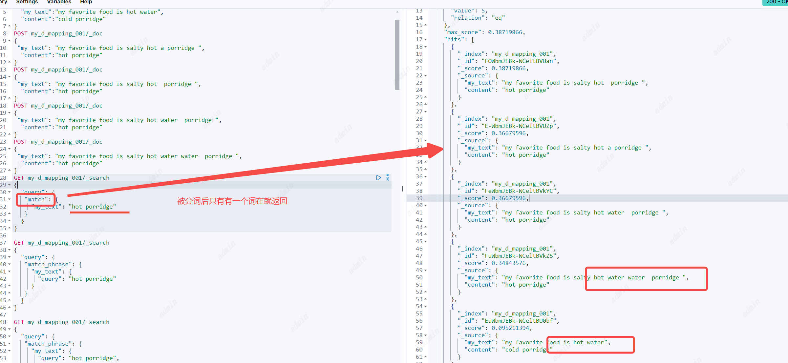
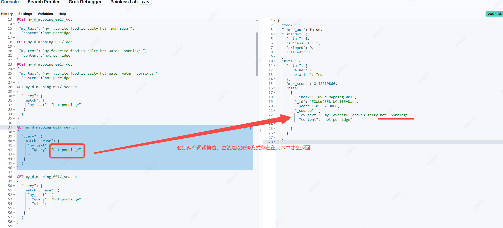
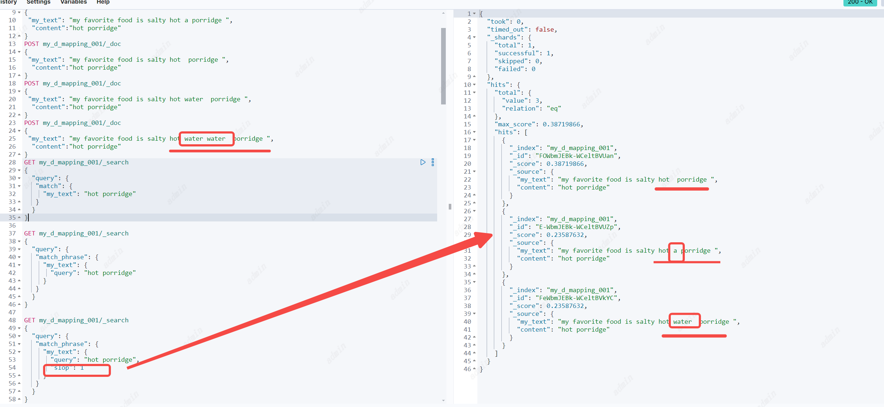
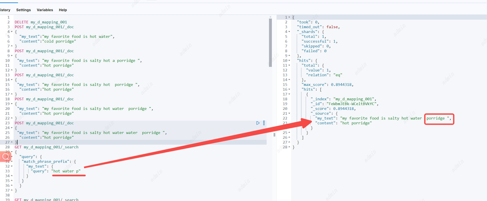
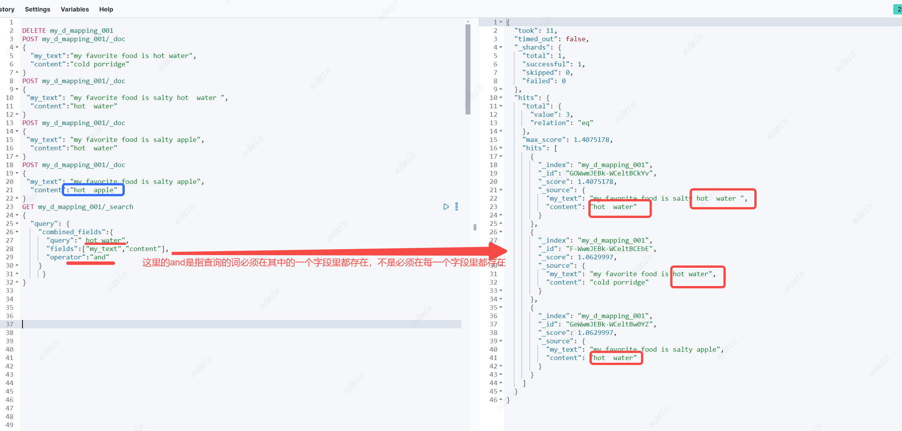

## Match phrase query
匹配短语查询
参数
1. `field` : 必要参数、顶级参数，指定查询哪个字段。
2. `query` : 指定查询的短语文本
3. `analyzer` 选填，指定使用哪个分词器分词，默认使用`field`使用的分词器
4. `stop` 选填，可以允许短语中多出几个词
5. `zero_terms_query` 选填，与match一样
```
POST my_d_mapping_001/_doc
{
  "my_text":"my favorite food is hot water",
  "content":"cold porridge"
}
POST my_d_mapping_001/_doc
{
 "my_text": "my favorite food is salty hot a porridge ",
  "content":"hot porridge"
}
POST my_d_mapping_001/_doc
{
 "my_text": "my favorite food is salty hot  porridge ",
  "content":"hot porridge"
}
POST my_d_mapping_001/_doc
{
 "my_text": "my favorite food is salty hot water  porridge ",
  "content":"hot porridge"
}
POST my_d_mapping_001/_doc
{
 "my_text": "my favorite food is salty hot water water  porridge ",
  "content":"hot porridge"
}
GET my_d_mapping_001/_search
{
  "query": {
   "match": {
     "my_text": "hot porridge"
   }
  }
}

GET my_d_mapping_001/_search
{
  "query": {
   "match_phrase": {
     "my_text": {
       "query": "hot porridge"
     }
   }
  }
}

GET my_d_mapping_001/_search
{
  "query": {
   "match_phrase": {
     "my_text": {
       "query": "hot porridge",
       "slop": 1
     }
   }
  }
}
```
与Match区别：Match查询分词后，只有文档中有一个词满足就会返回，但Match phrase必须两个词挨着也就是以短语的形式存在才会返回。


stop的作用：允许短语中有几个词间隔

## Match phrase prefix query
匹配短语前缀查询，与短语匹配基本相同，文档必须包含这个短语并且按照相同的顺序，但最后一个字可以模糊匹配。
注意：最后一个模糊词会在index词的字典中按照顺序获取前50个，如果你想要搜索的词并不在前50个就会搜不到，所以会有一些歧义。但这通常不是问题，因为用户会不断输入文本让查找变得精确（个人认为适合在搜索框里做搜索的提示词）
参数
1. `field` : 必要参数、顶级参数，指定查询哪个字段。
2. `query` : 指定查询的短语文本
3. `analyzer` 选填，指定使用哪个分词器分词，默认使用`field`使用的分词器
4. `max_expansions` 选填，根据最后一个词最大可模糊匹配的词数，默认50个。
5. `stop` 选填，可以允许短语中多出几个词
6. `zero_terms_query` 选填，与match一样
```
GET my_d_mapping_001/_search
{
  "query": {
   "match": {
     "my_text": "hot porridge"
   }
  }
}
```


## Combined fields
组合字段搜索：可以同时搜索多个字段。
注意：`indices.query.bool.max_clause_count` 参数对搜索的字段数量限制，默认4096个字段

参数
1. `fields` : 必要参数、是数组，可以为每个字段分别设置打分系数。如：` "fields" : [ "title^2", "body" ]`
2. `query` : 指定查询的文本
3. `analyzer` 选填，指定使用哪个分词器分词，默认使用`field`使用的分词器
4. `auto_generate_synonyms_phrase_query` 选填，与match一样
5. `operator` 选填，与match一样 注意：这里的and和or与match一样，并不是代表需要在每一个字段里都存在
6. `minimum_should_match` 选填，与match一样
7. `zero_terms_query` 选填，与match一样

   //todo 与Multi-match区别
## Multi-match query
多匹配查询
//todo


## Query string query
