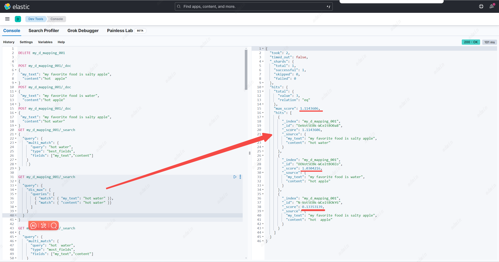
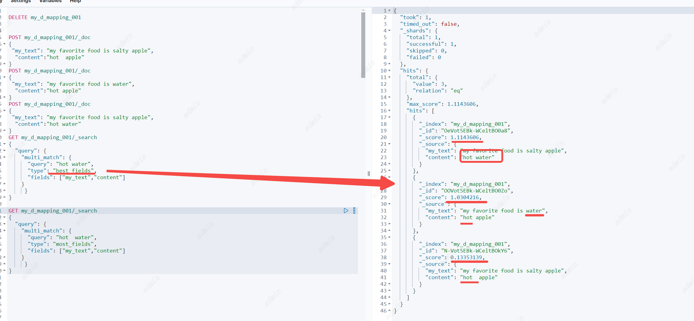
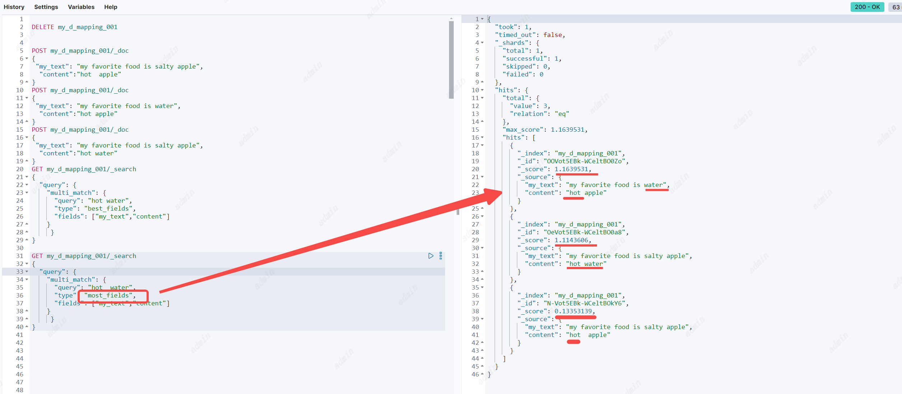
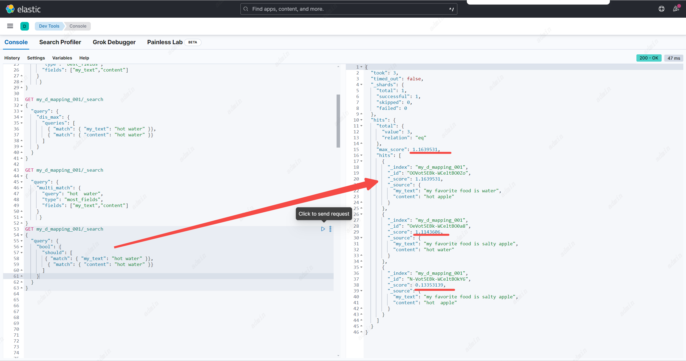

## Match phrase query
匹配短语查询
参数
1. `field` : 必要参数、顶级参数，指定查询哪个字段。
2. `query` : 指定查询的短语文本
3. `analyzer` 选填，指定使用哪个分词器分词，默认使用`field`使用的分词器
4. `stop` 选填，可以允许短语中多出几个词
5. `zero_terms_query` 选填，与match一样
```
POST my_d_mapping_001/_doc
{
  "my_text":"my favorite food is hot water",
  "content":"cold porridge"
}
POST my_d_mapping_001/_doc
{
 "my_text": "my favorite food is salty hot a porridge ",
  "content":"hot porridge"
}
POST my_d_mapping_001/_doc
{
 "my_text": "my favorite food is salty hot  porridge ",
  "content":"hot porridge"
}
POST my_d_mapping_001/_doc
{
 "my_text": "my favorite food is salty hot water  porridge ",
  "content":"hot porridge"
}
POST my_d_mapping_001/_doc
{
 "my_text": "my favorite food is salty hot water water  porridge ",
  "content":"hot porridge"
}
GET my_d_mapping_001/_search
{
  "query": {
   "match": {
     "my_text": "hot porridge"
   }
  }
}

GET my_d_mapping_001/_search
{
  "query": {
   "match_phrase": {
     "my_text": {
       "query": "hot porridge"
     }
   }
  }
}

GET my_d_mapping_001/_search
{
  "query": {
   "match_phrase": {
     "my_text": {
       "query": "hot porridge",
       "slop": 1
     }
   }
  }
}
```
与Match区别：Match查询分词后，只有文档中有一个词满足就会返回，但Match phrase必须两个词挨着也就是以短语的形式存在才会返回。


stop的作用：允许短语中有几个词间隔

## Match phrase prefix query
匹配短语前缀查询，与短语匹配基本相同，文档必须包含这个短语并且按照相同的顺序，但最后一个字可以模糊匹配。
注意：最后一个模糊词会在index词的字典中按照顺序获取前50个，如果你想要搜索的词并不在前50个就会搜不到，所以会有一些歧义。但这通常不是问题，因为用户会不断输入文本让查找变得精确（个人认为适合在搜索框里做搜索的提示词）
参数
1. `field` : 必要参数、顶级参数，指定查询哪个字段。
2. `query` : 指定查询的短语文本
3. `analyzer` 选填，指定使用哪个分词器分词，默认使用`field`使用的分词器
4. `max_expansions` 选填，根据最后一个词最大可模糊匹配的词数，默认50个。
5. `stop` 选填，可以允许短语中多出几个词
6. `zero_terms_query` 选填，与match一样
```
GET my_d_mapping_001/_search
{
  "query": {
   "match": {
     "my_text": "hot porridge"
   }
  }
}
```


## Combined fields
组合字段搜索：可以同时搜索多个字段。
注意：`indices.query.bool.max_clause_count` 参数对搜索的字段数量限制，默认4096个字段

参数
1. `fields` : 必要参数、是数组，可以为每个字段分别设置打分系数。如：` "fields" : [ "title^2", "body" ]`
2. `query` : 指定查询的文本
3. `analyzer` 选填，指定使用哪个分词器分词，默认使用`field`使用的分词器
4. `auto_generate_synonyms_phrase_query` 选填，与match一样
5. `operator` 选填，与match一样 注意：这里的and和or与match一样，并不是代表需要在每一个字段里都存在
6. `minimum_should_match` 选填，与match一样
7. `zero_terms_query` 选填，与match一样

   //todo 与Multi-match区别
## Multi-match query
多匹配查询:可以以构建一个查询条件去匹配多个字段。
参数：
1. `fields` 必填。字段支持通配符以及定义字段匹配分数系数。` "fields": [ "title", "*_name" ] ` `"fields" : [ "subject^3", "message" ] `
2. tie_breaker 平衡分数计算,计算规则：最佳匹配字段的分数加上所有其他匹配字段的tie_breaker * _score。
3. 同样也有和match query 一样的参数：analyzer, boost, operator, minimum_should_match, fuzziness, lenient, prefix_length, max_expansions, fuzzy_rewrite, zero_terms_query, auto_generate_synonyms_phrase_query and fuzzy_transpositions。
4. `type` 选填。multi_match查询在内部执行的方式取决于类型参数
默认`best_fields` 
```
POST my_d_mapping_001/_doc
{
 "my_text": "my favorite food is salty apple",
  "content":"hot  apple"
}
POST my_d_mapping_001/_doc
{
 "my_text": "my favorite food is water",
  "content":"hot"
}
POST my_d_mapping_001/_doc
{
 "my_text": "my favorite food is salty apple",
  "content":"hot water"
}
```
**best_fields**
通常，best_fields类型使用单个最佳匹配字段的分数，但如果指定了tie_breaker，则它按如下方式计算分数:
最佳匹配字段的分数加上所有其他匹配字段的tie_breaker * _score
最佳字段，查找fields集合中的任意一个字段可以匹配查询文本的文档，但使用最佳字段中的_score
```
GET my_d_mapping_001/_search
{
  "query": {
    "multi_match": {
      "query": "hot water",
      "type": "best_fields", 
      "fields": ["my_text","content"]
    }
     }
}
```
等价于dis_max查询
```
GET my_d_mapping_001/_search
{
  "query": {
    "dis_max": {
      "queries": [
        { "match": { "my_text": "hot water" }},
        { "match": { "content": "hot water" }}
      ]
   
    }
  }
}
```


**most_fields**  
最多字段，查找fields集合中的任意一个字段可以匹配查询文本的文档，并组合每个字段匹配的_score。
适合查询不同字段不同分词器，找出最符合搜索文本内容的匹配度最高的文本。
```
GET my_d_mapping_001/_search
{
  "query": {
    "multi_match": {
      "query": "hot  water",
      "type": "most_fields", 
      "fields": ["my_text","content"]
    }
     }
}
```

与best_fields比对，其实返回的内容都一样，但分数不同。best_fields只返回最大分数。most_fields会将所有字段的分数累加，所以这个例子可以看到most_fields匹配到的第一个文档分数更高。
等价于Should查询
```
GET my_d_mapping_001/_search
{
  "query": {
    "bool": {
      "should": [
       { "match": { "my_text": "hot water" }},
        { "match": { "content": "hot water" }}
      ]
    }
  }
}
```

**cross_fields** //todo没看懂
使用相同的分析器将字段当作一个大字段来处理。查找任何字段中的每个单词。
cross_fields类型对于需要匹配多个字段的结构化文档特别有用。例如，当在first_name和last_name字段中查询“Will Smith”时，最佳匹配可能是在一个字段中包含“Will”，而在另一个字段中包含“Smith”。
与**best_fields**不同的是：1. operator和minimum_should_match是按字段应用的，而不是按术语；2. 与相关性有关:first_name和last_name字段中不同的术语频率可能会产生意想不到的结果。
换句话说，**所有术语必须出现在文档匹配的至少一个字段中**。(将此与best_fields和most_fields使用的逻辑进行比较。)


**phrase**
对每个字段运行match_phrase查询，并使用最佳字段中的_score。
与**best_fields**基本一致，但搜索文本以短语的形式去进行匹配

**phrase_prefix**
对每个字段运行match_phrase_prefix查询，并使用最佳字段的_score
与**best_fields**基本一致，但搜索文本以短语前缀的形式去进行匹配
```
GET my_d_mapping_001/_search
{
  "query": {
    "multi_match": {
      "query": "hot water",
      "type": "phrase_prefix", 
      "fields": ["my_text","content"]
    }
     }
}
```
等价于dis_max查询
```
GET my_d_mapping_001/_search
{
  "query": {
    "dis_max": {
      "queries": [
        { "match_phrase_prefix": { "my_text": "hot water" }},
        { "match_phrase_prefix": { "content": "hot water" }}
      ]
   
    }
  }
}
```


**bool_prefix**
与**best_fields**基本一致，在每个字段上创建一个match_bool_prefix查询，并组合每个字段的_score。
```
GET my_d_mapping_001/_search
{
  "query": {
    "multi_match": {
      "query": "hot water",
      "type": "bool_prefix", 
      "fields": ["my_text","content"]
    }
     }
}
```
等价于dis_max查询
```
GET my_d_mapping_001/_search
{
  "query": {
    "dis_max": {
      "queries": [
        { "match_bool_prefix": { "my_text": "hot water" }},
        { "match_bool_prefix": { "content": "hot water" }}
      ]
   
    }
  }
}
```


## Query string query
可以使用query_string查询创建一个复杂的搜索，其中包括通配符、跨多个字段的搜索等等。虽然用途广泛，但查询是严格的，如果查询字符串包含任何无效语法，则返回错误。
参数
1. `query` :  必要参数、提供的查询内容需要追寻查询语法。就是一些的lucene语法，具体查询语法见（https://www.elastic.co/guide/en/elasticsearch/reference/current/query-dsl-query-string-query.html#query-string-syntax）
2. `default_field` : 选填、指定查询哪个字段。默认值是索引的配置`index.query.default_field`指定，这个配置是`*` ,表示所有符合匹配搜索的字段都会被查询（不包括 nested 文档， nested 文档需要用 nested 查询）。一次可以查询的字段次数是有限制的，可以设置索引配置`indices.query.bool.max_clause_count`。
3. `allow_leading_wildcard` : 选填,默认true。是否允许query里的查询内容以通配符`*或者？`开头
4. `analyze_wildcard`: 选填,默认false。如果为true，查询将尝试分析查询字符串中的通配符
5. `analyzer` 选填，指定使用哪个分词器分词，默认使用`field`使用的分词器
6. `auto_generate_synonyms_phrase_query` 选填，默认true，如果是true表示开启使用synonym_graph令牌过滤器进行多词同义词扩展，将query中的文本信息找到同义词，一起进行多terms查找，如`ny`与`new york`是同意词，搜索的时候除了匹配包含`ny`的文档，也会匹配包含`new york`的文档，约等于查询`ny OR (new AND york)`
7. `boost` ：选填。分数系数，默认1
8. `enable_position_increments` 选填,默认true。如果为true，则在从query_string搜索构造的查询中启用位置增量
9. `fields` : 必要参数、是数组，可以为每个字段分别设置打分系数。如：` "fields" : [ "title^2", "body" ]`；也支持`*`，进行多字段查询时，也可以使用与多字段查询一样的参数。
10. `max_determinized_states` 选填,默认1000。查询所需的自动机状态的最大数目。（感觉和Lucene语法有关）Elasticsearch内部使用Apache Lucene来解析正则表达式。Lucene将每个正则表达式转换为包含许多确定状态的有限自动机。
    您可以使用此参数来防止该转换无意中消耗太多资源。您可能需要增加此限制以运行复杂的正则表达式。
11. `fuzziness` ：选填。模糊查询，指定可以最多有多少个字符与搜索的内容不同。
12. `max_expansions` ：选填。默认50个，模糊匹配最大可扩展到多少个term词
13. `prefix_length` ：选填。默认0，表示模糊匹配从哪一位开始模糊
14. `transpositions` ：选填，默认值true,指定是否可以交换字符顺序
15. `fuzzy_rewrite` ：选填，模糊重写方法。如果fuzziness参数不为0，则fuzzy_rewrite默认使用top_terms_blended_freqs_${max_expansion}方法
16. `lenient` ：选填，默认false，如果是true，会校验query中设置的查询内容的格式，
17. `operator` ：选填，只有两个选择OR和AND，默认OR。表示query中的文本被分成多个词后是使用OR去匹配还是AND匹配。
18. `minimum_should_match` ：选填，要返回文档必须匹配的最小子句数。如`I love china`经过分词后,相当于有`I` OR `love`OR `china`,三个子句。minimum_should_match配置多少就要返回匹配这些子句最小最小子句数的文档。
19. `zero_terms_query` ：选填，none 或者 all，默认none 。如果query中的文本经过分词器处理后，没有任何词（如全是停止词所以将词全部移除），none表示不返回任何文档，all返回所有文档。

