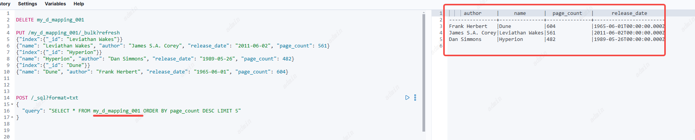

# ES SQL API操作


## 返回数据格式
通过format参数控制返回数据的格式

| 格式   | 接收http头  | 人可读    |
|------|----------|--------|
| CSV  | text/csv | 是      |
| JSON |      application/json    | 是      |
| TSV  |     text/tab-separated-values     | 是      |
| TXT  |   text/plain       | 是      |
| YAML |      application/yaml    | 是      |
| cbor  |   application/cbor      | 否（二进制） |
| smile |      pplication/smile   |  否（二进制）  Smile二进制数据格式类似cor    |

```
POST /_sql?format=json
{
"query": "SELECT * FROM my_d_mapping_001 ORDER BY page_count DESC LIMIT 5"
}
```