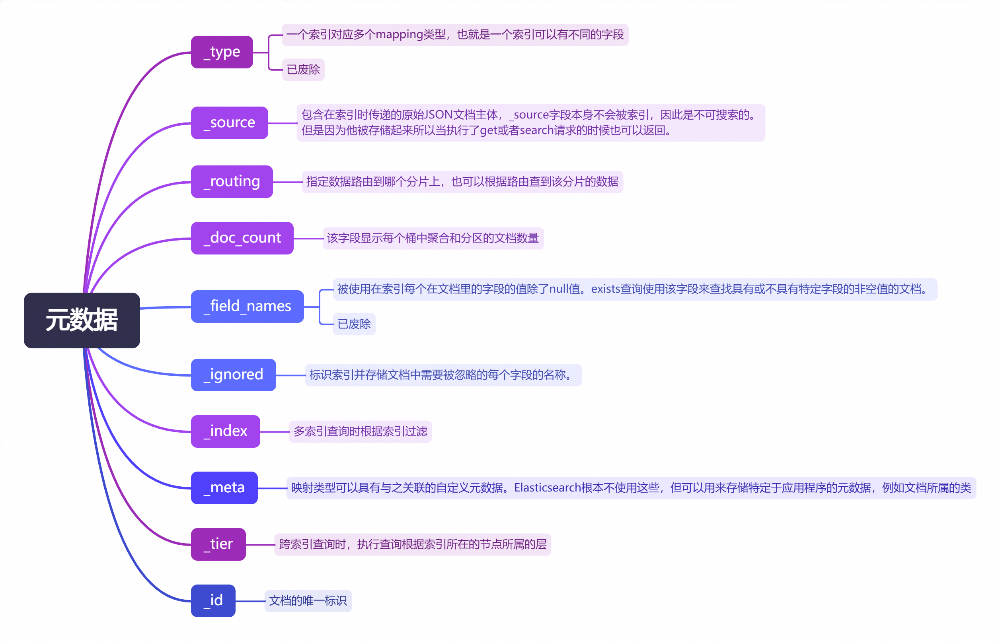

# 索引篇

## 什么是索引

在常见的关系型数据库中，索引像是为提高数据查询速度而建立的字典。然而在ES中并非如此，在ES中索引类似于的关系型数据库的表，是数据存储和搜索的核心单位，用来存储和关联一类相似特征的文档的集合。每个索引包含多个文档，每个文档又包含多个字段。索引由名称标识（必须全部小写），在对其中的文档执行索引、搜索、更新和删除操作时，该名称用于引用索引。

## 索引基础概念

创建和使用一个索引前需要了解一下内容

### 文档

文档是可以被索引的基本信息单位。文档以JSON 表示，可读性很高。

在索引中，可以存储任意数量的文档。请注意，虽然文档物理上驻留在索引中，但文档实际上必须被索引/分配给索引中的类型。

### 分片

索引存储的数据是没有限制的（不考虑实际的设计约束和性能），如果超过机器节点本身的磁盘大小该怎么办呢？为了解决这个问题，Elasticsearch提供了将索引细分为多个碎片的功能。当用户创建索引时，可以简单地定义所需的分片数量。每个分片本身就是一个功能齐全且独立的“索引”，可以托管在集群中的任何节点上。

分片之所以重要，主要有两个原因：

1. 它允许水平分割/缩放内容卷

2. 它允许跨分片（可能在多个节点上）分发和并行操作，从而提高性能/吞吐量

分片如何分布以及它的文档如何聚合回搜索请求的机制完全由Elasticsearch管理。

在随时可能出现故障的网络/云环境中，如果分片/节点以某种方式脱机或因任何原因消失，则非常有用并且强烈建议使用故障转移机制。为此，Elasticsearch允许您将索引分片的一个或多个副本创建为所谓的副本分片（replica shards，简称replicas）。

### 副本

副本顾名思义就是数据的备份。

复制之所以重要，主要有两个原因：

1. 它在分片/节点发生故障时提供高可用性。出于这个原因，**一定要注意，绝不会将复制碎片分配到与其复制的原始/主碎片相同的节点上。**

2. 它可以扩展搜索量/吞吐量，因为搜索可以在所有副本上并行执行。

总而言之，每个索引可以分成多个分片。一个索引也可以被复制零次（即没有副本）或多次。一旦被复制，每个索引将拥有主分片（被复制的原始分片）和副本分片（主分片的副本）。可以在创建索引时定义每个索引的分片和副本的数量。创建索引后，您可以随时动态更改副本的数量，但不能更改事后分片的数量。

Elasticsearch 中每个索引的分片和副本配置如下：

- **主分片（Primary Shards）**：默认情况下，每个索引有 **5个主分片**。
- **副本分片（Replica Shards）**：默认情况下，每个索引有 **1个副本分片**，即每个主分片都有一个副本。

如果是单节点集群，副本分片将无法分配到其他节点，因此 Elasticsearch 会自动将副本分片分配到主分片上，实际上每个副本分片都“存在”在主分片所在的同一个节点上

### 类型

在索引中，7.0.0之前用户可以定义一个或多个类型。类型是索引的逻辑类别/分区，其语义完全由用户决定。通常，类型是为具有一组公共字段的文档定义的。

`_type` 字段与文档的 `_id` 字段结合生成`_uid` 字段，所以允许相同的`_id`不同的 `_type` 存在同一个索引下。

```
_type` 也被用于父子关系的文档，也就是一个文档的 `question` 类型的父文档可能是 `answer
```

**7.0.0之后的版本不在支持自定义Mapping 的type属性**

**为什么移除？**

最开始，解释ES的index类似于database，type类似于table。实际上这时一个这是一个错误的类比，会导致错误的假设。在SQL数据库中，表是相互独立的。

一个表中的列与另一个表中同名的列没有关系，但这与ES的mapping的Type完全不一样。统一索引下不同的mapping type中**相同字段名称的字段实际上是同一个的，在内部由相同的Lucene字段支持，所以这两个type中相同的字段必须是相同的类型**。

因此，如果想要**删除一个类型下与其他类型相同的字段时，会失败**。

**最重要的是，在同一个索引中存储具有很少或没有共同字段的不同实体会导致数据稀疏，并干扰Lucene有效压缩文档的能力**。

总结：

1. 相同index不同Type的相同字段内部由相应的lucene字段支持，可不单独删除
2. 相同index不同Type中不同字段过多会导致数据稀疏，降低lucene压缩能力

所以为了避免给用户带来困扰，ES7.0.0之后不再允许为一个索引定义多个Type，到了8.0之后直接移除这个属性。所以在使用ES比较早的同学们可以把这点考虑进去，避免后续升级带来的麻烦。

### 元数据字段



### 显式创建Mapping

映射是定义文档及其包含的字段如何存储和索引的过程。每个文档都是字段的集合，每个字段都有自己的数据类型。在映射数据时，您将创建一个映射定义，其中包含与文档相关的字段列表。显示创建索引可以通过为每个字段指定数据类型来预先定义映射。

### 动态创建Mapping

当用户使用动态映射时，Elasticsearch会自动尝试检测文档中字段的数据类型。这允许您通过向索引添加数据来快速入门。如果用新字段索引其他文档，Elasticsearch会自动添加这些字段。用户可以向顶级映射、内部对象和嵌套字段添加字段。

使用动态模板定义自定义映射，这些映射将基于匹配条件应用于动态添加的字段。

## 索引操作

### 为索引创建分片

```
PUT my_d_mapping_001
{
    "settings" : {
        "index" : {
            "number_of_shards" : 1, //默认5
            "number_of_replicas" : 1 //默认1
        }
    }
}
```

索引创建好分片后，主分片数量就不能改变了，副本分片数量可以修改。

### 为索引创建显式Mapping

```
DELETE my_d_mapping_001 //先把前面的索引删除

PUT my_d_mapping_001
{
  "settings": {
    "number_of_shards": 1
  },
  "mappings": {
    "properties": {
      "user": {
        "type": "keyword"
      }
    }
  }
}
```

### 为索引映射动态Mapping

过设置dynamic参数来动态创建字段。可以在文档和对象级别禁用dynamic。默认true

1. true：根据字段内容判断字段类型，将新字段添加到索引中
2. runtime：根据字段内容判断字段类型，将新字段添加到动态运行时字段中，因为只存_source中，依然可以被查询，查询的代价会更大。
3. false ：忽略新字段，只存在_source中，也就是不能查询只能展示
4. strict：拒绝为定义的字段插入

ES会根据我们的数据自动创建动态Mapping

```
DELETE my_d_mapping_001 //先把前面的索引删除

POST my_d_mapping_001/_doc
{
  "docContent" : "动态数据"
}
```

再执行GET /my_d_mapping_001/_mapping

返回

```
{
  "my_d_mapping_001": {
    "mappings": {
      "properties": {
        "docContent": {
          "type": "text",
          "fields": {
            "keyword": {
              "type": "keyword",
              "ignore_above": 256
            }
          }
        }
      }
    }
  }
}
```

Elasticsearch默认字段类型

| **JSON data type**                                           | **`"dynamic":"true"`**                             | **`"dynamic":"runtime"`**                          |
| ------------------------------------------------------------ | -------------------------------------------------- | -------------------------------------------------- |
| `null`                                                       | No field added                                     | No field added                                     |
| `true` or `false`                                            | `boolean`                                          | `boolean`                                          |
| `double`                                                     | `float`                                            | `double`                                           |
| `long`                                                       | `long`                                             | `long`                                             |
| `object`                                                     | `object`                                           | No field added                                     |
| `array`                                                      | Depends on the first non-`null` value in the array | Depends on the first non-`null` value in the array |
| `string` that passes [date detection](https://gitee.com/link?target=https%3A%2F%2Fwww.elastic.co%2Fguide%2Fen%2Felasticsearch%2Freference%2Fcurrent%2Fdynamic-field-mapping.html%23date-detection) | `date`                                             | `date`                                             |
| `string` that passes [numeric detection](https://gitee.com/link?target=https%3A%2F%2Fwww.elastic.co%2Fguide%2Fen%2Felasticsearch%2Freference%2Fcurrent%2Fdynamic-field-mapping.html%23numeric-detection) | `float` or `long`                                  | `double` or `long`                                 |
| `string` that doesn’t pass `date` detection or `numeric` detection | `text` with a `.keyword` sub-field                 | `keyword`                                          |

也可以为date_detection和numeric_detection自定义字段映射规则。也可以使用dynamic_templates去定义额外的动态字段映射规则。

### 为索引创建别名

索引别名API允许使用名称为索引创建别名，所有API都会自动将别名转换为实际索引名称。别名也可以映射到多个索引，指定它时，别名将自动扩展到别名索引。别名还可以与筛选器相关联，该筛选器将在搜索和路由值时自动应用。**别名不能与索引同名**。

为my_d_mapping_001索引添加一个名为alias1的别名

```
POST /_aliases
{
    "actions" : [
        { "add" : { "index" : "my_d_mapping_001", "alias" : "alias1" } }
    ]
}
```

这时根据别名也可以将my_d_mapping_001索引中的数据查找出来

```
GET alias1/_search
```

也可以通过remove操作将索引从别名中移除 ，以及多个索引指向同一个别名，同时也支持通配符将具有相同前缀的多个索引指向同一个别名

```
POST /_aliases
{
    "actions" : [
        { "remove" : { "index" : "test1", "alias" : "alias1" } },
        { "add" : { "index" : "test2", "alias" : "alias1" } }
    ]
}

POST /_aliases
{
    "actions" : [
        { "add" : { "indices" : ["test1", "test2"], "alias" : "alias1" } }
    ]
}

POST /_aliases
{
    "actions" : [
        { "add" : { "index" : "test*", "alias" : "all_test_indices" } }
    ]
}
```

### 删除索引

需要指定索引、别名或通配符表达式。

delete index API还可以应用于多个索引，方法是使用逗号分隔的列表，或者使用_all或*作为索引应用于所有索引（使用这种方式需要注意）。

默认情况下，该参数不支持通配符“*”或“_all”。要使用通配符或_all，请将action.destructive_requires_name集群设置为false。

```
DELETE /my_d_mapping_001
```

### 查看索引

查看索引设置

```
GET my_d_mapping_001/_settings
```

返回

```
{
  "my_d_mapping_001": {
    "settings": {
      "index": {
        "routing": {
          "allocation": {
            "include": {
              "_tier_preference": "data_content"
            }
          }
        },
        "number_of_shards": "1",
        "provided_name": "my_d_mapping_001",
        "creation_date": "1731403563131",
        "number_of_replicas": "1",
        "uuid": "PnmT-lfTR1-b1_8PbP0ung",
        "version": {
          "created": "8505000"
        }
      }
    }
  }
}
```

查看索引mapping

```
GET my_d_mapping_001/_mapping
```

返回

```
{
  "my_d_mapping_001": {
    "mappings": {
      "properties": {
        "docContent": {
          "type": "text",
          "fields": {
            "keyword": {
              "type": "keyword",
              "ignore_above": 256
            }
          }
        }
      }
    }
  }
}
```

使用以下命令可以查看所有索引的相关信息

```console
GET /_cat/indices?v
```

