# Hive

## 什么是Hive

1. 是基于Hadoop的数仓工具，可以将结构化的数据映射成一张表，并提供类SQL查询功能
2. 构建在Hadoop之上，本质上将HQL转换成MR任务只能
3. 扩展性较好，支持自定义UDF，自定义存储格式等
4. Hive中的表是逻辑表，就只是表的定义也就是元数据，本质是Hadoop存储的目录/文件，达到了元数据与数据分离的目的，Hive本身不存储数据，数据存储再HDFS
5. Hive针对读多写少的场景，不支持更新数据
6. HIve没有定义固定的数据格式，所以可以由用户指定，有三个属性分别：1. 列分隔符；2. 行分隔符；3. 读取文件数据的方法。

## Hive的优缺点以及应用场景

### 优点：

1. 可以使用类SQL的方式炒作，降低了使用门槛。
2. 避免直接写MR任务，简化了开发成本
3. 统一的是元数据管理，可以让impala/Spark共享元数据
4. 易扩展（HDFS+Hadoop：可以扩展集群规模，支持自定义函数）

### 缺点：

1. Hive执行的延迟比较高，所以常用于数据分析，适合实时性要求不高的场景
2. Hive不支持数据更新，所以适用于修改不频繁的场景

### 场景：

1. Hive优势在于处理大数据但是实行不高，所以适用于数据离线处理：如日志分析、海量结构化数据离线分析
2. Hive的执行延迟比较高，因此hve常用于数据分析的，对实时性要求不高的场合


### Hive 和 RDBMS（[关系数据库]管理系统）的对比
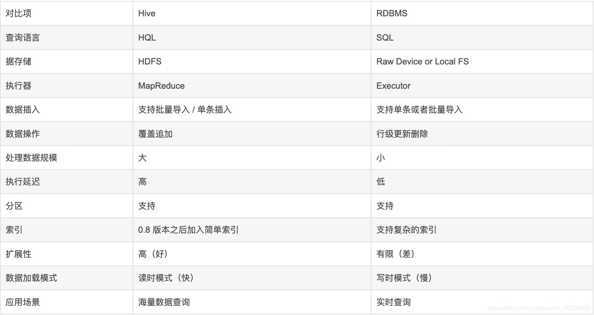

## Hive架构
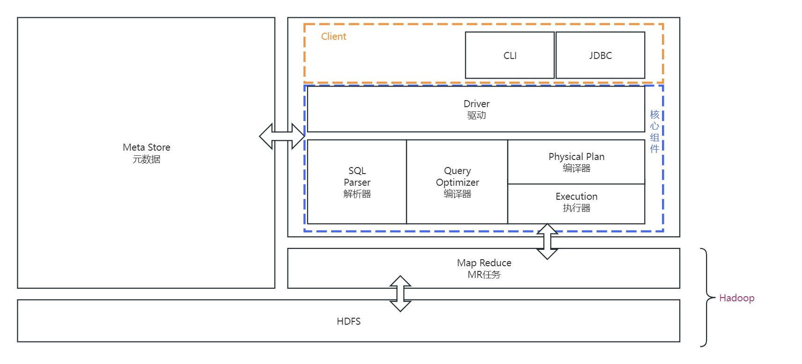

用户接口主要有三个：CLI、Client、WebUI
元数据存储：通常在关系型数据库：Mysql、Derby
语句转换：解释器、编译器、优化器、执行器

用户接口主要由三个：CLI、JDBC/Beeline和WebGUI。其中，CLI为shell命令行；JDBC/Beeline是Hive的JAVA实现，与传统数据库JDBC类似；WebGUI是通过浏览器访问Hive。

元数据存储：Hive 将元数据存储在数据库中(MySql或者Derby)。Hive中的元数据包括表的名字，表的列和分区及其属性，表的属性（是否为外部表等），表的数据所在目录等。表的数据所在目录Metastore 默认存在自带的 Derby 数据库中。缺点就是不适合多用户操作，并且数据存储目录不固定。数据库跟着 Hive 走，极度不方便管理。解决方案：通常存我们自己创建的 MySQL 库（ 本地 或 远程）Hive 和 MySQL 之间通过 MetaStore 服务交互。

Driver ： 解释器，编译器 （Compiler） ） ，优化器 （Optimizer） ） ，执行器 （Executor ）
Driver 组件完成 HQL 查询语句从词法分析，语法分析，编译，优化，以及生成逻辑执行
计划的生成。生成的逻辑执行计划存储在 HDFS 中，并随后由 MapReduce 调用执行
Hive 的核心是驱动引擎， 驱动引擎由四部分组成：
(1) 解释器：解释器的作用是将 HiveSQL 语句转换为抽象语法树（AST）
(2) 编译器：编译器是将语法树编译为逻辑执行计划
(3) 优化器：优化器是对逻辑执行计划进行优化
(4) 执行器：执行器是调用底层的运行框架执行逻辑执行计划
## Hive分区
分区是hive存放数据的一种方式，将列值作为目录来存放数据，就是一个分区，可以有多列。
这样查询时使用分区列进行过滤，只需根据列值直接扫描对应目录下的数据，不扫描不关心的分区，快速定位，提高查询效率。
hive的分区有两种类型：
静态分区SP(Static Partitioning)
动态分区DP(Dynamic Partitioning)
静态分区需要指定分区值，动态分区的分区值是不确定的，会根据数据自动创建
### 静态分区
1. 单分区建表
```aidl
create table if not exists day_log(
  uid bigint,
  uname string,
  action string
) comment '用户动作流水记录'
partitioned by(ymd string comment '日期格式yyyyMMdd')
row format delimited fields terminated by '\t';
```
2. 将数据加载到指定分区
```aidl
load data local inpath '/user/hive/data/day_log.txt' 
into table day_log paritition(ymd='20220803')
```
3. 创建具有多个分区的表
```aidl
create table if not exists day_log(
  uid bigint,
  uname string,
  action string
) comment '用户动作流水记录'
partitioned by(year string,month string,day string)
row format delimited fields terminated by '\t';
```
4. 将数据加载到指定分区
```aidl
load data local inpath '/user/hive/data/day_log.txt' 
into table day_log paritition(year='2022',month='08',day='02')

将查询的数据直接写入分区

insert overwrite table day_log partition (year='2022',month='08',day='02')
select uid,uname,action from (
	xxxxxx
)

```
### 动态分区
所谓动态分区，分区的值是不确定的，分区的数量是不确定的，都是由数据确定。
生产环境中，动态分区一般常用于创建新表后，需要一次性加载历史数据。
1. 创建临时表
```aidl
-- 创建临时表
create table if not exists tmp (
  uid int,
  commentid bigint,
  recommentid bigint,
  year int,
  month int,
  day int
)
row format delimited fields terminated by '\t';
 
-- 加载数据到临时表
load data local inpath 'user/hive/data/tmp.txt' into table tmp;
```
2. 创建动态分区
```aidl
-- 创建动态分区表
create table if not exists dp_tmp(
	uid int,
	commentid bigint,
	recommentid bigint
)
partitioned by (year string,month string,day string)
row format delimited fields terminated by '\t';
 
-- 写入数据到分区表
-- 参数为开启动态分区
set hive.exec.dynamic.partition=true;
insert overwrite table dp_tmp partition(year,month,day)
select uid,commentid,recommentid,year,month,day from tmp;
```
执行上述写入语句会报错
```aidl
FAILED: SemanticException [Error 10096]: Dynamic partition strict mode requires at least one static partition column. To turn this off set hive.exec.dynamic.partition.mode=nonstrict
```
看报错信息：动态分区严格模式至少需要一个静态分区列。关闭它，设置参数
```aidl
set hive.exec.dynamic.partition.mode=nonstrict
```
### 严格模式
参数hive.exec.dynamic.partition.mode表示动态分区的模式。
默认是strict，也就是严格模式，表示必须指定至少一个分区为静态分区
nonstrict模式，即非严格模式，表示允许所有的分区字段都可以使用动态分区
#### 严格模式
```aidl
-- 至少需要指定一个静态分区列
-- 开启动态分区
set hive.exec.dynamic.partition=true;
insert overwrite table dp_tmp partition(year='2022',month,day)
select uid,commentid,recommentid,month,day from tmp;
```
#### 非严格模式
```aidl
set hive.exec.dynamic.partition=true;
-- 允许所有的分区字段都可以使用动态分区，兼容严格模式
-- 更改动态分区模式为非严格模式
set hive.exec.dynamic.partition.mode=nonstrict;
insert overwrite table dp_tmp partition(year,month,day)
select uid,commentid,recommentid,month,day from tmp;
```
通常情况下，我们使用动态分区，为非严格模式：
```aidl
 set hive.exec.dynamic.partition=true;
 set hive.exec.dynamic.partition.mode=nonstrict;
```
### 静态分区和动态分区的区别
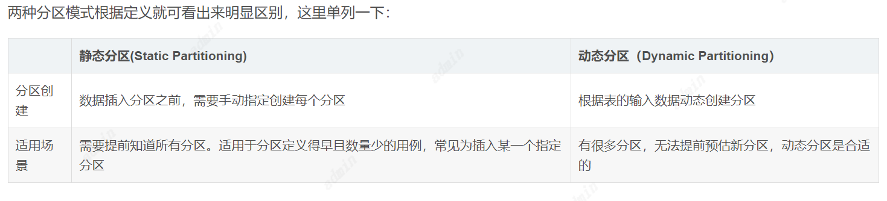
另外动态分区的值是MapReduce任务在reduce运行阶段确定的，也就是所有的记录都会distribute by，相同字段(分区字段)的map输出会发到同一个reduce节点去处理，如果数据量大，这是一个很弱的运行性能。
而静态分区在编译阶段就确定了，不需要reduce任务处理。所以如果实际业务场景静态分区能解决的，尽量使用静态分区即可。
### 分区使用注意事项
1.hive分区参数及作用
hive表中的分区作用主要是使数据按照分区目录存储在hdfs上，查询只要针对指定的目录集合进行查询，避免全局查找，这样提高了查询性能。
hive的分区需要合理使用，过多的分区目录和文件对于集群Namenode服务是有性能压力的，Namenode需要将大量的元数据信息保存在内存中。如果报错，会造成Namenode不可用。
一次查询表里有太多分区，会使得查询文件过大，也会造成Metastore服务出现OOM报错，报错信息显示Metastore不可用。
hive为了避免因为异常产生大量分区，导致上述问题，本身是默认动态分区关闭，同时对生成动态分区的数量也做了一定限制。
通过手动参数设置可以改变系统默认值，具体hive默认参数以及SQL执行配置参数（不同版本默认参数有一定差异）如下:
```aidl
-- Hive默认配置值
-- 开启或关闭动态分区
hive.exec.dynamic.partition=false;
-- 设置为nonstrict模式，让所有分区都动态配置，否则至少需要指定一个分区值
hive.exec.dynamic.partition.mode=strict;
-- 能被mapper或reducer创建的最大动态分区数，超出而报错
hive.exec.max.dynamic.partitions.pernode=100;
-- 一条带有动态分区SQL语句所能创建的最大动态分区总数，超过则报错
hive.exec.max.dynamic.partitions=1000;
-- 全局能被创建文件数目的最大值，通过Hadoop计数器跟踪，若超过则报错
hive.exec.max.created.files=100000;
 
-- 根据个人需要配置
-- 设置动态分区开启
set hive.exec.dynamic.partition=true;  
-- 设置为非严格模式
set hive.exec.dynamic.partition.mode=nonstrict;
-- 设置每个节点创建最大分区数
set hive.exec.max.dynamic.partitions.pernode=1000;
-- 设置执行SQL创建最大分区数
set hive.exec.max.dynamic.partitions=10000;
-- 设置全局被创建文件最大值
set hive.exec.max.created.files=1000000;
```
在执行hiveSQL的时候如果动态分区数量或文件数任何一个超过集群默认就会产生报错：
```aidl
ERROR [LocalJobRunner Map Task Executor #0]:mr.ExecMapper (ExecMapper.java:map(171)) - org.apache.hadoop.hive.ql.metadata.HiveException: Hive Runtime Error while processing row ....
 Caused by: org.apache.hadoop.hive.ql.metadata.HiveFatalException: [Error 20004]: Fatal error occurred when node tried to create too many dynamic partitions. The maximum number of dynamic partitions is controlled by hive.exec.max.dynamic.partitions and hive.exec.max.dynamic.partitions.pernode. Maximum was set to: 256... 10 more
```
集群会kill任务。为了解决报错，我们通常将三个参数调大。但是也需要用户对自己的Hive表的分区数量进行合理规划，避免过多的分区。

2.分区常见注意事项
a. 尽量不要使用动态分区，因为动态分区的时候，将会为每一个分区分配reducer数量，当分区数量多的时候，reducer数量将会增加，对服务器是一种灾难。
b. 动态分区和静态分区的区别，静态分区不管有没有数据都会创建指定分区，动态分区是有结果集将创建，否则不创建。
c. hive动态分区的严格模式和hive严格模式是不同的。
3.一些异常分区处理

a.默认分区
如果动态分区列输入的值为NULL或空字符串，则hive将该行放入一个特殊分区，分区名称由参数hive.exec.default.partition.name控制。
默认值为__HIVE_DEFAULT_PARTITION__。可以通过查看表分区命令进行查看：
```aidl
show partitions 'table';
  
-- ymd=__HIVE_DEFAULT_PARTITION__
```
清理该分区使用正常删除分区语句即可。对分区的操作命令详见上篇文章。
b.乱码分区
表分区字段处理不当可能会造成乱码分区，主要是由于转译编码原因造成。例如：
```aidl
sp_test=r_ready%3D91;r_load%3D351
```
原因是Hive会自动对一些UTF-8字符编码成Unicode（类似网址中中文字符和一些特殊字符的编码处理）。此处%3D解码后是'='。可以使用在线转换进行解码：https://www.matools.com/code-convert-utf8。

最后使用解码后的字段即可（注意分号转义）：
```
alter table dpdw_traffic_base drop partition(sp_test='r_ready=91\;r_load=351');
```

## 窗口函数
### 窗口函数概述
窗口函数（Window functions）是一种SQL函数，非常适合于数据分析，因此也叫做OLAP函数，其最大特点是：输入值是从SELECT语句的结果集中的一行或多行的“窗口”中获取的。你也可以理解为窗口有大有小（行有多有少）。
通过OVER子句，窗口函数与其他SQL函数有所区别。如果函数具有OVER子句，则它是窗口函数。如果它缺少OVER子句，则它是一个普通的聚合函数。
窗口函数可以简单地解释为类似于聚合函数的计算函数，但是通过GROUP BY子句组合的常规聚合会隐藏正在聚合的各个行，最终输出一行，窗口函数聚合后还可以访问当中的各个行，并且可以将这些行中的某些属性添加到结果集中。 
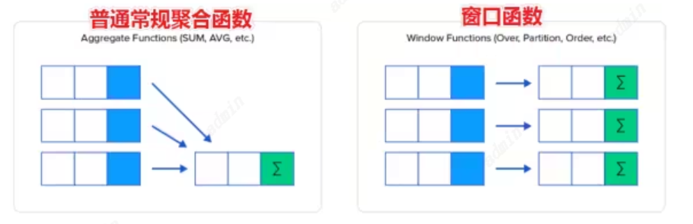
为了更加直观感受窗口函数，我们通过sum聚合函数进行普通常规聚合和窗口聚合，一看效果。 
```aidl
----sum+group by普通常规聚合操作------------
select sum(salary) as total from employee group by dept;

----sum+窗口函数聚合操作------------
select id,name,deg,salary,dept,sum(salary) over(partition by dept) as total from employee; 
```
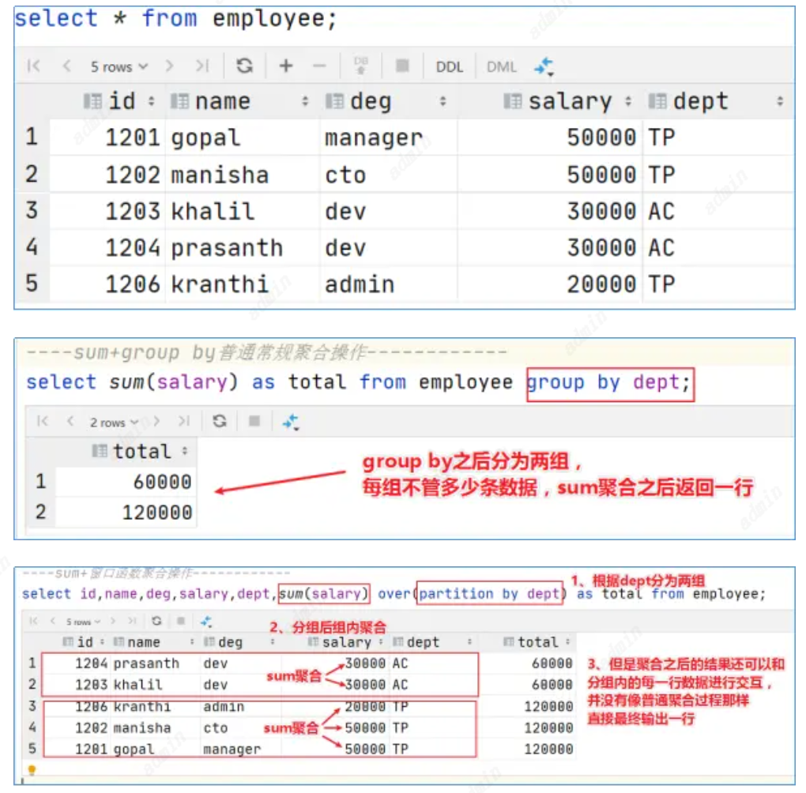
### 窗口函数语法
```
unction(arg1,..., argn) OVER ([PARTITION BY <...>] [ORDER BY <....>] [<window_expression>])

--其中Function(arg1,..., argn) 可以是下面分类中的任意一个
    --聚合函数：比如sum max avg等
    --排序函数：比如rank row_number等
    --分析函数：比如lead lag first_value等

--OVER [PARTITION BY <...>] 类似于group by 用于指定分组  每个分组你可以把它叫做窗口
--如果没有PARTITION BY 那么整张表的所有行就是一组

--[ORDER BY <....>]  用于指定每个分组内的数据排序规则 支持ASC、DESC

--[<window_expression>] 用于指定每个窗口中 操作的数据范围 默认是窗口中所有行 
```
### 案例：网站用户页面浏览次数分析 
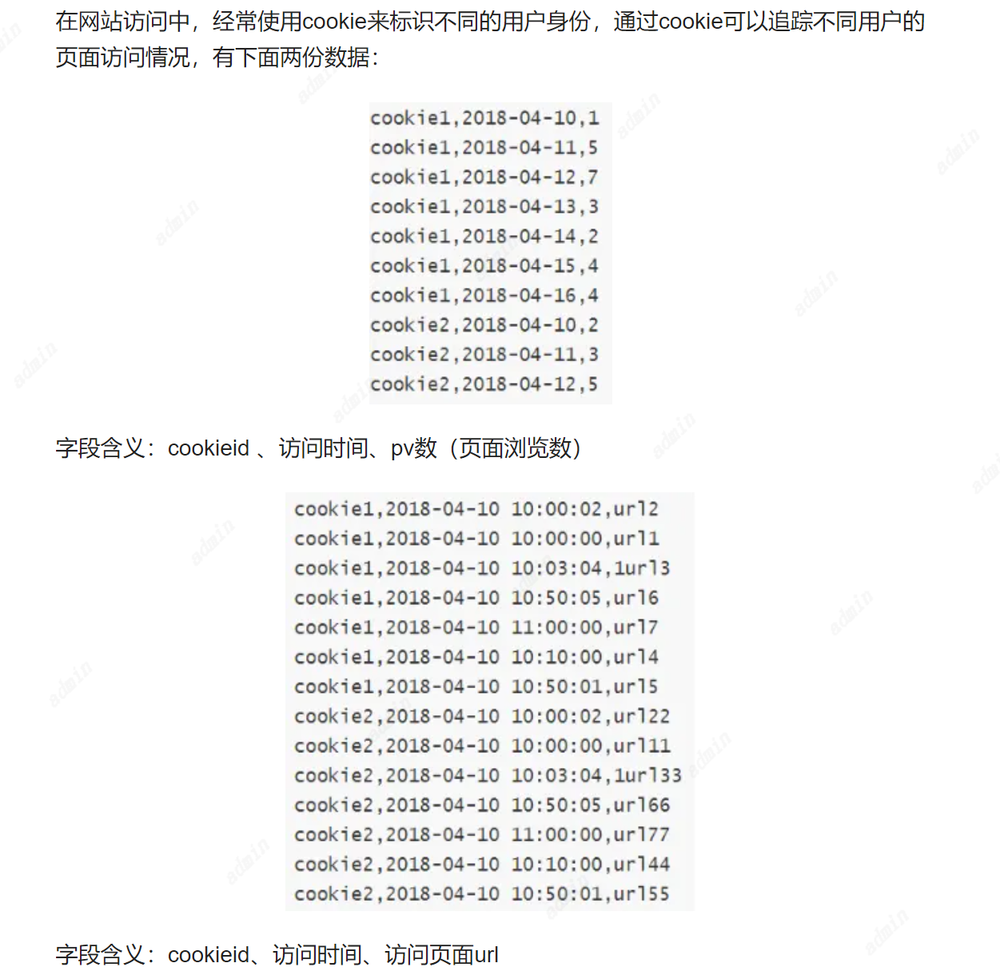
在Hive中创建两张表表，把数据加载进去用于窗口分析。 
```aidl
---建表并且加载数据
create table website_pv_info(
   cookieid string,
   createtime string,   --day
   pv int
) row format delimited
fields terminated by ',';

create table website_url_info (
    cookieid string,
    createtime string,  --访问时间
    url string       --访问页面
) row format delimited
fields terminated by ',';


load data local inpath '/root/hivedata/website_pv_info.txt' into table website_pv_info;
load data local inpath '/root/hivedata/website_url_info.txt' into table website_url_info;

select * from website_pv_info;
select * from website_url_info; 
```
#### 窗口聚合函数
从Hive v2.2.0开始，支持DISTINCT与窗口函数中的聚合函数一起使用。
这里以sum（）函数为例，其他聚合函数使用类似。
```aidl
-----窗口聚合函数的使用-----------
--1、求出每个用户总pv数  sum+group by普通常规聚合操作
select cookieid,sum(pv) as total_pv from website_pv_info group by cookieid;

--2、sum+窗口函数 总共有四种用法 注意是整体聚合 还是累积聚合
--sum(...) over( )对表所有行求和
--sum(...) over( order by ... ) 连续累积求和
--sum(...) over( partition by... ) 同组内所有行求和
--sum(...) over( partition by... order by ... ) 在每个分组内，连续累积求和

--需求：求出网站总的pv数 所有用户所有访问加起来
--sum(...) over( )对表所有行求和
select cookieid,createtime,pv,
sum(pv) over() as total_pv
from website_pv_info;

--需求：求出每个用户总pv数
--sum(...) over( partition by... )，同组内所行求和
select cookieid,createtime,pv,
sum(pv) over(partition by cookieid) as total_pv
from website_pv_info;

--需求：求出每个用户截止到当天，累积的总pv数
--sum(...) over( partition by... order by ... )，在每个分组内，连续累积求和
select cookieid,createtime,pv,
sum(pv) over(partition by cookieid order by createtime) as current_total_pv
from website_pv_info; 
```
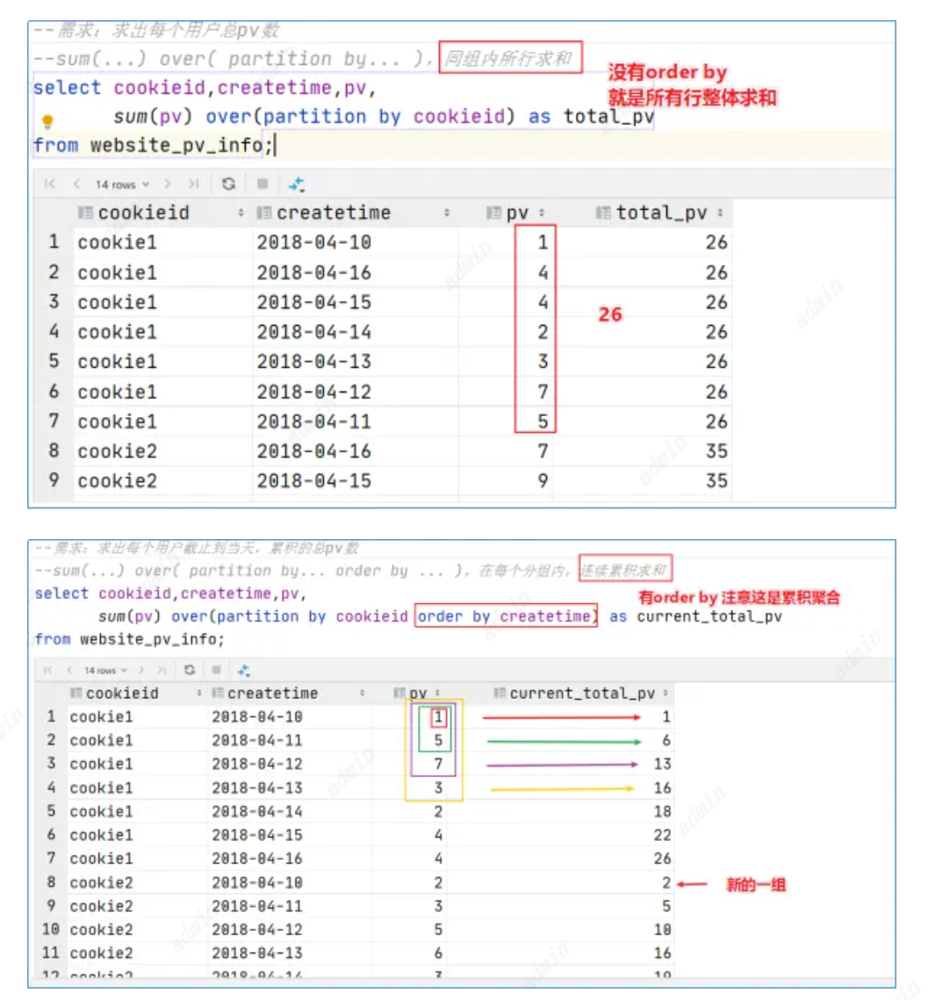
#### 窗口表达式
我们知道，在sum(...) over( partition by... order by ... )语法完整的情况下，进行的累积聚合操作，默认累积聚合行为是：从第一行聚合到当前行。
Window expression窗口表达式给我们提供了一种控制行范围的能力，比如向前2行，向后3行。
语法如下：

关键字是rows between，包括下面这几个选项
- preceding：往前
- following：往后
- current row：当前行
- unbounded：边界
- unbounded preceding 表示从前面的起点
- unbounded following：表示到后面的终点

```aidl
---窗口表达式
--第一行到当前行
select cookieid,createtime,pv,
sum(pv) over(partition by cookieid order by createtime rows between unbounded preceding and current row) as pv2
from website_pv_info;

--向前3行至当前行
select cookieid,createtime,pv,
sum(pv) over(partition by cookieid order by createtime rows between 3 preceding and current row) as pv4
from website_pv_info;

--向前3行 向后1行
select cookieid,createtime,pv,
sum(pv) over(partition by cookieid order by createtime rows between 3 preceding and 1 following) as pv5
from website_pv_info;

--当前行至最后一行
select cookieid,createtime,pv,
sum(pv) over(partition by cookieid order by createtime rows between current row and unbounded following) as pv6
from website_pv_info;

--第一行到最后一行 也就是分组内的所有行
select cookieid,createtime,pv,
sum(pv) over(partition by cookieid order by createtime rows between unbounded preceding  and unbounded following) as pv6
from website_pv_info; 
```
#### 窗口排序函数
窗口排序函数用于给每个分组内的数据打上排序的标号。注意窗口排序函数不支持窗口表达式。总共有4个函数需要掌握：
row_number：在每个分组中，为每行分配一个从1开始的唯一序列号，递增，不考虑重复；
rank: 在每个分组中，为每行分配一个从1开始的序列号，考虑重复，挤占后续位置；
dense_rank: 在每个分组中，为每行分配一个从1开始的序列号，考虑重复，不挤占后续位置；

```aidl
-----窗口排序函数
SELECT
cookieid,
createtime,
pv,
RANK() OVER(PARTITION BY cookieid ORDER BY pv desc) AS rn1,
DENSE_RANK() OVER(PARTITION BY cookieid ORDER BY pv desc) AS rn2,
ROW_NUMBER() OVER(PARTITION BY cookieid ORDER BY pv DESC) AS rn3
FROM website_pv_info
WHERE cookieid = 'cookie1'; 
```
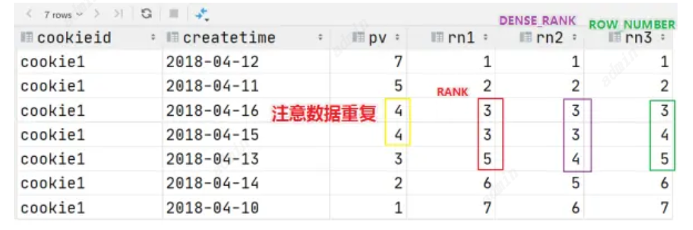
上述这三个函数用于分组TopN的场景非常适合。

```aidl
--需求：找出每个用户访问pv最多的Top3 重复并列的不考虑
SELECT * from
(SELECT
cookieid,
createtime,
pv,
ROW_NUMBER() OVER(PARTITION BY cookieid ORDER BY pv DESC) AS seq
FROM website_pv_info) tmp where tmp.seq <4; 
```
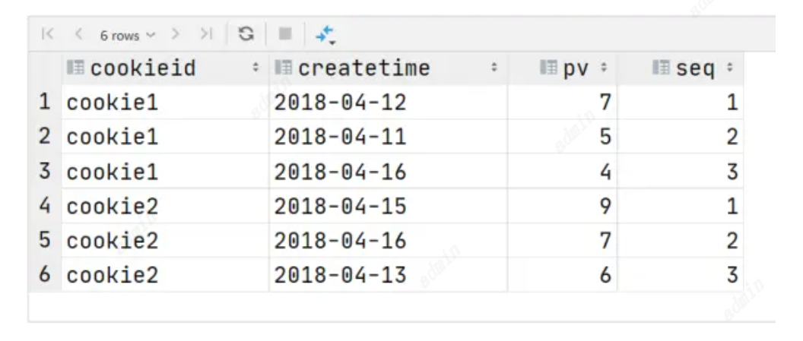
还有一个函数，叫做ntile函数，其功能为：将每个分组内的数据分为指定的若干个桶里（分为若干个部分），并且为每一个桶分配一个桶编号。
如果不能平均分配，则优先分配较小编号的桶，并且各个桶中能放的行数最多相差1。
有时会有这样的需求:如果数据排序后分为三部分，业务人员只关心其中的一部分，如何将这中间的三分之一数据拿出来呢?NTILE函数即可以满足。
```aidl
--把每个分组内的数据分为3桶
SELECT
cookieid,
createtime,
pv,
NTILE(3) OVER(PARTITION BY cookieid ORDER BY createtime) AS rn2
FROM website_pv_info
ORDER BY cookieid,createtime;
```
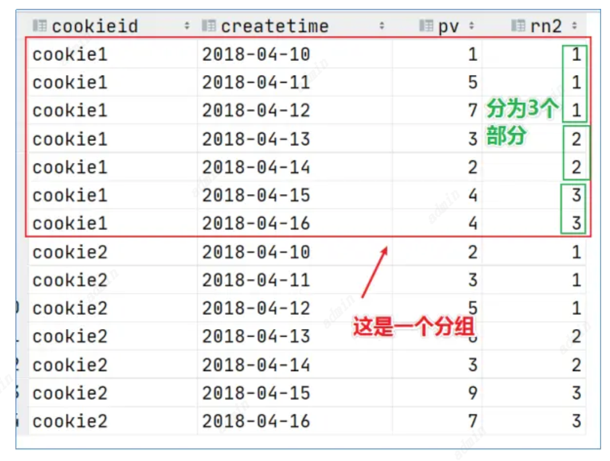

```aidl
--需求：统计每个用户pv数最多的前3分之1天。
--理解：将数据根据cookieid分 根据pv倒序排序 排序之后分为3个部分 取第一部分
SELECT * from
(SELECT
     cookieid,
     createtime,
     pv,
     NTILE(3) OVER(PARTITION BY cookieid ORDER BY pv DESC) AS rn
 FROM website_pv_info) tmp where rn =1;
```
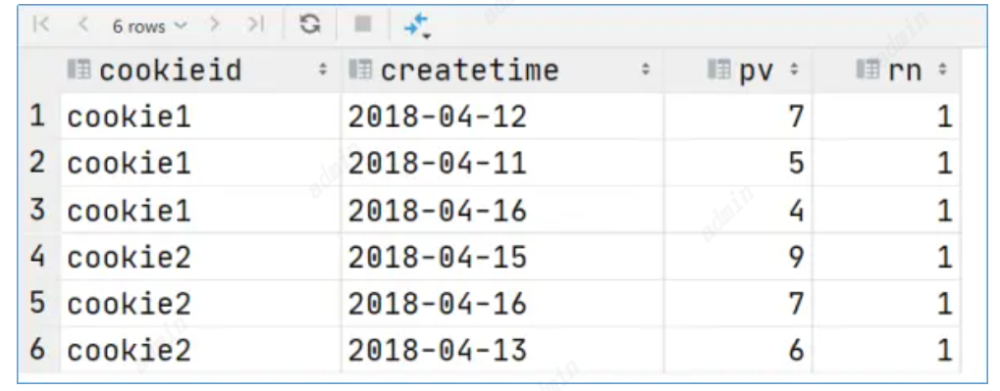
#### 窗口分析函数
LAG(col,n,DEFAULT) 用于统计窗口内往上第n行值
第一个参数为列名，第二个参数为往上第n行（可选，默认为1），第三个参数为默认值（当往上第n行为NULL时候，取默认值，如不指定，则为NULL）；
LEAD(col,n,DEFAULT)用于统计窗口内往下第n行值
第一个参数为列名，第二个参数为往下第n行（可选，默认为1），第三个参数为默认值（当往下第n行为NULL时候，取默认值，如不指定，则为NULL）；
FIRST_VALUE 取分组内排序后，截止到当前行，第一个值；
LAST_VALUE 取分组内排序后，截止到当前行，最后一个值；

```aidl
-----------窗口分析函数----------
--LAG
SELECT cookieid,
createtime,
url,
ROW_NUMBER() OVER(PARTITION BY cookieid ORDER BY createtime) AS rn,
LAG(createtime,1,'1970-01-01 00:00:00') OVER(PARTITION BY cookieid ORDER BY createtime) AS last_1_time,
LAG(createtime,2) OVER(PARTITION BY cookieid ORDER BY createtime) AS last_2_time
FROM website_url_info;


--LEAD
SELECT cookieid,
createtime,
url,
ROW_NUMBER() OVER(PARTITION BY cookieid ORDER BY createtime) AS rn,
LEAD(createtime,1,'1970-01-01 00:00:00') OVER(PARTITION BY cookieid ORDER BY createtime) AS next_1_time,
LEAD(createtime,2) OVER(PARTITION BY cookieid ORDER BY createtime) AS next_2_time
FROM website_url_info;

--FIRST_VALUE
SELECT cookieid,
createtime,
url,
ROW_NUMBER() OVER(PARTITION BY cookieid ORDER BY createtime) AS rn,
FIRST_VALUE(url) OVER(PARTITION BY cookieid ORDER BY createtime) AS first1
FROM website_url_info;

--LAST_VALUE
SELECT cookieid,
createtime,
url,
ROW_NUMBER() OVER(PARTITION BY cookieid ORDER BY createtime) AS rn,
LAST_VALUE(url) OVER(PARTITION BY cookieid ORDER BY createtime) AS last1
FROM website_url_info; 
```
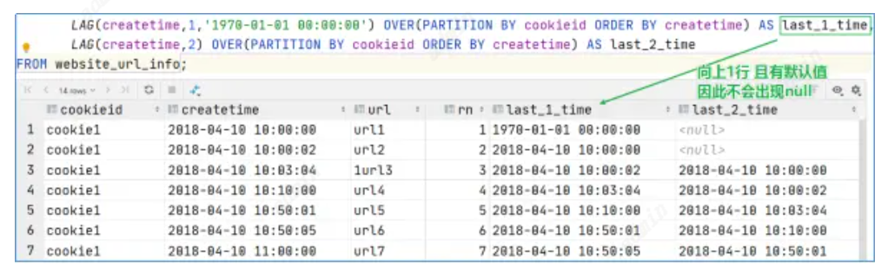
