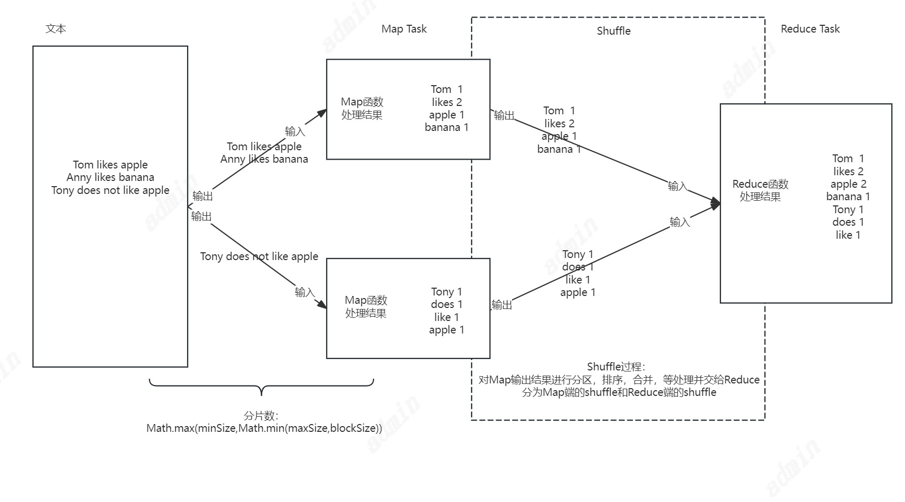
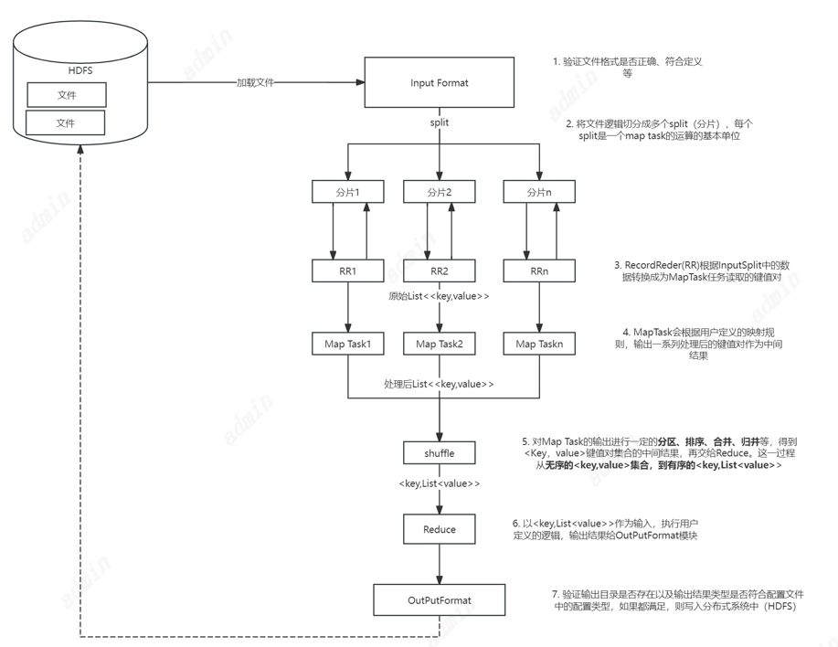

# MapReduce

主要思想：**“分而治之”+计算向数据靠拢**。一个存储在分布式文件系统中的大规模数据集，在处理之前将会被切分成为许多独立的小数据块，这小小的数据块会被多个Map任务并行处理。MapReduce框架会为每个Map任务输入一个数据集，Map任务的结果会继续作为Reduce任务的输入，最终由Reduce任务输出最后的结果，并写入分布式文件系统。前提条件：待处理的数据可以分解成为许多的小的数据集，而且每个小的数据集可以并行的进行处理。

计算向数据靠拢：在一个集群中，只要有可能，MapReduce框架就会将Map程序就近地在HDFS数据所在的数据节点运行，即**将计算节点和存储节点在一起运行**。


## Map阶段

1. 获取输入数据
2. 对数据数据进行转换并输出

### Map函数

**输入来源于分布式文件系统的文件块**，这些文件块的格式是任意的，可以是文档，也可以是二进制格式的。文件块是一系列元素的集合，这些元素的类型也是任意的。**Map函数将输入的元素转换为 <key,value>形式的键值对**，键和值的类型也是任意的，但其中的**键值不作为标志性属性，没有唯一性**，不同的键值对的key值可以相同，**一个Map函数可以生成多个具有相同key值的<key,value>对**。

### Map Task

在MapReduce当中，每个mapTask处理一个切片split的数据量，注意切片与block块的概念很像，但是block块是HDFS当中存储数据的单位，切片split是MapReduce当中每个MapTask处理数据量的单位。在介绍map task的数量及切片机制之前先了解这两个概念：


#### block块（数据块，物理划分）
block是HDFS中的基本存储单位，hadoop1.x默认大小为64M，而hadoop2.x默认块大小为128M。文件上传到HDFS，就要划分数据成块，这里的划分属于物理的划分（实现机制也就是设置一个read方法，每次限制最多读128M的数据后调用write进行写入到hdfs），块的大小可通过 dfs.block.size配置。block采用冗余机制保证数据的安全：默认为3份，可通过dfs.replication配置。
注意：当更改块大小的配置后，新上传的文件的块大小为新配置的值，以前上传的文件的块大小为以前的配置值。

```
	(1)文件的个数   
	(2)文件大小   
	(3)blocksize
```

如果不进行任何设置，默认的Map Task得个数 Map得个数取决于blockSize得大小，如一个blockSize是128M，总数据大小为256M，那么Map Task得数量就是256/128 

#### split分片（数据分片，逻辑划分）
Hadoop中split划分属于逻辑上的划分，目的只是为了让map task更好地获取数据。split是通过hadoop中的 InputFormat 接口中的getSplits（）方法得到的。数据切片只是在逻辑上对输入进行分片，并不会在磁盘上将其切分成片进行存储。

#### MapTask个数


切片数量取决于 块大小（blockSize）、切片最小值(minSize)、切片最大值（maxSize）


切片大小计算公式

```
  protected long computeSplitSize(long blockSize, long minSize, long maxSize) {
    return Math.max(minSize, Math.min(maxSize, blockSize));
  }
  
  
Math.max(minSize, Math.min(maxSize, blockSize));   
mapreduce.input.fileinputformat.split.minsize=1 默认值为1  
mapreduce.input.fileinputformat.split.maxsize= Long.MAXValue 默认值Long.MAXValue  
blockSize为128M 

Math.min(maxSize, blockSize) 得出值为blockSize
Math.max(minSize, Math.min(maxSize, blockSize));得出值为blockSize
由以上计算公式可以推算出split切片的大小刚好与block块相等
```

#### 带来的问题

如果有1000个小文件，每个小文件是1kb-100MB之间，那么我们启动1000个MapTask是否合适，该如何合理的控制MapTask的个数？？？

Map Task数量过多的话，会产生大量的小文件, 过多的Mapper创建和初始化都会消耗大量的硬件资源 。
Map Task数量过少，就会导致并发度过小，Job执行时间过长，无法充分利用分布式硬件资源。

解决方案

```
从切片计算公式：Math.max(minSize, Math.min(maxSize, blockSize)) 可以看出，重点在于minSize和maxSize
如果想增加map task个数，则通过FileInputFormat.setMaxInputSplitSize(job,long bytes)方法设置最大数据分片大小为一个小于默认blockSize的值，越小map数量越多。
如果想减小map task个数，则FileInputFormat.setMinInputSplitSize(job,long bytes) 方法设置最小数据分片大小为一个大于默认blockSize的值，越大map数量越少。
```

#### 切片临界值

分片大小的数量一定是按照公式Math.max(minSize, Math.min(maxSize, blockSize))计算的吗？

可做以下试验：文件大小 297M(311349250)，块大小128M
测试代码

```
FileInputFormat.setMinInputSplitSize(job, 301349250);  
FileInputFormat.setMaxInputSplitSize(job, 10000);
```

由上面分片公式算出分片大小为301349250, 比 311349250小， 理论应该为2个map, 但实际测试后Map个数为1， 这是为什么呢？
分片的计算中，会考虑空间利用问题，每次分出一个分片后，都会判断剩下的数据能否在一定的比率(slop变量，默认10%)内压缩到当前分片中，如果不大于默认比率1.1，则会压缩到当前分片中。源码如下：


## Reduce阶段

1. 对输出结果进行聚合计算

### Reduce 函数

其**输入为Map函数的结果**，<key,List(value)>对，这种类型的键值对所代表的意思是List(value)是一批同属于同一个key值的value。

Reduce函数**将一些列具有相同的键值的键值对以某种方式组合起来，输出处理后的键值对**，输出的结果为一个文件。用户可以指定Reduce函数的个数。

### Reduce Task

#### Reduce Task 个数

[Reduce](https://so.csdn.net/so/search?q=Reduce&spm=1001.2101.3001.7020)任务是一个数据聚合的步骤，数量默认为1。使用过多的Reduce任务则意味着复杂的shuffle，并使输出文件数量激增。而reduce的个数设置相比map的个数设置就要简单的多，只需要设置在驱动程序中通过`job.setNumReduceTasks(int n)`即可

### Shuffle



shuffle过程图


#### Map端的shuffle

（1）Map的输出结果首先会被写入缓存当中。
（2）当缓存满时，便会启动溢写操作（这里的缓存满并不是缓存真的满了，而是达到了一定的溢写比，比如设置当缓存的实用程度达到了80%，便启动了溢写操作，剩下的20%的内存接着来存放数据），把缓存中的数据写入磁盘当中，并清空缓存。
（3）当启动溢写操作的时候，先将缓存中的数据进行分区，然后对每个分区的数据进行排序，合并，之后再写入磁盘文件。
（4）每次溢写便会生成一个新的磁盘文件，Map任务数量的增多，磁盘文件的数量也会跟着增多，最后这些磁盘文件将会被归并为一个大的磁盘文件。Map端的

#### Map端的Shuffle过程


（1）输入数据和执行Map任务。

输入的数据一般是从分布式文件系统中而来的，一般是以文件块的形式，文件块的格式时任意的，可以是文档，也可以是二进制。Map任务接受<key,value>作为输入后，按照一定的规则映射为一批<key,value>进行输出。

（2）写入缓存。

每个Map任务都会被分配一个缓存，Map的输出结果不是立即写入磁盘，而是首先写入缓存当中。在缓存中积累了一定数量的Map输出结果后，再一次批量性的写入磁盘，这样可以大大减少对磁盘的I/O影响。注意：在写入缓存之前，key与value值都会被序列化为字节数组。

（3）溢写（分区，排序，合并（归并））。

MapReduce的缓存容量是有限的，默认大小是100MB。随着Map任务的执行，缓存中的Map结果的数量会不断的增加，当达到一定的溢写比时，就必须启动溢写操作，把缓存中的内容一次性的写入磁盘中，并清空缓存。溢写的过程通常是由另一个单独的后台线程来完成的，不会影响Map结果往缓存中写入。

在溢写到磁盘之前，缓存中的数据首先会被分区。缓存中的数据是<key,value>形式的键值对。MapReduce通过Partitioner接口对这些键值对进行分区，默认采用的分区方式是Hash函数对key进行哈希后再用Reduce任务的数量进行取模，这样，就可以把map输出结果均匀地分配给等量的Reduce任务去并行处理了。当然，MapReduce也允许用户通过重载Partitioner接口来自定义分区方式。**分区决定map输出的数据将会被哪个reduce任务进行处理**

**对于每个分区内的所有键值**，后台线程会根据值对他们**进行排序**，排序是MapReduce的默认操作。排序后根据用户是否定义函数Combiner来选择是否执合并函数，如有定义则执行，如没有则不执行。

（4）文件合并/归并。

每次溢写都会生成一个新的溢写文件在磁盘中，随着MapReduce的执行，溢写文件会越来越多，最终，在Map任务全部结束之前，系统会对所有溢写文件中的数据进行归并为一个大文件，生成一个大的溢写文件，这个大的溢写文件中的左右的键值对也是经过分区和排序的。

所谓合并，就是将那些具有相同key的<key,value>的value加起来，比如：<a,1><a,2>合并为<a,2>

所谓归并，就是讲那些具有相同key的键值对会被归并成一个新的键值对。比如：<a,1><a,2>归并为<a,<1,2>>

#### 自己的话

map shuffle总结成自己话：当map以<key,value>对输出之后，会写入到内存中（环形缓冲区），环形缓冲区默认大小是100MB，当数据达到缓冲区总容量的80%（阈值）时，会将我们的数据spill到本地磁盘。数据在环形缓冲区中spill到本地磁盘之前会做分区，排序，之后再spill到本地磁盘。因为map对数据不断的进行处理，数据会不断spill到本地磁盘，也就在磁盘上生成很多小文件。由于最终reduce只会拿map输出的一个结果，所以会将spill到磁盘的数据进行一次合并，将各个分区的数据合并在一起，分区合并之后再次排序。最后会形成一个文件，待reduce任务获取

#### Combiner概述

Map和Reduce往往不在一个机器，所以数据的传输就需要HTTP传输，所以在Map端将数据进行Combiner就可可以将数据先进行合并，**减少网络传输数据量提高运行性能**。

·Mapreduce中的mapper阶段将输入的数据转换成一个个键值对的形式<key,value>，然后在网络节点间对其进行shuffle机制对数据进行整理，最后reducer阶段处理数据并输出结果。这是一个mr程序一般的处理流程。如果存在这样一个实际的场景：如果有10个数据文件，Mapper会生成10亿个<k2,v2>的键值对在网络间进行传输，但如果我们只是对数据求最大值，显然Mapper只需要输出它所知道的最大值即可。这样做不仅可以减轻网络压力，同样也可以大幅度提高程序效率。
**combiner本质就是map端reduce**：我们可以把合并（combiner）看作是一个在每个单独节点上先做一次Reduce的操作，其输入及输出的参数和Reduce是一样的。

使用Combiner需要任务本身是满足可结合律的，也可以集成接口自己写，如计算最大值等。

#### Reduce端的Shuffle

Reduce任务从Map端的不同Map机器领回属于自己的处理的数据，然后对数据进行归并，后交给Reduce处理。

#### Reduce端的Shffle过程

只需要从Map端读取Map结果，然后执行归并操作，最后输送给Reduce任务进行处理。

（1）“领取数据”。

Map端的Shuffle过程结束后，所有Map输出结果都保存在Map端的本地磁盘当中，所以Reduce任务首先要把这些数据请求拉回本地磁盘上。

（3）归并数据。

从Map端领取回来的数据首先会被保存在Reduce本地的缓存当中，如果缓存满，就会像Map端一样被溢写到磁盘当中。系统中一般存在多个Map机器，Reduce任务会从多个Map机器领回属于自己处理的那些分区的数据。当溢写操作启动的时候，具有相同key值的键值对会被执行归并操作，如用户定义合并函数，则也会执行合并操作。溢写文件的增多，最终也会归并为一个大的磁盘文件，归并的时候还会给键值对进行排序。

（4）把数据输入给Reduce任务。

将大的排序，归并（合并）好的大的磁盘文件输入给Reduce任务，Reduce任务会执行Reduce函数中定义的各种映射，输出最终的结果，并保存到分布式文件系统当中。

#### 自己的话 

reduce shuffle总结成自己话：当map阶段数据处理完成之后，各个reduce任务主动到已经完成的map 任务的磁盘中，去拉取属于自己要处理的数据，reduce先 将对应partition的数据写入内存，根据reduce端数据内存的阈值，spill到reduce本地磁盘，形成一个个小文件，然后对一个个小文件进行合并，排序，分组（将相同key的value放在一起），最后形成reduce输入端，传递给reduce()函数，得出结果。





#### [MapReduce](https://so.csdn.net/so/search?q=MapReduce&spm=1001.2101.3001.7020) shuffle阶段配置详解

```
//1.分区
job.setPartitionerClass();

//2.排序
job.setSortComparatorClass();

//3.combiner  -可选项
//combiner其实就是map端reduce
job.setCombinerClass(WordCountCombiner.class);

//4.compress  -可配置

//5.分组
job.setGroupingComparatorClass();


```


## MapReduce调优

```
MapReduce的调优
1.Reduce Task Number（设定reduce的数量）

根据业务需求
测试
2.Map task 输出压缩

3.shuffle数据处理过程中的参数

mapreduce.task.io.sort.mb：配置环形缓冲区大小（默认100MB）
mapreduce.map.sort.spill.percent：配置达到的百分比（默认是80%开始spill磁盘）
mapreduce.task.io.sort.factor：配置分区合并文件的数量（默认是10）
mapreduce.map.cpu.vcores：配置CPU核数（默认是1）
mapreduce.reduce.cpu.vcores：配置CPU核数（默认是1）
mapreduce.map.memory.mb：配置内存大小（默认是1024MB）
mapreduce.reduce.memory.mb：配置内存大小（默认是1024MB）
```


参考：
https://blog.csdn.net/zc666ying/article/details/106357175?utm_medium=distribute.pc_relevant.none-task-blog-2~default~baidujs_baidulandingword~default-0-106357175-blog-90752213.235^v43^pc_blog_bottom_relevance_base2&spm=1001.2101.3001.4242.1&utm_relevant_index=3
