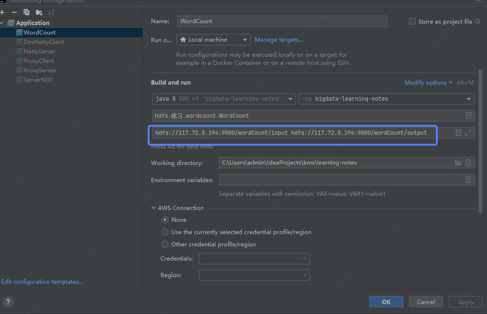
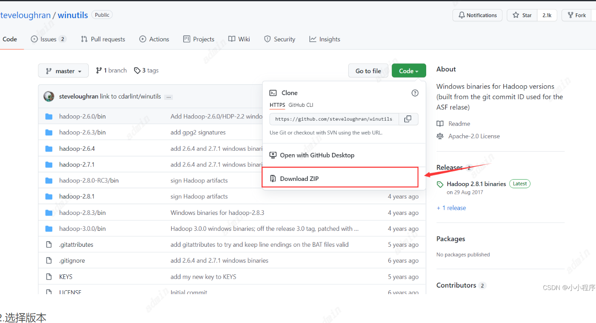
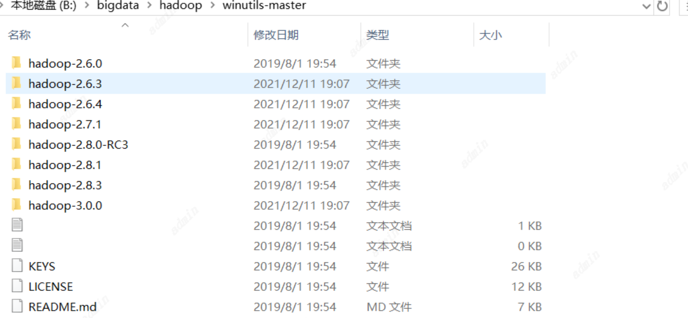
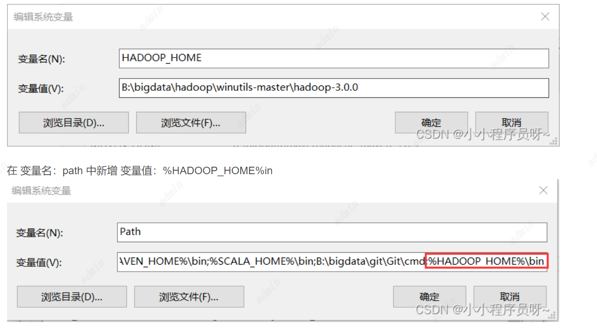
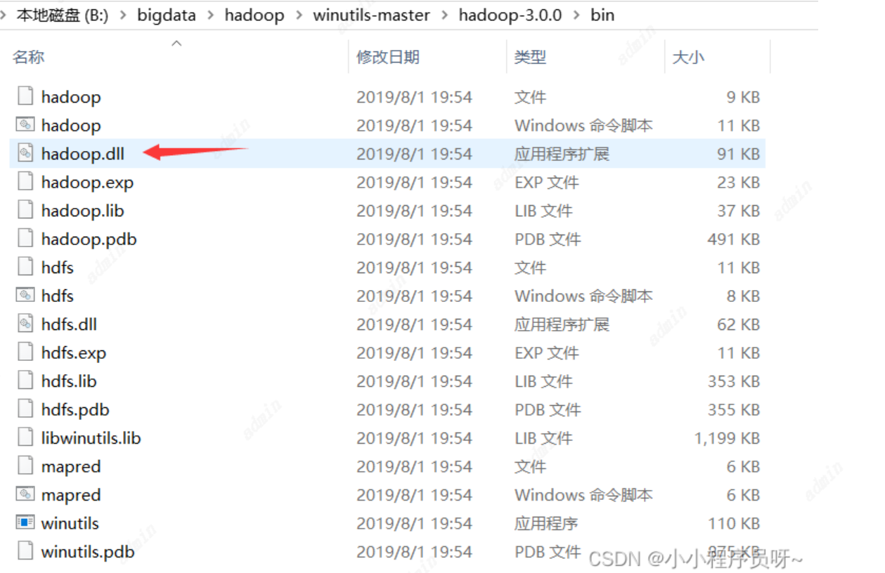
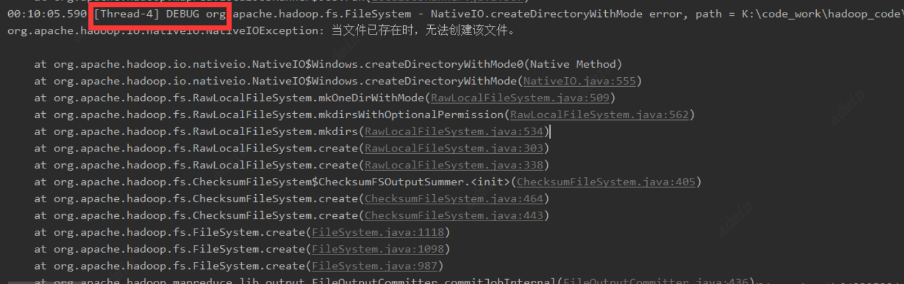
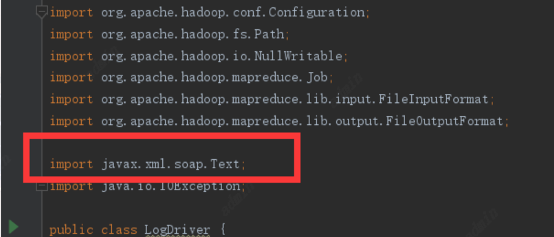
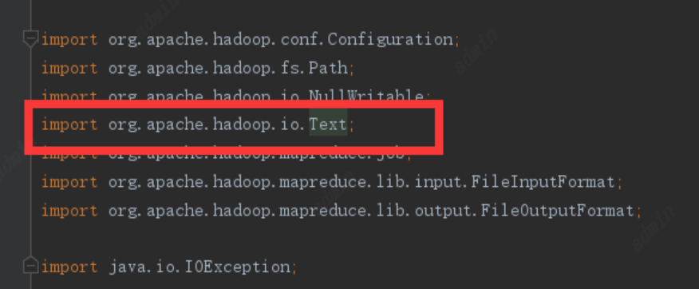

## 本地调试配置
参数
```aidl
hdfs://117.72.8.194:9000/wordCount/input hdfs://117.72.8.194:9000/wordCount/output
```

## 遇到的问题
### 1. 本地跑MR任务连接远端Hdfs关于IDEA出现报错： java.io.FileNotFoundException HADOOP_HOME and hadoop.home.dir are unset
```aidl
今天在跑wc的时候，代码仔细确认很多遍没有问题，但就是一直报错如下：

Exceptioninthread"main"java.lang.RuntimeException:java.io.FileNotFoundException:java.io.FileNotFoundException:HADOOP_HOMEandhadoop.home.dirareunset.-seehttps://wiki.apache.org/hadoop/WindowsProblems
atorg.apache.hadoop.util.Shell.getWinUtilsPath(Shell.java:736)
atorg.apache.hadoop.util.Shell.getSetPermissionCommand(Shell.java:271)
atorg.apache.hadoop.util.Shell.getSetPermissionCommand(Shell.java:287)
atorg.apache.hadoop.fs.RawLocalFileSystem.setPermission(RawLocalFileSystem.java:867)
atorg.apache.hadoop.fs.RawLocalFileSystem.mkOneDirWithMode(RawLocalFileSystem.java:549)
atorg.apache.hadoop.fs.RawLocalFileSystem.mkdirsWithOptionalPermission(RawLocalFileSystem.java:589)
atorg.apache.hadoop.fs.RawLocalFileSystem.mkdirs(RawLocalFileSystem.java:561)
atorg.apache.hadoop.fs.RawLocalFileSystem.mkdirsWithOptionalPermission(RawLocalFileSystem.java:588)
atorg.apache.hadoop.fs.RawLocalFileSystem.mkdirs(RawLocalFileSystem.java:566)
atorg.apache.hadoop.fs.FilterFileSystem.mkdirs(FilterFileSystem.java:332)
atorg.apache.hadoop.mapreduce.JobSubmissionFiles.getStagingDir(JobSubmissionFiles.java:162)
atorg.apache.hadoop.mapreduce.JobSubmissionFiles.getStagingDir(JobSubmissionFiles.java:113)
atorg.apache.hadoop.mapreduce.JobSubmitter.submitJobInternal(JobSubmitter.java:148)
atorg.apache.hadoop.mapreduce.Job$11.run(Job.java:1565)
atorg.apache.hadoop.mapreduce.Job$11.run(Job.java:1562)
atjava.security.AccessController.doPrivileged(NativeMethod)
atjavax.security.auth.Subject.doAs(Subject.java:422)
atorg.apache.hadoop.security.UserGroupInformation.doAs(UserGroupInformation.java:1762)
atorg.apache.hadoop.mapreduce.Job.submit(Job.java:1562)
atorg.apache.hadoop.mapreduce.Job.waitForCompletion(Job.java:1583)
atcom.ruozedata.hadoop.mapreduce.wc.WordCountDriver.main(WordCountDriver.java:46)
Causedby:java.io.FileNotFoundException:java.io.FileNotFoundException:HADOOP_HOMEandhadoop.home.dirareunset.-seehttps://wiki.apache.org/hadoop/WindowsProblems
atorg.apache.hadoop.util.Shell.fileNotFoundException(Shell.java:548)
atorg.apache.hadoop.util.Shell.getHadoopHomeDir(Shell.java:569)
atorg.apache.hadoop.util.Shell.getQualifiedBin(Shell.java:592)
atorg.apache.hadoop.util.Shell.(Shell.java:689)
atorg.apache.hadoop.util.StringUtils.(StringUtils.java:78)
atorg.apache.hadoop.conf.Configuration.getBoolean(Configuration.java:1665)
atorg.apache.hadoop.security.SecurityUtil.setConfigurationInternal(SecurityUtil.java:104)
atorg.apache.hadoop.security.SecurityUtil.(SecurityUtil.java:88)
atorg.apache.hadoop.security.UserGroupInformation.initialize(UserGroupInformation.java:316)
atorg.apache.hadoop.security.UserGroupInformation.ensureInitialized(UserGroupInformation.java:304)
atorg.apache.hadoop.security.UserGroupInformation.doSubjectLogin(UserGroupInformation.java:1860)
atorg.apache.hadoop.security.UserGroupInformation.createLoginUser(UserGroupInformation.java:718)
atorg.apache.hadoop.security.UserGroupInformation.getLoginUser(UserGroupInformation.java:668)
atorg.apache.hadoop.security.UserGroupInformation.getCurrentUser(UserGroupInformation.java:579)
atorg.apache.hadoop.mapreduce.task.JobContextImpl.(JobContextImpl.java:72)
atorg.apache.hadoop.mapreduce.Job.(Job.java:150)
atorg.apache.hadoop.mapreduce.Job.getInstance(Job.java:193)
atcom.ruozedata.hadoop.mapreduce.wc.WordCountDriver.main(WordCountDriver.java:21)
Causedby:java.io.FileNotFoundException:HADOOP_HOMEandhadoop.home.dirareunset.
atorg.apache.hadoop.util.Shell.checkHadoopHomeInner(Shell.java:468)
atorg.apache.hadoop.util.Shell.checkHadoopHome(Shell.java:439)
atorg.apache.hadoop.util.Shell.(Shell.java:516)
```
问题扣出来就是：
```aidl
java.io.FileNotFoundException:HADOOP_HOMEandhadoop.home.dirareunset.
```
问题原因：
日志描述内容就是，没有设置 HADOOP_HOME 和 hadoop.home.dir 两项。而这两项就是配置在本地环境变量中的 Hadoop 地址，也就是需要我们在本地搭建Hadoop环境。

解决办法：
一、如果是远程连接Linux上的Hadoop集群，是不需要在本地再下载hadoop，只要下载winutils文件,然后配置环境变量，最后再把hadoop.dll文件放到 C:/windows/system32 下就可以了
解决步骤（一）：
1.下载winutils文件

GitHub - steveloughran/winutils: Windows binaries for Hadoop versions (built from the git commit ID used for the ASF relase)

点击绿色的Code按钮，再选择Download Zip下载


2.选择版本

如果没有和你版本一致的文件夹，就选择和你版本最相近的，因为我的Hadoop版本是3.2.2版本，所以我选择的是hadoop-3.0.0

3.配置环境变量

配置系统环境变量：

新增 变量名：HADOOP_HOME 变量值：就是你上面选择的hadoop版本文件夹的位置地址
在 变量名：path 中新增 变量值：%HADOOP_HOME%in

4. 把hadoop.dll放到C:/windows/system32文件夹下

拷贝bin文件夹下的hadoop.dll文件

复制进C:/windows/system32文件夹下
6.重启IDEA，再次运行代码，跑成功。亲测哟！！！

另一个方法

hadoop运行在windows系统上的，也是要下载winutils文件,然后配置环境变量，比上面多出一步就是，需要把你下的winutils文件下你需要的Hadoop版本的bin目录文件去替换你**windows系统之前使用的Hadoop版本的bin目录文件，**最后同样是把hadoop.dll文件放C:/windows/system32 下就可以（这个解决步骤在最后面）

https://www.jianshu.com/p/6efd353c4b25
### 2. MapReduce异常：org.apache.hadoop.io.nativeio.NativeIOException: 当文件已存在时，无法创建该文件。


Hadoop在本地运行的时候总是出现这个异常，不影响代码运行，可忽略

### 3. MapReduce异常：java.lang.ClassCastException: interface javax.xml.soap.Text

```none
复制java.lang.ClassCastException: interface javax.xml.soap.Text
	at java.lang.Class.asSubclass(Class.java:3396)
	at org.apache.hadoop.mapred.JobConf.getOutputKeyComparator(JobConf.java:887)
	at org.apache.hadoop.mapred.MapTask$MapOutputBuffer.init(MapTask.java:1004)
	at org.apache.hadoop.mapred.MapTask.createSortingCollector(MapTask.java:402)
	at org.apache.hadoop.mapred.MapTask.access$100(MapTask.java:81)
	at org.apache.hadoop.mapred.MapTask$NewOutputCollector.<init>(MapTask.java:698)
	at org.apache.hadoop.mapred.MapTask.runNewMapper(MapTask.java:770)
	at org.apache.hadoop.mapred.MapTask.run(MapTask.java:341)
	at org.apache.hadoop.mapred.LocalJobRunner$Job$MapTaskRunnable.run(LocalJobRunner.java:270)
	at java.util.concurrent.Executors$RunnableAdapter.call(Executors.java:511)
	at java.util.concurrent.FutureTask.run(FutureTask.java:266)
	at java.util.concurrent.ThreadPoolExecutor.runWorker(ThreadPoolExecutor.java:1142)
	at java.util.concurrent.ThreadPoolExecutor$Worker.run(ThreadPoolExecutor.java:617)
	at java.lang.Thread.run(Thread.java:745)
```

**解决方法：**

- 1、原因是因为引入Text包时引入错误的包：



- 2、把这个Text替换为



### 4. 本地连接远程HDFS执行MR任务问题：Failed to connect to /192.168.0.0:9866 for block BP-1340737360-192.168.0.0-1
问题：Failed to connect to /192.168.0.0:9866 for block BP-1340737360-192.168.0.0-1

通过日志可以看出，是本地中无法连接到192.168.0.0:9866，查看自己的网络可以发现192.168.0.0是内部网络，也就是namenode与DataNonde的通信是采用内网进行通信的，我们再本地调试的时候需要指定网络为外网网络

解决方式
方式一：
```aidl
 <property>
     <name>dfs.client.use.datanode.hostname</name>
     <value>true</value>
 </property>

```
此时再运行程序的时候就可以直接通过了


方式二：
在代码在添加
```aidl
//再代码中指定NM和DN之间的通信为外网，此方式仅适用于api操作HDFS
        configuration.set("dfs.client.use.datanode.hostname", "true");
```
通过两种方式，建议使用第一种

