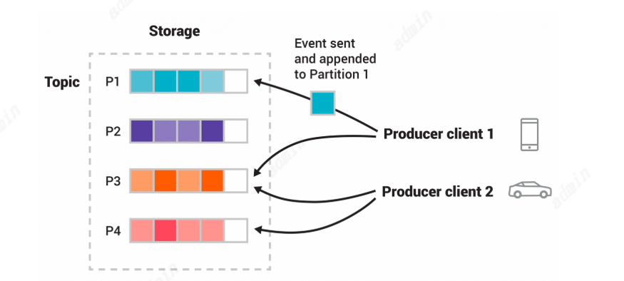

# Kafka基础知识
## 什么是Kafka？
Kafka是有三个关键能力组成，所以可以实现端到端的事件流能力：
1. 去推和订阅事件流，包括从其他系统连续导入/导出数据。
2. 存储事件流，可自定义存储时间
3. 处理事件流，可以回溯
   所有这些功能都以分布式、高度可伸缩、弹性、容错和安全的方式提供
## Kafka是如何工作的
Kafka是一个分布式系统，由服务器和客户端组成，通过高性能TCP网络协议进行通信。
服务端：
Kafka作为一个单服务或多服务的集群运行，可以跨多个数据中心或者云区域。一些服务负责构建存储层叫做Broker。Kafka集群具有高度可扩展性和容错性：如果其中任何一个服务器出现故障，其他服务器将接管它们的工作，以确保持续运行而不会丢失任何数据。
客户端：
客户端允许用户编写分布式应用程序和微服务，这些应用程序和微服务可以并行地、大规模地、以容错的方式读取、写入和处理事件流，

## 主要概念和术语
1. 生产者：向Kafka推送事件数据的客户端程序
2. 消费者：订阅/读取/处理kafka事件数据的客户端程序
   在Kafka中，生产者和消费者是完全解耦的，彼此不可知。
3. Topic：事件被组织并持久地存储在主题中。类似于文件系统中的文件夹，事件都被放在文件夹中。Kafka中的主题总是多生产者和多订阅者
   事件在使用后不会被删除。相反，，这意味着Tipic可以通过每个主题的配置设置来定义Kafka应该保留多长时间的事件，之后旧的事件将被丢弃。Kafka的性能在数据大小方面是有效恒定的，所以长时间存储数据是完全没问题的。
4. 分区：Topic是分区的，这意味着一个主题被分散在位于不同Kafka代理上的许多“桶”上。
   当新事件发布到主题时，它实际上被附加到主题的一个分区中。具有相同事件键（例如，客户或车辆ID）的事件被写入相同的分区，并且Kafka保证给定主题分区的任何消费者总是以与写入相同的顺序读取该分区的事件。
5. 副本：每个Topic都有副本。通常生产会设置三个副本。



## Kafka特性
1. 高吞吐量：支持高流量的事件流，如实时日志聚合。
2. 大数据积压处理能力：能够优雅地处理大量数据积压，以支持离线系统的周期性数据加载。
3. 低延迟交付：能够处理更传统的消息传递用例，确保低延迟传递。
4. 分区和分布式实时处理：支持分区、分布式的实时流处理，以生成新的派生数据流。这促使我们设计了分区和消费者模型。
5. 容错保障：在机器故障的情况下，系统必须能够保证容错性，以便将数据流输入到其他数据系统中进行处理。
这些特点使得Kafka更像一个数据库日志系统，而非传统的消息系统。

### 持久化
Kafka在存储和缓存消息时，极度依赖文件系统。
通过利用磁盘的顺序读写优势，Kafka避免了内存中大量缓存数据的开销，并通过操作系统的缓存机制提高了系统的效率。

Kafka是在JVM上构建的，任何有过Java内存使用经验的人都知道两件事：
1. 对象的内存开销非常高，通常会将数据存储的大小加倍（甚至更高）。
2. 随着堆内存数据量的增加，Java垃圾回收变得越来越繁琐和缓慢。
这表明一种非常简单的设计思路：与其尽可能将所有数据保存在内存中，并在内存空间不足时慌忙将其刷新到文件系统，不如颠倒这一过程。
**所有数据会立即写入到文件系统的持久化日志中，而不必立即刷新到磁盘。** 实际上，这只是意味着它被转移到内核的页面缓存中。
与使用B树等复杂数据结构相比，磁盘寻道操作会带来的高开销。而通过简单的文件读写操作构建持久化队列（例如日志系统的方式），可以将所有操作的时间复杂度保持在常数时间（O(1)），并且在磁盘空间几乎无限的情况下，不会影响性能。
Kafka利用这一点，可以在不删除消息的情况下保留它们一段时间，给消费者更多的灵活性和性能优势。

### 效率
Kafka在高效性方面的设计和优化措施。主要包括：
1. 批量处理（Batching）：Kafka通过将消息打包成消息集来减少网络请求和磁盘操作的开销，避免了频繁的小I/O操作。消息打包后，不仅能减少网络往返的延迟，还能进行大范围的顺序磁盘写入，提高吞吐量。
2. 字节复制优化：通过使用标准化的二进制消息格式，Kafka减少了在生产者、代理和消费者之间传输数据时的字节复制，降低了负载下的性能影响。
3. 网络和磁盘优化：Kafka通过采用Unix操作系统中的sendfile系统调用，优化了日志块的网络传输，提高了系统的效率和性能。

这些措施有效地提升了Kafka的处理能力，尤其在高负载情况下，使得Kafka能够支持大规模的多租户环境，确保系统能够快速响应并避免基础设施成为瓶颈。

#### sendFile 零拷贝
传统从文件到套接字的数据传输的常见数据路径：
1. 操作系统将数据从磁盘读取到内核空间的页面缓存中。
2. 应用程序从内核空间读取数据到用户空间缓冲区。
3. 应用程序将数据写回到内核空间中的套接字缓冲区。
4. 操作系统将数据从套接字缓冲区复制到网卡缓冲区，然后通过网络发送。

这种方式显然是低效的，因为它涉及四次数据复制和两次系统调用。
使用 **sendfile** 可以避免这种重新复制的过程，它允许操作系统直接从页面缓存将数据发送到网络。因此，在优化后的路径中，**仅需要将数据最终复制到网卡缓冲区。**
**零拷贝优化的好处：通过将数据存储在页面缓存中，Kafka 的消费者能够重复使用缓存中的数据，而不是每次都将其从内存复制到用户空间，从而提高了消费速度，接近网络连接的最大吞吐量。**

#### 网络带宽瓶颈——数据压缩
解决方案：
1. 压缩多个消息：Kafka 提供了高效的批处理压缩机制，可以将多个消息一起压缩，而不是单独压缩每个消息。这样可以提高压缩比，避免因重复内容（如 JSON 字段名、日志中的常见值等）导致的低效压缩。
2. 批处理格式：Kafka 支持将消息批次压缩并传输。Broker解压验证批次内容，并将其以压缩形式存储和传输。
压缩协议：Kafka 支持多种压缩协议，包括 GZIP、Snappy、LZ4 和 ZStandard，能够根据需求选择最合适的压缩方式。

### 生产者——负载均衡/异步发送
负载均衡
生产者控制将消息发布到哪个分区。可以通过随机的方式来实现负载均衡，也可以通过某种语义分区函数来决定（如根据Key的Hash）。

异步发送与批量处理
Kafka 生产者通过在内存中积累消息并批量发送来提高效率。可以配置批量积累的消息数量和等待的最大延迟。这种机制通过稍微增加延迟来换取更高的吞吐量。

### 消费者——拉取消息


消费者工作原理：Kafka 消费者通过发出“拉取”请求来从分区的领导者代理处获取日志数据。**消费者可以指定偏移量，从而控制其读取的起始位置，并可以在需要时回退重新消费数据。**

拉取式系统的优势：
1. 可以批量传输数据，从而避免低延迟下的单条消息传输浪费。
2. 可以通过长轮询机制避免无数据时的忙等待。

拉取式系统的缺点：
在没有数据时，消费者可能会一直轮询，浪费资源。
解决方案：Kafka 通过长轮询（等待数据）来解决这一问题。
#### 消费者组与分区
分区： 在 Kafka 中，不同分区之间的数据是独立的不同的。
消费者组：对于一个Topic，可以有多个消费者组，每个消费者组里的消费者可以是一个或者更多
消费者组与分区的关系
1. 一个消费者组可以有多个消费者，这些消费者会在消费者组内分配到不同的分区来并行消费消息。
2. 一个分区只能被 同一消费者组中的一个消费者消费。
3. 一个消费者组的消费者数量通常是小于或等于分区数，如果消费者数量小于分区数，Kafka 会将一些消费者分配给多个分区；如果消费者数量大于分区数，一些消费者将不会消费任何消息。

#### 偏移量标记
消费偏移量的标记可以保持对已消费消息的跟踪。
##### 消息确认机制
确认机制的目的是确保消息不丢失，避免处理中发生无法重新消费异常导致数据丢失。
可能带来的问题的可能
1. **重复消费：假设消费者成功处理了消息，但在发送确认信号时崩溃了，那么Broker就会认为这条消息没有被消费。结果，当消费者重新启动后，它可能会重新消费这条消息，造成重复消费。**
2. 性能开销：
   为了实现确认机制，消息代理需要跟踪每条消息的状态：
I：代理首先将消息锁定，防止被多个消费者重复分发；
II：然后，标记消息为已消费，以便可以删除这条消息。
这个过程会增加代理的负担，尤其是在大规模分发消息时，性能可能受到影响。

Kafka的解决方案
Kafka采用的方式不完全依赖于传统的确认机制，而是采用了一种偏移量（offset）机制。 
Kafka 将**每个主题（topic）分成多个分区（partition），每个分区是有序的。**当消费者消费某个分区的消息时，**Broker会记录消费位置（偏移量）**，也就是已经消费到该分区的哪个位置。
额外优点：可以回滚消费。消费者可以选择回滚到一个旧的偏移量，并重新消费这些消息。

Kafka的处理方式：

Kafka通过将主题划分为多个完全有序的分区，使每个分区的消费位置仅由一个偏移量表示。这种做法使得关于消费状态的信息非常简洁。
这种方式使得消息确认变得非常廉价，因为消费位置（偏移量）可以定期保存为检查点。
附带好处：
Kafka的设计允许消费者回滚到旧的偏移量重新消费数据，这对修复错误或数据恢复非常有用，尽管这种设计与传统队列的消费模式有所不同。

#### 离线数据加载
Kafka支持大规模并行加载，适合周期性批量处理任务，能够高效地加载数据到离线存储系统如Hadoop。

#### 静态成员身份
通过提供持久化的组成员ID，避免了动态重平衡带来的负担，提高了流应用的稳定性和可用性。升级到Kafka 2.3或更高版本并设置唯一的GROUP_INSTANCE_ID_CONFIG后，可以避免因重启或配置变更而引起的组重平衡。


## API
## Producer API/Consumer API/Admin API
```
<dependency>
	<groupId>org.apache.kafka</groupId>
	<artifactId>kafka-clients</artifactId>
	<version>3.9.0</version>
</dependency>
```
## Streams API
```
<dependency>
	<groupId>org.apache.kafka</groupId>
	<artifactId>kafka-streams</artifactId>
	<version>3.9.0</version>
</dependency>
```
