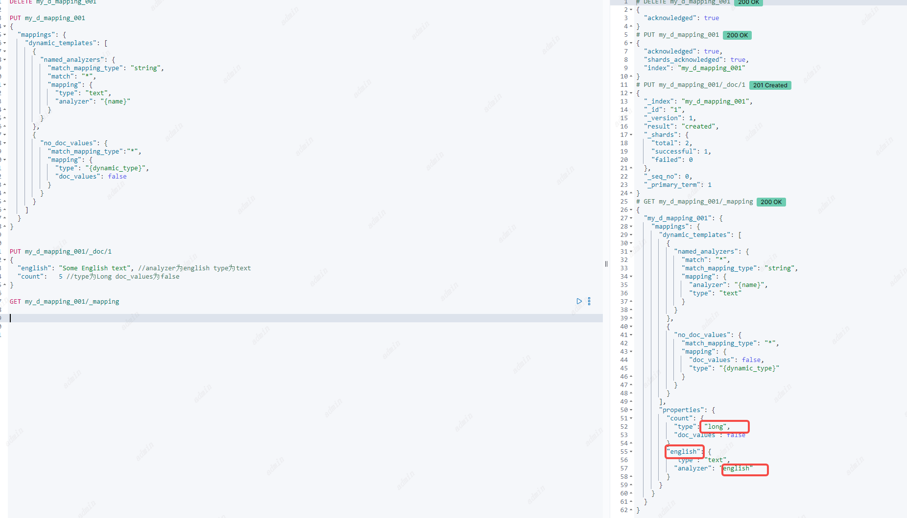

# Mapping

## 动态字段映射

通过设置dynamic参数来动态创建字段。可以在文档和对象级别禁用dynamic。默认true

1. true：根据字段内容判断字段类型，将新字段添加到索引中
2. runtime：根据字段内容判断字段类型，将新字段添加到动态运行时字段中，因为只存_source中，所以不被索引，但与false不同，依然可以被查询，查询的代价会更大。
3. false ：忽略新字段，只存在_source中，也就是不能查询只能展示
4. strict：拒绝为定义的字段插入

Elasticsearch默认字段类型

| **JSON data type**                                           | **`"dynamic":"true"`**                             | **`"dynamic":"runtime"`**                          |
| ------------------------------------------------------------ | -------------------------------------------------- | -------------------------------------------------- |
| `null`                                                       | No field added                                     | No field added                                     |
| `true` or `false`                                            | `boolean`                                          | `boolean`                                          |
| `double`                                                     | `float`                                            | `double`                                           |
| `long`                                                       | `long`                                             | `long`                                             |
| `object`                                                     | `object`                                           | No field added                                     |
| `array`                                                      | Depends on the first non-`null` value in the array | Depends on the first non-`null` value in the array |
| `string` that passes [date detection](https://www.elastic.co/guide/en/elasticsearch/reference/current/dynamic-field-mapping.html#date-detection) | `date`                                             | `date`                                             |
| `string` that passes [numeric detection](https://www.elastic.co/guide/en/elasticsearch/reference/current/dynamic-field-mapping.html#numeric-detection) | `float` or `long`                                  | `double` or `long`                                 |
| `string` that doesn’t pass `date` detection or `numeric` detection | `text` with a `.keyword` sub-field                 | `keyword`                                          |

也可以为date_detection和numeric_detection自定义字段映射规则。也可以使用dynamic_templates去定义额外的动态字段映射规则。

### date_detection（日期检测）

如果date_detection开启（默认开启），当心的字段被检测后发现他们的内容匹配任何一个`dynamic_date_formats`参数中配置的日期表达式

，那么这个字段就被认为是日期类型。`dynamic_date_formats`默认是`[ "strict_date_optional_time"`,`"yyyy/MM/dd HH:mm:ss Z||yyyy/MM/dd Z"`]


这时候date_detection参数，尽管数据内容满足dynamic_date_formats参数的格式，这时ES也会将字段当成String类型处理。

```
PUT my_d_mapping_001
{
  "mappings": {
    "date_detection": false
  }
}
```


自定义探索日期格式

`dynamic_date_formats` 格式

1.  使用`,`f分割表示匹配任意一个即可，如果满足`dynamic_date_formats`配置的其中一个表达式，映射到Mapping的字段格式为匹配上的第一个。
2.  使用`||`f分割表示匹配任意一个即可，，如果满足`dynamic_date_formats`配置的其中一个表达式，映射到Mapping的字段格式为dynamic_date_formats表达式

```
PUT my_d_mapping_001
{
  "mappings": {
    "dynamic_date_formats": ["yyyy-MM-dd"]
  }
}
```


```
PUT my_d_mapping_001
{
  "mappings": {
    "dynamic_date_formats": ["yyyy-MM-dd || MM/dd/yyyy "]
  }
}
```


### numeric_detection（数值检测）

numeric_detection参数默认关闭，它可以检测字段的值是否满足数值类型，如果是将字段类型设置为对应的数值类型。


```
PUT my_d_mapping_001
{
  "mappings": {
    "numeric_detection": true
  }
}
```


## 动态映射模板

使用动态映射模板可以控制ES去做字段映射。**前提是dynamic设置为true或者runtime**。动态添加字段基于以下匹配条件：

1. ES根据`match_mapping_type` and `unmatch_mapping_type`这两个操作去做**字段类型**检测
2. ES根据`match` and `unmatch`这两个操作配置的表达式去做**字段名**检测
3. ES根据`path_match` and `path_unmatch`这两个操作在**字段的全路径**检测

如果一个动态模板， `match_mapping_type`, `match`, or `path_match`这三个操作都没定义，那将会匹配不上任何字段。也可以通过模板的名称指向一个模板。

使用映射规范中的`{name}`和`{dynamic_type}`模板变量作为占位符。

注意：默认情况下动态字段映射只有当这个字段有值时才会映射，如果这个字段的值是null或空数组，就不会在Mapping上增加这个字段的映射信息。但如果动态模板允许空值，则只有在第一个具有该字段具体值的文档被索引之后才会应用该选项。

```
  "dynamic_templates": [
    {
      "my_template_name": { //模板名称
        ... match conditions ...  //匹配条件match_mapping_type, match, match_pattern, unmatch, path_match, path_unmatch
        "mapping": { ... } //匹配字段应该使用的映射
      }
    },
    ...
  ]
```

### 校验动态模板

如果提供的映射包含无效的映射片段，则返回验证错误。验证发生在索引时应用动态模板时，在大多数情况下，发生在更新动态模板时。在某些情况下，提供无效的映射片段可能会导致动态模板的更新或验证失败:

1. 如果没有指定`match_mapping_type`，但是这个模版提供了最少一个的有效映射，那么这个映射片段是有效的。但是如果将与模版匹配的字段映射为其他类型，则在index时返回验证错误。例如：配置一个动态模版，不包含`match_mapping_type`，这样就是一个有效的字符串类型，但是如果有一个字段匹配动态模版时被匹配为`long`，那么在`index`时将返回验证错误。建议就是将`match_mapping_type`配置为预期的`JSON`类型（参考开头的映射关系表）或者在`mapping`中配置好所需的类型


2. 如果我们在`mapping`的片段中使用了`{name}`占位符，那么在动态模版的更新时是跳过验证的。这是因为当时的字段名还是不知道的，所以在`index`时进行验证

### 动态模板在dynamic: runtime时使用

如果你想让Elasticsearch动态地将某个类型的新字段映射为运行时字段，在索引映射中设置dynamic: runtime。这些字段不会被索引，并且在查询时从_source加载。**尽管您的字符串字段不会被索引，但它们的值存储在_source中，并可用于搜索请求、聚合、过滤和排序**。

除了dynamic: runtime，也可以在dynamic: true的条件下，单独设置某个字段为runtime字段。


| 条件                   | 含义                                 | 示例                                                         |
| ---------------------- | ------------------------------------ | ------------------------------------------------------------ |
| `match_mapping_type`   | 字段类型符合的字段，按照模板映射     | "match_mapping_type": ["long", "double"] 或者"match_mapping_type": "*", |
| `unmatch_mapping_type` | 字段类型符合的字段，不按照模板映射   | "unmatch_mapping_type": "object",                            |
| `match`                | 字段名称符合的字段，按照模板映射     | "match": "count"或者 "match_pattern": "regex",   "match": "^profit_\d+$" （match_pattern参数调整match参数的行为，以支持在字段名上匹配完整的Java正则表达式，而不是简单的通配符） |
| `unmatch`              | 字段名称符合的字段，不按照模板映射   | "unmatch": "*_text"                                          |
| `path_match`           | 字段全路径符合的字段，按照模板映射   | "path_match":   "name.*",或"path_match":   ["name.*", "user.name.*"], |
| `path_unmatch`         | 字段全路径符合的字段，不按照模板映射 | "path_unmatch": "*.middle",或"path_unmatch": ["*.middle", "*.midinitial"], |


### 模板参数

{name}和{dynamic_type}占位符将在映射中用字段名和检测到的动态类型替换。下面的例子将所有字符串字段设置为使用与该字段同名的分析器，并禁用所有非字符串字段的doc_values:



### 关闭norms

norms是打分因素之一，如果不关心分数，也不需要按照分数排序，可以把他关掉。**禁用索引中这些评分因素的存储，从而节省一些空间。

### 时序

使用ES做时序分析时，通常会有很多数值字段，他们呢会经常被聚合而不是过滤。在这个场景下，可以关闭对这些字段的索引，这样可以节约磁盘空间以及提升搜索速度。


## 显示映射

ES除了动态映射字段，还可以显示的定义字段的标准。在创建index的时候，可以为这个index添加字段。

### 创建

```
PUT my_d_mapping_001
{
  "mappings": {
    "properties": {
      "age":{
        "type": "long"
      },
      "name":{
        "type": "text"
      }
    }
  }
}
```


### 更新

1. 在原有的mapping上新增字段

```
PUT my_d_mapping_001/_mapping
{
  "properties":{
    "sex":{
      "type":"keyword"
    }
  }
}
```


2. 不能修改已存在的mapping字段

如果需要修改，需要重建索引，然后将原来的数据移入新的索引下。

### 查询

1. 查询索引mapping

```
GET my_d_mapping_001/_mapping
```


2. 查询索引指定的字段

```
GET my_d_mapping_001/_mapping/field/title
```


## 运行时字段

运行时字段在被查询时评估，运行时字段可以让你：

1. 不需要重建索引就可以在已存在的文档上增加字段
2. 在不了解数据结构的情况下开始处理数据
3. 在查询时覆盖一个索引字段的返回值
4. 在不修改底层模式的情况下为特定用途定义字段

可以通过搜索的API访问任何一个字段，ES认为运行时字段没有什么不一样。你可以定义一个运行时字段在Mapping中或者在搜索请求中。

在`_search`API使用`fields`参数去检索需要的运行时字段的值，搜索的字段不会展示在`_source`中，但是 `fields` API 会在所有字段上生效，尽管一些字段不属于原始`_source`.

运行时字段在日志数据中很有用，尤其是当你不确定数据的结构时。您的搜索速度会降低，但只要你的索引足够的小并且您可以更快地处理数据那就不必为它们建立索引。

### 好处

1. 不会增加索引大小。因为运行时字段不会被索引。您可以直接在索引映射中定义运行时字段，从而节省存储成本并提高摄取速度。您可以更快地将数据摄取到Elastic Stack中并立即访问它。定义运行时字段后，可以立即在搜索请求、聚合、过滤和排序中使用它。

2. 快速提取运行时字段为索引字段。如果将运行时字段更改为索引字段，则不需要修改引用该运行时字段的任何查询。更好的是，您可以引用字段为运行时字段的某些索引，以及字段为索引字段的其他索引。您可以灵活地选择要索引哪些字段以及保留哪些字段作为运行时字段。

3. 无需预先定义数据结构。使用运行时字段随时修改映射。

4. 节约资源。使用运行时字段允许使用更小的索引和更快的摄取时间，从而使用更少的资源并降低操作成本。


### 优点

1. 仅对搜索命中的数据构建运行时字段。运行时字段可以取代许多使用`_search`API编写脚本的方法。运行时字段的使用方式受到所包含脚本运行的文档数量的影响。如果您正在使用_search API上的fields参数来检索运行时字段的值，那么脚本就像脚本字段一样，只针对top命中值运行。
2. 比脚本查询灵活。您可以使用脚本字段访问_source中的值，并根据脚本估值返回计算值。运行时字段具有相同的功能，但提供了更大的灵活性，因为您可以在搜索请求中查询和聚合运行时字段。脚本字段只能获取值。类似地，您可以编写一个脚本查询，根据脚本过滤搜索请求中的文档。运行时字段提供了一个非常相似的更灵活的特性。您编写了一个脚本来创建字段值，它们在任何地方都可用，例如字段、所有查询和聚合。您也可以使用脚本对搜索结果进行排序，但是相同的脚本在运行时字段中的工作方式完全相同。如果将脚本从搜索请求中的任何这些部分移动到从相同数量的文档计算值的运行时字段，则性能应该是相同的。这些特性的性能在很大程度上取决于所包含的脚本运行的计算以及脚本运行的文档数量。

### 使用索引字段和运行时字段的选择方案

1. 使用运行时可能会影响基于运行时脚本中定义的计算的搜索性能。搜索性能和灵活性是需要平衡的，大部分情况会在索引字段上进行查找和过滤。当运行一个请求时，ES自动地使用这些索引字段，并且快速的响应结果。您可以使用运行时字段来限制Elasticsearch需要计算值的字段数量。将索引字段与运行时字段一起使用，可以为索引的数据以及为其他字段定义查询的方式提供灵活性。
2. 使用异步搜索API来运行包含运行时字段的搜索。这种搜索方法有助于抵消计算包含该字段的每个文档中的运行时字段值对性能的影响。如果查询不能同步返回结果集，您将在结果可用时异步获得结果。

### 禁用运行时字段

使用运行时字段查询被认为是高消耗的查询，使用参数`search.allow_expensive_queries` 设置为false可以禁用掉使用运行时字段进行查询。

```
search.allow_expensive_queries:false
```

### 更新运行时字段

在Mapping中添加一个与需要更新的运行时字段名字相同的运行时字段，就可以覆盖掉原来的运行时字段。

### 删除运行时字段

直接将运行时字段设置为null

```
PUT my-index-000001/_mapping
{
 "runtime": {
   "day_of_week": null
 }
}
```

**当运行时字段依赖脚本在运行中计算返回值的时候，更新或删除运行时字段可能会返回不一致的结果。每个shard可以访问脚本的不同版本，这取决于映射更改生效的时间。**

### 映射一个运行时字段

通过在映射定义下添加一个运行时部分并定义一个Painless脚本来映射运行时字段。该脚本可以访问文档的整个上下文，包括通过params访问原始的_source。_source和任何映射字段及其值。在查询时，脚本运行并为查询所需的每个脚本字段生成值。

**如果`dynamic`设置为`runtime`，那么添加的字段都是动态运行时字段。**

1. 运行时字段可用数据类型

- `boolean`
- `composite`
- `date`
- `double`
- `geo_point`
- `ip`
- `keyword`
- `long`
- `lookup`

2. 忽略脚本处理运行时字段报错

脚本在进行处理时，可能会因为确实数据或者字段产生异常，可以使用`on_script_error`参数设置为`continue`,这时运行时字段产生的报错就不会影响l

#### 使用脚本定义运行时字段


#### 不使用脚本定义运行时字段

使用Painless脚本定义一个运行时字段时典型的做法，然而也可以直接定义一个运行时字段通过脚本。例如想要从`_source`中不需要做任何改变检索一个字段，那就不需要脚本。

当没有提供脚本时，Elasticsearch在查询时隐式地在`_source`中查找与运行时字段同名的字段，如果存在，则返回一个值。如果具有相同名称的字段不存在，则响应不包含该运行时字段的任何值。


在大多数情况下，尽可能通过doc_values检索字段值。使用运行时字段访问doc_values比从_source检索值要快，因为数据是如何从Lucene加载的。

当将`_source`关闭，不使用脚本定义运行时字段，数据就查询不到了。


但使用脚本定义的运行时字段就可以查询到


### 执行查询时定义运行时字段

在查询请求时，可以通过`runtime_mappings`参数定义一个运行时字段，这个字段只在这次请求中存在。定义方式和在Mapping中使用脚本定义运行时字段一样。

可以看到在第一个查询中定义的运行时字段，返回结果也可以查到运行时字段。第二个查询没有定义，也查询不到。


### 使用其他运行时字段创建运行时字段


### 使用查询重写字段值（敏感词搜索）

这个功能可以解决敏感词搜索问题。

场景：如果创建一个与Mapping字段相同名称的运行时字段名，那么这个运行时字段会覆盖Mapping字段，并按照你定义的脚本返回这个字段值。

要求：敏感词不能展示，但是可以被搜索。

如，定义敏感词为：“敏感”，此时搜索”敏感“二字可以将这个文本搜索出来，原始文本不变（毕竟敏感词多了全是*已经认不出原文了），但不能将敏感两个字在搜索结果中展示出来。

这条数据 {"text":"我是一个敏感的内容"}  搜索关键词“敏感”时，这条数据应展示为”我是一个**的内容“。

```
POST my_d_mapping_002/_bulk?refresh=true
{"index":{}}
{"text":"我是一个可以正常返回的内容"}
{"index":{}}
{"text":"我是一个可以正常返回的内容"}
{"index":{}}
{"text":"我是一个可以正常返回的内容"}
{"index":{}}
{"text":"我是一个可以正常返回的内容"}
{"index":{}}
{"text":"我是一个可以正常返回的内容"}
{"index":{}}
{"text":"我是一个可以正常返回的内容"}
{"index":{}}
{"text":"我是一个敏感的内容"}  //搜索关键词“敏感”时，这条数据应展示为我是一个**的内容。
```

使用运行时字段在查询时覆盖掉原始原始字段text

```
POST my_d_mapping_002/_search
{
  "runtime_mappings": {
    "text": { //运行时字段与Mapping中需要被覆盖的字段名称相同。
      "type": "keyword",
      "script": {
        "source": //如果text文本中有敏感两个字
        """
emit(/[敏感]/.matcher(doc['text.keyword'].value).replaceAll('*'))  //表示如果text.keyword中包含“敏感”一词时，将“敏感”词变为”*“
          """
      }
    }
  },
  "query": {
    "query_string": {
      "default_field": "text.keyword",
       "query": "*敏感*"
    }
  }, 
  "fields": [
    "text"
  ]
}
```

结果可以看到这条数据被查询出来，且fields里的text已经脱敏展示。原本的_source内容没有改变。


如果需要原始_source不展示，在Mapping中这时`_source` 参数为false

```
//注意，需要在创建索引时设置。
PUT my_d_mapping_002
{
  "mappings": {
    "_source": {
      "enabled": false
    }
  }
}
```


#### 对比_update_by_query

脱敏处理还有一个API看起来好像也能做到那就是update_by_query。

这个API，顾名思义在查询时更新。那一起来看看这个区别。

```
PUT my_d_mapping_003/_bulk?refresh
{"index":{}}
{"text":"我是一个可以正常返回的内容"}
{"index":{}}
{"text":"我是一个可以正常返回的内容"}
{"index":{}}
{"text":"我是一个可以正常返回的内容"}
{"index":{}}
{"text":"我是一个可以正常返回的内容"}
{"index":{}}
{"text":"我是一个可以正常返回的内容"}
{"index":{}}
{"text":"我是一个可以正常返回的内容"}
{"index":{}}
{"text":"我是一个敏感的内容"}
```

调用_update_by_query,jiang 字段text进行敏感字替换。同样的这条数据 {"text":"我是一个敏感的内容"}  搜索关键词“敏感”时，这条数据应展示为”我是一个**的内容“。

```
POST my_d_mapping_003/_update_by_query
{
  "script": {
    "lang": "painless",
    "source": "ctx._source.text = /[敏感]/.matcher(ctx._source.text).replaceAll('*')"
  }
}
```

执行查询语句

```
GET my_d_mapping_003/_search
{
   "query": {
    "query_string": {
      "default_field": "text.keyword",
      "query": "***"
    }
  }
}
```


看起来数据被查出来了还脱敏了。

实际上仔细想想我们之前的业务需求，除了需要脱敏，还需要保证原始文本内容不变，那么就看一下原始文本内容。


原始文本已经被替换成了**。细心的人已经发现了，我第一次搜索的不是”脱敏“，而是”\*“，当我搜索”脱敏“一词是无法将文档搜索出来的。


所以可以看到，_update_by_query这个API实际上是在搜索时将我们的文档进行了替换并查询出来，而使用运行时字段对原Mapping进行替换并不会改变原始的文档内容，还可以根据自己的需要判断是否返回原始内容。

#### Painless 语法继续扩展

通过刚才查询出来的内容可以看到这条数据 {"text":"我是一个敏感的内容"}  搜索关键词“敏感”时，这条数据应展示为”我是一个**的内容“。有两个\*。说明语法将“敏感”一词中的两个字分别进行了替换，但很多时候敏感的不是词是一个词或者一句话。所以我们需要脱敏后展示”我是一个\*的内容“

最有可能对结果产生影响的就是脚本里的内容了，让我们看脚本里都有哪些内容。

```
emit(/[敏感]/.matcher(doc['text.keyword'].value).replaceAll('*'))
```

1. emit() ：函数处理得到的返回值会赋值给我们定义好的运行时字段
2. /pattern/：是一个匹配的模型，在painless语法中使用双\表示一个模型，这里也支持Java中的正则表达式。
3. matcher()：匹配函数
4. doc['filed'].value：表示获取文档中这个字段的值，这里为什么用keyword呢，因为运行时字段支持的文本类型只有keyword。
5. replaceAl()：替换函数。

看了这些可以看到问题出现在匹配上，`/[敏感]/.matcher`将文本匹配成两个字分别进行后续的替换操作。那为什么不是词呢，关键就是`[]`这个中括号，敏感的程序员一下子就能想到，这表示数组。

没错，这里`/[敏感]/`在Painless 语法中被认为是由`敏`和`感`两个字组成的数组，所以替换后会有两个\*

可以验证一下，这里我再加入一个数据，这时我搜索敏，可以看到新的数据也被替换了

```
POST my_d_mapping_002/_bulk?refresh=true
{"index":{}}
{"text":"我是一个敏的内容"}
```


那么如何修改呢，当然就是去掉中括号了

```
POST my_d_mapping_002/_search
{
  "runtime_mappings": {
    "text": {
      "type": "keyword",
      "script": {
        "source": //如果text文本中有敏感两个字
        """
emit(/敏感/.matcher(doc['text.keyword'].value).replaceAll('*'))
          """
      }
    }
  },
  "query": {
    "query_string": {
      "default_field": "text.keyword",
       "query": "*敏*"
    }
  }, 
  "fields": [
    "text"
  ]
}
```

再次搜索，新加的数据并没有被脱敏。


问题：如果有多敏感词呢？

### 搜索一个运行时字段

使用`_search`API中的`fields`参数可以将运行时字段的值搜索出来，运行时字段不会出现在`_source`字段中，但是`fields`参数可以返回所有的字段，不管这个字段是否在原始`_source`中。

使用通配符"*"表示返回所有字段。

```
GET my_d_mapping_001/_search
{
  "fields" : ["*"]
}
```

#### 从关联索引搜索fields //todo

注意：未来可能被删除

暂时不细究了。

```
POST ip_location/_doc?refresh
{
  "ip": "192.168.1.1",
  "country": "Canada",
  "city": "Montreal"
}

PUT logs/_doc/1?refresh
{
  "host": "192.168.1.1",
  "message": "the first message"
}

PUT logs/_doc/2?refresh
{
  "host": "192.168.1.2",
  "message": "the second message"
}

POST logs/_search
{
  "runtime_mappings": {
    "location": {
        "type": "lookup", 
        "target_index": "ip_location", 
        "input_field": "host", 
        "target_field": "ip", 
        "fetch_fields": ["country", "city"] 
    }
  },
  "fields": [
    "host",
    "message",
    "location"
  ],
  "_source": false
}
```

### 索引一个运行时字段

运行时字段可以在一个文本运行时被定义，例如在进行搜索时定义一个一运行时字段并返回。如果您决定为运行时字段建立索引以获得更高的性能，只需将完整的运行时字段定义(包括脚本)移动到索引映射的上下文中。ES将自动索引字段驱动查询，快速返回结果。这个能力意味着只需要定义一次脚本，每哥文本都能使用到这个运行时字段。

**注意：目前不支持索引复合运行时字段。**

可以使用运行时字段来限制Elasticsearch需要计算值的字段数量。将索引字段与运行时字段一起使用，可以为索引的数据以及为其他字段定义查询的方式提供灵活性。

**注意：索引运行时字段后，无法更新包含的脚本。如果需要更改脚本，请使用更新后的脚本创建一个新字段。**

`on_script_error`参数时可选参数，该参数决定如果脚本在索引时抛出错误(默认值)，是否拒绝整个文档。将值设置为ignore将在文档的_ignored元数据字段中注册该字段并继续索引。

```
PUT my_d_mapping_001/_mapping
{
  "runtime": {
    "voltage_corrected": {
      "type": "double",
       "on_script_error": "fail", 
      "script": {
        "source": """
        emit(doc['voltage'].value * params['multiplier'])
        """,
        "params": {
          "multiplier": 2
        }
      }
    }
  }
}
```

查询一样可以在fields中获取这个字段。

**与映射一个运行时字段不一样的是：映射一个运行时字段是在索引创建时一同创建，索引一个运行时字段是在索引已经创建后再创建一个运行时字段。**

### 从运行时字段导出数据

考虑要从中提取字段的大型日志数据集。为数据建立索引非常耗时，而且会占用大量磁盘空间，并且只需要数据结构，不需要预先定义数据模式。你知道你的日志数据中包含你想要提取的指定字段。通过使用运行时字段你可以定义脚本在搜索时获取到这些字段值。

1. 定义一个Index的Mapping
2. 放入一些数据
3. 查看索引
4. 定义一个运行时字段通过grok pattern或者dissect pattern解析文本里想要提取的字段

```
//1. 定义Mapping
PUT my_d_mapping_001
{
  "mappings": { 
    "properties": {
      "@timestamp": {
        "format": "strict_date_optional_time||epoch_second", 
        "type": "date"
      },
      "message": {
        "type": "wildcard"
      }
    }
  }
}
//2. 插入APACHE日志格式的数据
POST my_d_mapping_001/_bulk?refresh
{"index":{}}
{"timestamp":"2020-04-30T14:30:17-05:00","message":"40.135.0.0 - - [30/Apr/2020:14:30:17 -0500] \"GET /images/hm_bg.jpg HTTP/1.0\" 200 24736"}
{"index":{}}
{"timestamp":"2020-04-30T14:30:53-05:00","message":"232.0.0.0 - - [30/Apr/2020:14:30:53 -0500] \"GET /images/hm_bg.jpg HTTP/1.0\" 200 24736"}
{"index":{}}
{"timestamp":"2020-04-30T14:31:12-05:00","message":"26.1.0.0 - - [30/Apr/2020:14:31:12 -0500] \"GET /images/hm_bg.jpg HTTP/1.0\" 200 24736"}
{"index":{}}
{"timestamp":"2020-04-30T14:31:19-05:00","message":"247.37.0.0 - - [30/Apr/2020:14:31:19 -0500] \"GET /french/splash_inet.html HTTP/1.0\" 200 3781"}
{"index":{}}
{"timestamp":"2020-04-30T14:31:22-05:00","message":"247.37.0.0 - - [30/Apr/2020:14:31:22 -0500] \"GET /images/hm_nbg.jpg HTTP/1.0\" 304 0"}
{"index":{}}
{"timestamp":"2020-04-30T14:31:27-05:00","message":"252.0.0.0 - - [30/Apr/2020:14:31:27 -0500] \"GET /images/hm_bg.jpg HTTP/1.0\" 200 24736"}
{"index":{}}
{"timestamp":"2020-04-30T14:31:28-05:00","message":"not a valid apache log"}

```

#### 使用Grok pattern解析文本数据

grok时一个正则表达式的另一种说法，支持可重用的别名表达式。Grok对处理syslog日志很友好，Apache和其他的web服务日志、mysql日志、以及一般任何为人类而不是计算机编写的日志格式。

Grok位于Oniguruma正则表达式库之上，所以任何正则表达式再grok中都时合法的。grok使用正则表达式去允许名称已经存在表达式以及将它们组合成为更复杂的表达式去比配你的字段。

ES内置了许多预定义的grok表达式去简化工作，重用grok模式的语法采用以下形式之一:

| `%{SYNTAX}`                                                  | `%{SYNTAX:ID}`                                               | `%{SYNTAX:ID:TYPE}`                                          |
| ------------------------------------------------------------ | ------------------------------------------------------------ | ------------------------------------------------------------ |
| 与文本匹配的模式的名称.例如，NUMBER和IP都是默认模式集中提供的模式。NUMBER模式匹配像3.44这样的数据，IP模式匹配像55.3.244.1这样的数据。 | 指定要匹配的文本的标识符。例如，3.44可能是事件的持续时间，因此您可以将其称为duration。字符串55.3.244.1可以标识发出请求的客户端。 | 要转换命名字段的数据类型。支持Int、long、double、float和Boolean类型。 |

例如：3.44 55.3.244.1 使用grok解析 `%{NUMBER:duration} %{IP:client}`

//todo https://www.elastic.co/guide/en/elasticsearch/reference/current/grok.html

```
GET /my_d_mapping_001

//3. 在索引上定义运行时字段http.client_ip
//脚本含义：使用grok内置的APACHE日志解析模板，提取message字段中的值，返回clientip
//          如果clientip!=null 输出clientip
//          if (clientip != null) emit(clientip); 没有这个判断时，后续的任何分片上插入的数据一旦不符合脚本的grok模式就会失败
//                                                有了这个判断后如果不符合查询会跳过这个数据
PUT my_d_mapping_001/_mappings
{
  "runtime": {
    "http.client_ip": {
      "type": "ip",
      "script": """
        String clientip=grok('%{COMMONAPACHELOG}').extract(doc["message"].value)?.clientip;
        if (clientip != null) emit(clientip); 
      """
    }
  }
}
GET my_d_mapping_001/_search
{
    "query": {
    "match": {
      "http.client_ip": "252.0.0.0"
    }
  },
  "fields" : ["http.client_ip"]
}

//或者也可以在搜索时定义运行时字段
GET my_d_mapping_001/_search
{
  "runtime_mappings": {
    "http.clientip": {
      "type": "ip",
      "script": """
        String clientip=grok('%{COMMONAPACHELOG}').extract(doc["message"].value)?.clientip;
        if (clientip != null) emit(clientip);
      """
    }
  },
  "query": {
    "match": {
      "http.clientip": "40.135.0.0"
    }
  },
  "fields" : ["http.clientip"]
}
//定义一个复杂的运行时字段，通过一个脚本输出多个字段
//脚本含义：使用grok内置的APACHE日志解析模板，提取message字段中的值，返回解析模板所有内置返回的值
//          clientip、verb、response
PUT my_d_mapping_001/_mappings
{
  "runtime": {
    "http": {
      "type": "composite",
      "script": "emit(grok(\"%{COMMONAPACHELOG}\").extract(doc[\"message\"].value))",
      "fields": {
        "clientip": {
          "type": "ip"
        },
        "verb": {
          "type": "keyword"
        },
        "response": {
          "type": "long"
        }
      }
    }
  }
}
```


#### 使用Dissect pattern解析文本数据

与Grok pattern不同的是Dissect pattern不是使用正则表达式去解析文本提取结构字段的。它使用解剖语法更为简单在一些场景下比Grok pattern解析更快。

Dissect pattern 更适合数据格式固定不变的文本。

```
1.2.3.4 - - [30/Apr/1998:22:00:52 +0000] \"GET /english/venues/cities/images/montpellier/18.gif HTTP/1.0\" 200 3171
```

Dissect pattern 每个%{}之间使用空格分割，表示解析上面的文本也是根据空格分割，匹配到的内容就是%{}内定义的字段的值

```
%{clientip} %{ident} %{auth} [%{@timestamp}] \"%{verb} %{request} HTTP/%{httpversion}\" %{status} %{size}
```

//todo https://www.elastic.co/guide/en/elasticsearch/reference/current/dissect-processor.html

```
PUT my_d_mapping_001/_mappings
{
  "runtime": {
    "http.client.ip": {
      "type": "ip",
      "script": """
        String clientip=dissect('%{clientip} %{ident} %{auth} [%{@timestamp}] "%{verb} %{request} HTTP/%{httpversion}" %{status} %{size}').extract(doc["message"].value)?.clientip;
        if (clientip != null) emit(clientip);
      """
    }
  }
}
PUT my_d_mapping_001/_mappings
{
  "runtime": {
    "http.responses": {
      "type": "long",
      "script": """
        String response=dissect('%{clientip} %{ident} %{auth} [%{@timestamp}] "%{verb} %{request} HTTP/%{httpversion}" %{response} %{size}').extract(doc["message"].value)?.response;
        if (response != null) emit(Integer.parseInt(response));
      """
    }
  }
}
GET my_d_mapping_001/_search
{
  "query": {
    "match": {
      "http.responses": "304"
    }
  },
  "fields" : ["http.client_ip","timestamp","http.verb"]
}

```


