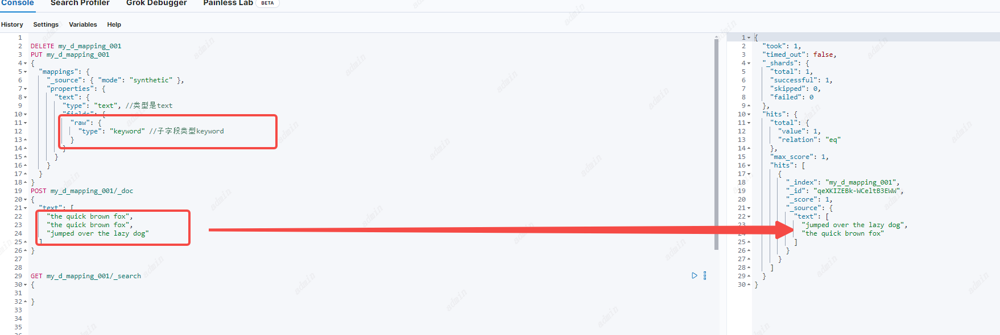

# 元数据字段

## 移除Mapping的_type字段

**7.0.0之后的版本不在支持自定义Mapping 的_type**

## _type

7.0.0之前支持一个索引对应多个mapping类型，也就是一个索引可以有不同的字段。

`_type` 字段与文档的 `_id` 字段结合生成`_uid` 字段，所以允许相同的`_id`不同的  `_type` 存在同一个索引下。

`_type` 也被用于父子关系的文档，也就是一个文档的 `question` 类型的父文档可能是 `answer`

## 为什么移除

最开始，解释ES的index类似于database，type类似于table。实际上这时一个这是一个错误的类比，会导致错误的假设。在SQL数据库中，表是相互独立的。

一个表中的列与另一个表中同名的列没有关系，但这与ES的mapping的Type完全不一样。统一索引下不同的mapping type中**相同字段名称的字段实际上是同一个的，在内部由相同的Lucene字段支持，所以这两个type中相同的字段必须是相同的类型**。

因此，如果想要**删除一个类型下与其他类型相同的字段时，会失败**。

**最重要的是，在同一个索引中存储具有很少或没有共同字段的不同实体会导致数据稀疏，并干扰Lucene有效压缩文档的能力**。

总结：

1. 相同index不同Type的相同字段内部由相应的lucene字段支持，可不单独删除
2. 相同index不同Type中不同字段过多会导致数据稀疏，降低lucene压缩能力


## _source

`_source`字段包含在索引时传递的原始JSON文档主体。这个**`_source`字段本身不会被索引，因此是不可搜索的**，但是因为他被存储起来所以当执行了get或者search请求的时候也可以返回。

如果对磁盘利用率要求高的话，`_source`设置为synthetic可以减少磁盘使用，但代价是只支持映射的子集和较慢的读取，或者(不推荐)禁用`_source`字段，这也会减少磁盘使用，但会禁用许多特性。

### synthetic

synthetic通常在时序数据索引下使用（此时index.mode设置成time_series）。对于其他的索引这个参数属于技术预览阶段。未来可能改变或者移除。

`_source`虽然非常方便，但这个字段占用了磁盘上的大量空间。所以当 `_source`的`mode设置为 synthetic` 时，Elasticsearch可以**在检索时动态地重建源内容**，而不是在发送源文档时将它们完全存储在磁盘上。虽然这种动态重建通常比逐字保存源文档并在查询时加载它们要慢，但它节省了大量存储空间。

设置方法：

```
PUT idx
{
  "mappings": {
    "_source": {
      "mode": "synthetic"
    }
  }
}
```

限制：

1. 当设置为synthetic后检索_source文本信息是，与原始的数据JSON会有一些不同。

- 数组数据子字段丢失


- 字段名称改变


- 按字母顺序排序

动态重组后的source数据会根据字段的字母排序返回，也会与原始的字段顺序不同。


- 删除字段类型为keyword的重复数据


如果将store这是为true则不会删除重复数据。


增加参数ignore_above被忽略的数据也会返回，但会放在最后。比如ignore_above为3，bang长度大于3，所以被放在最后。


- 字段类型使用text

重新排序文本字段可能会对短语和跨度查询产生影响。有关更多细节，请参阅关于position_increment_gap的讨论。您可以通过确保短语查询上的slop参数低于position_increment_gap来避免这种情况。这是默认值。


没有子类型为keyword的text类型不支持设置为synthetic


字段类型是text，子字段类型是keyword



字段类型是text，也可以开启store参数，设置source为synthetic。并不删除重复数据。


2. 只有索引使用的是以下类型的字段才能使用这个参数。

- aggregate_metric_double
- boolean
- byte
- date
- date_nanos
- dense_vector
- double
- flattened
- float
- geo_point
- half_float
- histogram
- integer
- ip
- keyword
- long
- scaled_float
- short
- text
- version
- wildcard

### 禁用_source字段

`_source`虽然非常方便，但这个字段占用了磁盘上的大量空间。所以可以将他禁用。

```
PUT my-index-000001
{
  "mappings": {
    "_source": {
      "enabled": false
    }
  }
}
```

如果禁用`_source`字段而不考虑后果，然后后悔。如果`_source`字段不可用，则不支持以下功能:禁用前需要注意：

1.  update、update_by_query以及reindex这些API都将不支持
2.  使用Kibana的Discover工具是字段将无法展示
3.  高亮功能不能正常使用
4.  从一个Elasticsearch索引重新索引到另一个索引的能力，无论是更改映射或分析，还是将索引升级到新的主要版本都无法使用。
5.  通过查看索引时使用的原始文档来调试查询或聚合的能力。
6.  自动修复索引损坏的能力。

**如果需要考虑磁盘空间，不如提高压缩级别，而不是禁用_source。**

### 选择哪些字段保留在_source

只有专家才能使用的特性是，在文档被索引之后，但在存储`_source`字段之前，选择哪些字段保留在_source。移除的字段也同样会再也不存储，所以从一个Elasticsearch索引重新索引到另一个索引的能力，无论是更改映射或分析，还是将索引升级到新的主要版本都无法使用。所以需要慎重。

```
PUT logs
{
  "mappings": {
    "_source": {
      "includes": [
        "*.count",
        "meta.*"
      ],
      "excludes": [
        "meta.description",
        "meta.other.*"
      ]
    }
  }
}
```

## _routing

文档被路由到索引中的特定分片使用以下公式:

```
routing_factor = num_routing_shards / num_primary_shards
shard_num = (hash(_routing) % num_routing_shards) / routing_factor
```

num_routing_shards是索引`number_of_routing_shards`参数的值。

um_primary_shards是索引`number_of_shards`参数的值。

`_routing`默认情况下是索引的`_id`的值。可以通过为每个文档指定自定义路由值来实现自定义路由模式

### 自定义路由

**主要功能：可以指定数据路由到哪个分片上，并根据路由查到该分片的数据**


**数据流不支持自定义路由，除非在模板中启用了allow_custom_routing设置。**

在搜索中使用自定义路由，这个搜索请求将只在指定的路由值相关联的分片上执行。

**如果只有一个分片却指定多个路由可能存在问题**

```
GET my-index-000001/_search?routing=user1,user2 
{
  "query": {
    "match": {
      "title": "document"
    }
  }
}
```

### 强制指定路由参数

在使用自定义路由时，在索引、获取、删除或更新文档时提供路由值是很重要的。忘记路由值可能导致文档在多个分片上被索引。为了安全起见，_routing字段可以配置为所有CRUD操作所需的自定义路由值:

```
PUT my-index-000002
{
  "mappings": {
    "_routing": {
      "required": true 
    }
  }
}
```


注意

1. 自定义路由的ID唯一问题：当索引指定自定义_routing的文档时，不能保证在索引中的所有分片中_id的唯一性。事实上，如果使用不同的_routing值进行索引，具有相同_id的文档可能会在不同的分片上结束。所以**需要由用户来确保id在整个索引中是唯一的**

### 路由到分区索引

可以配置索引，这样自定义路由值将转到分片的一个子集，而不是单个分片。这有助于降低最终导致集群不平衡的风险，同时仍然减少搜索的影响。这是通过提供索引级别设置索引来实现的。创建索引时的`Routing_partition_size`随着分区大小的增加，数据的分布将变得更加均匀，但代价是每个请求必须搜索更多的分片。

使用这个参数时，路由公式：

```
routing_value = hash(_routing) + hash(_id) % routing_partition_size
shard_num = (routing_value % num_routing_shards) / routing_factor
```

`_routing`字段用于计算索引中的一组分片，然后使用`_id`在该集合中选择一个分片。

**要启用此特性，请执行索引。Routing_partition_size的值应该大于1，小于index.number_of_shards。**

一旦启用，分区索引将有以下限制:

1. 不能在其中创建具有连接字段关系的映射。

2. 索引中的所有映射都必须将_routing字段标记为必需的。

## _doc_count

分桶聚合经常返回一个字段doc_count ，该字段显示每个桶中聚合和分区的文档数量。计算doc_count这个值很简单，doc_count在同个每个桶收集每个文档的适合就会加1。

虽然这种简单的方法在计算单个文档的聚合时是有效的，但它不能准确地表示存储预聚合数据的文档(如含有 `histogram` 或`aggregate_metric_double`字段)，因为一个汇总字段可能表示多个文档。

为了在使用预聚合数据时能够正确的计算文档数量，可以使用元数据字段 `_doc_count` ， `_doc_count` 必须始终是一个正整数，表示在单个摘要字段中聚合的文档数量。

当字段 `_doc_count` 被添加到文档中时，所有桶聚合将以它的值为主，此时桶的文档数不再是加1而是加上`_doc_count` 的值。，如果没有这个字段，默认为1。

注意：

1.  `_doc_count` 是整数，不允许使用嵌套数组
2.  `_doc_count` 不填写默认为1
3.  `_doc_count` 在插入文档时增加，主要用在含有 `histogram` 或`aggregate_metric_double`字段的文档

```
DELETE my_d_mapping_001
PUT my_d_mapping_001
{
  "mappings" : {
    "properties" : {
      "my_histogram" : {
        "type" : "histogram"
      },
      "my_text" : {
        "type" : "keyword"
      }
    }
  }
}

PUT my_d_mapping_001/_doc/2
{
  "my_text" : "histogram_2",
  "my_histogram" : {
      "values" : [0.1, 0.25, 0.35, 0.4, 0.45, 0.5],
      "counts" : [8, 17, 8, 7, 6, 2]
   },
  "_doc_count": 62 
}
PUT my_d_mapping_001/_doc/3
{
  "my_text" : "histogram_3",
  "my_histogram" : {
      "values" : [0.21],
      "counts" : [1]
   }
}
```


## _field_names（8.0废弃字段）

`_field_names` 字段被使用在索引每个在文档里的字段的值除了null值。exists查询使用该字段来查找具有或不具有特定字段的非空值的文档。目前 `_field_names` 与 `doc_values` 和`norms` 字段互斥。对于exists查询而言可以使用 `doc_values` 和`norms` 但不能同时使用`_field_names` 。

现在不再需要禁用`_field_names` 。**它现在默认启用**，因为它不再像以前那样承担索引开销。**8.0之后取消了对禁用_field_names的支持**，**8.0之前如果使用了`doc_values` 和`norms` 或者不需要做exist查询可以禁用，但不推荐**

```
PUT my_d_mapping_001
{
  "mappings" : {
    "properties" : {
     
      "my_text" : {
        "type" : "keyword"
      }
    },
    "_field_names": {
      "enabled": true
    }
  }
}
```


## _ignored

`_ignored` 字段标识索引并存储文档中需要被忽略的每个字段的名称。例如，当字段格式错误且`ignore_malformed`被打开时，当keyword字段的值超过其可选的`ignore_above`设置时，或者当字段数量已达到`index.mapping.total_fields`限制，`index.mapping.total_fields`和`Ignore_dynamic_beyond_limit`设置为true。

`_ignored` 字段在term、terms、exists查询中可以被搜索的，返回在hits中。

**主要功能：查到被忽略的文档**


## _id

每个文档的`_id `都是唯一标识，可以通过id进行ids查询查找数据。`_id `在索引时就被分配好了，或者根据ES自动生成，这个字段不是在Mapping中配置的。

`_id `可以被很多查询支持，如 `term`, `terms`, `match`, and `query_string`.


**`_id`字段被限制在聚合、排序和脚本中使用。如果需要对`_id`字段进行排序或聚合，建议将`_id`字段的内容复制到另一个启用了`doc_values`的字段中。**

## _index

在跨多个索引执行查询时，有时需要添加仅与某些索引的文档相关联的查询子句。 `_index` 字段允许匹配文档被索引到的索引。它的值在某些查询和聚合，排序或脚本时是可访问的

**主要功能：多索引查询时根据索引过滤**


## _meta

映射类型可以具有与之关联的自定义元数据。Elasticsearch根本不使用这些，但可以用来存储特定于应用程序的元数据，例如文档所属的类

**主要功能：自定义元数据，一般不适用**

```
PUT my-index-000001
{
  "mappings": {
    "_meta": { 
      "class": "MyApp::User",
      "version": {
        "min": "1.0",
        "max": "1.3"
      }
    }
  }
}
//更新
PUT my-index-000001/_mapping
{
  "_meta": {
    "class": "MyApp2::User3",
    "version": {
      "min": "1.3",
      "max": "1.5"
    }
  }
}
```

## _tier

跨索引查询时，执行查询根据索引所在的节点所属的层 (`data_hot`, `data_warm`, `data_cold` or `data_frozen`等).

可以在重写为术语查询的任何查询中使用_tier字段，例如match、query_string、term、terms或simple_query_string查询，以及前缀和通配符查询。但是，它不支持regexp和模糊查询。

**主要功能：在分层数据中查找**

```
PUT index_1/_doc/1
{
  "text": "Document in index 1"
}

PUT index_2/_doc/2?refresh=true
{
  "text": "Document in index 2"
}

GET index_1,index_2/_search
{
  "query": {
    "terms": {
      "_tier": ["data_hot", "data_warm"] 
    }
  }
}
```

