# Query context和 Filter context（查询上下文和过滤器上下文）
Query context更倾向于**查询更匹配的文档**，相关性分数在 `_score` 字段中展示。
Filter context更倾向于**查询匹配查询的文档**，也就是查询出来的文档一定是完全符合查询条件的，所以不会有相关性分数的计算。
## 相关性分数（Relevance scores）
ElasticSearch搜索出来的结果是根据相关性分数进行排序的，这个指标表示每一个匹配上的文档与查询的匹配度高低。
相关性分数是一个正浮点数，search的API中"_score"元数据字段里返回。"_score"值越高，说明文档相关性越高。每一个query类型都可以计算不同的相关性分数，分数的计算也取决于查询子句是在查询上下文中运行还是在过滤器上下文中运行。
Query context中为查询计算的分数表示为单精度浮点数;它们只有 24 位的精度。超过有效值精度的分数计算将被转换为精度损失的浮点数。

| 类型             | 含义            | 相关性分数 | 是否缓存                   | 生效参数                                                                              |
|----------------|---------------|-------|------------------------|-----------------------------------------------------------------------------------|
| Query context  | 查询更匹配查询条件的文档      | 有     | 否                      | `query` 参数                                                                        |
| Filter context | 过滤完全满足查询条件的文档 | 无，返回0 | 是，最近的过滤查询会被自动缓存，提升查询性能 | `bool`查询中的`filter`和`must_not`等参数；`constant_score`查询中的`filter`参数; `filter`聚合 |

一个查询子句中既包含Query context 也包含 Filter context，Query context 将匹配度高的文档打分排序，Filter context会过滤掉不匹配的文档，但Filter context不会影响匹配文档的分数。
# 复合查询
## Bool Query
一个查询可以通过bool组合其他的查询去匹配文档。bool查询是映射lucene的`BooleanQuery`。bool 查询由一个或多个子查询构成，
子查询的类型：
1. must ：非必填。返回的文档必须匹配上这个查询条件，并且将对分数产生影响。
2. filter：非必填。返回的文档必须匹配上这个查询条件，忽略分数，并且查询结果通常会被缓存。
3. should：非必填。返回的文档可能匹配上这个查询条件
4. must_not：非必填。返回的文档必须不匹配上这个查询条件，忽略分数，并且查询结果通常会被缓存。

参数：
1. minimum_should_match：非必填。与should子查询一起使用，指定should子查询至少匹配上的子查询条件数量或者百分比。当bool查询中，有一个should子查询，且没有must和filter子查询时，minimum_should_match默认值是1，其他都是0.
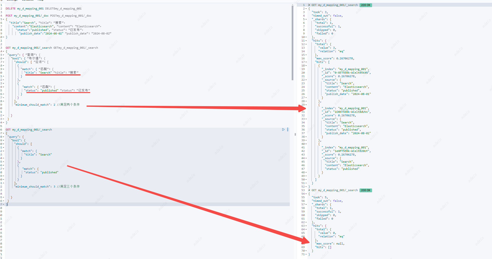
2. boost：非必填。分数系数，默认1
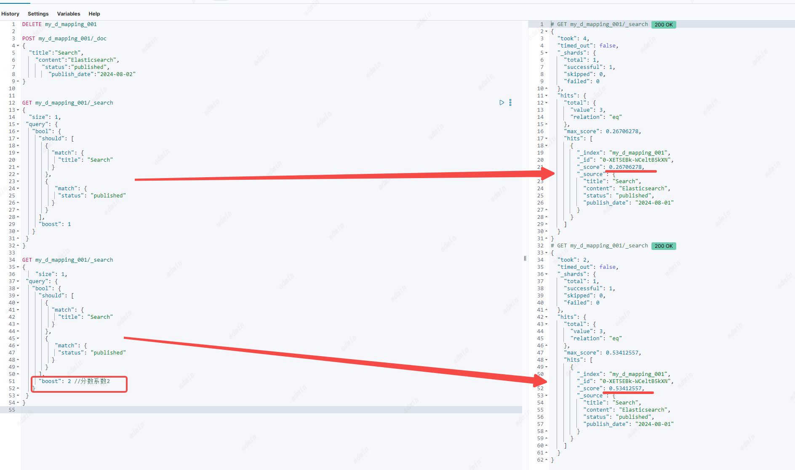
## Boosting query
返回与肯定查询匹配的文档，同时降低也与否定查询匹配的文档的相关性分数。 您可以使用提升查询来降级某些文档，而无需将它们从搜索结果中排除。
子查询的类型：
1. positive：必填。肯定查询，返回的文档必须匹配上这个查询条件，满足肯定查询的文档分数不变
2. negative：必填。否定查询，返回的文档如果匹配上这个查询条件，该文档分数会乘以否定系数（negative_boost）

参数：
1. negative_boost：必填。否定分数系数，0-1之间的浮点数，
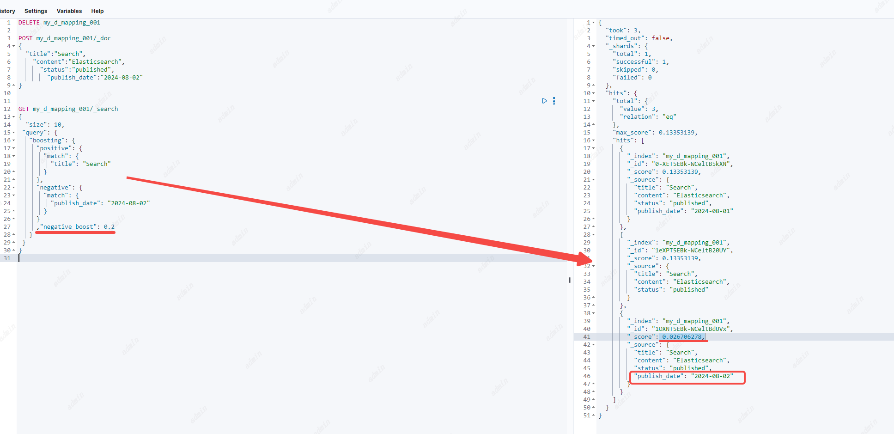

## Constant score query
常量分数查询是filter 查询的封装，每一个返回的文档的相关性分数都是参数`boost`设置的值
子查询的类型：
1. filter：必填。返回的文档必须匹配上这个查询条件，分数为`boost`设置的值，ES会自动缓存常用的过滤器查询。

参数：
1. boost：非必填。默认值1.0，0-1之间的浮点数，
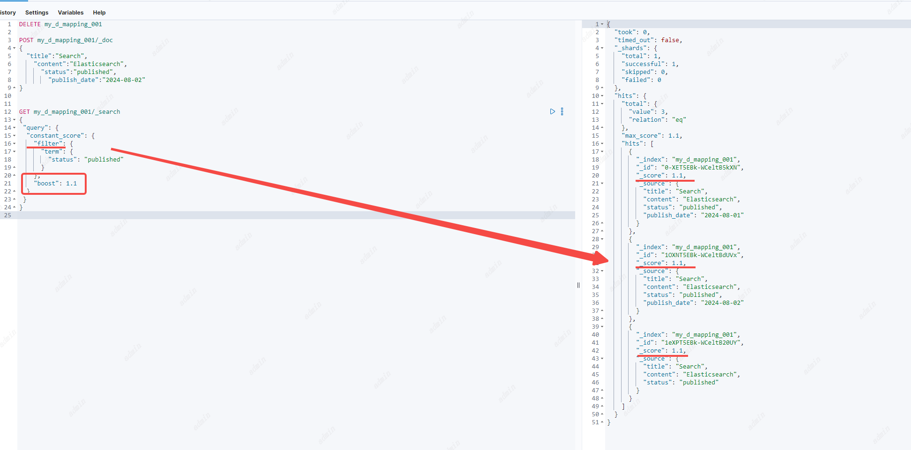

## Disjunction max query
分离最大值查询：返回与一个或多个包装查询（称为查询子句或子句）匹配的文档。如果返回的文档匹配多个子查询，那么`dis_max`查询会将匹配的所有子条件中最高的分数分配这个文档，以及加上`tie_breaker`参数中的分数。

子查询的类型：
1. queries：必填。查询对象数组。可以包括一个或多个子查询。返回的文档匹配上这里面的一个或多个查询。如果一个文档匹配上了多个查询条件，那么文档最终相关性分数给匹配分数最高的值。

参数：
1. tie_breaker：非必填。默认值0.0，0-1之间的浮点数，

如果一个文档匹配上了多个子查询，那么`dis_max`查询会按照以下方式计算相关性分数
1. 取匹配条件分数最高的分数
2. 将任何其他匹配子句的分数乘以`tie_breaker`值。
3. 将最高分数添加到相乘的分数中。
如果`tie_breaker`值大于 0.0，则所有匹配子句都计算在内，但得分最高的子句计数最多。

## Function score query
本质上是定义各个过滤条件的权重从而自定义返回的分数。
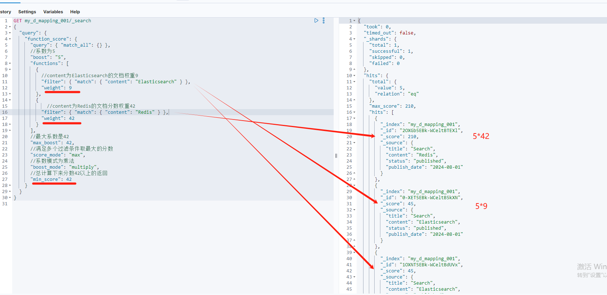
分数计算规则：
1. 首先根据query语句进行查询
2. 得到符合query语句的文档，根据functions中定义的filter过滤符合的文档，得到匹配的文档初始分数filterScore为weight* `Function score` 如果没有指定`Function score` 默认为1。
3. 如果设置了max_boost，filterScore>max_boost则按照max_boost设置的数值返回
4. 如果一个文档满足多个条件也就是有多个filterScore，则根据score_mode字段计算当前文档的initScore
5. boost为基础系数，根据boost_mode字段和initScore计算最终分数finallyScore
6. 如果设置了min_score，finallyScore大于min_score，则返回这条文档。

子查询类型：
1. query：与正常的query一样
2. functions： 
• script_score：通过脚本从文档中的数值类型的字段来定义分数
• weight:给满足函数的文档得分进行权重赋值，计算方式：分数*权重
• random_score：随机分数，默认情况下分数是[0,1)且每次搜索分数都不固定，如果希望固定通过seed和field两个字段，最终分数的计算会基于seed
                 位于同一分片内且具有相同`field`值的文档将获得相同的分数，因此通常希望为所有文档使用具有唯一值的字段。`field`推荐的默认值为`_seq_no`,但更新文档也会更新`_seq_no`所以最终的分数也会被更新 
• field_value_factor：与script_score类型，但是可以避免脚本的开销，适合需要根据字段值进行简单的分数计算。
                       包含参数：field文档中的字段名、factor影响因子默认为1、modifier计算方式（none, log, log1p, log2p, ln, ln1p, ln2p, square, sqrt, or reciprocal. 默认 to none.）、missing缺省值 
• decay functions: 衰减函数// todo


参数：
1. score_mode：根据定义的函数对每个文档进行评分。参数score_mode指定如何组合计算分数，类型有：multiply、sum、avg、first、max、min。如 一个文档符合函数A score=10， weight=2 ，函数B score=20，weight=3，此时score_mode为sum，那么分数为（10*2+20*3）/(2+3)
2. weight：可以用来矫正函数中每个过滤条件的得分，公式是weight*文档得分
3. boost_mode：指定boost系数的值如何与函数得分组合计算分数，，类型有：multiply、sum、avg、first、max、min。
4. min_score：最终返回时会过滤掉最终得分比min_score值小的文档

# 全文本查询
可以查询被分词器分词的text类型的字段。查询的内容通过同一个分词器（在索引期间对字段指定了的分词器）进行处理后进行搜索，
## intervals query
间隔查询，允许对匹配词的顺序和接近度进行细粒度控制。
```
POST my_d_mapping_001/_doc
{
  "my_text":"my favorite food is cold porridge",
  "content":"hot water"
}

POST my_d_mapping_001/_doc
{
  "my_text":"my favorite food is hot water",
  "content":"cold porridge"
}
 
POST my_d_mapping_001/_doc
{
  "my_text":"my very favorite food is hot water",
  "content":"hot water"
}
 
GET my_d_mapping_001/_search
{
  "query": {
    "intervals" : {
      "my_text" : {
        "all_of" : {
          "ordered" : true,
          "intervals" : [
            {
              "match" : {
                "query" : "my favorite food",
                "max_gaps" : 0,
                "ordered" : true
              }
            },
            {
              "any_of" : {
                "intervals" : [
                  { "match" : { "query" : "hot water" } },
                  { "match" : { "query" : "cold porridge" } }
                ]
              }
            }
          ]
        }
      }
    }
  }
}
```

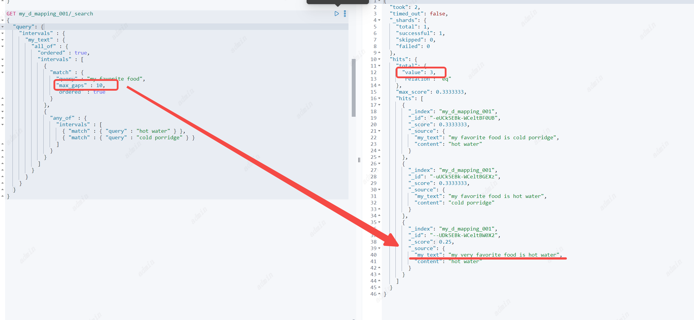
参数
1. `field` : 必要参数、顶级参数，指定查询哪个字段。
2. match : 用于构造查询指定的匹配规则。 
```
内含参数：
`query` 必填，指定查询的文本内容。
`max_gaps` 选填，最大间隔数，用于标识查询的文本内容可以有多大的间隙，默认是-1，表示只要查询的字段中包含查询文本分此后的词即可。0表示必须紧挨着。n表示可以分隔成n隔间；
`ordered` 选填，默认false，表示是否匹配项必须按指定的顺序出现
`analyzer` 选填，指定使用哪个分词器分词，默认使用`field`使用的分词器
`filter` 选填，可以继续包含`filter`过滤条件
`use_field`选填， 如果指定查询的字段就换成`use_field`指定的字段，`analyzer`也是用这个字段的分词器作为默认分词器。
```
3. prefix : 前缀匹配
最多只能指定128个terms查修
```
内含参数：
`prefix`  必填，指定查询的前缀字符串
`analyzer` 选填，指定使用哪个分词器分词，默认使用`field`使用的分词器
`use_field`选填， 如果指定查询的字段就换成`use_field`指定的字段，`analyzer`也是用这个字段的分词器作为默认分词器。
```
4. wildcard ：  通配符查询
   最多只能指定128个terms查修
```
内含参数：
`wildcard`  必填，可以使用`? *` 进行模糊查询。（避免以*或?开头。这可能会增加查找匹配项所需的迭代，并降低搜索性能。）
`analyzer` 选填，指定使用哪个分词器分词，默认使用`field`使用的分词器
`use_field`选填， 如果指定查询的字段就换成`use_field`指定的字段，`analyzer`也是用这个字段的分词器作为默认分词器。
```
5. fuzzy ： 相似词查询
定义相似词查询规则，可以搜索出与查询内容相似的词所在的文档，最多只能指定128个terms查修
```
内含参数：
`term`  必填，term查询
`prefix_length` 选填，默认值0，指定可变字符的开始位置
`transpositions`选填，默认值true,指定是否可以交换字符顺序
`fuzziness`选填，默认值auto,指定可变字符的长度
`analyzer` 选填，指定使用哪个分词器分词，默认使用`field`使用的分词器
`use_field`选填， 如果指定查询的字段就换成`use_field`指定的字段，`analyzer`也是用这个字段的分词器作为默认分词器。
```
6. all_of ： 全部匹配
表示以下所含的所有规则都要匹配
```
`intervals`  必填，是个数组。里面是子规则条件，返回的文档要满足里面所有的子规则
`max_gaps` 选填，最大间隔数，用于标识查询的文本内容可以有多大的间隙，默认是-1，表示只要查询的字段中包含查询文本分此后的词即可。0表示必须紧挨着。n表示可以分隔成n隔间；
`ordered` 选填，默认false，表示是否匹配项必须按指定的顺序出现
`filter` 选填，可以继续包含`filter`过滤条件
```
7. any_of ： 任意匹配
表示以下所含的所有规则只要匹配任意一个或多个
```
`intervals`  必填，是个数组。里面是子规则条件，返回的文档要满足里面任意一个的子规则
`filter` 选填，可以继续包含`filter`过滤条件
```
8. filter ： 过滤器
基于前面的查询过滤出满足的文档
```
`after`  选填，查询，返回在query的文本内容前包含after指定的文本的文档
`before` 选填，查询，返回在query的文本内容后包含after指定的文本的文档
`containing` 选填，查询，返回在query的文本内容中包含containing指定的文本的文档
`not_containing` 选填，查询，返回在query的文本内容中不包含not_containing指定的文本的文档
`contained_by` 选填，查询，返回在query的文本内容且被涵盖在contained_by指定的文本的文档
`not_contained_by` 选填，查询，返回在query的文本内容且不被涵盖在not_contained_by指定的文本的文档
## 以下两个没懂
`overlapping` 选填，查询，返回在query的文本内容且与overlapping指定的文本重合的文档
`not_overlapping` 选填，查询，返回在query的文本内容且与overlapping指定的文本不重合的文档
`script` 选填，查询，返回在query的文本内容且满足脚本内容的文档
```
after、before示例
```
POST my_d_mapping_001/_doc
{
  "my_text":"my favorite food is hot salty porridge ",
  "content":"hot porridge"
}
POST my_d_mapping_001/_doc
{
  "my_text":"my favorite food is hot porridge and salty",
  "content":"hot porridge"
}
POST my_d_mapping_001/_doc
{
 "my_text": "my favorite food is salty hot  porridge ",
  "content":"hot porridge"
}
GET my_d_mapping_001/_search
{
  "query": {
    "intervals" : {
      "my_text" : {
        "match" : {
          "query" : "hot porridge",
          "max_gaps" : 0,
          "filter" : {
            "after":{
              "match" : {
                "query" : "salty"
              }
            }
          }
        }
      }
    }
  }
}

GET my_d_mapping_001/_search
{
  "query": {
    "intervals" : {
      "my_text" : {
        "match" : {
          "query" : "hot porridge",
          "max_gaps" : 0,
          "filter" : {
            "before":{
              "match" : {
                "query" : "salty"
              }
            }
          }
        }
      }
    }
  }
}
```
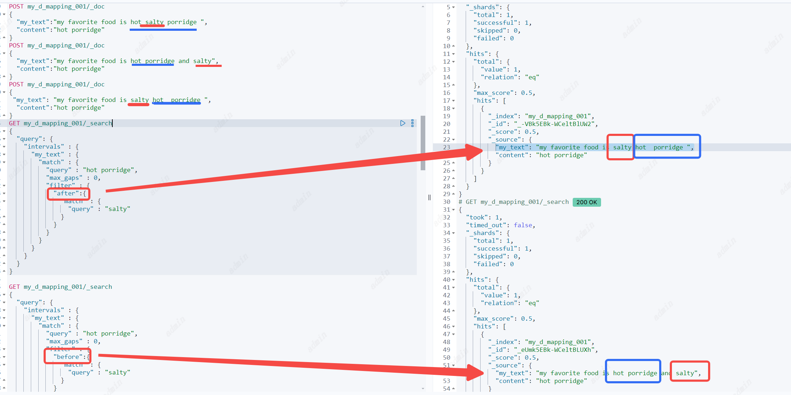
not_contained_by、contained_by示例
```
POST my_d_mapping_001/_doc
{
  "my_text":"my favorite food is hot water",
  "content":"cold porridge"
}
POST my_d_mapping_001/_doc
{
 "my_text": "my favorite food is salty hot  porridge ",
  "content":"hot porridge"
}
GET my_d_mapping_001/_search
{
  "query": {
    "intervals" : {
      "my_text" : {
        "match" : {
          "query" : "hot ",
          "max_gaps" : -1,
          "filter" : {
            "not_contained_by":{
              "match" : {
                "query" : "hot porridge "
              }
            }
          }
        }
      }
    }
  }
}
GET my_d_mapping_001/_search
{
  "query": {
    "intervals" : {
      "my_text" : {
        "match" : {
          "query" : "hot ",
          "max_gaps" : -1,
          "filter" : {
            "contained_by":{
              "match" : {
                "query" : "hot porridge "
              }
            }
          }
        }
      }
    }
  }
}
```
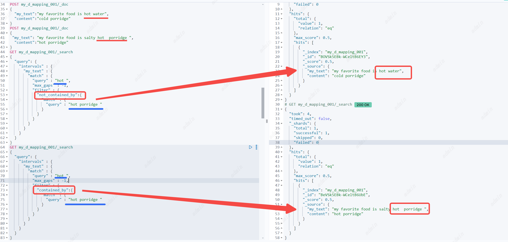
## Match query
匹配查询
返回与所提供的文本、数字、日期或布尔值匹配的文档。在匹配之前对提供的文本进行分析。匹配查询是执行全文搜索的标准查询，包括模糊匹配选项。
参数。

1. `field` : 必要参数、顶级参数，指定查询哪个字段。这个字段的类型需要是：Text, number, boolean , date
2. `query` :  必要参数、匹配查询会在执行查询前将提供的文本进行分词，所以他搜索时使用的是的是分词后的Token，换句话来说不是精确术语。
3. `analyzer` 选填，指定使用哪个分词器分词，默认使用`field`使用的分词器
4. `auto_generate_synonyms_phrase_query` 选填，默认true，如果是true表示开启使用synonym_graph令牌过滤器进行多词同义词扩展，将query中的文本信息找到同义词，一起进行多terms查找，如`ny`与`new york`是同意词，搜索的时候除了匹配包含`ny`的文档，也会匹配包含`new york`的文档，约等于查询`ny OR (new AND york)`
5. `boost` ：选填。分数系数，默认1
6. `fuzziness` ：选填。模糊查询，指定可以最多有多少个字符与搜索的内容不同。
7. `max_expansions` ：选填。默认50个，模糊匹配最大可扩展到多少个term词
8. `prefix_length` ：选填。默认0，表示模糊匹配从哪一位开始模糊
9. `transpositions` ：选填，默认值true,指定是否可以交换字符顺序
10. `fuzzy_rewrite` ：选填，模糊重写方法。如果fuzziness参数不为0，则fuzzy_rewrite默认使用top_terms_blended_freqs_${max_expansion}方法
11. `lenient` ：选填，默认false，如果是true，会校验query中设置的查询内容的格式，
12. `operator` ：选填，只有两个选择OR和AND，默认OR。表示query中的文本被分成多个词后是使用OR去匹配还是AND匹配。
13. `minimum_should_match` ：选填，要返回文档必须匹配的最小子句数。如`I love china`经过分词后,相当于有`I` OR `love`OR `china`,三个子句。minimum_should_match配置多少就要返回匹配这些子句最小最小子句数的文档。
14. `zero_terms_query` ：选填，none 或者 all，默认none 。如果query中的文本经过分词器处理后，没有任何词（如全是停止词所以将词全部移除），none表示不返回任何文档，all返回所有文档。

lenient示例
```
POST my_d_mapping_001/_doc
{
  "my_text":"this is not a test",
  "nums":1
}
GET my_d_mapping_001/_mapping
GET my_d_mapping_001/_search
{
  "query": {
    "match": {
      "nums": {
          "query": "this",
          "lenient": "false"
      }
    
    }
  }
}

```
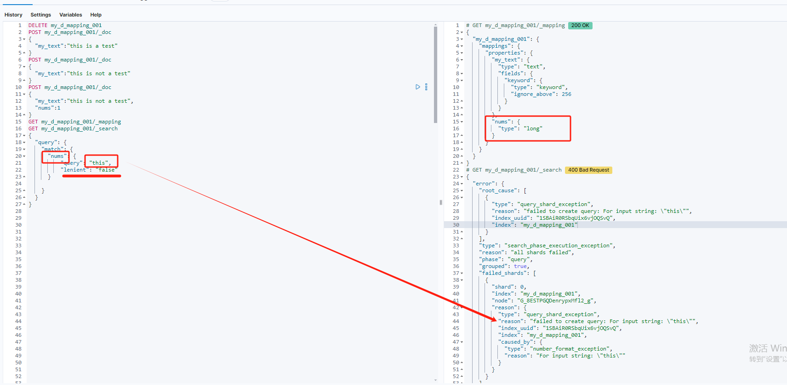
## Match boolean prefix query
匹配不布尔前缀查询
等价于bool的should查询，将查询文本进行分词后，前面的词进行term匹配，最后一个词进行前缀匹配。
参数：
1. `field` : 必要参数、顶级参数，指定查询哪个字段。这个字段的类型需要是：Text, number, boolean , date
2. `query` :  必要参数、匹配查询会在执行查询前将提供的文本进行分词，所以他搜索时使用的是的是分词后的Token，换句话来说不是精确术语。
3. `analyzer` 选填，指定使用哪个分词器分词，默认使用`field`使用的分词器
4`boost` ：选填。分数系数，默认1
5`fuzziness` ：选填。（作用在最后一个模糊词前的所有term词上）模糊查询，指定可以最多有多少个字符与搜索的内容不同。
6`max_expansions` ：选填。（作用在最后一个模糊词前的所有term词上）默认50个，模糊匹配最大可扩展到多少个term词
7`prefix_length` ：选填。（作用在最后一个模糊词前的所有term词上）默认0，表示模糊匹配从哪一位开始模糊
8`transpositions` ：选填，（作用在最后一个模糊词前的所有term词上）默认值true,指定是否可以交换字符顺序
9`fuzzy_rewrite` ：选填，（作用在最后一个模糊词前的所有term词上）模糊重写方法。如果fuzziness参数不为0，则fuzzy_rewrite默认使用top_terms_blended_freqs_${max_expansion}方法
10`lenient` ：选填，默认false，如果是true，会校验query中设置的查询内容的格式，
11`operator` ：选填，只有两个选择OR和AND，默认OR。表示query中的文本被分成多个词后是使用OR去匹配还是AND匹配。
12`minimum_should_match` ：选填，要返回文档必须匹配的最小子句数。如`I love china`经过分词后,相当于有`I` OR `love`OR `china`,三个子句。minimum_should_match配置多少就要返回匹配这些子句最小最小子句数的文档。

```
DELETE my_d_mapping_001
POST my_d_mapping_001/_doc
{
  "my_text":"i love china"
}
POST my_d_mapping_001/_doc
{
  "my_text":"you have lots more to work on"
}

GET my_d_mapping_001/_mapping
GET my_d_mapping_001/_search
{
  "query": {
    "match_bool_prefix" : {
      "my_text" : "you have m"
    }
  }
}
GET /_search
{
  "query": {
    "bool" : {
      "should": [
        { "term": { "my_text": "you" }},
        { "term": { "my_text": "have" }},
        { "prefix": { "my_text": "m"}}
      ]
    }
  }
}

GET my_d_mapping_001/_search
{
  "query": {
    "match_bool_prefix" : {
      "my_text" : "u hav f"
    }
  }
}

GET /_search
{
  "query": {
    "bool" : {
      "should": [
        { "term": { "my_text": "u" }},
        { "term": { "my_text": "hav" }},
        { "prefix": { "my_text": "f"}}
      ]
    }
  }
}

```
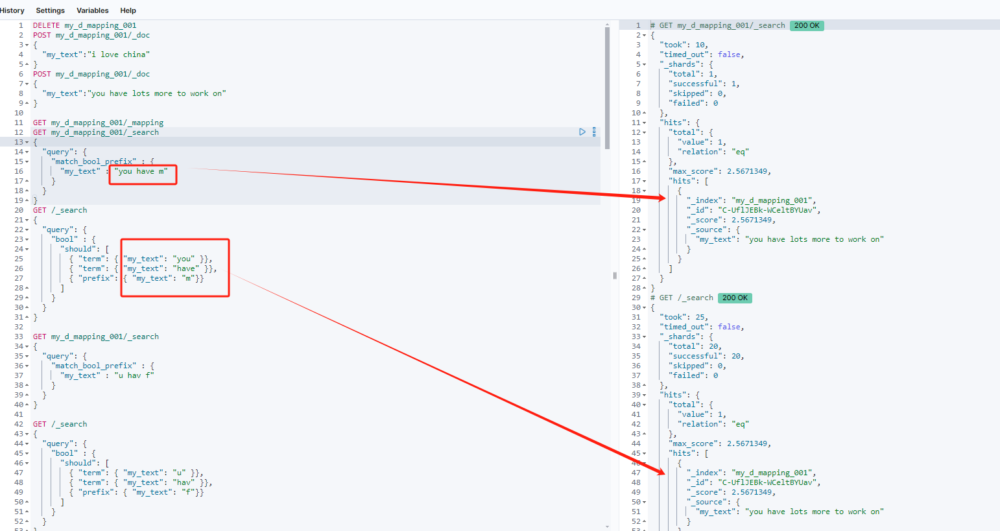
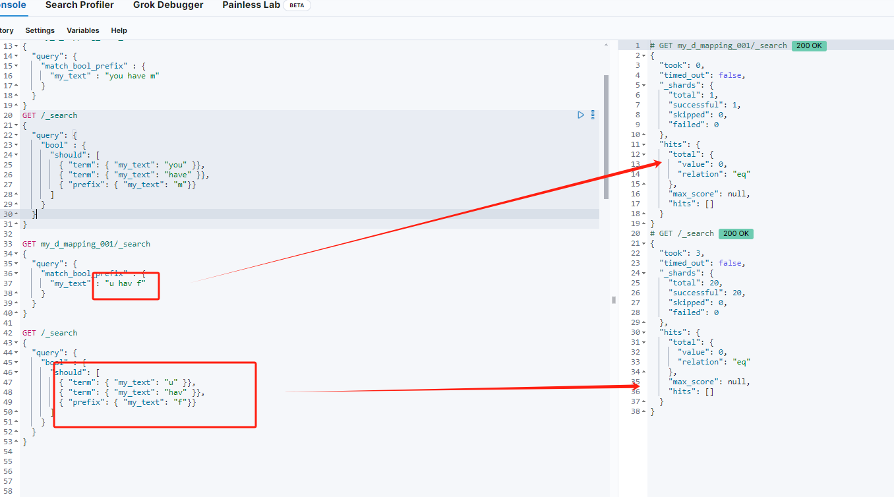

## Match phrase query
匹配短语查询
参数
1. `field` : 必要参数、顶级参数，指定查询哪个字段。
2. `query` : 指定查询的短语文本
3. `analyzer` 选填，指定使用哪个分词器分词，默认使用`field`使用的分词器
4. `stop` 选填，可以允许短语中多出几个词
5. `zero_terms_query` 选填，与match一样
```
POST my_d_mapping_001/_doc
{
  "my_text":"my favorite food is hot water",
  "content":"cold porridge"
}
POST my_d_mapping_001/_doc
{
 "my_text": "my favorite food is salty hot a porridge ",
  "content":"hot porridge"
}
POST my_d_mapping_001/_doc
{
 "my_text": "my favorite food is salty hot  porridge ",
  "content":"hot porridge"
}
POST my_d_mapping_001/_doc
{
 "my_text": "my favorite food is salty hot water  porridge ",
  "content":"hot porridge"
}
POST my_d_mapping_001/_doc
{
 "my_text": "my favorite food is salty hot water water  porridge ",
  "content":"hot porridge"
}
GET my_d_mapping_001/_search
{
  "query": {
   "match": {
     "my_text": "hot porridge"
   }
  }
}

GET my_d_mapping_001/_search
{
  "query": {
   "match_phrase": {
     "my_text": {
       "query": "hot porridge"
     }
   }
  }
}

GET my_d_mapping_001/_search
{
  "query": {
   "match_phrase": {
     "my_text": {
       "query": "hot porridge",
       "slop": 1
     }
   }
  }
}
```
与Match区别：Match查询分词后，只有文档中有一个词满足就会返回，但Match phrase必须两个词挨着也就是以短语的形式存在才会返回。
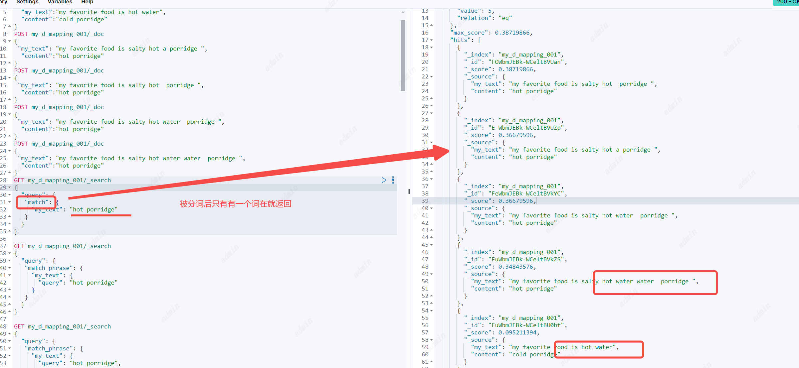
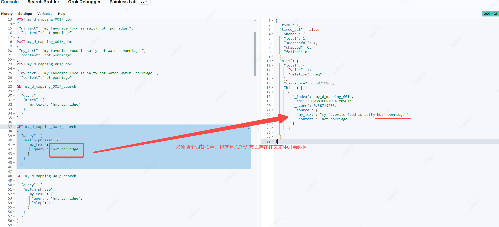
stop的作用：允许短语中有几个词间隔
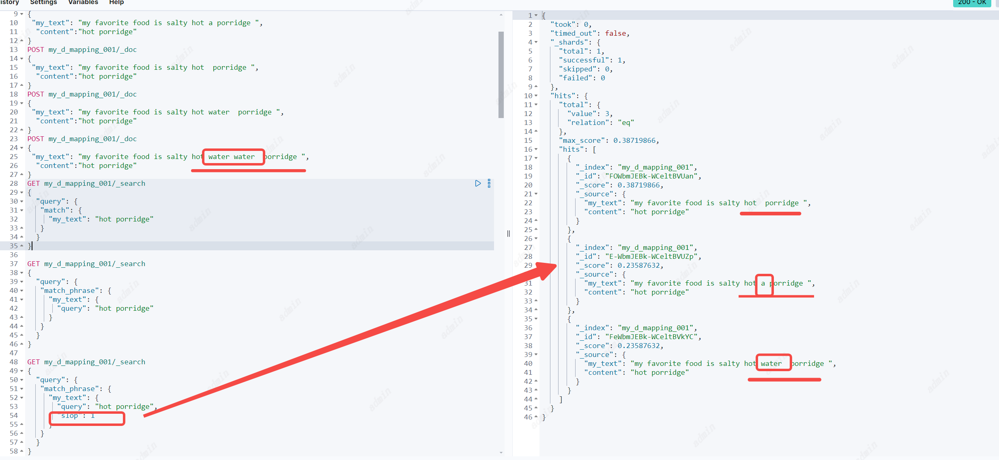
## Match phrase prefix query
匹配短语前缀查询，与短语匹配基本相同，文档必须包含这个短语并且按照相同的顺序，但最后一个字可以模糊匹配。
注意：最后一个模糊词会在index词的字典中按照顺序获取前50个，如果你想要搜索的词并不在前50个就会搜不到，所以会有一些歧义。但这通常不是问题，因为用户会不断输入文本让查找变得精确（个人认为适合在搜索框里做搜索的提示词）
参数
1. `field` : 必要参数、顶级参数，指定查询哪个字段。
2. `query` : 指定查询的短语文本
3. `analyzer` 选填，指定使用哪个分词器分词，默认使用`field`使用的分词器
4. `max_expansions` 选填，根据最后一个词最大可模糊匹配的词数，默认50个。
5. `stop` 选填，可以允许短语中多出几个词
6. `zero_terms_query` 选填，与match一样
```
GET my_d_mapping_001/_search
{
  "query": {
   "match": {
     "my_text": "hot porridge"
   }
  }
}
```
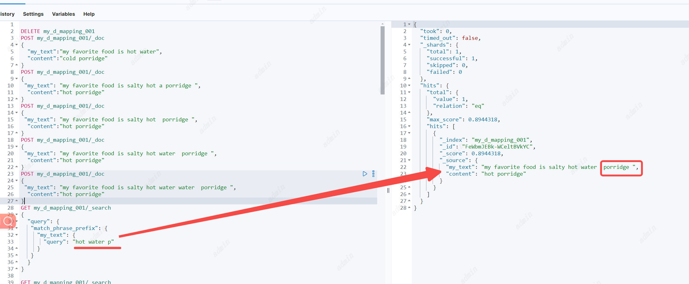

## Combined fields
组合字段搜索：可以同时搜索多个字段。
注意：`indices.query.bool.max_clause_count` 参数对搜索的字段数量限制，默认4096个字段

参数
1. `fields` : 必要参数、是数组，可以为每个字段分别设置打分系数。如：` "fields" : [ "title^2", "body" ]`
2. `query` : 指定查询的文本
3. `analyzer` 选填，指定使用哪个分词器分词，默认使用`field`使用的分词器
4. `auto_generate_synonyms_phrase_query` 选填，与match一样
5. `operator` 选填，与match一样 注意：这里的and和or与match一样，并不是代表需要在每一个字段里都存在
6. `minimum_should_match` 选填，与match一样
7. `zero_terms_query` 选填，与match一样
   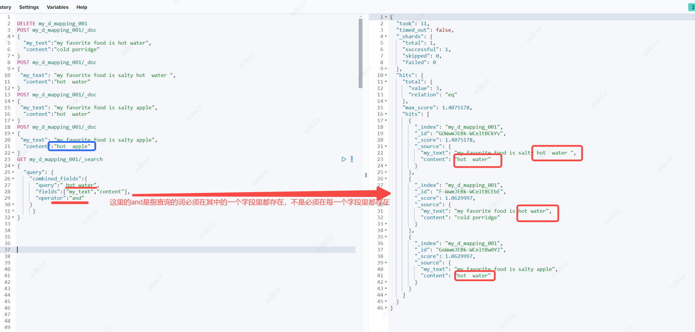
   //todo 与Multi-match区别
## Multi-match query
多匹配查询:可以以构建一个查询条件去匹配多个字段。
参数：
1. `fields` 必填。字段支持通配符以及定义字段匹配分数系数。` "fields": [ "title", "*_name" ] ` `"fields" : [ "subject^3", "message" ] `
2. tie_breaker 平衡分数计算,计算规则：最佳匹配字段的分数加上所有其他匹配字段的tie_breaker * _score。
3. 同样也有和match query 一样的参数：analyzer, boost, operator, minimum_should_match, fuzziness, lenient, prefix_length, max_expansions, fuzzy_rewrite, zero_terms_query, auto_generate_synonyms_phrase_query and fuzzy_transpositions。
4. `type` 选填。multi_match查询在内部执行的方式取决于类型参数
   默认`best_fields`
```
POST my_d_mapping_001/_doc
{
 "my_text": "my favorite food is salty apple",
  "content":"hot  apple"
}
POST my_d_mapping_001/_doc
{
 "my_text": "my favorite food is water",
  "content":"hot"
}
POST my_d_mapping_001/_doc
{
 "my_text": "my favorite food is salty apple",
  "content":"hot water"
}
```
**best_fields**
通常，best_fields类型使用单个最佳匹配字段的分数，但如果指定了tie_breaker，则它按如下方式计算分数:
最佳匹配字段的分数加上所有其他匹配字段的tie_breaker * _score
最佳字段，查找fields集合中的任意一个字段可以匹配查询文本的文档，但使用最佳字段中的_score
```
GET my_d_mapping_001/_search
{
  "query": {
    "multi_match": {
      "query": "hot water",
      "type": "best_fields", 
      "fields": ["my_text","content"]
    }
     }
}
```
等价于dis_max查询
```
GET my_d_mapping_001/_search
{
  "query": {
    "dis_max": {
      "queries": [
        { "match": { "my_text": "hot water" }},
        { "match": { "content": "hot water" }}
      ]
   
    }
  }
}
```
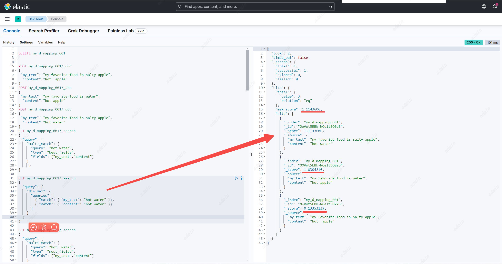
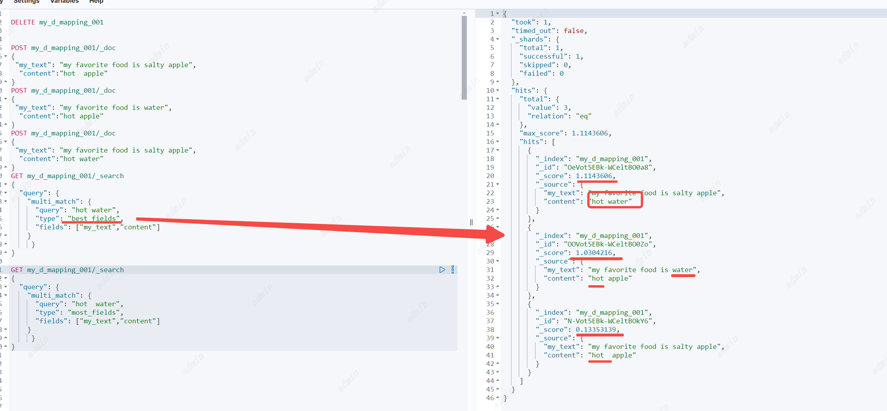
**most_fields**  
最多字段，查找fields集合中的任意一个字段可以匹配查询文本的文档，并组合每个字段匹配的_score。
适合查询不同字段不同分词器，找出最符合搜索文本内容的匹配度最高的文本。
```
GET my_d_mapping_001/_search
{
  "query": {
    "multi_match": {
      "query": "hot  water",
      "type": "most_fields", 
      "fields": ["my_text","content"]
    }
     }
}
```
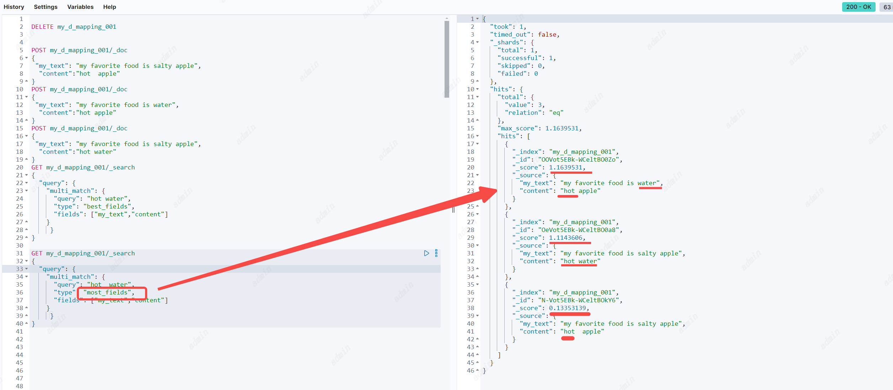
与best_fields比对，其实返回的内容都一样，但分数不同。best_fields只返回最大分数。most_fields会将所有字段的分数累加，所以这个例子可以看到most_fields匹配到的第一个文档分数更高。
等价于Should查询
```
GET my_d_mapping_001/_search
{
  "query": {
    "bool": {
      "should": [
       { "match": { "my_text": "hot water" }},
        { "match": { "content": "hot water" }}
      ]
    }
  }
}
```
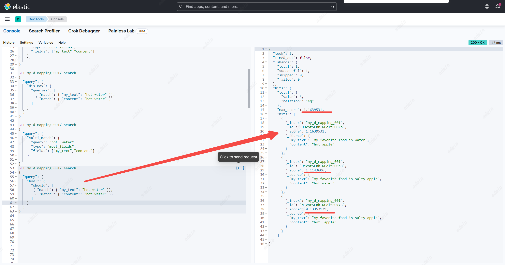
**cross_fields** //todo没看懂
使用相同的分析器将字段当作一个大字段来处理。查找任何字段中的每个单词。
cross_fields类型对于需要匹配多个字段的结构化文档特别有用。例如，当在first_name和last_name字段中查询“Will Smith”时，最佳匹配可能是在一个字段中包含“Will”，而在另一个字段中包含“Smith”。
与**best_fields**不同的是：1. operator和minimum_should_match是按字段应用的，而不是按术语；2. 与相关性有关:first_name和last_name字段中不同的术语频率可能会产生意想不到的结果。
换句话说，**所有术语必须出现在文档匹配的至少一个字段中**。(将此与best_fields和most_fields使用的逻辑进行比较。)


**phrase**
对每个字段运行match_phrase查询，并使用最佳字段中的_score。
与**best_fields**基本一致，但搜索文本以短语的形式去进行匹配

**phrase_prefix**
对每个字段运行match_phrase_prefix查询，并使用最佳字段的_score
与**best_fields**基本一致，但搜索文本以短语前缀的形式去进行匹配
```
GET my_d_mapping_001/_search
{
  "query": {
    "multi_match": {
      "query": "hot water",
      "type": "phrase_prefix", 
      "fields": ["my_text","content"]
    }
     }
}
```
等价于dis_max查询
```
GET my_d_mapping_001/_search
{
  "query": {
    "dis_max": {
      "queries": [
        { "match_phrase_prefix": { "my_text": "hot water" }},
        { "match_phrase_prefix": { "content": "hot water" }}
      ]
   
    }
  }
}
```


**bool_prefix**
与**best_fields**基本一致，在每个字段上创建一个match_bool_prefix查询，并组合每个字段的_score。
```
GET my_d_mapping_001/_search
{
  "query": {
    "multi_match": {
      "query": "hot water",
      "type": "bool_prefix", 
      "fields": ["my_text","content"]
    }
     }
}
```
等价于dis_max查询
```
GET my_d_mapping_001/_search
{
  "query": {
    "dis_max": {
      "queries": [
        { "match_bool_prefix": { "my_text": "hot water" }},
        { "match_bool_prefix": { "content": "hot water" }}
      ]
   
    }
  }
}
```


## Query string query
可以使用query_string查询创建一个复杂的搜索，其中包括通配符、跨多个字段的搜索等等。虽然用途广泛，但查询是严格的，如果查询字符串包含任何无效语法，则返回错误。
参数
1. `query` :  必要参数、提供的查询内容需要追寻查询语法。就是一些的lucene语法，具体查询语法见（https://www.elastic.co/guide/en/elasticsearch/reference/current/query-dsl-query-string-query.html#query-string-syntax）
2. `default_field` : 选填、指定查询哪个字段。默认值是索引的配置`index.query.default_field`指定，这个配置是`*` ,表示所有符合匹配搜索的字段都会被查询（不包括 nested 文档， nested 文档需要用 nested 查询）。一次可以查询的字段次数是有限制的，可以设置索引配置`indices.query.bool.max_clause_count`。
3. `allow_leading_wildcard` : 选填,默认true。是否允许query里的查询内容以通配符`*或者？`开头
4. `analyze_wildcard`: 选填,默认false。如果为true，查询将尝试分析查询字符串中的通配符
5. `analyzer` 选填，指定使用哪个分词器分词，默认使用`field`使用的分词器
6. `auto_generate_synonyms_phrase_query` 选填，默认true，如果是true表示开启使用synonym_graph令牌过滤器进行多词同义词扩展，将query中的文本信息找到同义词，一起进行多terms查找，如`ny`与`new york`是同意词，搜索的时候除了匹配包含`ny`的文档，也会匹配包含`new york`的文档，约等于查询`ny OR (new AND york)`
7. `boost` ：选填。分数系数，默认1
8. `enable_position_increments` 选填,默认true。如果为true，则在从query_string搜索构造的查询中启用位置增量
9. `fields` : 必要参数、是数组，可以为每个字段分别设置打分系数。如：` "fields" : [ "title^2", "body" ]`；也支持`*`，进行多字段查询时，也可以使用与多字段查询一样的参数。
10. `max_determinized_states` 选填,默认1000。查询所需的自动机状态的最大数目。（感觉和Lucene语法有关）Elasticsearch内部使用Apache Lucene来解析正则表达式。Lucene将每个正则表达式转换为包含许多确定状态的有限自动机。
    您可以使用此参数来防止该转换无意中消耗太多资源。您可能需要增加此限制以运行复杂的正则表达式。
11. `fuzziness` ：选填。模糊查询，指定可以最多有多少个字符与搜索的内容不同。
12. `max_expansions` ：选填。默认50个，模糊匹配最大可扩展到多少个term词
13. `prefix_length` ：选填。默认0，表示模糊匹配从哪一位开始模糊
14. `transpositions` ：选填，默认值true,指定是否可以交换字符顺序
15. `fuzzy_rewrite` ：选填，模糊重写方法。如果fuzziness参数不为0，则fuzzy_rewrite默认使用top_terms_blended_freqs_${max_expansion}方法
16. `lenient` ：选填，默认false，如果是true，会校验query中设置的查询内容的格式，
17. `operator` ：选填，只有两个选择OR和AND，默认OR。表示query中的文本被分成多个词后是使用OR去匹配还是AND匹配。
18. `minimum_should_match` ：选填，要返回文档必须匹配的最小子句数。如`I love china`经过分词后,相当于有`I` OR `love`OR `china`,三个子句。minimum_should_match配置多少就要返回匹配这些子句最小最小子句数的文档。
19. `zero_terms_query` ：选填，none 或者 all，默认none 。如果query中的文本经过分词器处理后，没有任何词（如全是停止词所以将词全部移除），none表示不返回任何文档，all返回所有文档。
# Match all 
## Match all query
Match all query是最简单的查询，可以匹配所有的文档，并将分数都设置为1.0.
`match_all` 表示全匹配
`match_none` 表示全不匹配
```
POST my_d_mapping_001/_doc
{
 "my_text": "my favorite food is salty apple",
  "content":"hot  apple"
}
POST my_d_mapping_001/_doc
{
 "my_text": "my favorite food is water",
  "content":"hot"
}

GET my_d_mapping_001/_search
{
  "query": {
   "match_all": {
     
   }
  }
}
GET my_d_mapping_001/_search
{
  "query": {
   "match_none": {}
  }
}
```
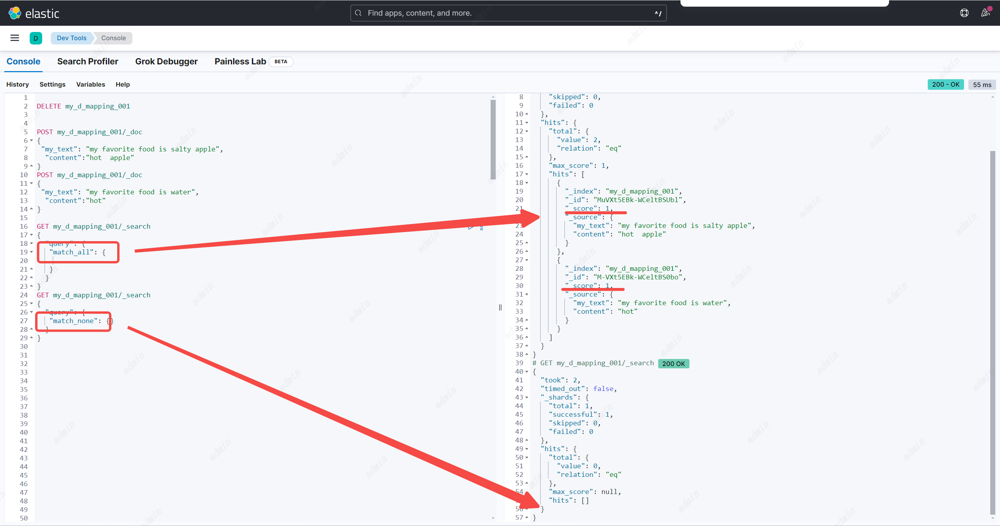
参数
1. `boost` ：选填。分数系数，默认1
