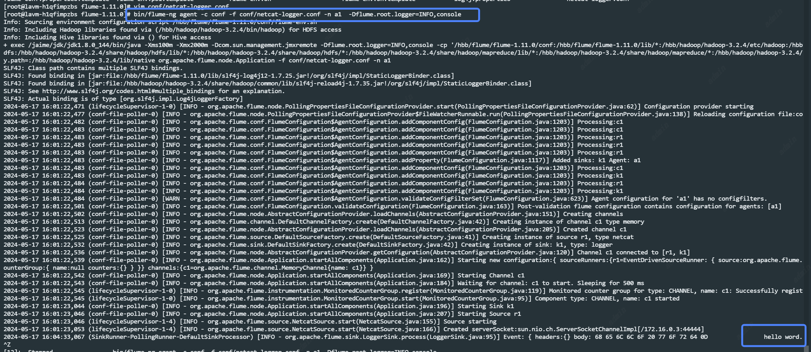
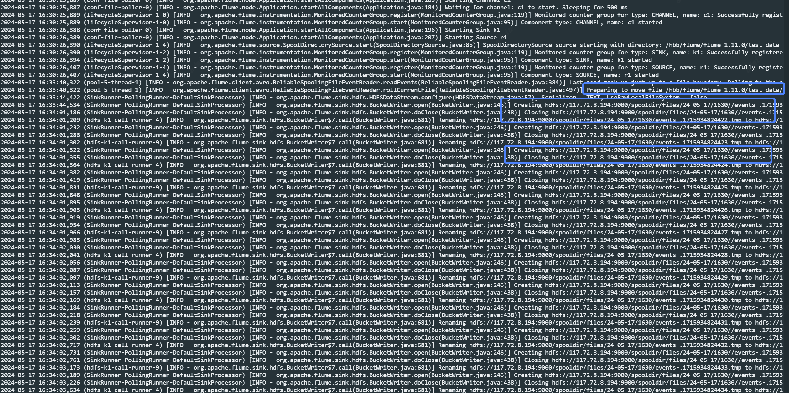
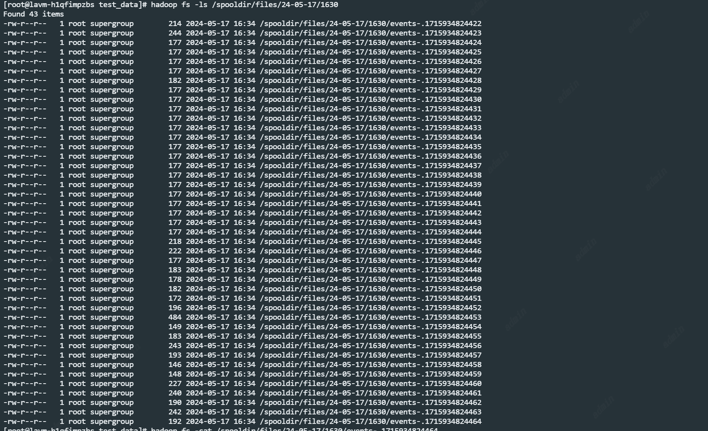

# Flume

## 部署
```aidl
# 下载
cd /hbb/flume;wget https://archive.apache.org/dist/flume/1.9.0/apache-flume-1.9.0-bin.tar.gz
# 解压
tar -zxvf apache-flume-1.9.0-bin.tar.gz -C /opt/module/;cd /opt/module/;ll
# 改名
mv apache-flume-1.9.0-bin/ flume-1.11.0;ll
# 删除guava-11.0.2.jar用来兼容Hadoop
cd lib;rm -rf flume-1.9.0/lib/guava-11.0.2.jar
```
### 修改文件，如下图
cd ../conf; vim log4j.properties
```aidl
flume.root.logger=INFO,LOGFILE
flume.log.dir=./logs
flume.log.file=flume.log
```
mv flume-env.sh.template flume-env.sh
vim flume-env.sh
```aidl
export JAVA_HOME=/jaime/jdk/jdk1.8.0_144
# Give Flume more memory and pre-allocate, enable remote monitoring via JMX
export JAVA_OPTS="-Xms100m -Xmx2000m -Dcom.sun.management.jmxremote"
```
### netcat网络数据采集
#### 安装telnet
```aidl
yum -y install telnet
```
#### 增加netcat采集配置文件
```aidl
cd  conf
vim   netcat-logger.conf
```
```aidl
# 定义这个agent中各组件的名字
a1.sources = r1
a1.sinks = k1
a1.channels = c1

# 描述和配置source组件：r1
a1.sources.r1.type = netcat
a1.sources.r1.bind = lavm-h1qfimpzbs
a1.sources.r1.port = 44444

# 描述和配置sink组件：k1
a1.sinks.k1.type = logger

# 描述和配置channel组件，此处使用是内存缓存的方式
a1.channels.c1.type = memory
a1.channels.c1.capacity = 1000
a1.channels.c1.transactionCapacity = 100

# 描述和配置source  channel   sink之间的连接关系
a1.sources.r1.channels = c1
a1.sinks.k1.channel = c1
```
#### 启动agent并指定配置文件netcat-logger.conf
```aidl
cd ..
bin/flume-ng agent -c conf -f conf/netcat-logger.conf -n a1  -Dflume.root.logger=INFO,console
```
#### 测试采集
发送数据
telnet  node03  44444   # 使用telnet模拟数据发送（接收不了中文）



### 日志数据采集到Hdfs
采集需求：某服务器的某特定目录下，会不断产生新的文件，每当有新文件出现，就需要把文件采集到HDFS中去
根据需求，首先定义以下3大要素
数据源组件，即source ——监控文件目录 : spooldir
spooldir特性：
1、监视一个目录，只要目录中出现新文件，就会采集文件中的内容
2、采集完成的文件，会被agent自动添加一个后缀：COMPLETED
3、所监视的目录中不允许重复出现相同文件名的文件
下沉组件，即sink——HDFS文件系统 : hdfs sink
通道组件，即channel——可用file channel 也可以用内存channel
flume配置文件开发
#### 配置文件编写
```aidl
cd  conf
vim spooldir.conf
```

```aidl
# name the components on this agent
# 如果需要采集多个文件夹下的数据，用空格分割 如 ”agent.sources = source1 source2“
a1.sources = r1
a1.sinks = k1
a1.channels = c1
# Describe/configure the source
##注意：不能往监控目中重复丢同名文件，否则挂了
a1.sources.r1.type = spooldir
## 要采集的目录
#是用来指定 Flume 的数据源（source）的类型的参数设置。具体来说，这个设置表示 r1 是一个 spooldir 类型的数据源。
#spooldir 是 Flume 提供的一种数据源类型，它用于监视一个目录（或多个目录），并将这些目录中的文件内容作为事件发送到 Flume 的通道（channel）中。当新的文件被创建或已有的文件被修改时，spooldir 数据源会自动检测到这些变化，并将文件内>容发送给 Flume 的通道进行后续处理。
a1.sources.r1.spoolDir = /hbb/flume/flume-1.11.0/test_data
#用于设置 Flume 数据源（source）的 fileHeader 参数的。具体而言，这个设置表示 r1 数据源将包含文件头信息。
a1.sources.r1.fileHeader = true
#
#
# Describe the sink
#
#
#用于指定 Flume 中的一个名为 k1 的 sink（数据目的地）的类型
a1.sinks.k1.type = hdfs
#用于指定 Flume 中的一个名为 k1 的 sink（数据目的地）将从名为 c1 的 channel（通道）接收数据。
a1.sinks.k1.channel = c1
#sink输出类型为hdsf相关配置：路径、前缀等
a1.sinks.k1.hdfs.path = hdfs://117.72.8.194:9000/spooldir/files/%y-%m-%d/%H%M/
a1.sinks.k1.hdfs.filePrefix = events-
a1.sinks.k1.hdfs.round = true
a1.sinks.k1.hdfs.roundValue = 10
a1.sinks.k1.hdfs.roundUnit = minute
a1.sinks.k1.hdfs.rollInterval = 3
a1.sinks.k1.hdfs.rollSize = 20
a1.sinks.k1.hdfs.rollCount = 5
a1.sinks.k1.hdfs.batchSize = 1
a1.sinks.k1.hdfs.useLocalTimeStamp = true
#生成的文件类型，默认是Sequencefile，可用DataStream，则为普通文本
a1.sinks.k1.hdfs.fileType = DataStream
# Use a channel which buffers events in memory
# channel配型 memory：放在内存 File ：保存在磁盘中 JDBC：放在数据库中  Kafka：放在kafka中  Spillable Memory：放在内存溢出后放在磁盘
a1.channels.c1.type = memory
a1.channels.c1.capacity = 1000
a1.channels.c1.transactionCapacity = 100
# Bind the source and sink to the channel
# 用于指定 Flume 中的一个名为 r1 的 source（数据输入）把数据输出到名为 c1 的 channel（通道）。
a1.sources.r1.channels = c1
```
Channel参数解释：
capacity：默认该通道中最大的可以存储的event数量
trasactionCapacity：每次最大可以从source中拿到或者送到sink中的event数量
keep-alive：event添加到通道中或者移出的允许时间
#### 启动
```aidl
cd ../
bin/flume-ng agent -c ./conf -f ./conf/spooldir.conf -n a1 -Dflume.root.logger=INFO,console
```
#### 模拟写入数据
模拟将数据写入到/hbb/flume/flume-1.11.0/test_data文件夹下
```aidl
vim test_data.txt
```
```aidl
Info: Sourcing environment configuration script /hbb/flume/flume-1.11.0/conf/flume-env.sh
Info: Including Hadoop libraries found via (/hbb/hadoop/hadoop-3.2.4/bin/hadoop) for HDFS access
Info: Including Hive libraries found via () for Hive access
+ exec /jaime/jdk/jdk1.8.0_144/bin/java -Xms100m -Xmx2000m -Dcom.sun.management.jmxremote -Dflume.root.logger=INFO,console -cp '/hbb/flume/flume-1.11.0/conf:/hbb/flume/flume-1.11.0/lib/*:/hbb/hadoop/hadoop-3.2.4/etc/hadoop:/hbbdfs:/hbb/hadoop/hadoop-3.2.4/share/hadoop/hdfs/lib/*:/hbb/hadoop/hadoop-3.2.4/share/hadoop/hdfs/*:/hbb/hadoop/hadoop-3.2.4/share/hadoop/mapreduce/lib/*:/hbb/hadoop/hadoop-3.2.4/share/hadoop/mapreduce/*:/hbb/hadoop/hadoop-3.2.4/y.path=:/hbb/hadoop/hadoop-3.2.4/lib/native org.apache.flume.node.Application -f ./conf/jaimes.conf -n a1
SLF4J: Class path contains multiple SLF4J bindings.
SLF4J: Found binding in [jar:file:/hbb/flume/flume-1.11.0/lib/slf4j-log4j12-1.7.25.jar!/org/slf4j/impl/StaticLoggerBinder.class]
SLF4J: Found binding in [jar:file:/hbb/hadoop/hadoop-3.2.4/share/hadoop/common/lib/slf4j-reload4j-1.7.35.jar!/org/slf4j/impl/StaticLoggerBinder.class]
SLF4J: See http://www.slf4j.org/codes.html#multiple_bindings for an explanation.
SLF4J: Actual binding is of type [org.slf4j.impl.Log4jLoggerFactory]
2024-05-17 16:30:25,799 (lifecycleSupervisor-1-0) [INFO - org.apache.flume.node.PollingPropertiesFileConfigurationProvider.start(PollingPropertiesFileConfigurationProvider.java:62)] Configuration provider starting
2024-05-17 16:30:25,804 (conf-file-poller-0) [INFO - org.apache.flume.node.PollingPropertiesFileConfigurationProvider$FileWatcherRunnable.run(PollingPropertiesFileConfigurationProvider.java:138)] Reloading configuration file:./
2024-05-17 16:30:25,810 (conf-file-poller-0) [INFO - org.apache.flume.conf.FlumeConfiguration$AgentConfiguration.addComponentConfig(FlumeConfiguration.java:1203)] Processing:k1
2024-05-17 16:30:25,811 (conf-file-poller-0) [INFO - org.apache.flume.conf.FlumeConfiguration$AgentConfiguration.addComponentConfig(FlumeConfiguration.java:1203)] Processing:k1
2024-05-17 16:30:25,811 (conf-file-poller-0) [INFO - org.apache.flume.conf.FlumeConfiguration$AgentConfiguration.addComponentConfig(FlumeConfiguration.java:1203)] Processing:c1
2024-05-17 16:30:25,811 (conf-file-poller-0) [INFO - org.apache.flume.conf.FlumeConfiguration$AgentConfiguration.addComponentConfig(FlumeConfiguration.java:1203)] Processing:r1
2024-05-17 16:30:25,811 (conf-file-poller-0) [INFO - org.apache.flume.conf.FlumeConfiguration$AgentConfiguration.addProperty(FlumeConfiguration.java:1117)] Added sinks: k1 Agent: a1
2024-05-17 16:30:25,811 (conf-file-poller-0) [INFO - org.apache.flume.conf.FlumeConfiguration$AgentConfiguration.addComponentConfig(FlumeConfiguration.java:1203)] Processing:k1
2024-05-17 16:30:25,811 (conf-file-poller-0) [INFO - org.apache.flume.conf.FlumeConfiguration$AgentConfiguration.addComponentConfig(FlumeConfiguration.java:1203)] Processing:k1
2024-05-17 16:30:25,812 (conf-file-poller-0) [INFO - org.apache.flume.conf.FlumeConfiguration$AgentConfiguration.addComponentConfig(FlumeConfiguration.java:1203)] Processing:k1
2024-05-17 16:30:25,812 (conf-file-poller-0) [INFO - org.apache.flume.conf.FlumeConfiguration$AgentConfiguration.addComponentConfig(FlumeConfiguration.java:1203)] Processing:k1
2024-05-17 16:30:25,812 (conf-file-poller-0) [INFO - org.apache.flume.conf.FlumeConfiguration$AgentConfiguration.addComponentConfig(FlumeConfiguration.java:1203)] Processing:r1
2024-05-17 16:30:25,812 (conf-file-poller-0) [INFO - org.apache.flume.conf.FlumeConfiguration$AgentConfiguration.addComponentConfig(FlumeConfiguration.java:1203)] Processing:k1
2024-05-17 16:30:25,812 (conf-file-poller-0) [INFO - org.apache.flume.conf.FlumeConfiguration$AgentConfiguration.addComponentConfig(FlumeConfiguration.java:1203)] Processing:k1
2024-05-17 16:30:25,812 (conf-file-poller-0) [INFO - org.apache.flume.conf.FlumeConfiguration$AgentConfiguration.addComponentConfig(FlumeConfiguration.java:1203)] Processing:r1
2024-05-17 16:30:25,812 (conf-file-poller-0) [INFO - org.apache.flume.conf.FlumeConfiguration$AgentConfiguration.addComponentConfig(FlumeConfiguration.java:1203)] Processing:c1
2024-05-17 16:30:25,814 (conf-file-poller-0) [INFO - org.apache.flume.conf.FlumeConfiguration$AgentConfiguration.addComponentConfig(FlumeConfiguration.java:1203)] Processing:r1
2024-05-17 16:30:25,814 (conf-file-poller-0) [INFO - org.apache.flume.conf.FlumeConfiguration$AgentConfiguration.addComponentConfig(FlumeConfiguration.java:1203)] Processing:k1
2024-05-17 16:30:25,814 (conf-file-poller-0) [INFO - org.apache.flume.conf.FlumeConfiguration$AgentConfiguration.addComponentConfig(FlumeConfiguration.java:1203)] Processing:k1
2024-05-17 16:30:25,814 (conf-file-poller-0) [INFO - org.apache.flume.conf.FlumeConfiguration$AgentConfiguration.addComponentConfig(FlumeConfiguration.java:1203)] Processing:k1
2024-05-17 16:30:25,814 (conf-file-poller-0) [INFO - org.apache.flume.conf.FlumeConfiguration$AgentConfiguration.addComponentConfig(FlumeConfiguration.java:1203)] Processing:k1
2024-05-17 16:30:25,814 (conf-file-poller-0) [INFO - org.apache.flume.conf.FlumeConfiguration$AgentConfiguration.addComponentConfig(FlumeConfiguration.java:1203)] Processing:c1
2024-05-17 16:30:25,814 (conf-file-poller-0) [INFO - org.apache.flume.conf.FlumeConfiguration$AgentConfiguration.addComponentConfig(FlumeConfiguration.java:1203)] Processing:k1
```

#### 查看hdfs数据

```aidl
[root@lavm-h1qfimpzbs test_data]# hadoop fs -cat /spooldir/files/24-05-17/1630/events-.1715934824464
2024-05-17 16:30:26,407 (lifecycleSupervisor-1-4) [INFO - org.apache.flume.instrumentation.MonitoredCounterGroup.start(MonitoredCounterGroup.java:95)] Component type: SOURCE, name: r1 started
```
### 日志数据采集到Kafka本根据文件名称发送到对应的Topic
https://blog.csdn.net/qinqinde123/article/details/128131260?utm_medium=distribute.pc_relevant.none-task-blog-2~default~baidujs_baidulandingword~default-0-128131260-blog-133811979.235^v43^pc_blog_bottom_relevance_base2&spm=1001.2101.3001.4242.1&utm_relevant_index=3


## 引发问题
### 小文件过多问题
可以从接入到hdfs的数据文件看出，数据写入到hdfs后产生了很多小文件，每个文件只有一行数据。在真实生产中，过多的小文件会给HDFS带来额外的开销，营销存储和计算效率。
1. 要是要对小文件进行计算,那么hdfs中每一个小文件都会对应生成一个task,而每一个task的形成和计算都会占用一定的资源和启停时间,影响计算效率
2. nn中要记录dn中存储的数据索引,小文件过多会生产很多记录占用nn内对应的容量,影响nn的寿命
#### 解决方案
1. 在flume的-f 对象conf中,设置sink的相关参数可以改善这种情况
```aidl
#实例a1,k1,具体情况具体更改
#表示每隔多少秒，Flume就会将内部的缓冲区数据写入HDFS。即文件创建超多少秒时会滚动生成新文件
a1.sinks.k1.hdfs.rollInterval
 
#表示当Flume的内部缓冲区达到指定字节数时，就会触发写入操作。 即文件在达到多少个字节时会滚动生成新文件
a1.sinks.k1.hdfs.rollSize
 
#表示不论内部缓冲区的大小或时间，当写入的文件数量达到指定数量时，就会触发滚动操作。即当event个数达到多少个的时候会滚动生成新文件
a1.sinks.k1.hdfs.rollCount
```
```aidl
#示例
a1.sinks.k1.hdfs.rollInterval = 10
a1.sinks.k1.hdfs.rollSize = 134217728
a1.sinks.k1.hdfs.rollCount = 0
 
#这里将时间改为10秒(rollInterval的单位是秒)提交一次,
#rollSize设置为128M(rollSize单位是字节bytes)贴合我的分块大小,
#预期是每满128M数据就提交一次,但是为了防止可能最后的数据不够128M,
#一直提交不了,设置了10秒(根据情况,我的10s差不多就能满128M)解决这个问题,
#rollCount设为0表示关闭指定数量触发滚动的机制,是为了防止又出现文件数大小特别小且数量多的小文件情况
```
2. 写shell等脚本或者MR任务对小文件进行合并
