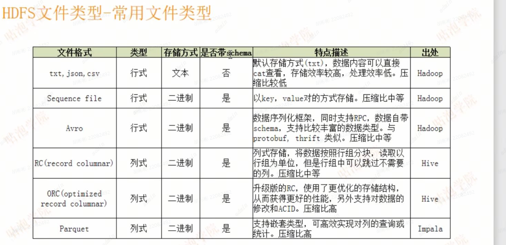
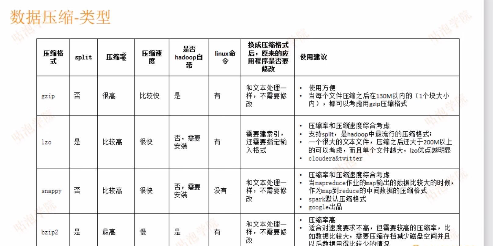
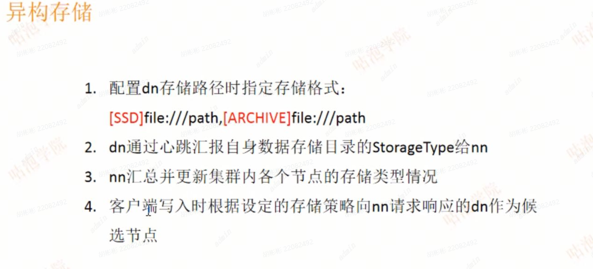
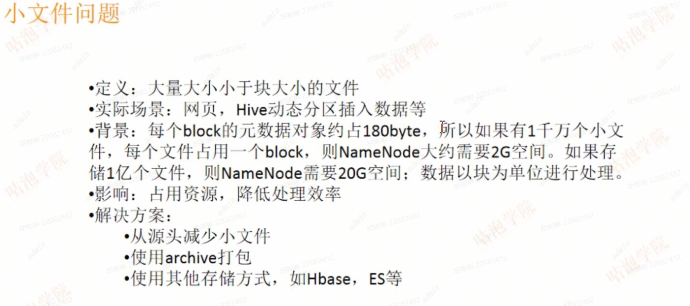
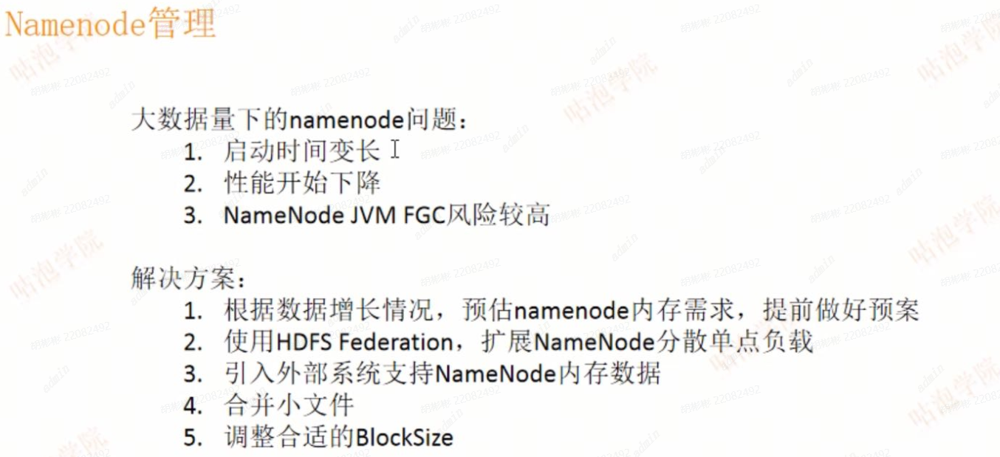

# HDFS1

文件存储系统，支持顺序写入而不是随机定位读写

设计目标：

1. 存储超大文件

适合存储大文件，单个文件通常百MB以上

适合存储海量文件，总量PB、EB以上

2. 硬件容错
3. 流式数据访问
4. 简单的一致性模型

一次写入，多次读取

一个文件经过创建、写入、关闭后就不需要修改

5. 本地计算

版本

0.x-1.x

hdfs、mapreduce

2.x（主流版本）

hdfs（namenode支持ha）、mapreduce、yarn

3.x

hdfs（namenode支持ha）、mapreduce、yarn


namenode

作用

在内存中保存着整个文件系统的namespace和数据块的地址映射（BlockMap）。

整个HDFS可存储的文件数受**限于NameNode的内存大小**

```
NameNode负责：文件元数据信息的操作以及处理客户端的请求
NameNode管理：HDFS文件系统的命名空间NameSpace。
NameNode维护：文件系统树（FileSystem）以及文件树中所有的文件和文件夹的元数据信息（matedata） 
        维护文件到块的对应关系和块到节点的对应关系
NameNode文件：namespace镜像文件（fsimage），操作日志文件（edit log）
        这些信息被Cache在RAM中，当然这两个文件也会被持久化存储在本地硬盘。
NameNode记录：每个文件中各个块所在的数据节点的位置信息。
        但它并不永久保存块的位置信息，因为这些信息在系统启动时由数据节点重建。
        从数据节点重建：在nameNode启动时，DataNode向NameNode进行注册时发送给NameNode

```

1. fsimage：元数据镜像文件。就是将内存中的元数据信息保存到磁盘，需要的时候就再从磁盘读取出来到内存。
2. edits：操作hdfs的日志文件
3. fstime：保存最后一次的还原点时间


思考

1. 数据块的复制策略？

```
 默认的副本数
HDFS默认的数据复制副本数为3，即每个块会被复制到3个DataNode上。这个默认值可以在配置文件中进行修改，以适应不同的应用场景。

 副本放置策略
HDFS会根据一定的策略将块的副本放置在不同的DataNode上。通常，一个副本会被放置在与它最近的DataNode上，而另外两个副本则会被放置在不同的机架上的DataNode上，以防止某一个机架发生故障。

 副本调度策略
HDFS会定期检查每个块的副本数是否达到预设的值，如果某个块的副本数小于预设值，HDFS会自动将缺少的副本复制到其他DataNode上。副本调度策略可以保证数据的冗余和可靠性。

 副本删除策略
HDFS会定期检查块的副本数是否超过预设值，如果超过了预设值，HDFS会自动删除多余的副本，以释放存储空间。副本删除策略可以保证数据的存储空间利用率。
```


2. 调整块大小会造成哪些影响？

- 影响寻址时间，块越大寻址时间越短，但磁盘传输时间越长

```
如果块设置过大，

一方面，从磁盘传输数据的时间会明显大于寻址时间，导致程序在处理这块数据时，变得非常慢；

另一方面，mapreduce中的map任务通常一次只处理一个块中的数据，如果块过大运行速度也会很慢。

如果块设置过小，

一方面存放大量小文件会占用NameNode中大量内存来存储元数据，而NameNode的内存是有限的，不可取；

另一方面文件块过小，寻址时间增大，导致程序一直在找block的开始位置。

因而，块适当设置大一些，减少寻址时间，那么传输一个由多个块组成的文件的时间主要取决于磁盘的传输速率。
```


3. namenode启动过程？

- 从fsimage中元数据信息加载到内存中构建目录树结构
- 将editlog文件加载到内存，使当前内存中元数据信息与上次关闭系统时保持一致
- 启动datanode
- 向namenode注册
- 向namenode发送blockreport


4. namenodeHA（高可用）方案

- 第一种：将数据持久化到本地磁盘并写入到远程挂载的网络系统中（NFS）
- 第二种：启动一个备用Secondary Namenode，并在两个 namenode节点所在的机器上安装一个zk，并检测namenode存活情况，然后抢占注册到zk主节点上，抢占成功的作为主namenode，如果主namenode挂了，其他的namenode继续抢占


5. secondary namenode的作用？

- 协助namenode定期将edits上的数据合并写入fsimage文件，将生成的新的fsimage数据文件替换原来老的fsimage文件

```
它会每隔一段时间（默认是30分钟）去询问一次namenode，看看是否需要合并（checkpoint），当namenode上的操作日志文件大到一定的时候会告诉secondaryNamenode需要合并。 
```

- 当主namenode挂了可以继续工作，增加HDFS的高可用


6. 如何扩展HDFS存储的容量

- 增加namespace内存
- 增加datanode节点

# HDFS2

存储格式




存储类型分：行式和列式

列式的优点：做统计速度快


类型指定

Alter table table_nameSETFILEFORMATPA PARQUET;

Create table table_name (x INT,y STRING) STORED AS PARQUET;

SET hive.default.fileformat=Orc


数据压缩类型



数据压缩使用场景

1. HDFS命令行写入：将数据压缩后写入
2. Flume写入：写入时指定hdfs.cideC参数
3. Sqoop写入：写入时执行参数
4. Hbase数据存储：创建表时指定
5. MapReduce中间结果和最终结果
6. Hive中间结果和最终结果
7. Spark（RDD分区、广播变量、shuffle输出）

数据压缩使用建议

1. 是否支持切分
2. 压缩率和压缩速度

什么时候使用：存储（磁盘空间利用率）和计算（传出速度）

纠删码

复制策略：1tb的数据，需要3tb的磁盘空间

纠删码：只需要复制策略50%的磁盘空间，而且同样可以保证数据的可靠性


纠删码使用

```
[root@hadoop01 ~]# hdfs ec 
Usage: bin/hdfs ec [COMMAND]
          [-listPolicies]
          [-addPolicies -policyFile <file>]
          [-getPolicy -path <path>]
          [-removePolicy -policy <policy>]
          [-setPolicy -path <path> [-policy <policy>] [-replicate]]  //设置某个路径下的数据都用这种纠删码策略
          [-unsetPolicy -path <path>]
          [-listCodecs]
          [-enablePolicy -policy <policy>]
          [-disablePolicy -policy <policy>]
          [-verifyClusterSetup [-policy <policy>...<policy>]]
          [-help <command-name>]


[root@hadoop01 ~]# hdfs ec -listPolicies                                                                                                                                                                                                                                                                                                                                
Erasure Coding Policies:                                                                                                                                                                                                                  # Name：RS实现算法 10个原始数据块  4个冗余块                                                                                                                        
ErasureCodingPolicy=[Name=RS-10-4-1024k, Schema=[ECSchema=[Codec=rs, numDataUnits=10, numParityUnits=4]], CellSize=1048576, Id=5], State=DISABLED                                                                                                                                                                                                                       
ErasureCodingPolicy=[Name=RS-3-2-1024k, Schema=[ECSchema=[Codec=rs, numDataUnits=3, numParityUnits=2]], CellSize=1048576, Id=2], State=DISABLED                                                                                                                                                                                                                         
ErasureCodingPolicy=[Name=RS-6-3-1024k, Schema=[ECSchema=[Codec=rs, numDataUnits=6, numParityUnits=3]], CellSize=1048576, Id=1], State=ENABLED                                                                                                                                                                                                                          
ErasureCodingPolicy=[Name=RS-LEGACY-6-3-1024k, Schema=[ECSchema=[Codec=rs-legacy, numDataUnits=6, numParityUnits=3]], CellSize=1048576, Id=3], State=DISABLED                                                                                                                                                                                                           
ErasureCodingPolicy=[Name=XOR-2-1-1024k, Schema=[ECSchema=[Codec=xor, numDataUnits=2, numParityUnits=1]], CellSize=1048576, Id=4], State=DISABLED 
```

纠删码使用建议（需要减少存储空间时候才使用）

1. 某些冷门数据以纠删码方式存储（因为存储性能比较低

异构存储



异构存储使用

```
[root@hadoop01 ~]# hdfs storagepolicies
Usage: bin/hdfs storagepolicies [COMMAND]
          [-listPolicies]
          [-setStoragePolicy -path <path> -policy <policy>] //设置某个路径下的数据都用这种异构存储
          [-getStoragePolicy -path <path>]
          [-unsetStoragePolicy -path <path>]
          [-help <command-name>]

[root@hadoop01 ~]# hdfs storagepolicies -listPolicies
Block Storage Policies:
        BlockStoragePolicy{COLD:2, storageTypes=[ARCHIVE], creationFallbacks=[], replicationFallbacks=[]}
        BlockStoragePolicy{WARM:5, storageTypes=[DISK, ARCHIVE], creationFallbacks=[DISK, ARCHIVE], replicationFallbacks=[DISK, ARCHIVE]}
        BlockStoragePolicy{HOT:7, storageTypes=[DISK], creationFallbacks=[], replicationFallbacks=[ARCHIVE]}
        BlockStoragePolicy{ONE_SSD:10, storageTypes=[SSD, DISK], creationFallbacks=[SSD, DISK], replicationFallbacks=[SSD, DISK]}
        BlockStoragePolicy{ALL_SSD:12, storageTypes=[SSD], creationFallbacks=[DISK], replicationFallbacks=[DISK]}
        BlockStoragePolicy{LAZY_PERSIST:15, storageTypes=[RAM_DISK, DISK], creationFallbacks=[DISK], replicationFallbacks=[DISK]}          

```

异构存储使用建议

1. 一般默认策略（HOT、磁盘）即可
2. ARCHIVE：计算能力弱。存储密度高、冷数据
3. SSD：内存形，费用高，速度快

小文件问题



解决方案：

1. 从源头上减少小文件：指定分区，或存放之前将数据进行整合、压缩
2. 使用archive打包，将数据整合 （命令：hadoop achive ）访问时无需解压
3. 使用其他方式存储：Hbase、ES等

NameNode管理问题



解决方案：

1. 提前预估好namenode内存需求：

```
文件元数据对象约占200byte。block元数据约占180byte：
总内存=198*num(Diretory+files)+176*num(blocks)+2%*其他总内存
```

2. 使用HDFS Federation，扩展NameNode分散单点负载

3. 引入外部系统支持NN内存数据

4. 合并小文件

5. 调整合适的BlockSize（不经常用，BlockSize小导致块增加）

数据迁移

场景：

1. 冷热数据迁移
2. 集群升级、维护

方案：

1. hadoop distcp 命令

数据平衡

原因：长时间运行的集群增删节点、节点增删磁盘等

影响：

1. 跨界点拷贝数据
2. task有失败的风险（磁盘占用90%以上）
3. 磁盘路利用不均

方案

1. 集群节点间：hdfs balancer命令

```
[root@hadoop01 ~]# hdfs balancer --help
Usage: hdfs balancer
        [-policy <policy>]      the balancing policy: datanode or blockpool  平衡策略
        [-threshold <threshold>]        Percentage of disk capacity  每个dataNode空间占用与整体（所有的dataNode）空间占用的差值不超过的阈值（不建议太小，不然会耗费性能调节平衡）
        [-exclude [-f <hosts-file> | <comma-separated list of hosts>]]  Excludes the specified datanodes.
        [-include [-f <hosts-file> | <comma-separated list of hosts>]]  Includes only the specified datanodes. 执行balance的dataNode列表
        [-source [-f <hosts-file> | <comma-separated list of hosts>]]   Pick only the specified datanodes as source nodes.
        [-blockpools <comma-separated list of blockpool ids>]   The balancer will only run on blockpools included in this list.
        [-idleiterations <idleiterations>]      Number of consecutive idle iterations (-1 for Infinite) before exit.
        [-runDuringUpgrade]     Whether to run the balancer during an ongoing HDFS upgrade.This is usually not desired since it will not affect used space on over-utilized machines.
```


2. 单节点磁盘间： hdfs diskbalancer命令


