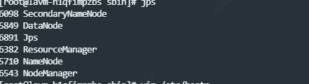
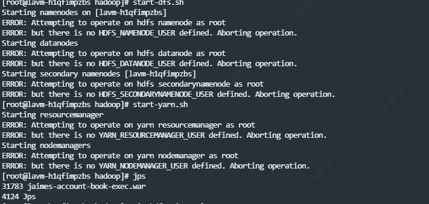
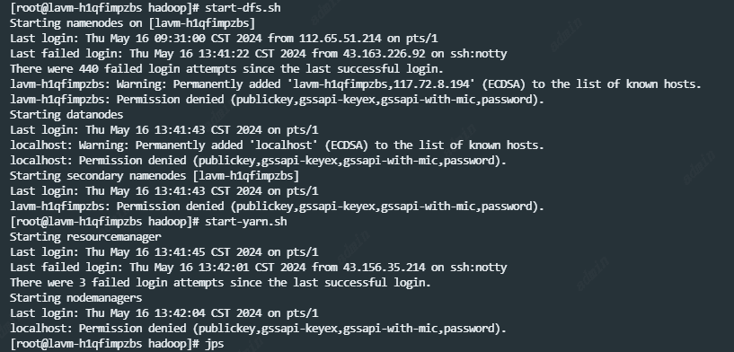
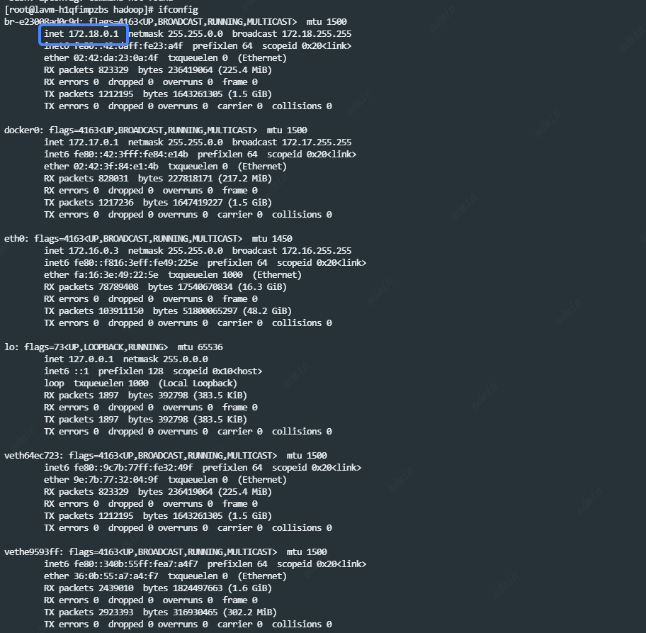

I、安装jdk

1、下载jdk1.8

```
wget --no-cookies --no-check-certificate --header "Cookie: gpw_e24=http%3A%2F%2Fwww.oracle.com%2F; oraclelicense=accept-securebackup-cookie" "http://download.oracle.com/otn-pub/java/jdk/8u141-b15/336fa29ff2bb4ef291e347e091f7f4a7/jdk-8u141-linux-x64.tar.gz"
```

2、解压jdk

```
tar xzf jdk-8u141-linux-x64.tar.gz
```

3、配置jdk

①建议将jdk放在/usr/local环境下

```
mkdir /usr/local/java
mv jdk1.8.0_141 /usr/local/javavi /etc/profile
```

②编辑环境文件

```
vi /etc/profile
(如果不会使用vi，可以yum install vim即可，上述命令改为vim /etc/profile)
```

插入下列三行

```
export JAVA_HOME=/usr/local/java/jdk1.8.0_141
export PATH=$JAVA_HOME/bin:$PATH
export CLASSPATH=.:$JAVA_HOME/lib/dt.jar:$JAVA_HOME/lib
```

退出后，source一下，覆盖旧的环境配置

```
source /etc/profile
```

别忘记在终端输入：java，如果出现一堆说明就是成功了，如果没出现，就找一下问题

II、安装hadoop2.7.7

1、下载hadoop2.7

```
wget  --no-cookies --no-check-certificate https://mirrors.tuna.tsinghua.edu.cn/apache/hadoop/common/hadoop-2.7.7/hadoop-2.7.7.tar.gz
```

2、解压hadoop

```
tar xzf hadoop-2.7.7.tar.gz
```

3、配置hadoop

①同样也是放到/usr/local中

```
#先创建hadoop文件夹
mkdir /usr/local/hadoop
mv hadoop-2.7.7 /usr/local/hadoop
```

②编辑配置文件


```
vim /etc/profile
#插入下面三行文件
export HADOOP_HOME=/usr/local/hadoop/hadoop-2.7.7
export PATH=$PATH:$HADOOP_HOME/sbin  
export PATH=$PATH:$HADOOP_HOME/bin#退出并保存
```


③source一下

```
source /etc/profile
```

同上，最后输入：hadoop，如果出现一堆说明就是成功了

III、安装mysql（这一步大家根据自己的情况安装，本人因为要用到mysql）

1、网上教程很多，我就不细细说明了


```
#添加mysql源
wget http://repo.mysql.com/mysql-community-release-el7-5.noarch.rpm
rpm -ivh mysql-community-release-el7-5.noarch.rpm
#下载安装mysql
yum install mysql-server
#更改mysql权限
chown root /var/lib/mysql/
service mysqld restart
#进入mysql并且修改密码
mysql -u root
use mysql;
update user set password=password('123456') where user='root';

#开启远程访问权限
GRANT ALL PRIVILEGES ON *.* TO root@"%" IDENTIFIED BY "123456";
flush privileges;
```


IV、配置hadoop文件(这里需要注意，根据你安装的是单机还是伪分布式，还是分布式，配置均不同)

本人搭建两机分布式

1、ssh免密登录

因为不想每一次启动都需要连上所有客户机，手动开启hadoop，因此开启ssh免密登录

（开启免密登录服务的时候会生成一个公钥文件，将该公钥文件给予需要连接的主机，然后改机再给予本机一个公钥，这样两机互联就不需要密码了）


```
#免密登录
ssh-keygen -t rsa -P '' -f ~/.ssh/id_rsa
cat ~/.ssh/id_rsa.pub >> ~/.ssh/authorized_keys
chmod 0600 ~/.ssh/authorized_keys

#开启成功
ssh localhost
#选择yes即可

#将自己生成的公钥赋权给其他主机
ssh-copy-id -i ~/.ssh/id_rsa.pub root@x.x.x.x

#yes，并输入密码后，就okl
```


2、修改hosts

通常我们不论是主机还是虚拟机默认用户名都是乱七八糟的，因此需要进行统一，这样我们容易分辨节点

```
#修改命令
hostnamectl set-hostname  xxx(新的主机名)

#重新连接
ssh localhost
```

同理，为了方便我们在配置文件中引入不同主机节点，需要将不同ip的主机以相同格式命名


```
#编辑hosts文件
vim /etc/hosts

#添加下列
X.X.X(本机ip)  servera
X.X.X(其他主机ip) serverb  （单节点无需填写）
```


3、hadoop正常启动总共需要修改6个配置文件，均在hadoop-2.7.7/etc/hadoop目录下，分别是hadoop-env.sh、 slaves、[core-site.xml](http://hadoop.apache.org/docs/r2.6.0/hadoop-project-dist/hadoop-common/core-default.xml)、[hdfs-site.xml](http://hadoop.apache.org/docs/r2.6.0/hadoop-project-dist/hadoop-hdfs/hdfs-default.xml)、[mapred-site.xml](http://hadoop.apache.org/docs/r2.6.0/hadoop-mapreduce-client/hadoop-mapreduce-client-core/mapred-default.xml)、[yarn-site.xml](http://hadoop.apache.org/docs/r2.6.0/hadoop-yarn/hadoop-yarn-common/yarn-default.xml) 。

①修改hadoop-env.sh配置文件


```
#编辑配置文件
vim /usr/local/hadoop/hadoop-2.7.7/etc/hadoop/hadoop-env.sh
#添加自己配置好的jdk环境
export JAVA_HOME=/usr/local/java/jdk1.8.0_141
export HADOOP_CONF_DIR=/usr/local/hadoop/hadoop-2.7.7/etc/hadoop
#source一下
source hadoop-env.sh
```

②、配置slaves文件（单节点无需步骤）

```
#编辑slaves文件vim /usr/local/hadoop-2.7.7/etc/hadoop/slaves
#添加2个节点（删除原先内容）
serverb 
```

③、配置core-site.xml文件

这个是核心配置文件，所以也是全局配置文件，如使用Hadoop实例分配给文件系统的存储器，用于存储数据的内存限制的端口号，以及读/写缓冲器的大小。


```
#编辑core-site.xml文件
vim core-site.xml

#添加下面几行
<--!分别表示dfs默认端口和临时文件存储-->
<configuration>
    <property>
       <name>fs.defaultFS</name>
       <value>hdfs://servera:9000</value>
    </property>
    <property>
       <name>hadoop.tmp.dir</name>
       <value>/usr/local/hadoop/hadoop_data/tmp</value>
    </property>
</configuration>
```


④、修改hdfs-site.xml配置文件

顾名思义，就是hdfs文件系统的配置文件


```
#编辑hdfs-site.xml配置文件
vim hdfs-site.xml

#添加下面几行
<configuration>
    <property>
      <name>dfs.namenode.secondary.http-address</name>
      <value>servera:50090</value>
    </property>
    <property>
      <name>dfs.replication</name>
      <!-单节点配置1->
      <value>2</value> 
    </property>
    <property>
      <name>dfs.namenode.name.dir</name>
      <value>/usr/local/hadoop/hadoop_data/hdfs/name</value>
    </property>
    <property>
      <name>dfs.datanode.data.dir</name>
      <value>/usr/local/hadoop/hadoop_data/hdfs/data</value>
    </property>
</configuration>
```


⑤、修改mapred-site.xml配置文件[

](http://hadoop.apache.org/docs/r2.6.0/hadoop-mapreduce-client/hadoop-mapreduce-client-core/mapred-default.xml)

这里注意，源文件夹没有该配置文件，只有模板文件mapred-site.xml.template，所以复制一下就行


```
#从模板文件复制过来
cp mapred-site.xml.template mapred-site.xml 

#编辑配置文件
vim mapred-site.xml

#加入下面几行
<configuration>
  <property>
    <name>mapreduce.framework.name</name>
    <value>yarn</value>
  </property>
  <property>
          <name>mapreduce.jobhistory.address</name>
          <value>servera:10020</value>
  </property>
  <property>
          <name>mapreduce.jobhistory.address</name>
          <value>servera:19888</value>
  </property>
</configuration>
```


⑥、修改yarn-site.xml配置文件


```
#编辑配置文件
vim yarn-site.xml

#添加下面这几行
<configuration>
     <property>
          <name>yarn.nodemanager.aux-services</name>
          <value>mapreduce_shuffle</value>
     </property>
     <property>
           <name>yarn.resourcemanager.address</name>
           <value>servera:8032</value>
     </property>
     <property>
          <name>yarn.resourcemanager.scheduler.address</name>
          <value>servera:8030</value>
      </property>
     <property>
         <name>yarn.resourcemanager.resource-tracker.address</name>
         <value>servera:8031</value>
     </property>
     <property>
         <name>yarn.resourcemanager.admin.address</name>
         <value>servera:8033</value>
     </property>
     <property>
         <name>yarn.resourcemanager.webapp.address</name>
         <value>servera:8088</value>
     </property>
</configuration>
```


⑦、最后还要添加slaves

```
#编辑slaves文件
vim slaves

#删掉原先内容，加入子节点
serverb
```

这里注意，对于其他主机（如serverb），需要将上述所有操作在其他主机上重复一遍hadoop不需要重新下载和配置，直接copy过去即可

```
scp -r /usr/local/hadoop/hadoop-2.7.7 root@serverb:/usr/local/hadoop
```

V、启动hadoop

第一步，在servera上先格式化一下

```
hdfs namenode -format  
```

第二步，启动hadoop


```
#执行下面命令
start-dfs.sh 
start-yarn.sh 

#输入jps，看看是否启动成功
jps
```


如果成功则出现以下几个进程，表示安装成功



如果出现以下问题：
1. 

需要修改vim hdfs-site.xml 副本数改为1
2. 


```aidl
# 执行以下命令，然后连续点三下回车生成SSH密匙对
ssh-keygen -t rsa
# 创建authorized_keys文件并修改权限为600
cd 
cd .ssh
touch authorized_keys
chmod 600 authorized_keys
# 将公钥追加到authorized_keys文件中去
cat id_rsa.pub >> authorized_keys

```
3. resourceManager启动不起来

检查配置的/etc/hosts，如果配置的是外网ip，改成内网ip

```aidl
127.0.0.1   localhost localhost.localdomain localhost4 localhost4.localdomain4
::1         localhost localhost.localdomain localhost6 localhost6.localdomain6
## 必须配置内网ip
172.18.0.1 lavm-h1qfimpzbs
```
