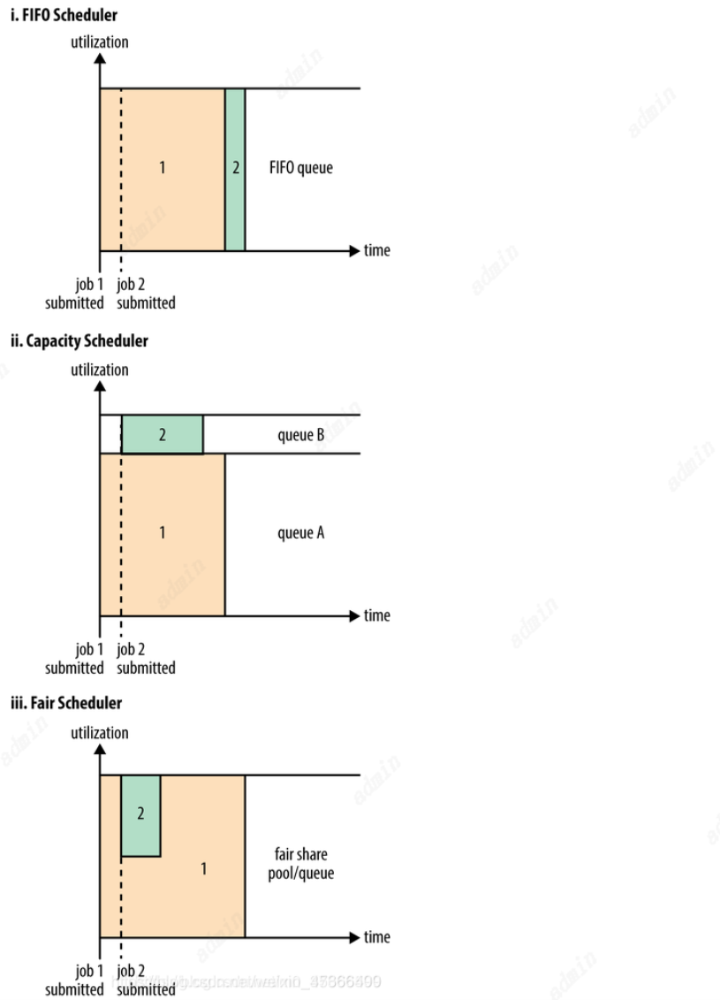
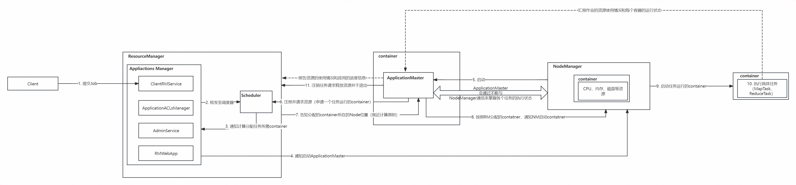

# Yarn

## 主要组件

### Resource Manager

- 处理客户端请求
- 启动/监控ApplicationMaster
- 监控NodeManager
- 所有资源分配与调度

ResourceManager（RM）是一个全局的资源管理器，负责整个系统的资源管理和分配，主要包括两个组件，即调度器（Scheduler）和应用程序管理器（Applications Manager）。

调度器接收来自ApplicationMaster的应用程序资源请求，把集群中的资源以“容器”的形式分配给提出申请的应用程序，容**器的选择通常会考虑应用程序所要处理的数据的位置，进行就近选择，从而实现“计算向数据靠拢”**。

容器（Container）作为动态资源分配单位，每个容器中都封装了一定数量的CPU、内存、磁盘等资源，从而限定每个应用程序可以使用的资源量。

调度器被设计成是一个可插拔的组件，YARN不仅自身提供了许多种直接可用的调度器，也允许用户根据自己的需求重新设计调度器。

应用程序管理器（Applications Manager）负责系统中所有应用程序的管理工作，主要包括应用程序提交、与调度器协商资源以启动ApplicationMaster、监控ApplicationMaster运行状态并在失败时重新启动等。

#### Scheduler

在 Yarn 中有三种调度器可以选择：**FIFO Scheduler ，Capacity Scheduler，Fair Scheduler**

**FIFO Scheduler（先进先出调度器）：** 把应用按提交的顺序排成一个队列，这是一个先进先出队列，在进行资源分配的时候，先给队列中最头上的应用进行分配资源，待最头上的应用需求满足后再给下一个分配，以此类推

工作方法：

- 单队列
- 先进先出原则

**Capacity Scheduler（容器调度器）**： 调度器允许多个组织共享整个集群，每个组织可以获得集群的一部分计算能力。通过为每个组织分配专门的队列，然后再为每个队列分配一定的集群资源，这样整个集群就可以通过设置多个队列的方式给多个组织提供服务了。除此之外，队列内部又可以垂直划分，这样一个组织内部的多个成员就可以共享这个队列资源了，在一个队列内部，资源的调度是采用的是先进先出(FIFO)策略。

工作方法：

- 多队列
- 资源使用量最小、优先级高的先执行
- 在多用户的情况下，可以最大化集群的吞吐量和利用率

**Fair Scheduler（公平调度器）：** 针对不同的应用（也可以为用户或用户组），每个应用属于一个队列，主旨是让每个应用分配的资源大体相当。（当然可以设置权重），若是只有一个应用，那集群所有资源都是他的。和 Capacity的区别是不需要预留资源 。适用情况：共享大集群、队列之间有较大差别。

工作方法：

- 多队列
- 公平调度，所有任务具有相同的资源

### Node Manager

- 单个节点上的资源管理
- 处理来自ResourceManger的命令
- 处理来自ApplicationMaster的命令

NodeManager是驻留在一个YARN集群中的每个节点上的代理，主要负责：

（1）容器生命周期管理。
（2）监控每个容器的资源（CPU、内存等）使用情况。
（3）跟踪节点健康状况。
（4）以“心跳”的方式与ResourceManager保持通信。
（5）向ResourceManager汇报作业的资源使用情况和每个容器的运行状态。
（6）接收来自ApplicationMaster的启动/停止容器的各种请求 。

需要说明的是，**NodeManager主要负责管理抽象的容器，只处理与容器相关的事情，而不具体负责每个任务（Map任务或Reduce任务）自身状态的管理**，因为**这些管理工作是由ApplicationMaster完成的**，ApplicationMaster会通过不断与NodeManager通信来掌握各个任务的执行状态。

### Applications Master

- 为应用程序申请资源，并分配给内部任务
- 任务调度、监控与容错

ResourceManager接收用户提交的作业，按照作业的上下文信息以及从NodeManager收集来的容器状态信息，启动调度过程，为用户作业启动一个ApplicationMaster。

ApplicationMaster的主要功能是：

（1）当用户作业提交时，ApplicationMaster与ResourceManager协商获取资源，ResourceManager会以容器的形式为ApplicationMaster分配资源；

（2）把获得的资源进一步分配给内部的各个任务（Map任务或Reduce任务），实现资源的“二次分配”；

（3）与NodeManager保持交互通信进行应用程序的启动、运行、监控和停止，监控申请到的资源的使用情况，对所有任务的执行进度和状态进行监控，并在任务发生失败时执行失败恢复（即重新申请资源重启任务）；

（4）定时向ResourceManager发送“心跳”消息，报告资源的使用情况和应用的进度信息；

（5）当作业完成时，ApplicationMaster向ResourceManager注销容器，执行周期完成。

### Containers

- 对资源抽象和封装，目的是为了让每个应用程序对应的任务完成执行

### Job(Application)

- 是需要执行的一个工作单元：它包括输入数据、MapReduce程序和配置信息。job也可以叫作Application。

### Task

- 一个具体做Mapper或Reducer的独立的工作单元。task运行在NodeManager的Container中。

### Client

- 一个提交给ResourceManager的一个Application程序。

### JobHistoryServer

- 负责查询job运行进度及元数据管理。

## Yarn工作机制
### 流程图

### 简述
1. 用户使用客户端向ResourceManager提交一个任务job，同时指定提交到哪个队列和需要多少资源。用户可以通过每个计算引擎的对应参数设置，如果没有特别指定，则使用默认设置。

2. ResourceManager在收到任务提交的请求后，先根据资源和队列是否满足要求选择一个 NodeManager，通知它启动一个特殊的 container，称为 ApplicationMaster（AM），后续流程由它发起。
3. ApplicationMaster向 ResourceManager注册后根据自己任务的需要，向ResourceManager申请 container，包括数量、所需资源量、所在位置等因素。用户可以直接通过ResourceManage查看应用程序的运行状态，然后它将为各个任务申请资源，并监控它的运行状态，直到运行结束。
4. 如果队列有足够资源，ResourceManager会将 container 分配给有足够剩余资源的 NodeManager，由 ApplicationMaster通知 NodeManager启动 container。
5. Container 启动后执行具体的任务，处理分给自己的数据。NodeManager除了负责启动 container，还负责监控它的资源使用状况以及是否失败退出等工作，如果 container 实际使用的内存超过申请时指定的内存，会将其杀死，保证其他 container 能正常运行。
6. 各个 container 向 ApplicationMaster汇报自己的进度，都完成后，ApplicationMaster向 ResourceManager 注销任务并退出，ResourceManager通知 NodeManager杀死对应的 container，任务结束。

## Yarn详细工作流程

yarn工作流程：

- 作业提交阶段
- 作业初始化阶段
- 任务分配阶段
- 任务运行阶段
- 作业完成阶段

1. 作业提交阶段
Client向ResourceManager提交作业，并同时申请一个Job_id。
ResourceManger收到请求后，给Client返回一个Job_id和HDFS资源路径。
Client收到返回的hdfs路径后上传任务的jar包和文件分片信息。
Client提交完成后向ResourceManager发送执行任务请求。
ResourceManger接收到请求后，针对Job创建一个ApplicationManager管理此次任务。

2. 作业初始化阶段
新创建的ApplicationManager将Job添加到ResourceScheduler(资源调度器)中，资源调度器维护一个队列，所有需要执行的Job都会保存到队列中，并按一定规则等待执行。
到Job需要执行时,ResourceScheduler通知ApplicationManager有空闲的NodeManager可以开始执行Job任务。
ApplicationManager调用分配给他的NodeManager开辟容器Container，启动对应需要被执行的ApplicationMaster。
ApplicationMaster获取HDFS上提交的文件，根据分片信息生成Task。

3. 任务分配阶段
ApplicationMaster想ResourceManager申请运行Task的任务资源。
ResourceManager分派Task任务给空闲的NodeManager，NodeManager分别领取资源并创建用于执行Task的容器Container。

4. 任务运行阶段
ApplicationMaster通知所有接收到Task计算任务的NodeManager启动计算。
NodeManager启动Task计算。
如果这一批Task计算运行完毕后还有新的Task需要执行，则想ResourceManager申请Container执行后续的Task。
所有Task执行完毕后，ApplicationMaster想ResourceManager申请注销自己。

5. 作业完成阶段

## YARN的HA架构
1. Container 故障：Resource Manager 可以分配其他的 Container 继续执行
2. App Master故障：分配新的 Container，启动 App Master，新的 App Master 从 App Manager 获取相关恢复信
3. NodeManager 故障：移除这个节点，在其他的 NodeManager 重启继续任务。
4. ResourceManager 故障：在Yarn 集群中，ResourceManager 可以启动多台，只有其中一台是 active 状态的，其他都处于待命状态。 这台active 状态的 ResourceManager 执行的时候会向 ZooKeeper 集群写入它的状态； 当它故障的时候这些 RM首先选举出另外一台 leader 变为 active 状态，然后从 ZooKeeper 集群加载 ResourceManager的状态； 在转移的过程中它不接收新的 Job，转移完成后才接收新 Job。
   ResourceManager HA 由一对 Active，Standby节点构成，通过RMStataStore存储内部数据和主要应用的数据及标记。
   目前支持的可替代的 RMStateStore实现有：基于内存的 MemoryRMStateStore，基于文件系统的FileSystemRMStateStore，及基于Zookeeper的ZKRMStateStore。
   ResourceManager HA的架构模式同NameNode HA的架构模式基本一致，数据共享由RMStateStore，而ZKFC称为ResourceManager进程的一个服务，非独立存在。
