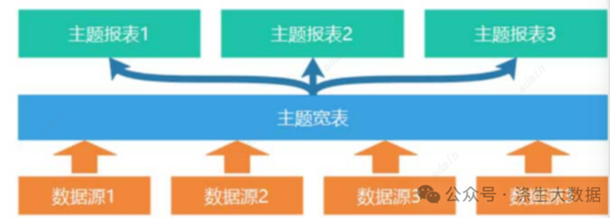

#主题大宽表的详解及hive中的实现

## 背景

在数仓开发过程中，我们常常会采用宽表设计来实现一些相似业务的汇聚，宽表不仅可以提升数据整合性、提高数据查询效率，并且可以降低维护成本。当然，宽表设计更便于跨系统和跨部门的数据整合。那么今天我们就来聊聊大宽表。

##  宽表及设计目的
在实现之前我们对大宽表进行介绍，从字面的层面上来讲，宽表比较好理解，可以理解为就是字段比较多的数据库的表，我们在面试的时候也常常被问到大宽表怎么实现的问题，在大部分的场景下，宽表就是将很多上一层级的业务事实表、维度表甚至是底层的贴源层的表关联在一起的一张大数据表。那么在数仓术语中，我们经常会说统一出口、统一业务口径，这里我们所说的的统一，其实都是需要宽表来实现。宽表和业务主题相关的所有维度信息、所有相关指标信息都可以放进同一张宽表。这么一说，大家就会有了一定的概念。
那么，我们为什么要建设宽表呢？使用了大宽表，我们可以利用大数据强大的计算能力，提前加工好想要的指标，避免计算过程带来过多的关联操作，甚至可以实现计算效率的高度并行化。当然在hive中更多的使用星型模型构建hive表，通过大量的冗余来提升查询效率，下面就是大宽表的具体优势。


## 宽表的优势
###统一数据指标口径
这一点上文已经提到，很多时候大数据开发团队会面对诸多的业务需求，可能不同的数据开发人员会接到相似甚至相同的指标开发需求，那么如果技术口径不是同一处，有可能会带来同一个指标的口径不一致的情况，导致我们提供的数据在不同的出口不一样，相信很多同学都遇见过这个问题，而且业务部门经常提出这个问题。这也就是数仓建设一直强调的公共核心逻辑下沉的原因。但是，因为如果我们的所有报表都能从我们的底层的大宽表出，那么我们报表上的指标肯定能实现统一。
### 提高数据查询效率
比如说我们在开发报表或者一些临时数据应用的取数，我们就可以直接从大宽表中获取，从而避免了每一个开发需求都要从头计算的复杂场景，这也是快速响应需求的一个很有效的办法，毕竟都是从ods层来一点点的开发报表，那对上层的数据开发人员是及其痛苦的过程。
### 提高上层数据质量
大宽表的准确性，一般都是经历了很长时间的检验的，反复修改的，逻辑错误的可能性很小，可以直接使用，要是让你从头开发，那这个过程中可能因为对业务理解不透彻或者是书写的逻辑不正确，导致有数据质量问题。

当然大宽表也存在一定的缺点，存在数据冗余，字段较多表数据量较大甚至存在性能问题，重跑难度大，逻辑修改复杂等等。但是每每一个数据还是必不可少的建设，毕竟是非常好用的模型。

## 宽表设计原则
1. 冗余存储：宽表中可以冗余存储更多的数据，常见的方法包括将一些常用的维度数据冗余在表中，避免了以后多表关联查询，以提高查询覆盖度。
2. 数据域的独立性：有时候我们在想我们的宽表到底要包含哪些数据，到底要多少字段，这个并没有清晰的界限，一般我们要设定好宽表的边界，尽可能保持宽表数据域的独立性。
3. 粒度设计：宽表也会分威粗粒度和细粒度，但是我们要在设计宽表的时候，根据需求设计合适的粒度，既要满足分析和查询的需求，又要避免过于庞大和冗杂的数据。
4. 水平分区：一般大宽表的数据量都会很大，对于宽表中的大表，可以根据某个维度进行分区，将数据按照某个维度的值分开存储，来提高查询性能。一般我们会使用时间按天分区。

## Hive中宽表的实现案例
主题宽表建模逻辑是一种以业务为导向的数据建模方法，它可以帮助企业更好地组织和管理数据，提供高效的数据查询和分析能力，从而支持决策和业务发展。我们一张销售表为例。
例子：dws_sale_theme_day_sum_d 销售主题宽表
1) 需求解读 ,业务理解通过解读业务，我们再确定下来对象的主题，确立对象的属性，
确立对象的行为指标该对象做了什么，发生了什么？如果不明白的指标和维度要和需求和业务进行讨论。这一块对业务考察能力要求比较高。

我们分析出来大宽表的指标：
销售收入金额、配送成交额、小程序成交额、平台收入金额、APP成交额；
总订单量、好评订单量、差评订单量、配送订单量、退款订单量、小程序订单量
等等指标，这里不做太多列举。
我们分析出来大宽表的维度 ：
日期、城市、商圈、店铺、品牌、商品大类、商品中类、商品小类；
这里我们需要冗余尽量多的维度，把涉及的维度都冗余进来。

2）hive 中建表，通过分析的维度和指标我们进行物理模型的构建，这个建hive表，当然在建表的时候要注意字段的命名，表的命名符合公司的规范。
```
create table dws.dws_sale_theme_day_sum_d (
  city_id string comment '城市id',
  city_name string comment '城市name',
  tradee_area_id string comment '商圈id',
  tradee_area_name string comment '商圈名称',
  stdore_id string comment '店铺的id',
  store_name string comment '店铺名称',
  braend_id string comment '品牌id',
  braend_name string comment '品牌名称',
  max_classs_id string comment '商品大类id',
  max_dclass_name string comment '大类名称',
  mid_class_id string comment '中类id',
  mid_class_name string comment '中类名称',
  min_class_id string comment '小类id',
  min_class_name string comment '小类名称',
  sale_damt decimal(38, 2) comment '销售收入金额',
  plats_amt decimal(38, 2) comment '平台收入金额',
  deliver_sale_amt decimal(38, 2) comment '配送成交额',
  orders_cnt bigint comment '成交订单量',
  evaa_order_cnt bigint comment '优评订单量comment=>cmt',
  bad_eeva_order_cnt bigint comment '差评订单量',
  deliver_order_cnt bigint comment '配送订单量',
  refund_order_cnt bigint comment '退款订单量',
  miniadpp_order_cnt bigint comment '小程序成交订单量',
  android_order_cnt bigint comment '安卓app订订单量',
  ios_order_cnt bigint comment '苹果app订订单量',
  pcweb_order_cnt bigint comment 'pc商城成交单量'
) comment '销售主题日统计宽表' partitioned by(data_dt string) stored as orc;
```

3) 表逻辑实现
表的数据来源，一般来自底层的dwd层的数据，有的甚至我们可以使用底层ods层的数据，当然我们不建议这么使用，这里你也要对数据无比的了解，有一个清晰的思路。对数据也无比的数据熟悉，比如商圈、店铺等维度来自于店铺明细宽表；大中小分类来自于商品明细宽表；而成交额等指标需要依赖订单明细宽表等。下图可以说明我们宽表数据的具体流转。


4）最终代码实现：
这里简单的举例实现宽表的代码：
```
--dws 主题宽表实现步骤
--step1:根据业务需求 梳理确定表关系：
DROP TABLE IF EXISTS fdm_tmp.tmp_dm_mem_tied_card_source_d_01;create TABLE fdm_tmp.tmp_dm_mem_tied_card_source_d_01 STORED AS ORC AS
select
  --step1:字段抽取
  --维度字段
  o.dt,
  --日期
  s.city_id,
  s.city_name,
  --城市
  s.tlijrade_area_id,
  s.trade_area_name,
  --商圈
  s.id as store_id,
  s.store_name,
  --店铺
  g.brand_id,
  g.brand_name,
  --品牌
  g.max_class_id,
  g.max_class_name,
  --商品大类
  g.mid_class_id,
  g.mid_class_name,
  --商品中类
  g.min_class_id,
  g.min_class_name,
  --商品小类
  --指标字段
  --订单量指标
  o.order_id,
  --订单id
  o.goods_id,
  --商品id
  --跟钱相关的指标
  o.order_amount,
  --订单金额
  o.total_price,
  --商品金额
  o.plat_fee,
  --平台分润
  o.dispatcher_money,
  --配送费
  o.order_from,
  o.evaluation_id,
  - o.geval_scores,
  - o.delievery_id,
  --配
  o.refund_id,
  --退款单ID
from
  yp_dwb.dwb_order_detail o
  left join yp_dwb.dwb_goods_detail g on o.goods_id = g.id
  left join yp_dwb.dwb_shop_detail s on o.store_id = s.id;--step2:插入到目标表中
  insert overwrite table dws_sale_theme_day_sum_d partition(stat_date = '${statisdate}')
select
  then city_id else null end as city_id,
  case when grouping(city_id) = 0 then city_name else null end as city_name,
  --城市
  case when grouping(trade_area_id) = 0 --商圈
  then trade_area_id else null end as trade_area_id,
  case when grouping(trade_area_id) = 0 then trade_area_name else null end as trade_area_name,
  case when grouping(store_id) = 0 --店铺
  then store_id else null end as store_id,
  case when grouping(store_id) = 0 then store_name else null end as store_name,
  case when grouping(brand_id) = 0 --品牌
  then brand_id else null end as brand_id,
  case when grouping(brand_id) = 0 then brand_name else null end as brand_name,
  case when grouping(max_class_id) = 0 --大类
  then max_class_id else null end as max_class_id,
  case when grouping(max_class_id) = 0 then max_class_name else null end as max_class_name,
  case when grouping(mid_class_id) = 0 --中类
  then mid_class_id else null end as mid_class_id,
  case when grouping(mid_class_id) = 0 then mid_class_name else null end as mid_class_name,
  case when grouping(min_class_id) = 0 --小类
  then min_class_id else null end as min_class_id,
  case when grouping(min_class_id) = 0 then min_class_name else null end as min_class_name,
  case when grouping(store_id, store_name) = 0 then 'store' when grouping(trade_area_id, trade_area_name) = 0 then 'trade_area' when grouping(city_id, city_name) = 0 then 'city' when grouping(brand_id, brand_name) = 0 then 'brand' when grouping(min_class_id, min_class_name) = 0 then 'min_class' when grouping(mid_class_id, mid_class_name) = 0 then 'mid_class' when grouping(max_class_id, max_class_name) = 0 then 'max_class' when grouping(dt) = 0 then 'all' else 'others' end as group_type,
  --step6：销售收入sale_amount计算
  case when grouping(store_id, store_name) = 0 --店铺销售收入
  then sum(
    if(store_id is not null, coalesce(order_amount, 0), 0)
  ) --             then sum(order_amount)
  --todo 如果订单金额指标为null 替换成为0
  ---if() 处理指标空值
  ---coalesce(v1，v2，v3.....) 功能：返回列表中第一个非空值
  ---nvl(order_amount,0)  空值转换函数  注意：presto是否支持
  when grouping(trade_area_id, trade_area_name) = 0 --商圈销售收入
  then sum(if(trade_area_id is not null, order_amount, 0)) when grouping(city_id, city_name) = 0 --城市销售收入
  then sum(if(city_id is not null, order_amount, 0)) when grouping(brand_id, brand_name) = 0 --品牌销售收入
  then sum(if(brand_id is not null, total_price, 0)) when grouping(min_class_id, min_class_name) = 0 --小类销售收入
  then sum(if(min_class_id is not null, total_price, 0)) when grouping(mid_class_id, mid_class_name) = 0 --中类销售收入
  then sum(if(mid_class_id is not null, total_price, 0)) when grouping(max_class_id, max_class_name) = 0 --大类销售收入
  then sum(if(max_class_id is not null, total_price, 0)) when grouping(dt) = 0 --日期（每天）销售收入
  then sum(if(dt is not null, order_amount, 0)) else null end as sale_amt ---销售收入
from
  fdm_tmp.tmp_dm_mem_tied_card_source_d_01
group by
  grouping sets(
    (dt),
    --日期
    (dt, city_id, city_name),
    --日期+城市
    (
      dt,
      city_id,
      city_name,
      trade_area_id,
      trade_area_name
    ),
    --日期+城市+商圈
    (
      dt,
      city_id,
      city_name,
      trade_area_id,
      trade_area_name,
      store_id,
      store_name
    ),
    --日期+城市+商圈+店铺
    (dt, brand_id, brand_name),
    --日期+品牌
    (dt, max_class_id, max_class_name),
    --日期+大类
    (
      dt,
      max_class_id,
      max_class_name,
      mid_class_id,
      mid_class_name
    ),
    ----日期+大类+中类
    (
      dt,
      max_class_id,
      max_class_name,
      mid_class_id,
      mid_class_name,
      min_class_id,
      min_class_name
    ) --日期+大类+中类+小类
  );
```