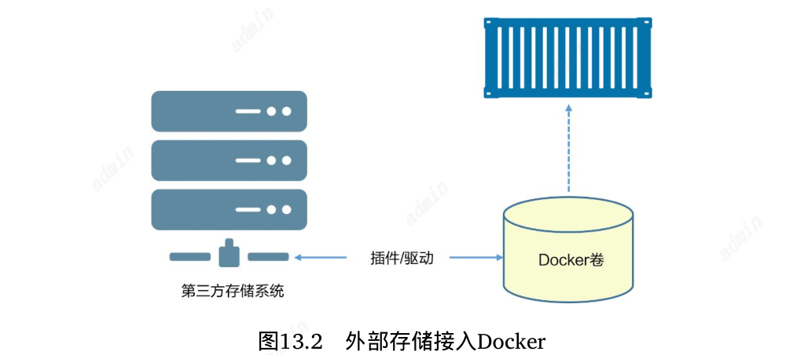
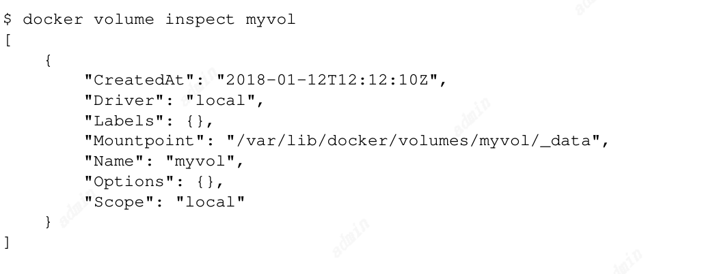
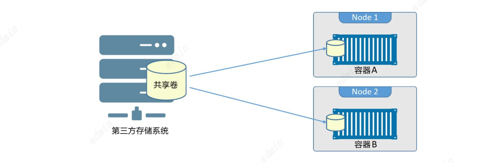

# Docker卷与持久化
## 持久化与非持久化
持久化：将数据存储在卷上，卷与容器是解耦得，可以独立创建并管理卷，且卷并未与任意容器生命周期绑定，容器删除后卷不会删除，所以数据也不会被删除。
非持久化：每个容器都分配了本地存储，数据生命周期与容器相同，容器删除后数据也会被删除。
所以容器不仅仅用于临时场景。

### 创建和管理容器卷
创建一个名为myvol得卷
```
docker volume create myvol
```
默认情况下Docker新创建的卷会采用内置得local驱动，这种本地卷只能被用于存在于当前节点的容器使用。也可以用 -d 参数指定不同的驱动。
三方驱动是以插件的方式接入的，接入后未docker集成了外部存储系统。
目前存在25种以上的卷插件
块存储： 相对性能更高，适用于对小块数据的随机访问负载。目前支
持Docker卷插件的块存储例子包括HPE 3PAR、Amazon EBS以及
OpenStack块存储服务（Cinder）。
• 文件存储： 包括NFS和SMB协议的系统，同样在高性能场景下表现优
异。支持Docker卷插件的文件存储系统包括NetApp FAS、Azure文件
存储以及Amazon EFS。
• 对象存储： 适用于较大且长期存储的、很少变更的二进制数据存储。
通常对象存储是根据内容寻址，并且性能较低。支持Docker卷驱动的
例子包括Amazon S3、Ceph以及Minio


查看已存在的卷
```
docker volume ls
```

查看详情
```
docker volume inspect
```

Driver和Scope都是local 。 这意味着卷使用**默认local 驱动创建，只能用于当前Docker主机上的容器**。
Mountpoint 属性说明卷位于Docker主机上的位置。在本例中卷位于Docker主机的/var/lib/docker/volumes/myvol/_data 目录。（使用local 驱动创建的卷在Docker主机上均有其专属目录，在Linux
中位于/var/lib/docker/volumes 目录下）

容器使用指定的卷
```
docker container run --flag
```

删除卷
```
docker volume prune 
docker volume rm 
```
**docker volume prune 会删除未装入到某个容器或者服务的所有卷 ，所以谨慎使用 ！
docker volume rm 允许删除指定卷。两种删除
命令都不能删除正在被容器或者服务使用的卷。**


### 在集群节点间共享存储
独立存储LUN或者NFS共享可以应用到多个Docker主机， 因此无论容器或者服务副本运行在哪个节点上，都可以共享该存储。
**使用共享存储必须要注意：数据损坏：**Node 1上的容器A更新了部分数据，将数据写入本地缓存，容器A将缓存刷新并提交到卷前，Node2的容器B也更新了同样的数据，但值不同并
且更新方式为直接写入卷中。此时，两个容器均认为自己已经将数据写入 卷中，但实际上只有容器B写入了。容器A会在稍后将自己的缓存数据写入缓存，覆盖了Node 2的容器B所做的一些变更。但是Node 2上的容器B对此一无所知。数据损坏就是这样发生的。


**为了避免这种情况，需要在应用程序中进行控制。**