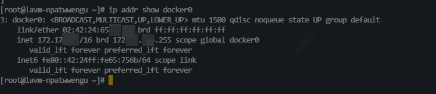

# Docker网络
Docker网络架构的实际规范是CNM（容器网络模型）。CNM中规定了Docker网络的基础组成要素。

## CNM
CNM中顶一个三个要素
1. 沙盒（Sandbox）：沙盒是独立的网络栈。其中包括以太网接口、端口、路由表以及DNS配置
2. 终端（Endpoint）：是虚拟网络接口，和普通的网络接口一样，终端主要职责是负责创建连接。在CNM中，终端负责将沙盒连接到网络
3. 网络（Network）：是802.ld网桥的软件实现，因此，网络就是需要交互的终端的集合，并且终端之间互相独立。


Docker环境中最小的调度单位就是容器，而CNM也恰如其名，负责
为容器提供网络功能。
沙盒被放在容器内部，为容器提供网络

容器A只有一个接口（终端）并连接到了网络A。容器B有两个接口
（终端）并且分别接入了网络A和网络B。容器A与B之间是可以相互通信
的，因为都接入了网络A。但是，如果没有三层路由器的支持，容器B的
两个终端之间是不能进行通信的。

需要重点理解的是，终端与常见的网络适配器类似，这意味着**终端只能接入某一个网络**。因此，**如果容器需要接入到多个网络，就需要多个终端**。

虽然容器A和容器B运行在同一个主机上，但其网络栈在操作系统层面是独立的（这一点用沙盒机制保证）

## Libnetwork
CNM是设计规范文档，Libnetwork是标准的实现。
Libnetwork是开 源的，采用Go语言编写，它跨平台（Linux以及Windows），并且被Docker所使用。
早期Docker的网络部分在Daemon中，后面将网络部分拆到了Libnetwork中，**除了为网络部分，Libnetwork还实现了本地服务发现、基于Ingress的容器负载均衡，以及网络控制层和管理层功能。**

## 驱动
Libnetwork实现了控制层和管理层功能，**驱动负责实现数据层**。网络连通性和隔离性是由驱动来处理的。
Docker封装了若干内置驱动，通常被称作原生驱动或者本地驱动。在Linux上包括Bridge 、Overlay 以及Macvlan ，在Windows上包括NAT、Overlay 、Transport 以及L2 Bridge 。接下来的一节中会介绍如何使用其中部分驱动。
第三方也可以编写Docker网络驱动。这些驱动叫作远程驱动，例如 Calico 、Contiv 、Kuryr 以及Weave 。


### 单机桥接网络
1. 单机：该网络只能在单个Docker主机上运行，并且只能与所在Docker主机上的容器进行连接
2. 桥接：睡觉哦802.l.d桥接的一种实现（二层交换机）
   Linux Docker创建单机桥接网络采用内置的桥接驱动，而WindowsDocker创建时使用内置的NAT驱动。实际上，这两种驱动工作起来毫无差异。

两个均包含相同本地桥接网络mynet的Docker主机。虽然网络是相同的，但却是两个独立的网络。
**每个Docker主机都有一个默认的单机桥接网络**。在Linux上网络名称为bridge ，在Windows上叫作nat 。除非读者通过命令行创建容器时指定参数--network ，否则**默认情况下，新创建的容器都会连接到该网络**。

同一个宿主机中的容器：因为容器的网路是隔离的，所以两个容器是无法直接通信的，但默认情况下不指定network，docker使用的是docker主机的单机桥网络，所以同一个宿主机中的两个容器在桥网络的连接下可以相互通信。桥接网络中的每个容器会分配一个 IP 地址，但如果通过容器的名称进行通信（比如在 Docker Compose 配置中），则不需要直接使用 IP 地址。
Docker 引擎在默认情况下会创建一个名为 docker0 的虚拟网桥，这个虚拟网桥属于 Docker 主机，并用于连接处于 bridge 网络模式 中的容器。 容器通过 docker0 网桥会被分配一个 IP 地址，并通过该网络相互连接

跨宿主机中的容器：如果没有使用额外的网络配置（如host网络模式、overlay网络或者DockerSwarm）是无法相互通信的。
解决方案：
1. 使用Docker的Overlay网络，特别是在多主机的Docker Swarm环境中，或者通过Docker compose配置不同宿主机上的容器进行互联
2. 使用Host网络模式（将容器网络直接绑定到宿主机网络上）

`docker network ls` 查看每个主机上的网络

`docker network inspect bridge` 查看bridge网络驱动详情

在 Containers 字段下，你可以看到每个容器的 IPv4Address（容器的 IP 地址）。
`ip addr show docker0` 查看宿主机上的 docker0 网桥的 IP 地址，以及容器与 docker0 网桥的网络配置。
docker0 的 IP 地址：这通常是宿主机与容器通信的网关地址。例如，默认情况下，docker0 的 IP 地址可能是 172.17.0.1。这就是宿主机上 docker0 网络接口的地址，容器将通过这个网关进行网络访问。
容器的 IP 地址：每个容器会从 docker0 网络的 IP 地址池中分配一个 IP 地址。默认情况下，容器的 IP 地址会在 172.17.0.0/16 子网范围内。例如，一个容器可能会被分配到 172.17.0.2，另一个容器可能会被分配到 172.17.0.3。


在Linux Docker主机之上，默认的“bridge”网络被映射到内核中 为“docker0 ”的Linux网桥。

Docker默认“bridge”网络和Linux内核中的“docker0”网桥之间的关系

```
#创建一个桥接网络 mynetwork
docker network create -d bridge mynetwork

# 查看网络信息
docker network ls

#启动两个容器都指向这个网络
docker container run -d --name c1 \
--network mynetwork \
alpine sleep 1d

docker container run -d --name c2 \
--network mynetwork \
alpine sleep 1d
# 这时容器c1和c2之间可以互相访问
这是因为c2容器运行了一个本地DNS解析器，该解析器
将请求转发到了Docker内部DNS服务器当中。DNS服务器中记录了容器启
动时通过--name 或者--net-alias 参数指定的名称与容器之间的映射
关系。
```
**桥接网络中的容器只能与位于相同网络中的容器进行通信。**
使用端口映射可以绕开这个限制。端口映射允许将某个容器端口映射到Docker主机端口上，对于配置中指定的Docker主机端口，任何发送到该端口的流量，都会被转发到容器。

容器内部应用开放端口为80。该端口被映射到了 Docker主机的10.0.0.15 接口的5000端口之上。最终结果就是访问10.0.0.15:5000 的所有流量都被转发到了容器的80端口。
在只有单一容器的情况下，它可以绑定到主机的任意端口。**这意味着其他容器就不能再使用已经被Nginx容器占用的5000端口了**。这也是**单机桥接网络只适用于本地开发环境以及非常小的应用的原因**。
单机桥接网络只适用于本地开发环境以及非常小的应用的原因：
1. 端口冲突：在单机桥接网络下，容器与主机端口映射后该主机的端口不能与其他容器映射，否则会发生**端口冲突**

**总结：
docker之间的网络通信有两种方式
1. 通过网络进行通信：通过network进行通信。同一宿主机下的容器默认使用的docker主机的单机桥网络进行通信或者创建新的单机桥网络并在容器启动时指向这个网络。跨宿主机需要使用docker的overlay网络或者docker swarm环境进行通信
2. 通过网络端口进行通信：通过使用 `-p` 或 `--publish` 参数将容器端口与宿主机端口进行映射后，通过宿主机ip+端口形式进行通讯，缺点是一个容器智能对应一个端口，不能重复映射否则端口映射冲突。**

### 多机覆盖网络
Docker为覆盖网络提供了本地驱动。这使得创建覆盖网络非常简单， 只需要在docker network create 命令中**添加--d overlay 参数**。
//todo 后面文章会提到


### 服务发现
Libnetwork还提供服务发现功能。
服务发现：允许容器和Swarm服务通过名称互相定位，前提**条件是容器、服务处于同一网络中**。底层实现是利用了Docker的DNS服务器，为每个容器提供DNS解析功能。
为什么Docker DNS可以解析出目标IP？ 
因为：**每个启动时使用了--name 参数的Swarm服务或者独立的容器，都会将自己的名称和IP地址注册到Docker DNS服务。这意味着容器和服务副本可以通过Docker DNS服务互相发现。**
但是，服务发现是受网络限制的。这意味着名称解析只对位于同一网络中的容器和服务生效。如果两个容器在不同的网络，那么就不能互相解析。
#### 发现过程
容器“c1”通过名称ping容器“c2”的过程

（1）ping c2 命令调用本地DNS解析器，尝试将“c2”解析为具体IP地址。每个Docker容器都有本地DNS解析器。
（2）如果本地解析器在本地缓存中没有找到“c2”对应的IP地址，本 地解析器会向Docker DNS服务器发起一个递归查询。本地服务解析器是预先配置好并知道Docker DNS服务器细节的。
（3）Docker DNS服务器记录了全部容器名称和IP地址的映射关系， 其中容器名称是容器在创建时通过--name 或者--net-alias 参数设置的。这意味着Docker DNS服务器知道容器“c2”的IP地址。
（4）DNS服务返回“c2”对应的IP地址到“c1”本地DNS解析器。之所以会这样是因为两个容器位于相同的网络当中，如果所处网络不同则该命令不可行。
（5）ping命令被发往“c2”对应的IP地址。

**用户可以为Swarm服务和独立容器进行自定义的DNS配置。**
举个例子，--dns 参数允许读者指定自定义的DNS服务列表，以防出现内置的Docker DNS服务器解析失败的情况。此外也可以使用--dns-search 参数指定自定义查询时所使用的域名（例如当查询名称并非完整域名的时候）。
在Linux上，上述工作都是通过在容器内部/etc/resolve.conf 文件内部增加条目来实现的。
```
$ docker container run -it --name c1 \
 --dns=8.8.8.8 \
--dns-search=dockercerts.com \
alpine sh
```

### Ingress网络
Swarm支持两种服务发布发布模式，这两种模式都能让服务从外部被访问
1. **Ingress模式（默认）**，这意味着任何时候读者通过简单指令-p 或者-- publish 发布服务的时候，默认都是Ingress模式`docker service create -d --name svc1 -p 5000：80 nginx`
2. Host模式，需要明确指定如`docker service create -d --name svc1 --publish published=5000,target=80,mode=host nginx`该方式采用逗号分隔多个参数，并且逗号前后不允许有空格。
   published=5000 表示服务通过端口5000提供外部服务；target=80 表示发送到published端口5000的请求，会映射到服务副本的80端口之上。mode=host 表示只有外部请求发送到运行了服务副本的节点才可以
   访问该服务。
区别：Ingress模式下即使运行的服务没有副本，也可以访问， Host模式必须通过运行服务副本的节点来访问。


在底层，**Ingress模式采用名为Service Mesh 或者Swarm Mode Service Mesh 的四层路由网络来实现。**

#### Ingress模式访问过程
1. 部署了一个名为“svc1”的Swarm服务。该服务连接到overnet 网络，并发布到5000端口。（--publish published=5000,target=80 ）
2. 集群确保到达Ingress网络中任意节点 的5000端口的流量，都会被路由到80端口的“svc1”服务。
3. 当前“svc1”服务只部署了一个副本，由于集群中有一条映射规则：“所有访问Ingress网络5000端口的流量都需要路由到运行了“svc1”服务副本的节点之上”。所以访问Node的15000端口的流量，通过Ingress网络，被路由到了Node2节点正在运行的服务副本之上。

入站流量可能访问4个Swarm节点中的任意一个，但是结果都是一样的，了解这一点很重要。这是因为服务通过Ingress网络实现了Swarm范围内的发布。
**如果存在多个运行中的副本，流量会平均到每个副本之上。（可以达到负载均衡的效果）**


## Docker网络命令
1. `docker network ls` 用于列出运行在本地Docker主机上的全部网
络。
2. `docker network create` 创建新的Docker网络。默认情况下，在 Windows上会采用NAT 驱动，在Linux上会采用Bridge驱动。读者可以使用-d 参数指定驱动（网络类型）。`docker network create -d overlay overnet` 会创建一个新的名为overnet的覆盖网络，其采用的驱动为Docker Overlay 。
3. `docker network inspect` 提供Docker网络的详细配置信息。
4. `docker network prune` 删除Docker主机上全部未使用的网络。
5. `docker network rm` 删除Docker主机上指定网络。