# Docker初步实践

## 一. 搭建Docker环境

参考文档

## 二. 运行一个Docker容器

### 下载安装包

 [getting-started-todo-app](https://github.com/docker/getting-started-todo-app/archive/refs/heads/main.zip)

```
wget https://github.com/docker/getting-started-todo-app/archive/refs/heads/main.zip
```

### 解压

```
unzip getting-started-todo-app.zip
```

### 进入getting-started-todo-app目录

```
cd getting-started-todo-app
```

### 执行命令

dockercompose watch

这个命令涵盖两个动作

1. sync：热加载

   监听当前compose.yaml文件相对路径下的web文件夹下的文件，发生改变后将变化的文件复制到 容器内的 /src/web 目录下。并且同步过程中忽略 文件夹 node_moudles文件夹下的所有内容

2. rebuild：重新构建

   如下，在文件[package.json](https://so.csdn.net/so/search?q=package.json&spm=1001.2101.3001.7020)发生改变后，直接重新构建

```
docker compose watch
```

### 注意一 拉不下镜像

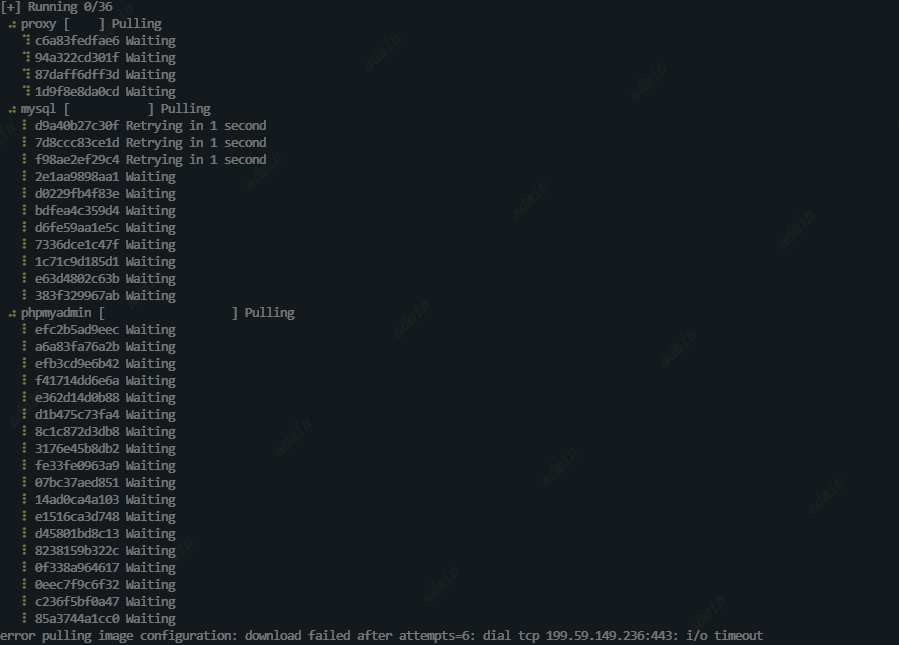

因为镜像拉去不到，需要修改/etc/docker/daemon.json文件，如果没有就创建一个

```
vim /etc/docker/daemon.json

{
    "registry-mirrors": [
        "https://docker.m.daocloud.io",
        "https://dockerproxy.com",
        "https://docker.mirrors.ustc.edu.cn",
        "https://docker.nju.edu.cn"
    ]
}
```

再重启daemon 以及docker

```
systemctl daemon-reload
systemctl restart docker
```

### 注意二 报错

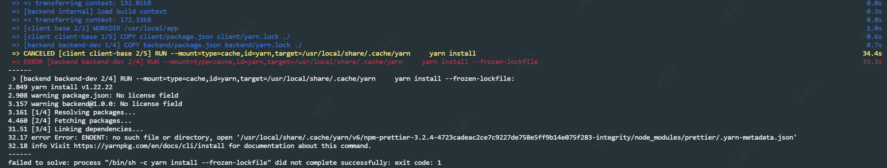

这个很奇怪，没有做任何修复，重新执行一遍就可以了

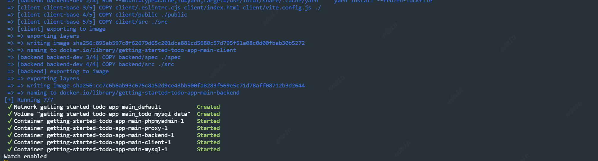

执行以下命令可以看到，刚才的操作拉取了多少个镜像以及运行了多少个容器

```
docker ps
docker images
```

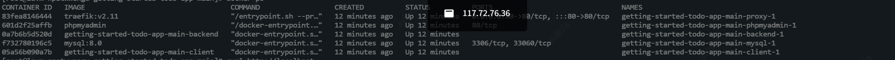

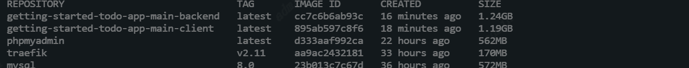

从镜像和容器运行情况上可以看出，运行一个getting-started-todo-app服务需要五个服务。

## 三. 构建一个镜像并推送到镜像仓库

构建镜像需要做

1. 登录你的docker 账号

https://hub.docker.com/

1. 创建一个镜像在 Docker Hub

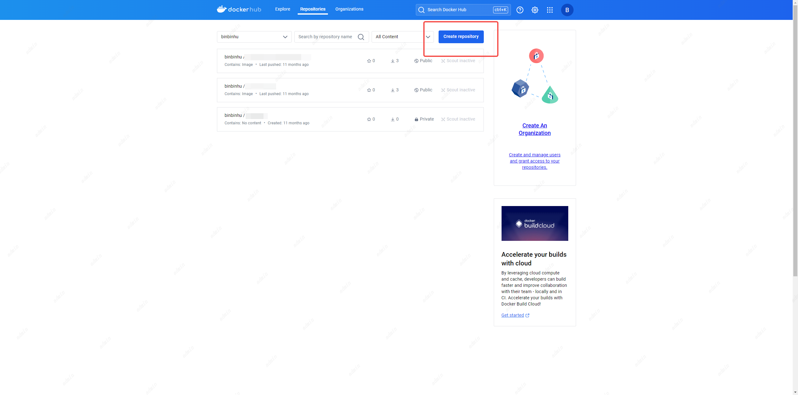

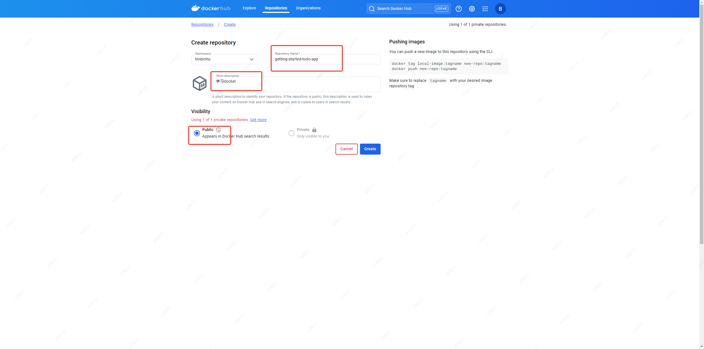

创建完成

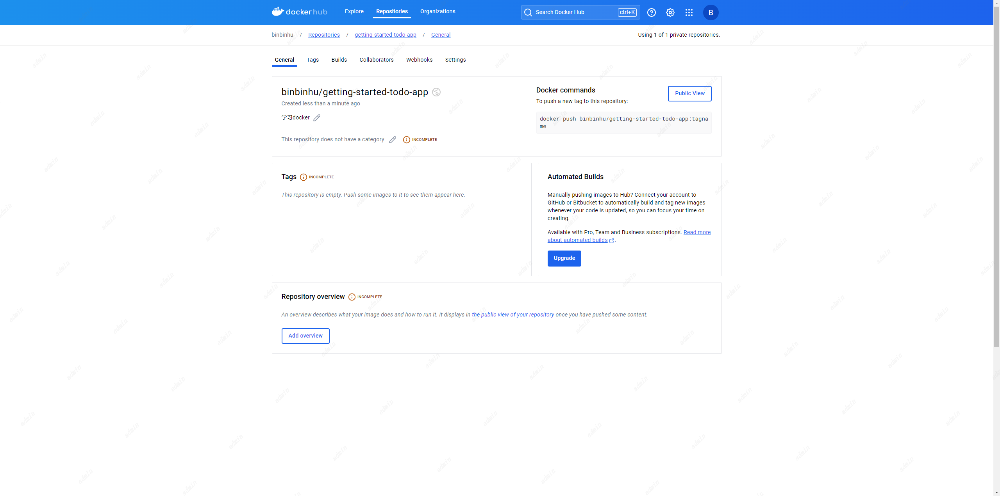


1. 构建这个容器的镜像

由于这个镜像是在原本的Node镜像上扩展的，所以不需要实例化或者配置Node、yarn等环境。这样我们可以只关注于我们自己修改的程序。

#### 什么是镜像/Dockerfile

思考一下这个案例，需要运行一个程序需要包含：Node环境、Mysql、后端代码、React代码等。任何使用镜像运行容器的机器都可以像构建时那样运行应用程序，而不需要在机器上预装任何其他东西。

Dockerfile是一个基于文本的脚本，他提供如何去构建一个镜像的指令集。为了快速启动，对应的仓库的地址也包含在Dockerfile文件中。

####  将当前容器打包成镜像并推到 Docker Hub上

执行 build命令docker build -t ${DOCKER_USERNAME}/getting-started-todo-app .${DOCKER_USERNAME}是docker hub的用户名，主要与创建好的镜像仓库对应

```
docker build -t binbinhu/getting-started-todo-app .
```

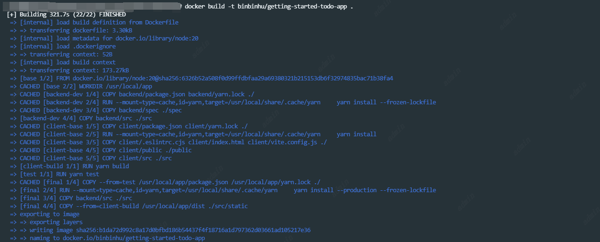

查看镜像列表，可以看到构建好的新镜像

```
docker images
```

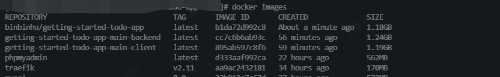

执行push命令，将镜像推到仓库

1. 推到Docker Hub镜像仓库

```
docker push binbinhu/getting-started-todo-app
```

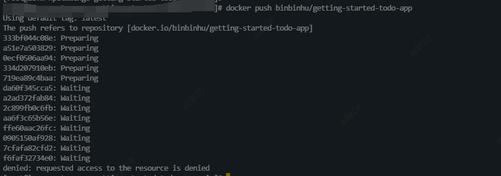

2. 推到私有镜像仓库如阿里云镜像仓库

登录阿里云账号

```
docker login --username=XXXX registry.cn-hangzhou.aliyuncs.com
```

打Tag，镜像仓库地址写创建好的阿里云镜像仓库地址

```
docker tag ${镜像名称/镜像ID} ${镜像仓库地址}:${镜像版本号}
```

将镜像推到阿里云镜像仓库

```
docker push ${镜像仓库地址}:[镜像版本号]
```

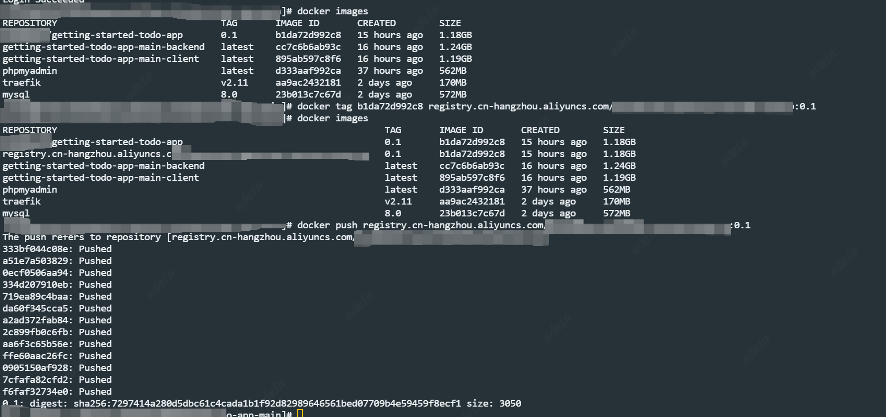

#### 注意 Push超时&领取阿里云个人免费仓库

push到Docker Hub我推不上去，应该是这个镜像太大了，一直重试直到超时，所以我用了阿里云的个人免费镜像仓库

领取阿里云个人免费仓库步骤

1.  登录阿里云，进入容器镜像服务 ACR

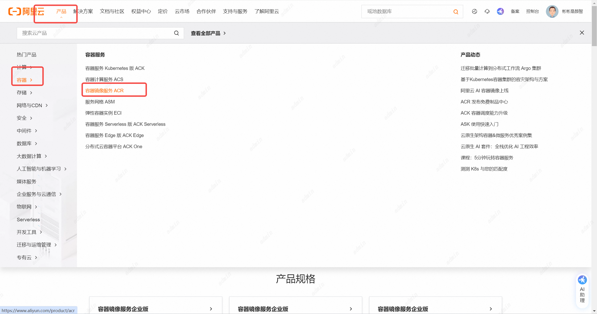

2. 选择免费试用

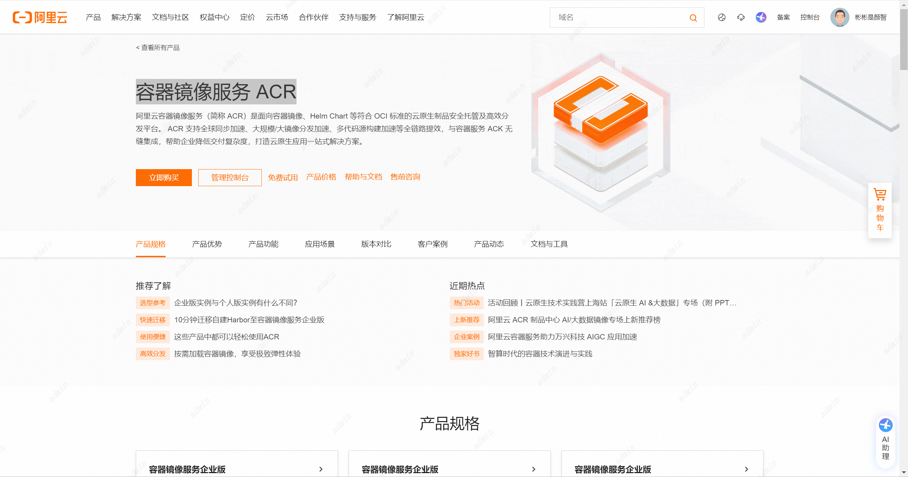


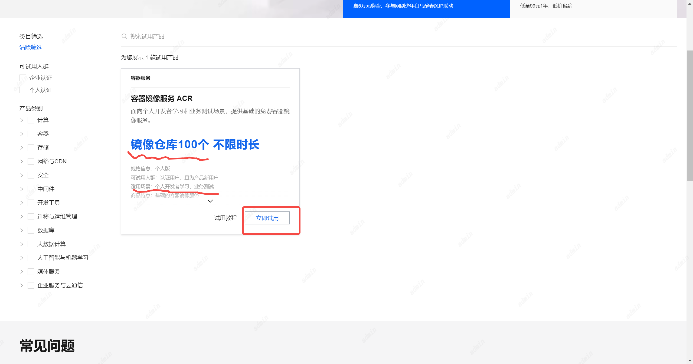

3. 创建个人实例，这里我已经创建完了

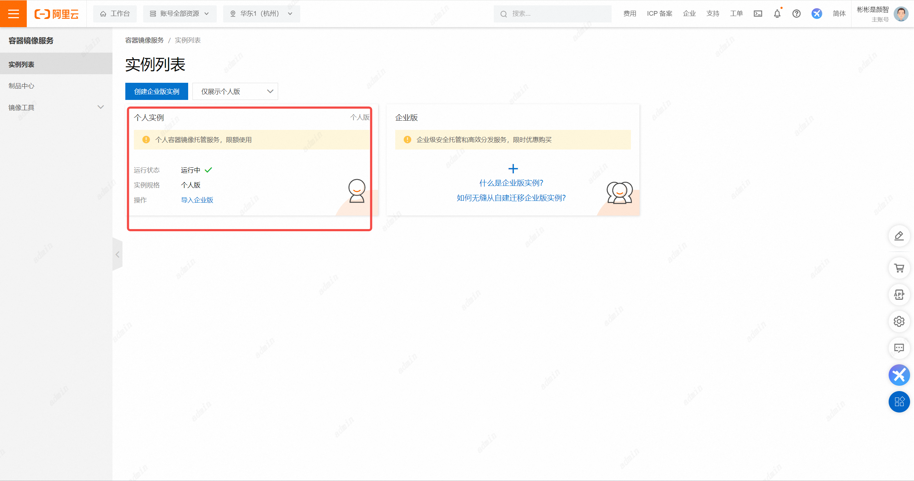

4. 进入可以看到实例基础信息以及可以创建自己的仓库

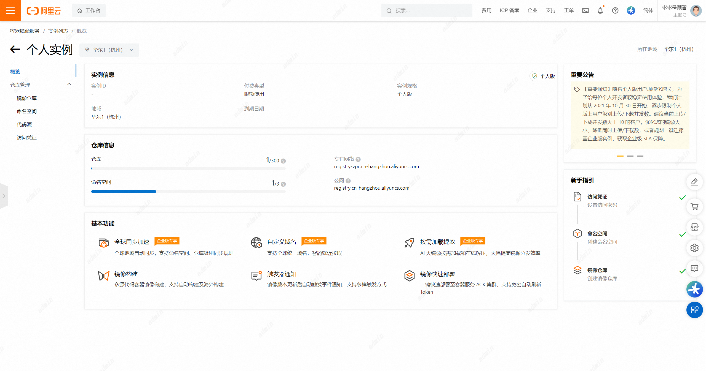


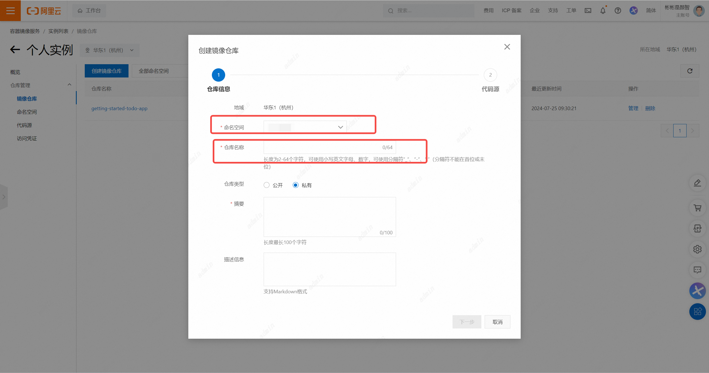

成功后可以看到推上来的镜像

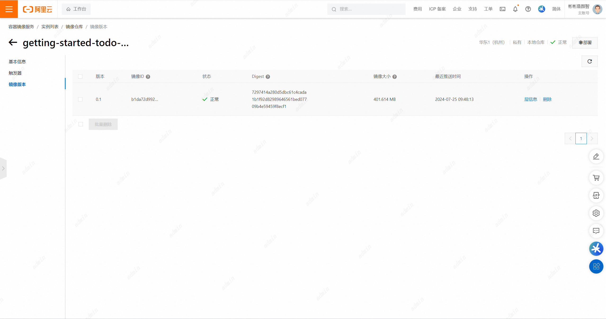

## 四. 将镜像推到Docker Hub

