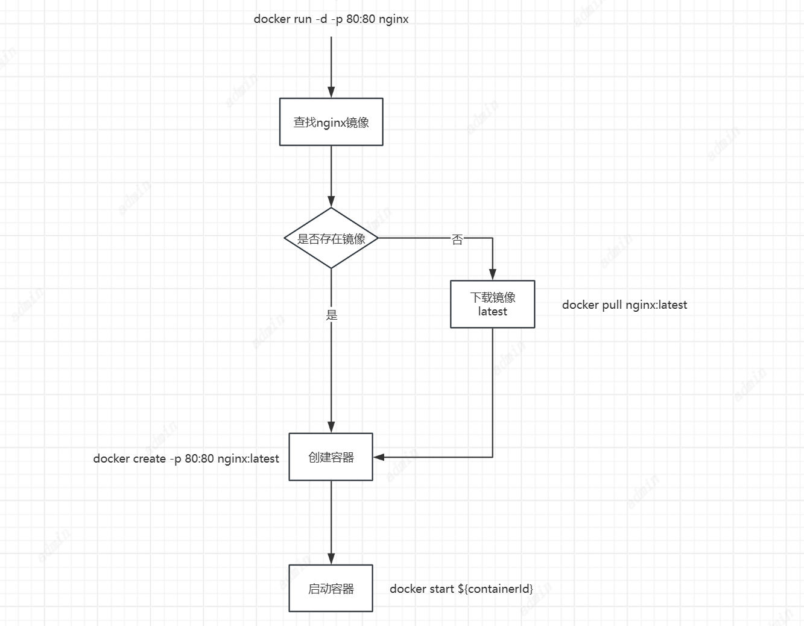

# Docker

Docker可以通过容器化技术提供快速、轻量级的应用部署和隔离，提升开发和运维的效率。

## 从Run开始

docker run是一个神奇的命令，任何复杂的程序貌似都可以无需部署，直接通过一个run命令来启动，那么run命令背后都经历了什么？

```Bash
# 启动并运行一个容器
docker run -d -p 80:80 nginx
```


​                                                                图1: Docker Nginx容器启动过程

1. 下载镜像

```Bash
# 拉取官方最新nginx镜像
docker pull nginx:latest

# 查看本地镜像
docker images
```

2. 创建容器

```Bash
# 创建容器但不启动
docker create \
  --name my-nginx \           # 指定容器名称
  -p 80:80 \                  # 端口映射
  nginx:latest                # 使用的镜像

# 启动已创建的容器
docker start my-nginx

# 或者直接使用容器ID
docker start 容器ID
```

3. 启动容器

```Bash
# 启动已创建的容器
docker start my-nginx

# 或者直接使用容器ID
docker start 容器ID
```




​                                                                                                         图2: docker run 命令拆解图

在docker run在背后有这样的几个问题：

什么是镜像？

pull 的镜像从哪来？

没有指定版本如何拉取？

docker  create后产生的是什么？

解答这些问题之前我们来浅谈一些Docker架构。

## Docker架构概览

Docker架构包括Docker Client、Docker Daemon、Docker Registry等核心组件。Client与Daemon通过REST API进行通信，Daemon(守护进程)负责执行Docker命令并管理容器生命周期。Registry是Docker镜像的存储和分发中心。


​                                                                                            图3: docker架构图

Docker核心对象

- Images：Docker镜像，包含应用程序及其依赖的静态文件。
- Containers：Docker容器，运行中的镜像实例，包含应用程序及其运行时环境。
- Volumes：Docker卷，用于持久化和共享容器数据的机制。
- Networks：Docker网络，用于连接和管理容器间的网络通信。

了解到这些我们就可以回答上面的问题。

1. 什么是镜像？

镜像（Image）是一个轻量、可执行的独立软件包，它包含了运行应用程序所需的所有内容：代码、运行时、库、环境变量、配置文件等。在 Docker 中，一个镜像本质上是一个只读的文件系统，它包含了运行容器所需要的所有依赖和文件。

所以Docker才能不需要依赖宿主机上的任何组件来运行我们的应用。

2. pull 的镜像从哪来？

`docker pull` 命令会从 Docker 镜像仓库（通常是 **Docker Hub**）拉取镜像。Docker Hub 是一个公共的、默认的镜像仓库，它包含了成千上万的公共镜像，开发者可以从中选择并使用。如果没有指定镜像仓库地址，Docker 会默认连接到 Docker Hub。

除了 Docker Hub，Docker 还支持私有镜像仓库。你可以将自己的镜像推送到自己的私有仓库，或者从其他公共仓库（如阿里云镜像、Google Container Registry 等）拉取镜像。

3. 没有指定版本如何拉取？

当你执行 `docker pull <image_name>` 命令时，如果没有指定具体的版本号（即标签 tag），Docker 会默认拉取该镜像的 **latest** 标签。例如：

```
docker pull nginx
```

这等同于执行：

```
docker pull nginx:latest
```

**latest** 并不是镜像的版本号，它只是默认的标签，表示该镜像的最新版本。实际上，镜像的版本通常是由开发者指定的标签，如 `ubuntu:20.04` 或 `node:14` 等，这样可以确保你拉取到一个特定版本的镜像。

4. docker  create后产生的是什么？

执行 `docker create <image_name>` 命令后，才是真正的创建了一个容器。容器（Container）是一种轻量级的虚拟化技术，它允许开发者将应用及其运行环境打包成一个独立的、标准化的单元，这个单元可以在任何支持容器的环境中一致地运行。容器将应用及其依赖的所有环境（如库、配置文件等）封装在一个包内，从而实现了**环境的一致性**。

至此，我们初步了解了Docker的命令、对象以及架构。

## 如何持久化

仅仅是做到快速部署还不够，很多时候我们需要持久化运行的程序所产生的数据，那么Docker该如何进行持久化呢？Docker推荐我们用卷来做持久化。

### 什么是卷？

在 Docker 中，**卷（Volume）** 是一种持久化存储数据的机制。它是 Docker 容器和宿主机之间、以及不同容器之间共享和管理数据的工具。卷可以用于存储容器的数据库、日志文件、配置文件等数据，并且即使容器被删除或重新创建，数据也能得以保留。

### 卷的关键特性：

1. **持久性**
    容器本身的文件系统是临时的，当容器停止或删除时，容器内的数据也会丢失。而卷是独立于容器生命周期的，即使容器被删除，卷中的数据依然存在。
2. **容器间共享数据**
    卷可以被多个容器挂载，并且容器对卷的修改会立刻反映到其他挂载了同一卷的容器中。这使得容器之间可以共享数据，比如数据库和配置文件。
3. **易于备份、恢复和迁移**
    由于卷是独立于容器的存储机制，可以方便地对卷中的数据进行备份、恢复或迁移。
4. **独立于宿主机文件系统**
    卷不受宿主机文件系统变化的影响，因此可以在不同主机或不同的 Docker 环境中使用。

### 卷的使用

让我们以持久化一个MySQL容器产生的数据为例进行验证。

- 命令示例：`docker run --name docker-mysql -e MYSQL_ROOT_PASSWORD=my-secret-pw -v /my/own/data/dir:/var/lib/mysql -p 3306:3306 -d mysql:latest`
- 参数说明：
  - `--name docker-mysql`：为容器指定名称。
  - `-e MYSQL_ROOT_PASSWORD=my-secret-pw`：设置MySQL root用户的密码。
  - `-v /my/own/data/dir:/var/lib/mysql`：将宿主机的目录挂载到容器的MySQL数据目录。
  - `-p 3306:3306`：将容器的3306端口映射到宿主机的3306端口。
  - `-d mysql:latest`：后台运行MySQL容器，使用最新版本的MySQL镜像。

### 据持久化初体验

- 进入容器并创建数据库和表。
- 删除并重新创建容器，验证数据库和表是否仍然存在。
- 通过验证，确认数据已经成功持久化到宿主机的指定目录中。

#### 详细验证步骤

通过不使用Volumes到使用Volumes一个前后对比。

1. 运行MySQL容器（使用卷）：

```Bash
docker run --name docker-mysql -e MYSQL_ROOT_PASSWORD=my-secret-pw -v /my/own/data/dir:/var/lib/mysql -p 3306:3306 -d mysql:latest
```

2. 进入容器并连接MySQL客户端：

```Bash
docker exec -it docker-mysql mysql -h 127.0.0.1 -P 3306 -uroot -p
```

3. 创建数据库和表：
   1. 创建数据库：`CREATE DATABASE docker_database;`
   2. 使用数据库：`USE docker_database;`
   3. 建表：
   4. ```SQL
      CREATE TABLE users (
        id INT AUTO_INCREMENT PRIMARY KEY,      -- 用户ID，自增主键
        username VARCHAR(50) NOT NULL UNIQUE,   -- 用户名，唯一且不能为空
        email VARCHAR(100) NOT NULL UNIQUE,     -- 邮箱，唯一且不能为空
        password_hash CHAR(60) NOT NULL,       -- 密码哈希值，固定长度
        created_at TIMESTAMP DEFAULT CURRENT_TIMESTAMP, -- 创建时间，默认为当前时间
        updated_at TIMESTAMP DEFAULT CURRENT_TIMESTAMP ON UPDATE CURRENT_TIMESTAMP -- 更新时间，默认为当前时间，更新时自动修改
      );
      ```
   5. 验证表结构：

```SQL
DESC users;
```

4. 删除容器：

```Bash
docker rm -f docker-mysql
```

5. 重新创建容器.
6进入新容器并尝试使用数据库，发现`docker_database`数据库仍然存在，数据已经成功持久化。

### 卷的错误使用

**卷不能当作配置文件**

在 Docker 中，卷主要用于持久化数据存储，比如数据库的数据存储，而不是作为配置文件管理的最佳选择。配置文件通常是在容器启动时挂载到容器内部，而卷用于持久化和共享数据。若将卷作为配置文件使用，可能会遇到一些问题：

- **配置文件的变更**：如果多个容器共享一个卷，并且这些容器同时尝试修改配置文件，可能会导致竞态条件或配置冲突。
- **动态更新问题**：卷通常不适合动态加载或实时更新配置。如果配置文件发生变化，容器本身可能并不会实时反映这些更改。

为了解决这些问题，可以考虑使用环境变量或配置管理工具（如 **Consul**、**Etcd**、**Spring Cloud Config** 等），或者使用 Kubernetes 的 **ConfigMap** 来处理动态配置。

**不能多个服务实时去读卷**

卷虽然可以让多个容器共享文件系统，但它的设计初衷是为了持久化和共享数据，而不是实现多容器之间的实时数据读写。多个服务同时读取和修改卷的文件可能会出现以下问题：

- **文件锁定**：如果多个容器同时读取和写入文件，可能导致数据不一致。
- **同步问题**：不同容器对文件的写入操作可能会发生竞态条件，导致数据的丢失或不一致。

为了解决这些问题，可以考虑使用一些分布式存储系统或消息队列来处理多个服务之间的数据同步与通信。

**服务间通信**

在 Docker 中，容器之间的通信通常通过 **网络** 或 **服务发现** 实现，而不是直接通过共享卷。Docker 提供了几种通信机制：

- **Docker 网络**：容器可以通过创建自定义网络（例如 `bridge`、`host`、`overlay` 等）来实现互相之间的通信。每个容器在同一网络中都有一个 IP 地址，通过这些 IP 地址，容器可以互相访问。
- **Docker Compose**：如果使用 Docker Compose 管理多容器应用，服务间可以通过服务名称进行通信，Docker Compose 会自动为容器设置网络，容器可以通过服务名称互相访问。
- **Docker Swarm 或 Kubernetes**：在大规模集群环境中，可以使用 Docker Swarm 或 Kubernetes 进行服务发现和负载均衡，支持容器间的通信。

### 总结

1. **卷不适合动态配置管理**：对于配置管理，使用环境变量、配置管理工具或 Kubernetes ConfigMap 更为合适。
2. **卷不能实时共享数据**：共享数据时要小心文件锁和同步问题，可以使用分布式存储系统或消息队列来解决。
3. **服务间通信**：通过 Docker 网络、Docker Compose、Swarm 或 Kubernetes 实现容器间的通信，而非通过卷。