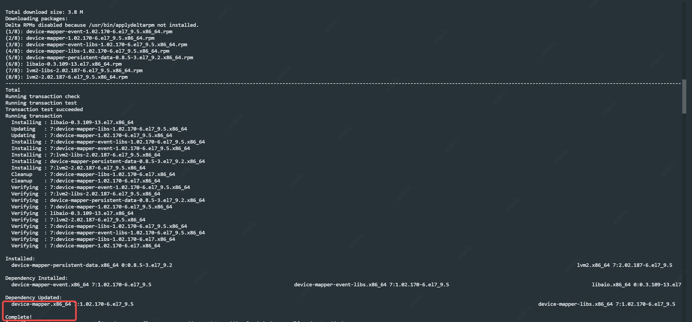
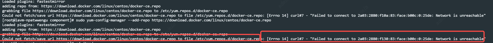
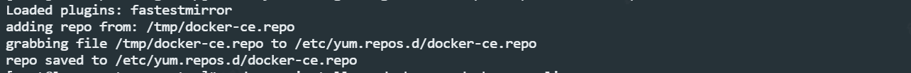
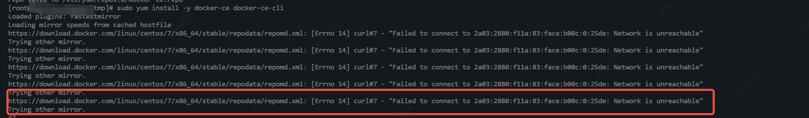
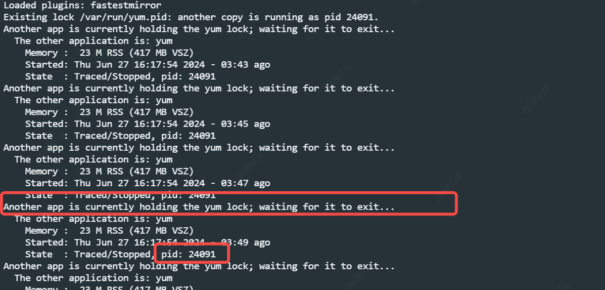
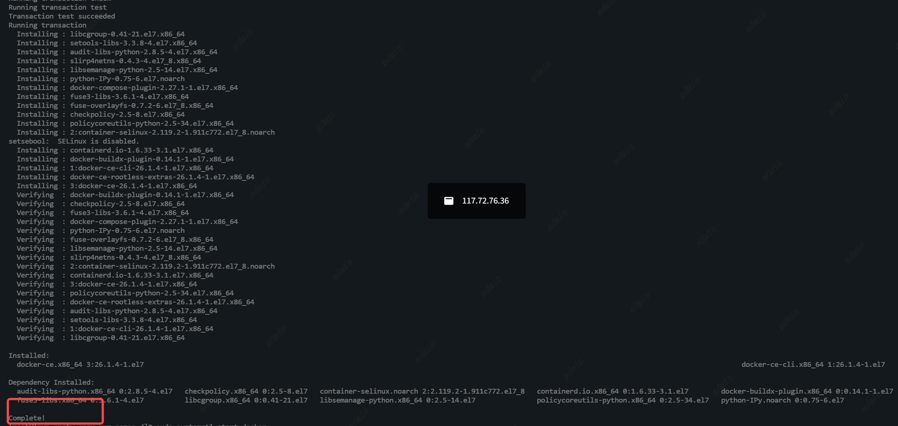
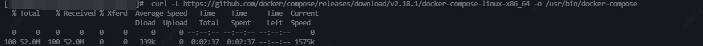

# Docker部署

系统环境要求

内核版本：Docker要求运行在Linux内核3.10或更高版本上。

检查你的内核版本：

```
uname -r
```

## 第一步

```
sudo yum install -y yum-utils device-mapper-persistent-data lvm2
```


## 第二步

```
sudo yum-config-manager --add-repo https://download.docker.com/linux/centos/docker-ce.repo
```

如果报错



说明拉不下来，可以外面把这份https://download.docker.com/linux/centos/docker-ce.repo文件下载下来，然后放到服务器上/tmp文件夹下

```
sudo yum-config-manager --add-repo /tmp/docker-ce.repo
```

展示以下说明完成



文件保存在 /etc/yum.repos.d/docker-ce.repo 中

## 第三步

```
sudo yum install -y docker-ce docker-ce-cli
```

如果报错



说明拉不下来。

将 /etc/yum.repos.d/文件夹下的docker-ce.repo文件中的yum源指向国内的yum源。

可以直接将原来的docker-ce.repo备份为docker-ce.repo.bak 重新创建一个docker-ce.repo文件内容改为 替换成清华大学的repo源

```
[docker-ce-stable]
name=Docker CE Stable - $basearch
baseurl=https://mirrors.tuna.tsinghua.edu.cn/docker-ce/linux/centos/7/$basearch/stable
enabled=1
gpgcheck=1
gpgkey=https://mirrors.tuna.tsinghua.edu.cn/docker-ce/linux/centos/gpg
 
[docker-ce-stable-debuginfo]
name=Docker CE Stable - Debuginfo $basearch
baseurl=https://mirrors.tuna.tsinghua.edu.cn/docker-ce/linux/centos/7/debug-$basearch/stable
enabled=0
gpgcheck=1
gpgkey=https://mirrors.tuna.tsinghua.edu.cn/docker-ce/linux/centos/gpg
 
[docker-ce-stable-source]
name=Docker CE Stable - Sources
baseurl=https://mirrors.tuna.tsinghua.edu.cn/docker-ce/linux/centos/7/source/stable
enabled=0
gpgcheck=1
gpgkey=https://mirrors.tuna.tsinghua.edu.cn/docker-ce/linux/centos/gpg
 
[docker-ce-edge]
name=Docker CE Edge - $basearch
baseurl=https://mirrors.tuna.tsinghua.edu.cn/docker-ce/linux/centos/7/$basearch/edge
enabled=0
gpgcheck=1
gpgkey=https://mirrors.tuna.tsinghua.edu.cn/docker-ce/linux/centos/gpg
 
[docker-ce-edge-debuginfo]
name=Docker CE Edge - Debuginfo $basearch
baseurl=https://mirrors.tuna.tsinghua.edu.cn/docker-ce/linux/centos/7/debug-$basearch/edge
enabled=0
gpgcheck=1
gpgkey=https://mirrors.tuna.tsinghua.edu.cn/docker-ce/linux/centos/gpg
 
[docker-ce-edge-source]
name=Docker CE Edge - Sources
baseurl=https://mirrors.tuna.tsinghua.edu.cn/docker-ce/linux/centos/7/source/edge
enabled=0
gpgcheck=1
gpgkey=https://mirrors.tuna.tsinghua.edu.cn/docker-ce/linux/centos/gpg
 
[docker-ce-test]
name=Docker CE Test - $basearch
baseurl=https://mirrors.tuna.tsinghua.edu.cn/docker-ce/linux/centos/7/$basearch/test
enabled=0
gpgcheck=1
gpgkey=https://mirrors.tuna.tsinghua.edu.cn/docker-ce/linux/centos/gpg
 
[docker-ce-test-debuginfo]
name=Docker CE Test - Debuginfo $basearch
baseurl=https://mirrors.tuna.tsinghua.edu.cn/docker-ce/linux/centos/7/debug-$basearch/test
enabled=0
gpgcheck=1
gpgkey=https://mirrors.tuna.tsinghua.edu.cn/docker-ce/linux/centos/gpg
 
[docker-ce-test-source]
name=Docker CE Test - Sources
baseurl=https://mirrors.tuna.tsinghua.edu.cn/docker-ce/linux/centos/7/source/test
enabled=0
gpgcheck=1
gpgkey=https://mirrors.tuna.tsinghua.edu.cn/docker-ce/linux/centos/gpg
 
[docker-ce-nightly]
name=Docker CE Nightly - $basearch
baseurl=https://mirrors.tuna.tsinghua.edu.cn/docker-ce/linux/centos/7/$basearch/nightly
enabled=0
gpgcheck=1
gpgkey=https://mirrors.tuna.tsinghua.edu.cn/docker-ce/linux/centos/gpg
 
[docker-ce-nightly-debuginfo]
name=Docker CE Nightly - Debuginfo $basearch
baseurl=https://mirrors.tuna.tsinghua.edu.cn/docker-ce/linux/centos/7/debug-$basearch/nightly
enabled=0
gpgcheck=1
gpgkey=https://mirrors.tuna.tsinghua.edu.cn/docker-ce/linux/centos/gpg
 
[docker-ce-nightly-source]
name=Docker CE Nightly - Sources
baseurl=https://mirrors.tuna.tsinghua.edu.cn/docker-ce/linux/centos/7/source/nightly
enabled=0
gpgcheck=1
gpgkey=https://mirrors.tuna.tsinghua.edu.cn/docker-ce/linux/centos/gpg
```

再次执行

```
sudo yum install -y docker-ce docker-ce-cli
```

如果报错



说明yum被另一个应用占用，pid为24091，直接kill掉这个进程

```
kill -9 24091
```

再次执行

```
sudo yum install -y docker-ce docker-ce-cli
```

出现如下标识成功



## 第四步

```
sudo systemctl start docker
sudo systemctl enable docker
```

出现标识成功


## 第五步

```
docker --version
```

查看docker版本，标识docker部署完成


## 第六步

```
 curl -L https://github.com/docker/compose/releases/download/v2.18.1/docker-compose-linux-x86_64 -o /usr/bin/docker-compose
```

出现以下标识成功



然后修改`/usr/bin/docker-compose` 文件执行权限

```
sudo chmod +x /usr/bin/docker-compose
```

再执行 查看docker-compose版本

```
docker-compose -v
```

出现以下标识成功


参考来源：https://blog.csdn.net/w137160164/article/details/131405184