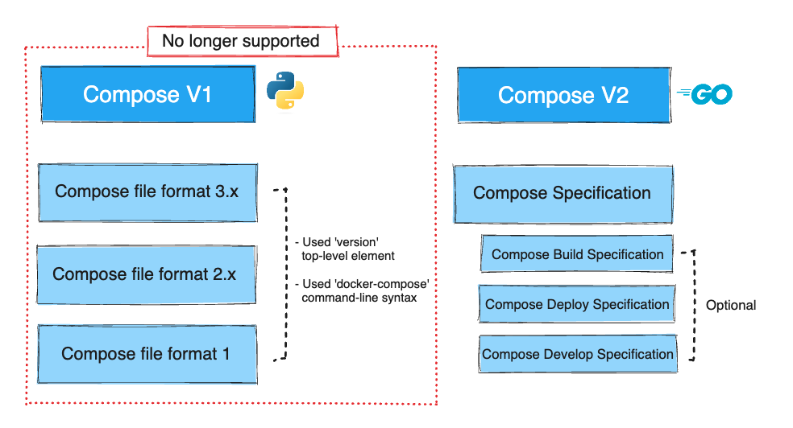
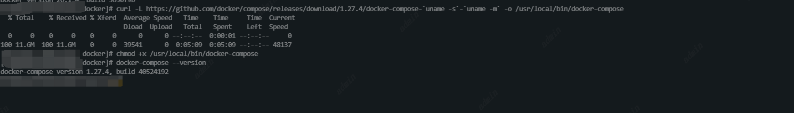

# Docker Compose简介
现在应用程序都是以微服务的形式相互协作共同组成一个完成可用的应用。所以将这些微服务组织在一起，部署、管理都是困难的，使用Dockers Compose可以解决这个问题。
Docker Compose并不是通过脚本和各种复杂的docker命令来将应用组织起来，而是**通过一个声明式的配置文件描述整个应用，从而使整个应用通过一条命令完成部署**。部署成功后还可以通过一系列简单的命令对应用整体进行周期管理。
what：Docker Compose是一个多容器的管理工具
Why：可以精简开发、部署和管理容器应用。
1. 控制简单：使用YML文件对多个服务、网络、挂载进行管理。
2. 高效合作：配置文件易于共享，促进了开发人员、运维团队和其他利益相关者之间的协作。
3. 快速应用软件开发：Compose会缓存已经创建好的容器以备复用。当没有改变的重启服务的适合，会直接复用已存在的容器，这会让部署变得很快。
4. 跨环境的可移植性：支持参数在配置文件中，可以自定义参数以适配不同的环境和不同的使用者
5. 广泛的社区和支持：活跃的社区驱动的生态系统有助于Docker Compose的持续改进，并帮助用户有效地解决问题。
How：1. 配置docker-compose.yml文件。2. 启动docker-compose

## Docker Compose的背景
Docker Compose的前身是Fig。Fig是一个基于Docker 的Python工具，允许用户基于一个YAML文件定义多容器应用，从而可以使用fig命令行工具进行应用的部署。Fig还可以对应用的全生命周期进行管理。
在2014年，Docker公司收购了Orchard公司，并将Fig更名为Docker Compose。命令行工具也从fig 更名为docker-compose ，并自此成为绑定在Docker引擎之上的外部工具。
虽然它从未完全集成到Docker引擎中，但是仍然受到广泛关注并得到普遍使用。


撰写V1发布了撰写文件格式的三个主要版本:
1. 撰写文件格式1与撰写1.0.0在2014年
2. 撰写文件格式2。在2016年发布Compose 1.6.0
3. 撰写文件格式在2017年发布Compose 1.10.0
撰写文件格式1与2、3所有格式都有本质上的不同，因为它缺少顶级服务键。它的使用是历史的，以这种格式编写的文件不能在ComposeV2中运行。
撰写文件格式2。X和3。它们彼此非常相似，但后者引入了许多针对Swarm部署的新选项。

撰写V2使用撰写规范进行项目定义。与之前的文件格式不同，撰写规范是滚动的，并使版本顶级元素成为可选的。Compose V2还使用了可选的规范——部署、开发和构建。
为了使迁移更容易，Compose V2对在Compose文件格式2.x/3之间已弃用或更改的某些元素具有向后兼容性。x和撰写规范。

## 安装Docker Compose（在Linux上安装Docker Compose）
Docker引擎、Docker Compose以及Compose文件之间的版本兼容性信息，可搜索参考“Compose file versions and upgrading”。
```
curl -L https://github.com/docker/compose/releases/download/1.27.4/docker-compose-`uname -s`-`uname -m` -o /usr/local/bin/docker-compose

chmod +x /usr/local/bin/docker-compose

docker-compose --version
```


## docker-compose.yml文件
Docker Compose默认使用文件名docker-compose.yml 。用户也可以使用-f 参数指定具体文件。
主要一级参数：
1. version 版本。必填。一般位于文件的第一行，定义了总体的版本。
2. services 服务。必填。用于定义不同的应用服务。
3. network 网络。用于指引Docker创建新的网络。默认情况下，DockerCompose会创建bridge 网络。这是一种单主机网络，只能够实现同一主机上容器的连接。当然，也可以使用driver 属性来指定不同的网络类型。services上的服务都连接到counter-net网络的话，衙门就可以通过名称解析到对方的地址了。
4. volumes 挂载。用于指引Docker来创建新的卷。


