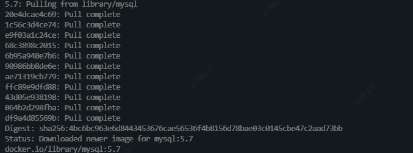
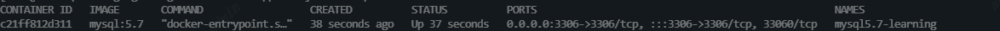
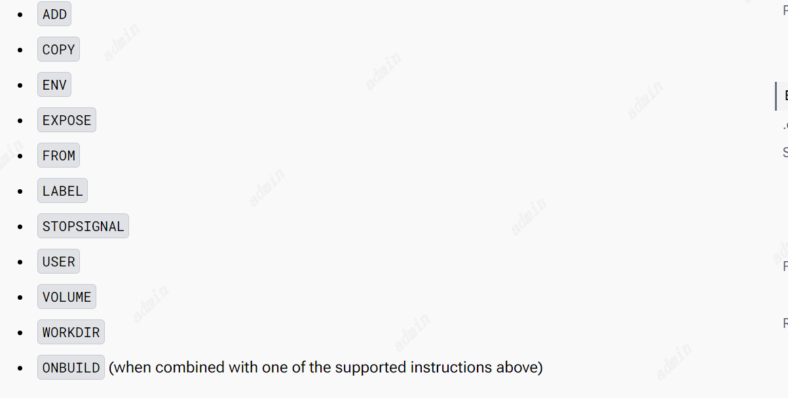
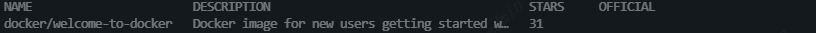
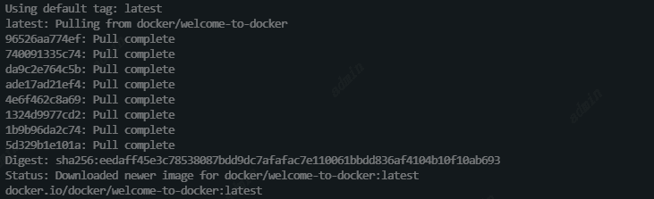
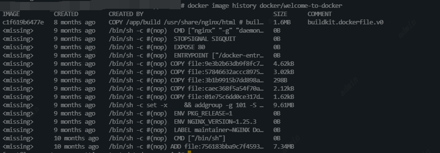
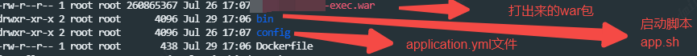
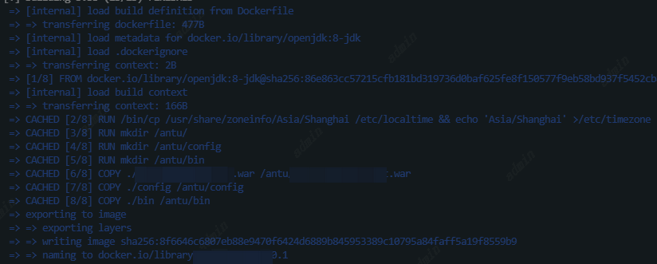

# 容器

思考：如果你开发了一个Web应用，你需要把它分享给你其他的开发伙伴，你该如何做？你如何确定你环境上所有的版本在其他地方部署也是一样的？

容器可以帮你解决这个问题。

什么是容器？容器是每一个应用的组件的独立的进程。无论这个应用的前端、后端、数据库都运行再一个独立的环境，完全与机器上的一切隔离。

所以容器有以下特性

1. 自足性。每个容器中包含程序需要的一切而不依赖于宿主机
2. 隔离性。一旦一个容器在独立的环境中运行，它们对主机和其他容器的影响最小，这增加了应用的安全性
3. 独立性。每一个容器都可被独立管理，大会拿出一个容器不会影响其他的容器
4. 可移植性。容器可以在任何地方运行，可以运行在你的机器上、数据中心或者云服务器。

## 容器与虚拟机

虚拟机：一个完整的操作系统，包含内核、硬件驱动、程序、应用等。

如果使用虚拟机仅仅是为了去隔离一个应用程序这是一个巨大的开销。

而容器仅仅是一个进程，这个进程上运行了所有他需要的文件。如果运行多个容器，容器之间可以共享一个操作系统内核以便在更少的基础架构上尽可能多的运行应用程序。

**通常容器与虚拟机一起使用。**

## 实践：部署一个MySQL5.7

1. 拉去镜像

```
docker pull mysql:5.7
```



查看镜像是否已存在

```
docker images
```

2. 创建并启动Mysql容器

mysql5.7-learning：容器名称

**-d**： 后台运行容器，并返回容器ID。

**-v** /component/mysql-docker-data:/var/lib/mysql：将本地的/component/mysql-docker-data路径挂载到容器的/var/lib/mysql，这样后续销毁容器数据也不会丢失，重新创建新容器后指       定这个挂载目录数据依然保留

**-p** 3306:3307：将容器的MYSQL实例端口映射到外部，后续可以通过主机ip+映射端口访问到MySql容器

**-e** MYSQL_ROOT_PASSWORD=123456：执行Mysql实例的密码

mysql:5.7：指定使用哪个镜像创建容器

```
docker run --name mysql5.7-learning -d -v /component/mysql-docker-data:/var/lib/mysql -p 3306:3306 -e MYSQL_ROOT_PASSWORD=123456 mysql:5.7
```

查看容器是否已存在

```
docker ps 
```



停止容器

```
docker stop 容器ID
```

删除容器

```
docker rm 容器ID
```


# 镜像

一个容器是一个独立的进程，那么他是从哪里获取到需要运行的文件和配置的呢？如何将这个进程所需的环境共享呢？

答案就是通过容器镜像。

一个镜像是一个标准化的包，其中包含运行一个容器的所有文件、二进制二进制、库以及配置。

对于镜像有两个原则：

1. 镜像是不可变的。一旦一个镜像产生，就不能修改，你可以创建一个新的镜像去替换他。
2. 镜像是分层的。每一层表示一组文件系统更改，用于文件的修改、增加、删除。

这两个原则让你扩展和增加你现有的镜像。

## 层（Layer）

镜像的层是构建镜像的基本单位。

最底层的 Layer 为 BaseImage（一般为一个操作系统的 ISO 镜像），然后顺序执行每一条指令，生成的 Layer 按照入栈的顺序逐渐累加，最终形成一个 Image。

layer是指在构建镜像时产生的一些列分层的文件系统，每一个layer都是基于前面一层进行更改或添加，而不是一个完整的文件系统。

这种分层结构充分利用了Copy-on-Write技术，‌使得Docker镜像的构建速度和存储效率更高。‌每个Layer都有一个唯一的ID，‌创建时间和对应的命令，‌我们可以通过`docker history`命令来查看镜像的Layer历史记录。‌

## Dockerfile

通过DockerFile文件，使用docker build 命令构建一个镜像

DockerFile 中的每一条命令的执行结果都会成为 Image 中的一个 Layer。

如Dockerfile.yml文件，示例文件有七个命令，那么就会构建七层，每一层生成一个独立的id，可以标识这一层的内容。

```
# Use an official Python runtime as a parent image
# 第一层
FROM python:2.7-slim

# Set the working directory to /app
# 第二层
WORKDIR /app

# Copy the current directory contents into the container at /app
# 第三层
COPY . /app

# Install any needed packages specified in requirements.txt
# 第四层
RUN pip install --trusted-host pypi.python.org -r requirements.txt

# Make port 80 available to the world outside this container
# 第五层
EXPOSE 80

# Define environment variable
# 第六层
ENV NAME World

# Run app.py when the container launches
# 第七层
CMD ["python", "app.py"]
```

构建结果

```
root@rds-k8s-18-svr0:~/xuran/exampleimage# docker build -t hello ./
Sending build context to Docker daemon  5.12 kB
Step 1/7 : FROM python:2.7-slim
### 每一层生成一个独立的id
 ---> 804b0a01ea83
Step 2/7 : WORKDIR /app
 ---> Using cache
 ---> 6d93c5b91703
Step 3/7 : COPY . /app
 ---> Using cache
 ---> feddc82d321b
Step 4/7 : RUN pip install --trusted-host pypi.python.org -r requirements.txt
 ---> Using cache
 ---> 94695df5e14d
Step 5/7 : EXPOSE 80
 ---> Using cache
 ---> 43c392d51dff
Step 6/7 : ENV NAME World
 ---> Using cache
 ---> 78c9a60237c8
Step 7/7 : CMD python app.py
 ---> Using cache
 ---> a5ccd4e1b15d
Successfully built a5ccd4e1b15d
```

这样一来，如果 DockerFile 中的内容没有变动，那么相应的镜像在 build 的时候会复用之前的 层，以便提升构建效率。并且，即使文件内容有修改，那也只会重新 build 修改的 layer，其他未修改的也仍然会复用。

那么Dockefile中的都支持哪些指令呢

| 指令        | 含义                               |
| ----------- | ---------------------------------- |
| ADD         | 添加一个本地或远程的文件或目录     |
| ARG         | 构建时使用的变量                   |
| CMD         | 指定默认命令                       |
| COPY        | 拷贝一个文件或目录                 |
| ENTRYPOINT  | 指定默认的可执行文件。             |
| ENV         | 设置环境变量                       |
| EXPOSE      | 应用程序监听哪些端口               |
| FORM        | 创建一个新的构建阶段从一个基础镜像 |
| HEALTHCHECK | 在启动时检查容器的运行状况。       |
| LABEL       | 为镜像添加元数据                   |
| MAINTAINER  | 指定镜像的作者                     |
| ONBUILD     | 指定何时在构建中使用映像的指令。   |
| RUN         | 执行构建命令                       |
| SHELL       | 为镜像设置默认shell                |
| STOPSIGNAL  | 指定一个系统调用信号标识容器的退出 |
| USER        | 设置用户和用户组ID                 |
| VOLUME      | 创建一个挂载卷                     |
| WORKDIR     | 创建一个工作目录                   |
|             |                                    |

Dockerfile文件内的指令不区分大小写，但指令大写可以把它和参数做有效的区分。

### 注释

Docker 会按顺序执行Dockerfile中的指令，一个Dockerfile文件一定是从FROM指令开始，FROM后面可能跟随一些解析指令、注释或者全局变量/这个FROM指令标识当前构建的镜像是基于哪个父镜像。FROM指令之前只能有一个或者多个ARG指令，这些指令声明了在Dockerfile中的FROM行中使用的参数。

BuildKit将以#开头的行视为注释，除非该行是有效的解析器指令。注释行会在执行时被移除。一行中任何地方的#标记都被视为参数。这允许如下语句:

```
# Comment
RUN echo 'we are running some # of cool things'
```

### 解析器指令

在Dockerfile 中， 并非所有以＃开头的行都是注释行，有一类特殊的参数是通过以＃开头的行来指定的，这类行的基本形式是：

\# directive=value

此类行称为解析指令行（ Parser Directives ），它的主要作用是提供一些解析Dockerfile需要使用的参数。

以下都是无效的

```
1. 由于连续多行:
# direc \
tive=value
2. 由于一个解析器指令出现2次：
# directive=value1
# directive=value2

FROM ImageName
3. 被当作注释由于出现在构建指令后面：
FROM ImageName
# directive=value
4. 被当作注释由于出现在一个注释后面而不是解释器命令
# About my dockerfile
# directive=value
FROM ImageName
5. 未知的指令会被当作注释由于无法辨认。另外，当它出现再一个不解析器指令的注释后面，已知的指令也会被当成注释：
# unknowndirective=value
# knowndirective=value

```

以下都是有效的,

```
#directive=value
# directive =value
#	directive= value
# directive = value
#	  dIrEcTiVe=value

```

支持的解析指令

| 解析指令 | 含义                                                         | 示例                                |
| -------- | ------------------------------------------------------------ | ----------------------------------- |
| escape   | escape 指令设置`Dockerfile`里默认的转义符。如果没有指定，默认的转义符是 \ 。 | ```# escape=\  或 # escape=` ```    |
| syntax   | 使用语法分析器指令来声明要用于构建的Dockerfile语法版本，默认BuildKit将使用Dockerfile前端的捆绑版本。声明语法版本可以让您自动使用最新的Dockerfile版本，而无需升级。大部分用户会设置 docker/dockerfile:1。 | ```# syntax=docker/dockerfile:1 ``` |
|          |                                                              |                                     |
|          |                                                              |                                     |

### 环境变量

ENV指令是Dockerfile使用的核心指令。转义还用于在语句中包含类似变量的语法。

环境变量规则：

```
$variable_name or ${variable_name}
```

${variable_name}语法还支持以下指定的一些标准bash修饰符:

${variable:-word}表示如果设置了变量，那么结果将是该值。如果变量未设置，则结果为word。

${variable:+word}表示如果设置了变量，则结果为word，否则结果为空字符串。

下面是一些使用方式，其中第3，4，5和6例子需要在声明`# syntax=docker/dockerfile-upstream:master `才可使用

```
1. 如果variable存在，variable为结果，否则word为结果
${variable:-word} 

2. 如果variable存在，word为结果，否则以空字符串为结果
${variable:+word}

# 以下syntax=docker/dockerfile-upstream:master 才可使用

3. 从前缀中删除匹配长度最短的字符串，如下面例子删除了foob
str=foobarbaz echo ${str#f*b}     # arbaz

4. 从前缀中删除匹配长度最长的字符串，如下面例子删除了foobarb
str=foobarbaz echo ${str##f*b}    # az

5. 从后缀中删除匹配长度最短的字符串，如下面例子删除了baz
string=foobarbaz echo ${string%b*}    # foobar

6. 从后缀中删除匹配长度最长的字符串，如下面例子删除了brzbaz
string=foobarbaz echo ${string%%b*} 

```

环境变量在以下指令中都可以使用



示例

```
FROM busybox
ENV FOO=/bar
WORKDIR ${FOO}   # WORKDIR /bar
ADD . $FOO       # ADD . /bar
COPY \$FOO /quux # COPY $FOO /quux
```

### 忽略文件

使用.dockerignore文件可以标识构建是忽略哪些文件或目录。

### Shell和Exec形式

RUN、CMD、ENTRYPOINT指令都有Shell和Exec两个形式

- `INSTRUCTION ["executable","param1","param2"]` (exec form)
- `INSTRUCTION command param1 param2` (shell form)

Exec表单可以避免shell字符串修改，并且可以使用特定的命令shell或任何其他可执行文件调用命令。它使用JSON数组语法，其中数组中的每个元素是一个命令、标志或参数。

```
ENTRYPOINT ["/bin/bash", "-c", "echo hello"]
```

```
RUN ["c:\\windows\\system32\\tasklist.exe"]
```

Shell形式更宽松，强调易用性、灵活性和可读性。shell表单会自动使用命令shell，而exec表单则不会。

```
RUN source $HOME/.bashrc && \
echo $HOME
或者
RUN source $HOME/.bashrc && echo $HOME
或者
RUN <<EOF
source $HOME/.bashrc && \
echo $HOME
EOF
```

### FROM指令

```
FROM [--platform=<platform>] <image> [AS <name>]
或者
FROM [--platform=<platform>] <image>[:<tag>] [AS <name>]
或者
FROM [--platform=<platform>] <image>[@<digest>] [AS <name>]
```

FROM指令初始化一个新的构建阶段，并为后续指令设置基本映像。**FROM是Dockerfile的必要指令**

需要注意以下规则：

1. 在Dockerfile中，ARG是唯一可能位于FROM之前的指令。参见理解ARG和FROM是如何互动的。

```
ARG  CODE_VERSION=latest
FROM base:${CODE_VERSION}
CMD  /code/run-app

FROM extras:${CODE_VERSION}
CMD  /code/run-extras
```

2. FROM可以在单个Dockerfile中出现多次，以创建多个映像，或者将一个构建阶段用作另一个构建阶段的依赖。只需在每个新的FROM指令之前记录提交操作输出的最后一个映像ID。每个FROM指令清除由前一个指令创建的任何状态。

3. 通过向FROM指令添加AS名，可以为新的构建阶段指定一个可选的名称。该名称可以在后续的FROM <name>、COPY --FROM =<name>和

   RUN --mount=type=bind、FROM =<name>指令中使用，以引用在此阶段构建的映像。

4. tag或digest值是可选的。如果省略其中任何一个，则构建器默认使用最新tag。如果构建器找不到tag值，则返回一个错误。

在FROM引用多平台映像的情况下，可选的--platform标志可用于指定映像的平台。例如:linux/amd64、linux/arm64、windows/amd64。默认情况下，使用构建请求的目标平台。全局构建参数可用于此标志的值，例如，自动平台arg允许您强制一个阶段为本机构建平台(--platform=$BUILDPLATFORM)，并使用它在阶段内交叉编译到目标平台。

//todo https://docs.docker.com/reference/dockerfile/#cmd


## 如何搜索并获取镜像

可以在Dockers Hub或者私有的镜像库中获取。

## 实践1——初级

使用docker search命令可以搜索镜像

```
docker search docker/welcome-to-docker
```



使用docker pull 命令将经常从docker hub 拉取到本地

```
docker pull docker/welcome-to-docker
```



很简单的就拉取下来了，这有点像是git pull

使用 docker image ls或者  docker images  命令可以获取已下载的镜像列表

```
docker image ls 
docker images
```

这里表示的图像大小反映了镜像未压缩的大小，而不是镜像的下载大小。

使用 docker image history命令可以获取镜像的层的使用

```
docker image history docker/welcome-to-docker
```




## 实践2——高级

将Java Web项目打成镜像

项目结构：



### app.sh

准备好项目启动脚本 app.sh（我的脚本是使用{project_name}-exec.war执行的）。

如果直接启动执行./app.sh start|stop|restart

使用docker启动需要执行./app.sh  docker

```
#!/usr/bin/env bash
# vim:ft=sh
#-------------------------------------------------------------------------------------------------------------
#该脚本的使用方式为-->[sh app.sh start|stop|status|restart|watch]
#注意对此文件做任何修改都无法影响到测试和生产环境，在系统部署环境时会还原，仅限于用户在本地部署使用。
#-------------------------------------------------------------------------------------------------------------

if [ ! -n "$JAVA_HOME" ]; then
	export JAVA_HOME="/usr/java/default"
fi

#
#-------------------------------------------------------------------------------------------------------------
#       系统运行参数   运行环境: JDK_1.8+
#-------------------------------------------------------------------------------------------------------------
# 公共参数，不要修改
APP_ID=antu-machine
APP_BIN=$(cd "$(dirname "$0")"; pwd)
APP_HOME=$(cd "$(dirname "$0")"/..; pwd)
SHELL_FILE_NAME=${0##*/}
CLASSPATH=$APP_HOME/config/

#这个是固定的,一定是spring-boot的类
APP_MAIN=org.springframework.boot.loader.WarLauncher
# 这个是PaaS在部署你的app时，会从服务器中读取系统环境变量APP_ID，代表你的APP_ID，不用修改，如果本地运行这脚本可能需要修改
# 打包后的Flat war文件
WAR_FILE=${APP_HOME}/$APP_ID-exec.war

# 定时检测任务配置内容
WATCH_JOB="* * * * * export INSTALL_PATH=$APP_HOME; $APP_BIN/$SHELL_FILE_NAME watch >/dev/null 2>&1"

NOHUPLOG=$APP_ID.out
#NOHUPLOG=nohup.out

# #加载系统配置参数到环境变量
# ENV_FILE=$APP_HOME/.env
# BACKUP_ENV=$APP_HOME/.env_bak
# ##保存环境变量
# env|grep "`cat $ENV_FILE|grep "^export.*="|awk -F "export " '{print$2}'|awk -F "=" '{print$1"="}'`">$BACKUP_ENV
# sed -i "s|'^(.*)='|'^export $1='|g" $BACKUP_ENV
# ##加载
# source $ENV_FILE


#-------------------------------------------------------------------------------------------------------------
#   程序开始
#-------------------------------------------------------------------------------------------------------------

PID=0

_get_pid(){
    javaps=`$JAVA_HOME/bin/jps -l | grep "${WAR_FILE}"`
    if [ -n "$javaps" ]; then
        PID=`echo $javaps | awk '{print $1}'`
    else
        PID=0
    fi
}

# Docker 容器下的运行方式
_docker() {
    _get_pid
    if [ $PID -ne 0 ]; then
        echo "================================================================================================================"
        echo "$APP_ID already started(PID=$PID)"
        echo "================================================================================================================"
    else
        #恢复环境变量的原始参数
        source $BACKUP_ENV
        # 内存大小 由系统环境变量 APP_JAVA_OPTS 配置。
        JAVA_OPTS="-server -Dfile.encoding=UTF-8"
        # $APP_JAVA_OPTS
#        JAVA_OPTS="$JAVA_OPTS -XX:ParallelGCThreads=8 -XX:+UseConcMarkSweepGC -XX:MaxGCPauseMillis=850"
#        JAVA_OPTS="$JAVA_OPTS -XX:+PrintGCDetails -XX:+PrintGCDateStamps -XX:+PrintGCTimeStamps -Xloggc:gc_icube.log"
#        JAVA_OPTS="$JAVA_OPTS -Djava.security.egd=file:/dev/./urandom"

        $JAVA_HOME/bin/java $JAVA_OPTS -Xbootclasspath/a:$CLASSPATH -jar $WAR_FILE 2>&1
    fi
}

_startup(){
    _get_pid
    echo "================================================================================================================"
    if [ $PID -ne 0 ]; then
        echo "$APP_ID already started(PID=$PID)"
        echo "================================================================================================================"
    else
        echo -n "Starting $APP_ID"

        # 内存配置
        JAVA_OPTS="$JAVA_OPTS -Xms1g -Xmx1g"
        JAVA_OPTS="$JAVA_OPTS -XX:ParallelGCThreads=8 -XX:+UseConcMarkSweepGC -XX:MaxGCPauseMillis=850"
        #JAVA_OPTS="$JAVA_OPTS -XX:+PrintGCDetails -XX:+PrintGCDateStamps -XX:+PrintGCTimeStamps -Xloggc:gc_lakehouse-scheduler-common-executor.log"
        JAVA_OPTS="$JAVA_OPTS -Djava.security.egd=file:/dev/./urandom"
        JAVA_OPTS="$JAVA_OPTS -server -Dfile.encoding=UTF-8"

        nohup $JAVA_HOME/bin/java $JAVA_OPTS -Xbootclasspath/a:$CLASSPATH -jar $WAR_FILE > $NOHUPLOG 2>&1 &

        for i in $(seq 5)
        do
        sleep 0.8
        echo -e ".\c"
        done
        _get_pid
        if [ $PID -ne 0 ]; then
            echo "(PID=$PID)...[Success]"
            _add_crontab
            echo "================================================================================================================"
        else
            echo "[Failed]"
            echo "================================================================================================================"
            exit 1
        fi
    fi
}

_shutdown(){
    kill_signal=$1
    _get_pid
    echo "================================================================================================================"
    if [ $PID -ne 0 ]; then
        echo -n "Stopping $APP_ID(PID=$PID)..."
        kill ${kill_signal} $PID
        if [ $? -ne 0 ]; then
            echo "[Failed]"
            echo "================================================================================================================"
            exit 1
            #break
        fi
        for i in $(seq 50)
        do
            sleep 0.9
            _get_pid
            if [ $PID -eq 0 ]; then
                break
            fi
            echo -e ".\c"
        done

        _get_pid
        if [ $PID -eq 0 ]; then
            echo "[Success]"
            _delete_crontab
            echo "================================================================================================================"
        else
            echo "[Failed]"
            echo "================================================================================================================"
            exit 1
        fi
    else
        echo "$APP_ID is not running"
        echo "================================================================================================================"
    fi
}

_status(){
    _get_pid
    echo "================================================================================================================"
    if [ $PID -ne 0 ]; then
        echo "$APP_ID is running(PID=$PID)"
        echo "================================================================================================================"
    else
        echo "$APP_ID is not running"
        echo "================================================================================================================"
    fi
}

_watch(){
    _get_pid
    if [ $PID -ne 0 ]; then
        echo "$APP_ID is running"
    else
        _startup
    fi
}

_add_crontab(){
    # 添加进程检测的定时任务
    (crontab -l | grep -v "$WATCH_JOB"; echo "$WATCH_JOB") | crontab -
}

_delete_crontab(){
    # 删除进程检测的定时任务
    (crontab -l | grep -v "$WATCH_JOB") | crontab -
}

_restart(){
    _shutdown $1
    sleep 1
    _startup
}


#-------------------------------------------------------------------------------------------------------------
#       命令参数
#-------------------------------------------------------------------------------------------------------------

case "$1" in
docker)
    _docker
    ;;
watch)
    _watch
    ;;
restart)
    _restart
    ;;
start)
    _startup
    ;;
stop)
    _shutdown
    ;;
status)
    _status
    ;;
forceStop)
    _shutdown "-9"
    ;;
forceRestart)
    _restart "-9"
    ;;
*)
 echo $"Usage: $SHELL_FILE_NAME {start|stop|status|restart|watch|docker}"
esac

```

### Dockerfile

```
# 基于OpenJDK8作为基础镜像
FROM openjdk:8-jdk

# 修改时区
RUN /bin/cp /usr/share/zoneinfo/Asia/Shanghai /etc/localtime && echo 'Asia/Shanghai' >/etc/timezone
# 在容器里创建一个目录，按照容器外的项目结构创建
RUN mkdir /antu/
RUN mkdir /antu/config
RUN mkdir /antu/bin
# 将需要的war包、配置文件、启动脚本都按照对应的目录结构复制进去
COPY ./antu-machine-exec.war /antu/antu-machine-exec.war
COPY ./config /antu/config
COPY ./bin /antu/bin
#EXPOSE 指令用于告知 Docker 在运行容器时，应该暴露哪些端口给外部。然而，即使没有在 Dockerfile 中使用 EXPOSE 指令，你仍然可
#以在运行容器时使用 -p 或 -P 参数来映射端口或随机映射端口
EXPOSE 9001
# 执行/antu/bin/app.sh启动脚本 参数为docker
ENTRYPOINT ["/bin/sh", "-c", "sh /antu/bin/app.sh docker"]
```

### 打镜像

```
docker build -t antu-service:0.1 . 
```



### 运行

```
docker run --name test-antu-machine-service -d -v /antu/config:/docker/test-project/config -p 9001:9002 antu-service:0.1
```