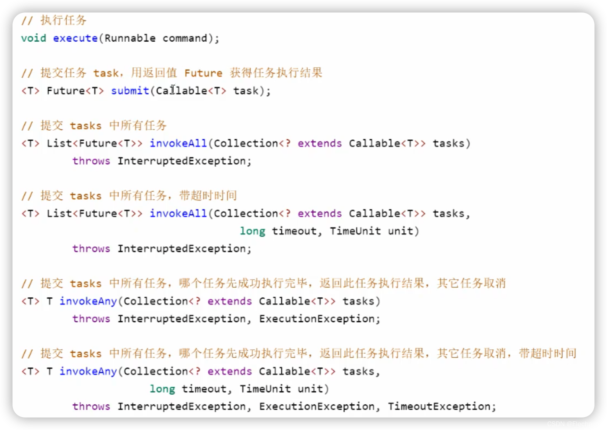

# ThreadPool
1. 通过池化的技术让线程得到复用，减少线程创建、销毁带来的性能开销。
2. 提高响应速度，任务提交进来无需等待，立刻有线程来执行。
3. 提高线程可维护性：线程创建过多，也会造成资源浪费，使用线程池可以统一对线程进行分配、调优和监控。
## 线程池思考
如果需要自己创建一个线程池需要怎么做？
1. 首先定义一个能创建线程的工厂，且创建的线程不能停止，就算任务执行完成后，线程也不能结束。---------ThreadFactory
2. 其次线程池必须是一个生产者消费者模型，创建的工作线程作为消费者不断地执行队列中的任务。
3. 需要一个存放提交任务的队列，这个队列需要是可阻塞的，当队列非空的时候会唤醒消费者（工作线程）来获取任务执行，当队列满了的时候要增加消费者或者阻止生产者提交任务。---------workQueue
4. 队列满了解决有两种方案，第一种：增加消费者，创建额外的工作线；---------corePoolSize，maximumPoolSize
5. 队列满了解决有两种方案，第二种：阻止生产者生产，就需要考虑拒绝策略，如直接报错、丢弃当前任务、丢弃最早的任务、自定义拒绝策略、直接执行等。---------RejectedExecutionHandler
6. 创建新的线程，需要考虑现成的生命周期，毕竟线程一直空跑也会消耗CPU资源，那么就要考虑创建的线程存活时间。---------keepAliveTime, unit
经过以上分析，需要创建一个灵活可满足各种场景的线程池需要有以上几个参数，这几个参数支持用户自定义。
### corePoolSize（线程池的基本大小）
提交一个任务到线程池时，线程池会创建一个新的线程来执行任务。注意：即使有空闲的基本线程能执行该任务，也会创建新的线程。
如果线程池中的线程数已经大于或等于corePoolSize，则不会创建新的线程。
如果调用了线程池的prestartAllCoreThreads()方法，线程池会提前创建并启动所有基本线程。
### maximumPoolSize（线程池的最大数量）
线程池允许创建的最大线程数
阻塞队列已满，线程数小于maximumPoolSize便可以创建新的线程执行任务。
如果使用无界的阻塞队列，该参数没有什么效果。
### workQueue（工作队列）
用于保存等待执行的任务的阻塞队列。
1. ArrayBlockingQueue：基于数组结构的有界阻塞队列，按FIFO（先进先出）原则对任务进行排序。使用该队列，线程池中能创建的最大线程数为maximumPoolSize。
2. LinkedBlockingQueue：基于链表结构的无界阻塞队列，按FIFO（先进先出）原则对任务进行排序，吞吐量高于ArrayBlockingQueue。使用该队列，线程池中能创建的最大线程数为corePoolSize。静态工厂方法 Executor.newFixedThreadPool()使用了这个队列。
3. SynchronousQueue：一个不存储元素的阻塞队列。添加任务的操作必须等到另一个线程的移除操作，否则添加操作一直处于阻塞状态。静态工厂方法 Executor.newCachedThreadPool()使用了这个队列。
4. PriorityBlokingQueue：一个支持优先级的无界阻塞队列。使用该队列，线程池中能创建的最大线程数为corePoolSize。
### keepAliveTime（线程活动保持时间）
线程池的工作线程空闲后，保持存活的时间。如果任务多而且任务的执行时间比较短，可以调大keepAliveTime，提高线程的利用率。
### unit（线程活动保持时间的单位）
可选单位有DAYS、HOURS、MINUTES、毫秒、微秒、纳秒。
### handler（饱和策略，或者又称拒绝策略）
当队列和线程池都满了，即线程池饱和了，必须采取一种策略处理提交的新任务。
1. AbortPolicy：无法处理新任务时，直接抛出异常，这是默认策略。
2. CallerRunsPolicy：只要线程池未关闭，该策略直接在调用者线程中，运行当前的被丢弃的任务。（线程池没有关闭，队列满了，则使用运行线程池的线程执行它。 如果在main里，则就是mian）
3. DiscardOldestPolicy：移除线程队列中最早的一个线程任务，并尝试提交当前任务。
4. DiscardPolicy：直接丢弃任务。
5. 实现RejectedExecutionHandler接口自定义策略
### threadFactory
构建线程的工厂类，可以修改创建的线程名称等
## ThreadPoolExecutor
一般情况下，构造线程使用ThreadPoolExecutor来显示的指定线程池参数，包括核心线程数，最大线程数，时间，队列选择以及大小，线程工厂，拒绝策略。防止因为默认的参数任务数量大或者频繁创建线程带来系统问题。
也是推荐的创建线程池的方式，因为使用ThreadPoolExecutor创建线程池，设计线程池的人需要对传入的参数有足够的了解才能创建出适合自己任务执行的线程池。
```
    public ThreadPoolExecutor(int corePoolSize,
                              int maximumPoolSize,
                              long keepAliveTime,
                              TimeUnit unit,
                              BlockingQueue<Runnable> workQueue) {
        this(corePoolSize, maximumPoolSize, keepAliveTime, unit, workQueue,
             Executors.defaultThreadFactory(), defaultHandler);
    }
```
### 提交任务

### 关闭线程池
shutdown()
非阻塞方式
可以安全地关闭一个线程池，调用 shutdown() 方法之后线程池并不是立刻就被关闭，因为这时线程池中可能还有很多任务正在被执行，或是任务队列中有大量正在等待被执行的任务。
调用 shutdown() 方法后线程池会在**执行完正在执行的任务和队列中等待的任务后才彻底关闭**。
调用 shutdown() 方法后如果还有新的任务被提交，线程池则会根据拒绝策略直接拒绝后续新提交的任务。
```
    public void shutdown() {
        final ReentrantLock mainLock = this.mainLock;
        mainLock.lock();
        try {
            checkShutdownAccess();
              //设置SHUTDOWN 标志 打断空闲线程，设置执行线程中断标志，等待任务运行结束
            advanceRunState(SHUTDOWN); 
            interruptIdleWorkers();  //打断空闲线程
            onShutdown(); // hook for ScheduledThreadPoolExecutor
        } finally {
            mainLock.unlock();
        }
        tryTerminate(); //尝试在打断
    }
    public void execute(Runnable command) {
        if (command == null)
            throw new NullPointerException();
        int c = ctl.get();
        // 线程池中的线程比核心线程数少 
        if (workerCountOf(c) < corePoolSize) {
            // 新建一个核心线程执行任务
            if (addWorker(command, true))
                return;
            c = ctl.get();
        }
        // 核心线程已满，但是任务队列未满，添加到队列中
        if (isRunning(c) && workQueue.offer(command)) {
            int recheck = ctl.get();
            // 任务成功添加到队列以后，再次检查是否需要添加新的线程，因为已存在的线程可能被销毁了
            if (! isRunning(recheck) && remove(command))
                // 如果线程池处于非运行状态，并且把当前的任务从任务队列中移除成功，则拒绝该任务
                reject(command);
            else if (workerCountOf(recheck) == 0)
                // 如果之前的线程已经被销毁完，新建一个非核心线程
                addWorker(null, false);
        }
        // 核心线程池已满，队列已满，尝试创建一个非核心新的线程
        else if (!addWorker(command, false))
            // 如果创建新线程失败，说明线程池关闭或者线程池满了，拒绝任务
            reject(command);
    }
```
shutdownNow()
非阻塞方法
执行 shutdownNow 方法之后，首先会给所有线程池中的线程发送 interrupt 中断信号，尝试中断这些任务的执行，然后会将任务队列中正在等待的所有任务转移到一个 List 中并返回。
我们可以根据返回的任务 List 来进行一些补救的操作，例如记录在案并在后期重试。
interruptWorkers
让每一个已经启动的线程都中断，这样线程就可以在执行任务期间检测到中断信号并进行相应的处理，提前结束任务
```
    public List<Runnable> shutdownNow() {
        List<Runnable> tasks;
        final ReentrantLock mainLock = this.mainLock;
        mainLock.lock();
        try {
            checkShutdownAccess();
            advanceRunState(STOP);  //设置stop 标志 打断  执行和没执行的线程都打断
            interruptWorkers();  //打断线程
            tasks = drainQueue();
        } finally {
            mainLock.unlock();
        }
        tryTerminate();
        return tasks;  //返回队列中任务
    }

```
shutdown 和 shutdownNow 的区别？
shutdown 会等待线程池中的任务执行完成之后关闭线程池，而 shutdownNow 会给所有线程发送中断信号，中断任务执行，然后关闭线程池
shutdown 没有返回值，而 shutdownNow 会返回关闭前任务队列中未执行的任务集合（List）

## Executors
Java中线程池的创建有两个方式一个是通过ThreadPoolExecutor直接创建，另一个是通过Executors
### Executors
Executors提供了快速创建线程池的方法
#### newFixedThreadPool（定长线程池）
````
    public static ExecutorService newFixedThreadPool(int nThreads) {
        return new ThreadPoolExecutor(nThreads, nThreads,
                                      0L, TimeUnit.MILLISECONDS,
                                      new LinkedBlockingQueue<Runnable>());
    }
````
从参数可以看出定长线程池的核心线程数与最大线程数相等，也就是说工作线程数固定，工作队列使用的是LinkedBlockingQueue无界队列。这就意味着，未能及时执行的任务都将添加到这个队列里面
随着任务的增加，这个队列所占用的内存将越来越多。最终导致OOM也是迟早的事情。
场景：
1. 并发执行多个任务，并且这些任务之间不太依赖于其他任务的完成，并且你希望有一个固定的线程池大小时使用，但任务数量需要控制，不然容易OOM
#### newCachedThreadPool（缓存线程池）
```
    public static ExecutorService newCachedThreadPool() {
        return new ThreadPoolExecutor(0, Integer.MAX_VALUE,
                                      60L, TimeUnit.SECONDS,
                                      new SynchronousQueue<Runnable>());
    }
```
从参数可以看出缓存线程池的核心线程数为0，最大线程数为无限大，工作队列为SynchronousQueue同步队列，该队列没有容量即只能存储一个任务。
也就是说明该线程池在接受到任务后**立刻创建**工作线程来执行，执行后一分钟没有复用直接销毁。
场景：
1. 任务执行时间短的场景（如果是非常耗时的任务不建议使用，因为每次提交一个任务都会开启一个线程，线程过多可能导致OMM）可以很明显的提升那些短期存活的异步任务的执行效率
#### newSingleThreadExecutor(单例线程池)
```
public static ExecutorService newSingleThreadExecutor() {
        return new FinalizableDelegatedExecutorService
            (new ThreadPoolExecutor(1, 1,
                                    0L, TimeUnit.MILLISECONDS,
                                    new LinkedBlockingQueue<Runnable>()));
    }
```
从参数可以看出单例线程池定长线程和最大线程都只有一个，工作队列使用的是LinkedBlockingQueue无界队列。
也就是说无论任务多少，都**只有一个**工作线程执行。
场景：
1. 适用于需要保证任务被按顺序执行，并且在任何时候都不会出现多个线程的情况。
#### newScheduledThreadPool(定时线程池)
```
public static ScheduledExecutorService newScheduledThreadPool(int corePoolSize) {
        return new ScheduledThreadPoolExecutor(corePoolSize);
    }
public ScheduledThreadPoolExecutor(int corePoolSize) {
        super(corePoolSize, Integer.MAX_VALUE, 0, NANOSECONDS,
              new DelayedWorkQueue());
    }
```
从参数可以看出定时线程池核心线程数固定，最大工作线程数是无线，工作队列使用的是DelayedWorkQueue延时工作队列。
也就是说任务将可按固定频率执行或延时执行。
按固定频率执行，与任务本身执行时间无关。但有个前提条件，任务执行时间必须小于间隔时间，例如间隔时间是5s，每5s执行一次任务，任务的执行时间必须小于5s。
场景：
1. 适用于周期或延时执行的任务
#### newSingleThreadScheduledExecutor(单例定时线程池)
```
    public static ScheduledExecutorService newSingleThreadScheduledExecutor() {
        return new DelegatedScheduledExecutorService
            (new ScheduledThreadPoolExecutor(1));
    }
       public ScheduledThreadPoolExecutor(int corePoolSize) {
        super(corePoolSize, Integer.MAX_VALUE, 0, NANOSECONDS,~~~~
              new DelayedWorkQueue());
    }
```
从参数可以看出定时线程池核心线程数是1，最大工作线程数是无线，工作队列使用的是DelayedWorkQueue延时工作队列。也就是说如果任务多于一个，那么将按照先后顺序执行，在该线程停止或发生异常时，newSingleThreadExecutor线程池会启动一个新的线程来代替该线程继续执行任务
1. 需要按顺序执行的需要周期或延时执行的任务
#### newWorkStealingPool（窃取线程池）
```
    public static ExecutorService newWorkStealingPool(int parallelism) {
        return new ForkJoinPool
            (parallelism,
             ForkJoinPool.defaultForkJoinWorkerThreadFactory,
             null, true);
    }
```
从参数可以看出窃取线程池是通过ForkJoinPool创建的，通过并行度parallelism参数控制并行的线程数，窃取线程池每一个线程有自己的工作队列WorkQueue。
场景：
1. 创建一个拥有多个任务队列的线程池，可以减少连接数，创建当前可用cpu数量的线程来并行执行，适用于大耗时的操作，可以并行来执行
## 线程大小如何选择
线程池最核心的东西是线程数量选择，一般而言，线程数量选择取决去该任务是计算型还是IO型任务。
理论而言
**计算型
线程数量 = CPU核心数 + 1
IO型
线程数量 = 2 * CPU核心数 + 1**