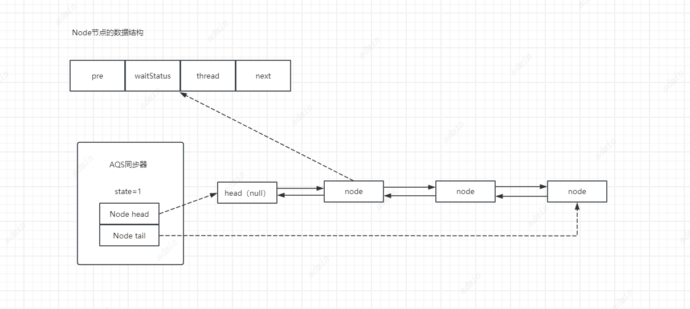
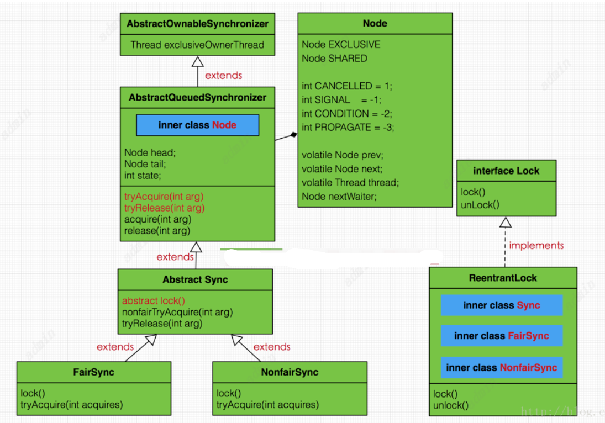
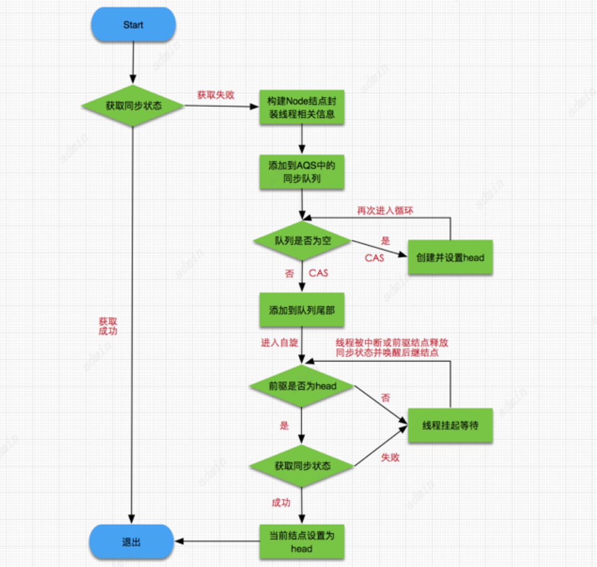
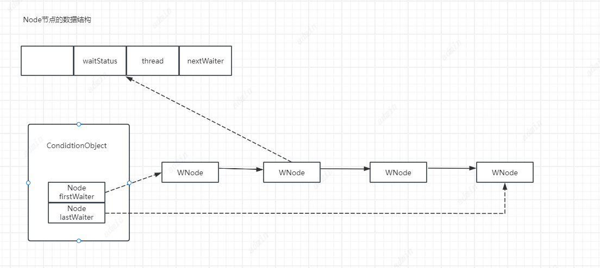
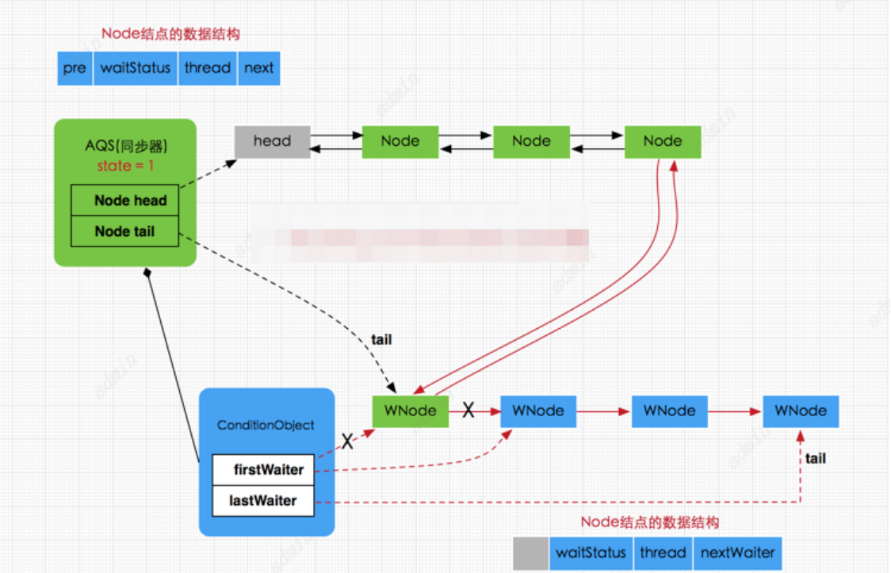

# ReentrantLock

ReentrantLock是JUC包中提供的解决并发安全问题的锁，基本作用与Synchronized关键字相似。ReentrantLock通过手动控制加锁和解锁使锁的使用更灵活，并且提供可重入特性，使一个线程可以多次获得锁减少同一线程竞争锁带来的资源消耗。同时使用ReentrantLock还可以指定锁的竞争是公平的还是非公平的。

主要方法

```java
public interface Lock {
    //加锁
    void lock();

    //解锁
    void unlock();

    //可中断获取锁，与lock()不同之处在于可响应中断操作，即在获
    //取锁的过程中可中断，注意synchronized在获取锁时是不可中断的
    void lockInterruptibly() throws InterruptedException;

    //尝试非阻塞获取锁，调用该方法后立即返回结果，如果能够获取则返回true，否则返回false
    boolean tryLock();

    //根据传入的时间段获取锁，在指定时间内没有获取锁则返回false，如果在指定时间内当前线程未被中并断获取到锁则返回true
    boolean tryLock(long time, TimeUnit unit) throws InterruptedException;

    //获取等待通知组件，该组件与当前锁绑定，当前线程只有获得了锁
    //才能调用该组件的wait()方法，而调用后，当前线程将释放锁。
    Condition newCondition();
}
```

其他方法

```
//查询当前线程保持此锁的次数。
int getHoldCount() 

//返回目前拥有此锁的线程，如果此锁不被任何线程拥有，则返回 null。      
protected  Thread   getOwner(); 

//返回一个 collection，它包含可能正等待获取此锁的线程，其内部维持一个队列，这点稍后会分析。      
protected  Collection<Thread>   getQueuedThreads(); 

//返回正等待获取此锁的线程估计数。   
int getQueueLength();

// 返回一个 collection，它包含可能正在等待与此锁相关给定条件的那些线程。
protected  Collection<Thread>   getWaitingThreads(Condition condition); 

//返回等待与此锁相关的给定条件的线程估计数。       
int getWaitQueueLength(Condition condition);

// 查询给定线程是否正在等待获取此锁。     
boolean hasQueuedThread(Thread thread); 

//查询是否有些线程正在等待获取此锁。     
boolean hasQueuedThreads();

//查询是否有些线程正在等待与此锁有关的给定条件。     
boolean hasWaiters(Condition condition); 

//如果此锁的公平设置为 true，则返回 true。     
boolean isFair() 

//查询当前线程是否保持此锁。      
boolean isHeldByCurrentThread() 

//查询此锁是否由任意线程保持。        
boolean isLocked()       
```


## 可重入

ReentrantLock的可重入方法是提供state变量，当一个线程获取锁时判断state是否为0，如果为0则线程获取锁，并保存当前获取到锁的线程；如果state不为0，则比较获取到锁的线程与当前线程是否为同一个，如果是则state+1。

这种方式下可以解决递归加锁带来的阻塞问题。

可重入锁的场景下加锁次数==释放锁次数。

## AQS

AbstractQueuedSynchronizer又称队列同步器（AQS），它是用来构建锁或其他同步组件的基础框架，通过内部一个int类型的成员变量state来控制同步状态。

当state=0时，说明没有任何线程占有锁，当state>0时，说明有线程正在使用，其他线程必须进入同步队列进行等待。AQS内部通过实现内部类Node构成的FIFO的同步队列来完成线程排队工作，同时利用ConditionObject构建等待队列，当Condidtion调用wait（）方法后，线程会进入灯带队列，当Condition调用signal（）和signalAll（）方法后，线程将等待队列中的线程放入同步队列中进行锁竞争。

注意这里涉及到两种队列，一种的同步队列，当线程请求锁而等待的后将加入同步队列等待，而另一种则是等待队列(可有多个)，通过Condition调用await()方法释放锁后，将加入等待队列。

### AQS抽象类模型

```
/**
 * AQS抽象类
 */
public abstract class AbstractQueuedSynchronizer
    extends AbstractOwnableSynchronizer{
//指向同步队列队头
private transient volatile Node head;

//指向同步的队尾
private transient volatile Node tail;

//同步状态，0代表锁未被占用，1代表锁已被占用
private volatile int state;

//省略其他代码......
}
```

head和tail分别是AQS中的变量，其中head指向同步队列的头部，注意head为空结点，不存储信息。而tail则是同步队列的队尾，同步队列采用的是双向链表的结构这样可方便队列进行结点增删操作。
state变量则是代表同步状态，执行当线程调用lock方法进行加锁后，
如果此时state的值为0，则说明当前线程可以获取到锁(在本篇文章中，锁和同步状态代表同一个意思)，
同时将state设置为1，表示获取成功。如果state已为1，也就是当前锁已被其他线程持有，那么当前执行线程将被封装为Node结点加入同步队列等待。
其中Node结点是对每一个访问同步代码的线程的封装，从图中的Node的数据结构也可看出，其包含了需要同步的线程本身以及线程的状态，如是否被阻塞，是否等待唤醒，是否已经被取消等。
每个Node结点内部关联其前继结点prev和后继结点next，这样可以方便线程释放锁后快速唤醒下一个在等待的线程，Node是AQS的内部类，其数据结构如下：
```java
static final class Node {
    //共享模式
    static final Node SHARED = new Node();
    //独占模式
    static final Node EXCLUSIVE = null;

    //标识线程已处于结束状态，被中断或获取锁超时的线程节点所标记的状态
    static final int CANCELLED =  1;
    //等待被唤醒状态，获取锁失败进入到AQS队列的线程节点所标记的状态
    static final int SIGNAL    = -1;
    //条件状态，调用wait()方法后进入到等待队列的线程节点所标记的状态
    //signal()方法后，CONDITION状态的结点将从等待队列转移到同步队列中，等待获取同步锁。
    static final int CONDITION = -2;
    //在共享模式中使用表示获得的同步状态会被传播
    static final int PROPAGATE = -3;

    //等待状态,存在CANCELLED、SIGNAL、CONDITION、PROPAGATE 4种
    volatile int waitStatus;

    //同步队列中前驱结点
    volatile Node prev;

    //同步队列中后继结点
    volatile Node next;

    //请求锁的线程
    volatile Thread thread;

    //等待队列中的后继结点，这个与Condition有关，稍后会分析
    Node nextWaiter;

    //判断是否为共享模式
    final boolean isShared() {
        return nextWaiter == SHARED;
    }

    //获取前驱结点
    final Node predecessor() throws NullPointerException {
        Node p = prev;
        if (p == null)
            throw new NullPointerException();
        else
            return p;
    }

    //.....
}

```
其中SHARED和EXCLUSIVE常量分别代表共享模式和独占模式，所谓共享模式是一个锁允许多条线程同时操作，
如信号量Semaphore采用的就是基于AQS的共享模式实现的，
而独占模式则是同一个时间段只能有一个线程对共享资源进行操作，多余的请求线程需要排队等待，如ReentranLock。
变量waitStatus则表示当前被封装成Node结点的等待状态，共有4种取值CANCELLED、SIGNAL、CONDITION、PROPAGATE。

1. CANCELLED：值为1，在同步队列中等待的线程等待超时或被中断，需要从同步队列中取消该Node的结点，其结点的waitStatus为CANCELLED，即结束状态，进入该状态后的结点将不会再变化。

2. SIGNAL：值为-1，被标识为该等待唤醒状态的后继结点，当其前继结点的线程释放了同步锁或被取消，将会通知该后继结点的线程执行。说白了，就是处于唤醒状态，只要前继结点释放锁，就会通知标识为SIGNAL状态的后继结点的线程执行。

3. CONDITION：值为-2，与Condition相关，该标识的结点处于等待队列中，结点的线程等待在Condition上，当其他线程调用了Condition的signal()方法后，CONDITION状态的结点将从等待队列转移到同步队列中，等待获取同步锁。

4. PROPAGATE：值为-3，与共享模式相关，在共享模式中，该状态标识结点的线程处于可运行状态。

5. 0状态：值为0，代表初始化状态。

ReentrantLock内部存在3个实现类，分别是Sync、NonfairSync、FairSync，
其中Sync继承自AQS实现了解锁tryRelease()方法，而NonfairSync(非公平锁)、 FairSync(公平锁)则继承自Sync，实现了获取锁的tryAcquire()方法，
ReentrantLock的所有方法调用都通过间接调用AQS和Sync类及其子类来完成的。
从设计模式角度来看，AQS采用的模板模式的方式构建的，其内部除了提供并发操作核心方法以及同步队列操作外，还提供了一些模板方法让子类自己实现，如独占模式下的tryAcquire()方法和tryRelease()方法，以及共享模式下的tryAcquireShared()方法和tryReleaseShared()方法。
因为实现上分为两种模式，即共享模式与独占模式，而这两种模式的加锁与解锁实现方式是不一样的，但AQS只关注内部公共方法实现并不关心外部不同模式的实现，所以提供了模板方法给子类使用。
***ReetrantLock是独占模式的锁。***


## 公平锁和非公平锁

### 非公平锁（不判断AQS队列中没线程排队就直接去抢占锁）
不管当前AQS队列是否有线程排队，直接去执行CAS方式加锁，如果加锁成功把获得锁的线程保存到exclusiveOwnerThread中，返回true。
如果加锁失败，则走AQS获取锁的方式。
#### 加锁
```java
/**
 * 非公平锁实现
 */
static final class NonfairSync extends Sync {
    //加锁
    final void lock() {
        //首先进行一次锁的抢占，执行CAS操作，获取同步状态
        if (compareAndSetState(0, 1))
       //成功则将独占锁线程设置为当前线程  
          setExclusiveOwnerThread(Thread.currentThread());
        else
            //抢占失败再次请求同步状态
            acquire(1);
    }
    //请求同步状态
    public final void acquire(int arg) {
        //tryAcquire由NonfairSync子类实现
        //tryAcquire(arg)再次尝试获取锁，如果失败将当前线程封装成排他节点放入AQS队列
        if (!tryAcquire(arg) &&
                //addWaiter添加到同步队列后，结点就会进入一个自旋过程，即每个结点都在观察时机待条件满足获取同步状态，然后从同步队列退出并结束自旋，
                // 回到之前的acquire()方法，自旋过程是在acquireQueued()方法中执行的
                acquireQueued(addWaiter(Node.EXCLUSIVE), arg))
            selfInterrupt();
    }
    //mode==Node.EXCLUSIVE
    private Node addWaiter(Node mode) {
        //将请求同步状态失败的线程封装成结点
        Node node = new Node(Thread.currentThread(), mode);

        Node pred = tail;
        //如果是第一个结点加入肯定为空，跳过。
        //如果不是第一个结点则直接执行CAS入队操作，尝试在尾部快速添加
        if (pred != null) {
            node.prev = pred;
            //使用CAS执行尾部结点替换，尝试在尾部快速添加
            if (compareAndSetTail(pred, node)) {
                pred.next = node;
                return node;
            }
        }
        //如果第一次加入或者CAS操作没有成功执行enq入队操作
        enq(node);
        return node;
    }
    //当前节点入AQS队列
    private Node enq(final Node node) {
        //死循环
        for (;;) {
            Node t = tail;
            //如果队列为null，即没有头结点
            if (t == null) { // Must initialize
                //创建并使用CAS设置头结点
                if (compareAndSetHead(new Node()))
                    tail = head;
            } else {//队尾添加新结点
                node.prev = t;
                if (compareAndSetTail(t, node)) {
                    t.next = node;
                    return t;
                }
            }
        }
    }

    final boolean acquireQueued(final Node node, int arg) {
        boolean failed = true;
        try {
            boolean interrupted = false;
            //自旋，死循环
            for (;;) {
                //获取前驱结点
                final Node p = node.predecessor();
                //当且仅当p为头结点才尝试获取同步状态。符合FIFO的规则，先进先出。
                if (p == head && tryAcquire(arg)) {
                    //将node设置为头结点
                    setHead(node);
                    //清空原来头结点的引用便于GC
                    p.next = null; // help GC
                    failed = false;
                    return interrupted;
                }
                //shouldParkAfterFailedAcquire()方法返回true，即前驱结点为SIGNAL状态同时又不是head结点，那么使用parkAndCheckInterrupt()方法挂起当前线程，称为WAITING状态，
                // 需要等待一个unpark()操作来唤醒它
                if (shouldParkAfterFailedAcquire(p, node) &&
                        parkAndCheckInterrupt())
                    interrupted = true;
            }
        } finally {
            if (failed)
                //最终都没能获取同步状态，结束该线程的请求
                cancelAcquire(node);
        }
    }

    //判断当前结点的前驱结点是否为SIGNAL状态(即等待唤醒状态)，如果是则返回true。
    // 如果结点的ws为CANCELLED状态(值为1>0),即结束状态，则说明该前驱结点已没有用应该从同步队列移除，执行while循环，直到寻找到非CANCELLED状态的结点。
    // 倘若前驱结点的ws值不为CANCELLED，也不为SIGNAL(当从Condition的条件等待队列转移到同步队列时，结点状态为CONDITION因此需要转换为SIGNAL)，那么将其转换为SIGNAL状态，等待被唤醒。
    private static boolean shouldParkAfterFailedAcquire(Node pred, Node node) {
        //获取当前结点的等待状态
        int ws = pred.waitStatus;
        //如果为等待唤醒（SIGNAL）状态则返回true
        if (ws == Node.SIGNAL)
            return true;
        //如果ws>0 则说明是结束状态，
        //遍历前驱结点直到找到没有结束状态的结点
        if (ws > 0) {
            do {
                node.prev = pred = pred.prev;
            } while (pred.waitStatus > 0);
            pred.next = node;
        } else {
            //如果ws小于0又不是SIGNAL状态，
            //则将其设置为SIGNAL状态，代表该结点的线程正在等待唤醒。
            compareAndSetWaitStatus(pred, ws, Node.SIGNAL);
        }
        return false;
    }

    private final boolean parkAndCheckInterrupt() {
        //将当前线程挂起
        LockSupport.park(this);
        //获取线程中断状态,interrupted()是判断当前中断状态，
        //并非中断线程，因此可能true也可能false,并返回
        return Thread.interrupted();
    }

}
//NonfairSync类
static final class NonfairSync extends Sync {

    protected final boolean tryAcquire(int acquires) {
        return nonfairTryAcquire(acquires);
    }
}

//Sync类
abstract static class Sync extends AbstractQueuedSynchronizer {

    //nonfairTryAcquire方法
    final boolean nonfairTryAcquire(int acquires) {
        final Thread current = Thread.currentThread();
        int c = getState();
        //判断同步状态是否为0，并尝试再次获取同步状态
        if (c == 0) {
            //执行CAS操作
            if (compareAndSetState(0, acquires)) {
                setExclusiveOwnerThread(current);
                return true;
            }
        }
        //如果当前线程已获取锁，属于重入锁，再次获取锁后将status值加1
        else if (current == getExclusiveOwnerThread()) {
            int nextc = c + acquires;
            if (nextc < 0) // overflow
                throw new Error("Maximum lock count exceeded");
            //设置当前同步状态，当前只有一个线程持有锁，因为不会发生线程安全问题，可以直接执行 setState(nextc);
            setState(nextc);
            return true;
        }
        return false;
    }
    //省略其他代码
}

```


#### 释放锁
tryRelease(int releases)方法是ReentrantLock类中内部类自己实现的，因为AQS对于释放锁并没有提供具体实现，必须由子类自己实现。
释放同步状态后会使用unparkSuccessor(h)唤醒后继结点的线程，这里看看unparkSuccessor(h)
```
private void unparkSuccessor(Node node) {
    //这里，node一般为当前线程所在的结点。
    int ws = node.waitStatus;
    if (ws < 0)//置零当前线程所在的结点状态，允许失败。
        compareAndSetWaitStatus(node, ws, 0);

    Node s = node.next;//找到下一个需要唤醒的结点s
    if (s == null || s.waitStatus > 0) {//如果为空或已取消
        s = null;
        for (Node t = tail; t != null && t != node; t = t.prev)
            if (t.waitStatus <= 0)//从这里可以看出，<=0的结点，都是还有效的结点。
                s = t;
    }
    if (s != null)
        LockSupport.unpark(s.thread);//唤醒
}

```

### 公平锁
先获取state，
如果state==0，认为未加锁，如果当前AQS队列中没线程排队时，则使用CAS方式加锁，如果加锁成功把获得锁的线程保存到exclusiveOwnerThread中，返回true。
如果state==1，判断exclusiveOwnerThread中的线程和当前线程是否是同一个，如果是，增加重入次数，返回true。
否则返回 false
#### 加锁
公平锁的获取顺序是完全遵循时间上的FIFO规则，也就是说先请求的线程一定会先获取锁，后来的线程肯定需要排队，这点与前面我们分析非公平锁的nonfairTryAcquire(int acquires)方法实现有锁不同，下面是公平锁中tryAcquire()方法的实现
```
//公平锁FairSync类中的实现
protected final boolean tryAcquire(int acquires) {
            final Thread current = Thread.currentThread();
            int c = getState();
            if (c == 0) {
            //注意！！这里先判断同步队列是否存在结点
                if (!hasQueuedPredecessors() &&
                    compareAndSetState(0, acquires)) {
                    setExclusiveOwnerThread(current);
                    return true;
                }
            }
            else if (current == getExclusiveOwnerThread()) {
                int nextc = c + acquires;
                if (nextc < 0)
                    throw new Error("Maximum lock count exceeded");
                setState(nextc);
                return true;
            }
            return false;
        }
```
该方法与nonfairTryAcquire(int acquires)方法唯一的不同是在使用CAS设置尝试设置state值前，调用了hasQueuedPredecessors()判断同步队列是否存在结点，
如果存在必须先执行完同步队列中结点的线程，当前线程进入等待状态。
这就是非公平锁与公平锁最大的区别，即公平锁在线程请求到来时先会判断同步队列是否存在结点，如果存在先执行同步队列中的结点线程，当前线程将封装成node加入同步队列等待。
而非公平锁呢，当线程请求到来时，不管同步队列是否存在线程结点，直接尝试获取同步状态，获取成功直接访问共享资源，但请注意在绝大多数情况下，非公平锁才是我们理想的选择，毕竟从效率上来说非公平锁总是胜于公平锁。

## 关于synchronized 与ReentrantLock
在JDK 1.6之后，虚拟机对于synchronized关键字进行整体优化后，在性能上synchronized与ReentrantLock已没有明显差距，因此在使用选择上，需要根据场景而定，大部分情况下我们依然建议是synchronized关键字.
原因之一是使用方便语义清晰，二是性能上虚拟机已为我们自动优化。
而ReentrantLock提供了多样化的同步特性，如超时获取锁、可以被中断获取锁（synchronized的同步是不能中断的）、等待唤醒机制的多个条件变量(Condition)等，因此当我们确实需要使用到这些功能是，可以选择ReentrantLock.
## Condition
在并发编程中，每个Java对象都存在一组监视器方法，如wait()\notify()\notifyAll()方法，通过这些方法，可以做到线程之间的通信与协作（等待和唤醒机制），如生产者-消费者模型，这些方法也是配合synchronized关键字使用。
Condition具有更多灵活性和精确性，因为notify()唤醒线程是随机的一个，而Condition则可通过多个Condition实例对象建立更加精细的线程控制，也就带来了更多灵活性了，我们可以简单理解为以下两点
1. 通过Condition能够精细的控制多线程的休眠与唤醒。

2. 对于一个锁，我们可以为多个线程间建立不同的Condition。
主要方法
```java
public interface Condition {

 /**
  * 使当前线程进入等待状态直到被通知(signal)或中断
  * 当其他线程调用singal()或singalAll()方法时，该线程将被唤醒
  * 当其他线程调用interrupt()方法中断当前线程
  * await()相当于synchronized等待唤醒机制中的wait()方法
  */
 void await() throws InterruptedException;

 //当前线程进入等待状态，直到被唤醒，该方法不响应中断要求
 void awaitUninterruptibly();

 //调用该方法，当前线程进入等待状态，直到被唤醒或被中断或超时
 //其中nanosTimeout指的等待超时时间，单位纳秒
 long awaitNanos(long nanosTimeout) throws InterruptedException;

  //同awaitNanos，但可以指明时间单位
  boolean await(long time, TimeUnit unit) throws InterruptedException;

 //调用该方法当前线程进入等待状态，直到被唤醒、中断或到达某个时
 //间期限(deadline),如果没到指定时间就被唤醒，返回true，其他情况返回false
  boolean awaitUntil(Date deadline) throws InterruptedException;

 //唤醒一个等待在Condition上的线程，该线程从等待方法返回前必须
 //获取与Condition相关联的锁，功能与notify()相同
  void signal();

 //唤醒所有等待在Condition上的线程，该线程从等待方法返回前必须
 //获取与Condition相关联的锁，功能与notifyAll()相同
  void signalAll();
}
```
### Condition实现原理
Condition是AQS内实现的等待队列，***使用Condition的前提必须是获得锁***。COndition的等待队列上的节点与同步队列的节点是同一个类Node，节点状态为CONDITION。在实现类ConditionObject中有两个节点分别是FirstWaiter和LastWaiter。
```java
 public class ConditionObject implements Condition, java.io.Serializable {
    //等待队列第一个等待结点
    private transient Node firstWaiter;
    //等待队列最后一个等待结点
    private transient Node lastWaiter;
    //省略其他代码.......
}
```
每个Condition都对应着一个等待队列，也就是一个锁每new一个Condition就会多一个等待队列。等待队列是FIFO模型。在队列中每个节点都包含了一个线程的引用，而该线程就是Condition对象上的等待线程.当线程调用await（）方法才会释放锁，
并构建一个Node节点封装当前线程的信息加入到等待队列中等待，直到被唤醒、中断、超时才从队列中移出。Condition中的等待队列模型如下

在等待队列中使用的变量与同步队列是不同的，Condtion中等待队列的结点只有直接指向的后继结点并没有指明前驱结点，而且使用的变量是nextWaiter而不是next，这点我们在前面分析结点Node的数据结构时讲过。firstWaiter指向等待队列的头结点，lastWaiter指向等待队列的尾结点，等待队列中结点的状态只有两种即CANCELLED和CONDITION，前者表示线程已结束需要从等待队列中移除，后者表示条件结点等待被唤醒。再次强调每个Codition对象对于一个等待队列，也就是说***AQS中只能存在一个同步队列，但可拥有多个等待队列***。
### 等待与唤醒
#### 等待
await()方法主要做了3件事，一是调用addConditionWaiter()方法将当前线程封装成node结点加入等待队列，二是调用fullyRelease(node)方法释放同步状态并唤醒后继结点的线程。三是调用isOnSyncQueue(node)方法判断结点是否在同步队列中，注意是个while循环，如果同步队列中没有该结点就直接挂起该线程，需要明白的是如果线程被唤醒后就调用acquireQueued(node, savedState)执行自旋操作争取锁，即当前线程结点从等待队列转移到同步队列并开始努力获取锁。
```
public final void await() throws InterruptedException {
      //判断线程是否被中断
      if (Thread.interrupted())
          throw new InterruptedException();
      //创建新结点加入等待队列并返回
      Node node = addConditionWaiter();
      //释放当前线程锁即释放同步状态
      int savedState = fullyRelease(node);
      int interruptMode = 0;
      //判断结点是否同步队列(SyncQueue)中,即是否被唤醒
      while (!isOnSyncQueue(node)) {
          //挂起线程
          LockSupport.park(this);
          //判断是否被中断唤醒，如果是退出循环。
          if ((interruptMode = checkInterruptWhileWaiting(node)) != 0)
              break;
      }
      //被唤醒后执行自旋操作争取获得锁，同时判断线程是否被中断
      if (acquireQueued(node, savedState) && interruptMode != THROW_IE)
          interruptMode = REINTERRUPT;
       // clean up if cancelled
      if (node.nextWaiter != null) 
          //清理等待队列中不为CONDITION状态的结点
          unlinkCancelledWaiters();
      if (interruptMode != 0)
          reportInterruptAfterWait(interruptMode);
  }

private Node addConditionWaiter() {
        Node t = lastWaiter;
        // 判断是否为结束状态的结点并移除
        if (t != null && t.waitStatus != Node.CONDITION) {
        unlinkCancelledWaiters();
        t = lastWaiter;
        }
        //创建新结点状态为CONDITION
        Node node = new Node(Thread.currentThread(), Node.CONDITION);
        //加入等待队列
        if (t == null)
        firstWaiter = node;
        else
        t.nextWaiter = node;
        lastWaiter = node;
        return node;
        }
```
#### 唤醒
这里signal()方法做了两件事，一是判断当前线程是否持有独占锁，没有就抛出异常，从这点也可以看出只**有独占模式先采用等待队列**，而共享模式下是没有等待队列的，也就没法使用Condition。二是唤醒等待队列的第一个结点，即执行doSignal(first)
```
 public final void signal() {
     //判断是否持有独占锁，如果不是抛出异常
   if (!isHeldExclusively())
          throw new IllegalMonitorStateException();
      Node first = firstWaiter;
      //唤醒等待队列第一个结点的线程
      if (first != null)
          doSignal(first);
 }
  private void doSignal(Node first) {
     do {
             //移除条件等待队列中的第一个结点，
             //如果后继结点为null，那么说没有其他结点将尾结点也设置为null
            if ( (firstWaiter = first.nextWaiter) == null)
                 lastWaiter = null;
             first.nextWaiter = null;
          //如果被通知节点没有进入到同步队列并且条件等待队列还有不为空的节点，则继续循环通知后续结点
         } while (!transferForSignal(first) &&
                  (first = firstWaiter) != null);
        }

//transferForSignal方法
final boolean transferForSignal(Node node) {
    //尝试设置唤醒结点的waitStatus为0，即初始化状态
    //如果设置失败，说明当期结点node的waitStatus已不为
    //CONDITION状态，那么只能是结束状态了，因此返回false
    //返回doSignal()方法中继续唤醒其他结点的线程，注意这里并
    //不涉及并发问题，所以CAS操作失败只可能是预期值不为CONDITION，
    //而不是多线程设置导致预期值变化，毕竟操作该方法的线程是持有锁的。
    if (!compareAndSetWaitStatus(node, Node.CONDITION, 0))
         return false;

        //加入同步队列并返回前驱结点p
        Node p = enq(node);
        int ws = p.waitStatus;
        //判断前驱结点是否为结束结点(CANCELLED=1)或者在设置
        //前驱节点状态为Node.SIGNAL状态失败时，唤醒被通知节点代表的线程
        if (ws > 0 || !compareAndSetWaitStatus(p, ws, Node.SIGNAL))
            //唤醒node结点的线程
            LockSupport.unpark(node.thread);
        return true;
    }
```
doSignal(first)方法中做了两件事，从条件等待队列移除被唤醒的节点，然后重新维护条件等待队列的firstWaiter和lastWaiter的指向。二是将从等待队列移除的结点加入同步队列(在transferForSignal()方法中完成的)，如果进入到同步队列失败并且条件等待队列还有不为空的节点，则继续循环唤醒后续其他结点的线程。到此整个signal()的唤醒过程就很清晰了，即signal()被调用后，先判断当前线程是否持有独占锁，如果有，那么唤醒当前Condition对象中等待队列的第一个结点的线程，并从等待队列中移除该结点，移动到同步队列中，如果加入同步队列失败，那么继续循环唤醒等待队列中的其他结点的线程，如果成功加入同步队列，那么如果其前驱结点是否已结束或者设置前驱节点状态为Node.SIGNAL状态失败，则通过LockSupport.unpark()唤醒被通知节点代表的线程，到此signal()任务完成，注意被唤醒后的线程，将从前面的await()方法中的while循环中退出，因为此时该线程的结点已在同步队列中，那么while (!isOnSyncQueue(node))将不在符合循环条件，进而调用AQS的acquireQueued()方法加入获取同步状态的竞争中，这就是等待唤醒机制的整个流程实现原理，流程如下图所示（注意无论是同步队列还是等待队列使用的Node数据结构都是同一个，不过是使用的内部变量不同罢了）
