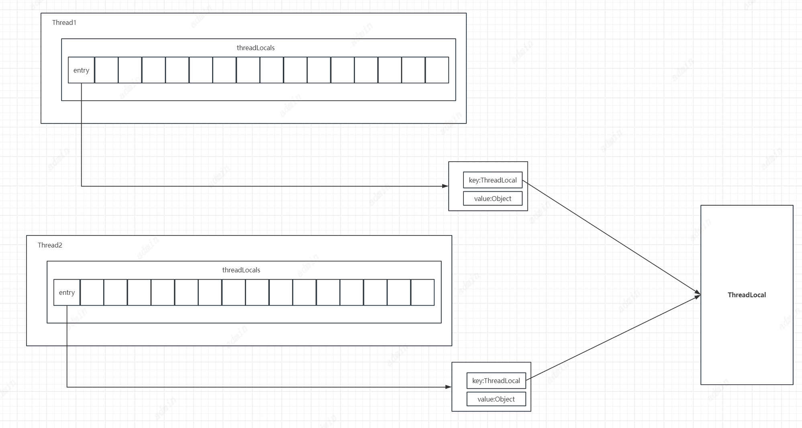
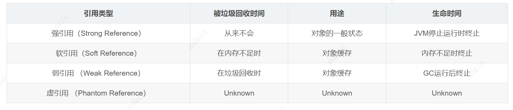

# ThreadLocal
ThreadLocal又叫做线程变量，也就是线程对使用ThreadLocal定义的全局变量的赋值、修改、移除等操作是属于当前线程的。
ThreadLocal本质是在当前线程中叫threadLocals的Map中添加一个元素，这个元素Key为使用ThreadLocal定义的全局变量，value为这个变量的值。也就是每个线程都有一个变量副本，其他线程都不可访问。
默认情况下threadLocals中可以存储16个元素，超过阈值可扩容。
所以使用ThreadLocal封装的变量的修改就可以做到线程隔离了。


## ThreadLocal使用
参考
```
ThreadLocaDemo
```
## 源码分析
set方法
```
    public void set(T value) {
    //获取当前线程
        Thread t = Thread.currentThread();
        //获取当前线程的threadLocals变量
        ThreadLocalMap map = getMap(t);
        if (map != null) {
        //如果线程threadLocals变量不为空，将当前ThreadLocal作为key，value作为值添加进入
            map.set(this, value);
        } else {
         //如果线程threadLocals变量为空，初始化threadLocals并将当前ThreadLocal作为key，value作为值添加进入
            createMap(t, value);
        }
    }
       ThreadLocalMap getMap(Thread t) {
        return t.threadLocals;
    }
    
     private void set(ThreadLocal<?> key, Object value) {

            // We don't use a fast path as with get() because it is at
            // least as common to use set() to create new entries as
            // it is to replace existing ones, in which case, a fast
            // path would fail more often than not.
            
            Entry[] tab = table;
            int len = tab.length;
            //通过key的threadLocalHashCode计算出放入threadLocals的位置
            int i = key.threadLocalHashCode & (len-1);

            //判断计算出来的i索引是否已有数据，如果有继续后续的判断
            //如果有数据且Key存在且与当前传入的Key不相等，则继续向下探索获取下一个位置的数据（nextIndex(i, len)）。（采用的是开放地址法，冲突了就往后找）
            for (Entry e = tab[i];
                 e != null;
                 e = tab[i = nextIndex(i, len)]) {
                ThreadLocal<?> k = e.get();
                //如果有判断存在的数据的key是否与当前要修改的key相等
                if (k == key) {
                    e.value = value;
                    return;
                }

                 //如果key为空则清理当前位置的数据以及前后为空的数据
                if (k == null) {
                    replaceStaleEntry(key, value, i);
                    return;
                }
            }
            //保存数据
            tab[i] = new Entry(key, value);
            int sz = ++size;
            //清除无效数据
            if (!cleanSomeSlots(i, sz) && sz >= threshold)
                rehash();
        }
        //清除无效数据
        private boolean cleanSomeSlots(int i, int n) {
            boolean removed = false;
            Entry[] tab = table;
            int len = tab.length;
            //遍历移除
            do {
                i = nextIndex(i, len);
                Entry e = tab[i];
                if (e != null && e.get() == null) {
                    n = len;
                    removed = true;
                    i = expungeStaleEntry(i);
                }
            } while ( (n >>>= 1) != 0);
            return removed;
        }
        

```
get方法
```
    public T get() {
        //获取当前线程
        Thread t = Thread.currentThread();
        //获取当前线程的threadLocals变量
        ThreadLocalMap map = getMap(t);
        //map不为空且key为当前ThreadLocal的元素不为空，返回元素值
        if (map != null) {
            ThreadLocalMap.Entry e = map.getEntry(this);
            if (e != null) {
                @SuppressWarnings("unchecked")
                T result = (T)e.value;
                return result;
            }
        }
        //如果还不存在key为当前ThreadLocal的元素，添加一个key为当前ThreadLocal，value为初始值的元素，并返回初始值
        return setInitialValue();
    }
    
    //设置初始值和set差不多
        private T setInitialValue() {
        T value = initialValue();
        Thread t = Thread.currentThread();
        ThreadLocalMap map = getMap(t);
        if (map != null) {
            map.set(this, value);
        } else {
            createMap(t, value);
        }
        if (this instanceof TerminatingThreadLocal) {
            TerminatingThreadLocal.register((TerminatingThreadLocal<?>) this);
        }
        return value;
    }

```
remove方法
```
     public void remove() {
      //获取当前线程的threadLocals变量
         ThreadLocalMap m = getMap(Thread.currentThread());
         if (m != null) {
         //移除key为当前ThreadLocal的元素
             m.remove(this);
         }
     }
```
## 弱引用
### Java中什么是引用
如果reference类型的数据中存储的数值代表的是另外一块内存的起始地址，就称这块内存代表着一个引用。引用不等同于对象本身，根据虚拟机种类的不同，可能是一个指向对象起始地址的引用指针，也可能是指向一个代表对象的句柄或其他与此对象相关的位置。
引用的存储位置、长度、结构
引用存储在java虚拟机栈中栈帧所对应的局部变量表中，局部变量表的容量以 变量槽(Variable Slot, 下称Slot) 为单位。虚拟机规范中并没有说明它的长度，也没有明确指出这种引用有怎样的结构，但一般每个Slot都应该能存放一个reference。

一般来说，虚拟机实现至少应当通过这个引用做到两点：

从此引用中直接或间接地查找到对象在java堆中的数据存放的起始地址索引。
此引用中直接或间接地查找到对象所属数据类型在方法区中的存储的类型信息。

### java引用分四种：
1. 强引用
强引用就是指在程序代码之中普遍存在的，类似"Object obj=new Object()"这类的引用，只要强引用还存在，垃圾收集器永远不会回收掉被引用的对象。

2. 软引用
软引用是用来描述一些还有用但并非必需的对象。对于软引用关联着的对象，在系统将要发生内存溢出异常之前，将会把这些对象列进回收范围之中进行第二次回收。如果这次回收还没有足够的内存，才会抛出内存溢出异常。

3. 弱引用
弱引用也是用来描述非必需对象的，但是它的强度比软引用更弱一些，被弱引用关联的对象只能生存到下一次垃圾收集发生之前。当垃圾收集器工作时，无论当前内存是否足够，都会回收掉只被弱引用关联的对象。

4. 虚引用
虚引用也称为幽灵引用或者幻影引用，它是最弱的一种引用关系。一个对象是否有虚引用的存在，完全不会对其生存时间构成影响，也无法通过虚引用来取得一个对象实例。为一个对象设置虚引用关联的唯一目的就是能在这个对象被收集器回收时收到一个系统通知。


### ThreadLocal中的弱引用
ThreadLocal的引用方式为弱引用，每个Thread内部都维护一个ThreadLocalMap字典数据结构，字典的Key值是ThreadLocal。
```java
static class ThreadLocalMap {

        /**
         * The entries in this hash map extend WeakReference, using
         * its main ref field as the key (which is always a
         * ThreadLocal object).  Note that null keys (i.e. entry.get()
         * == null) mean that the key is no longer referenced, so the
         * entry can be expunged from table.  Such entries are referred to
         * as "stale entries" in the code that follows.
         */
        static class Entry extends WeakReference<ThreadLocal<?>> {
            /** The value associated with this ThreadLocal. */
            Object value;

            Entry(ThreadLocal<?> k, Object v) {
                super(k);
                value = v;
            }
        }
}
```
可以看到这里的Entry没有集成Map而是自己实现了一个集成WeakReference的Entry。也就是key是一个弱引用类型，这意味着一次GC可能会将key回收掉，
也就会存在这样的情况：threadLocals中存在一个元素他的key是null，但value还存在。
所以在set方法中会判断key是否为null，如果为null则会向前和向后查找，直到遇到第一个遇到不为空的元素停止，并将前后为空的元素移除。
但不避免的会存在这样的情况：一些Key在一次次GC中被回收，但value还存在，key为空后就算执行了remove方法也无法锁定需要移除的元素也就造成了一些value无法被删除，只要Thread实例一直存在，后续很有可能会造成内存溢出。
## ThreadLocal使用建议
当需要存储线程私有变量的时候，可以考虑使用ThreadLocal来实现
当需要实现线程安全的变量时，可以考虑使用ThreadLocal来实现
当需要减少线程资源竞争的时候，可以考虑使用ThreadLocal来实现
注意Thread实例和ThreadLocal实例的生存周期，因为他们直接关联着存储数据的生命周期