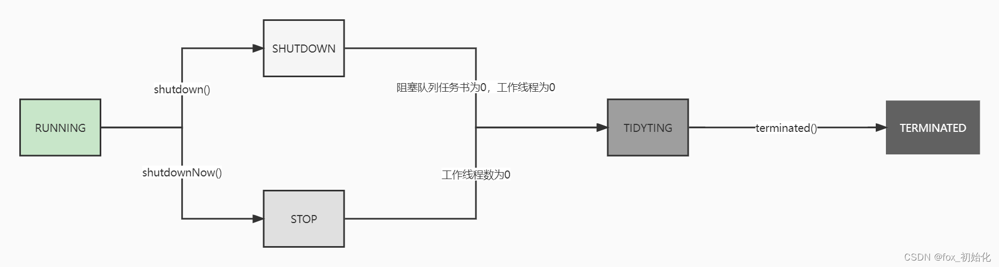
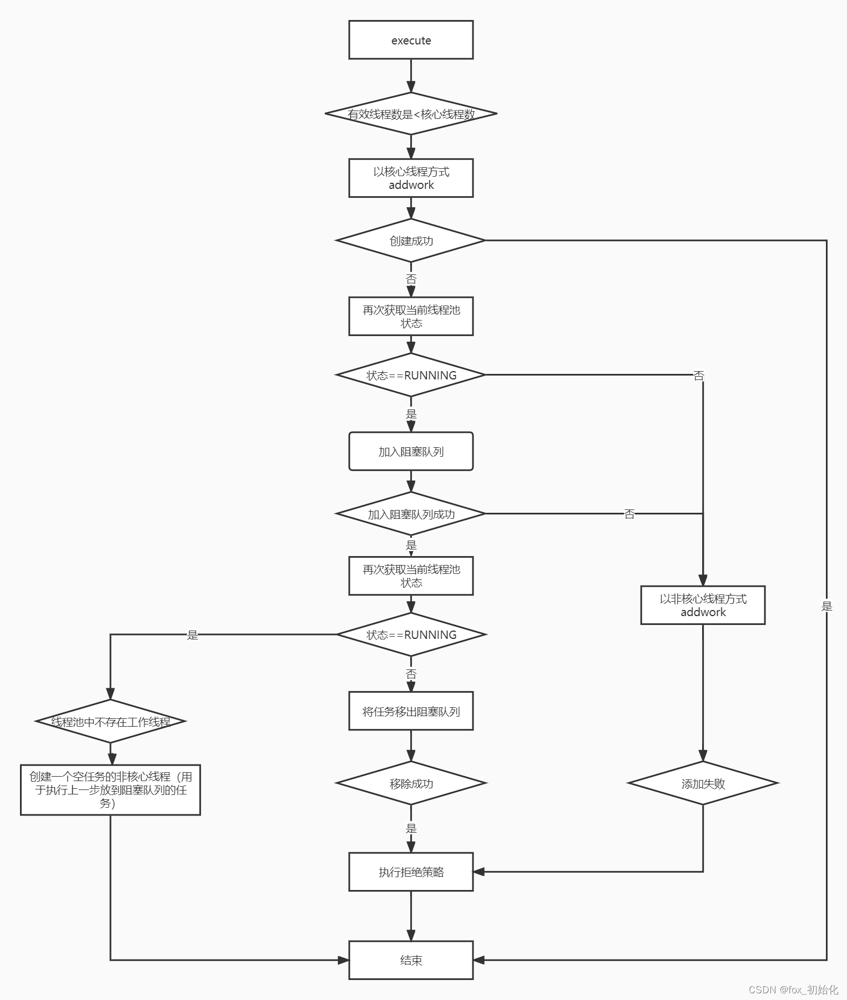
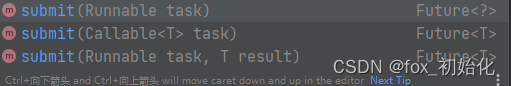

# 线程池的生命周期

```java
 private final AtomicInteger ctl = new AtomicInteger(ctlOf(RUNNING, 0));
```


ThreadPoolExecutor使用一个ctl变量代表两个信息，线程池的运行状态 (runState) 和 线程池内有效线程的数量 (workerCount)，高三位表示状态。

workerCount：线程池内有效线程的数量，工作线程允许开始，不允许停止，使用ctl的低29位表示

runState：线程的生命周期，是有序的随时间递增，也就是状态不可逆的。

```java
    private static final int COUNT_BITS = Integer.SIZE - 3;
    private static final int CAPACITY   = (1 << COUNT_BITS) - 1;

    // runState is stored in the high-order bits
    private static final int RUNNING    = -1 << COUNT_BITS;
    private static final int SHUTDOWN   =  0 << COUNT_BITS;
    private static final int STOP       =  1 << COUNT_BITS;
    private static final int TIDYING    =  2 << COUNT_BITS;
    private static final int TERMINATED =  3 << COUNT_BITS;

    // Packing and unpacking ctl
    private static int runStateOf(int c)     { return c & ~CAPACITY; }
    private static int workerCountOf(int c)  { return c & CAPACITY; }
    private static int ctlOf(int rs, int wc) { return rs | wc; }
```


| 状态       | 描述                                                         | 状态位 			（高三位） |
| ---------- | ------------------------------------------------------------ | ----------------------------- |
| RUNNING    | 运行状态，允许提交新的任务，正常处理阻塞队列中的任务         | 111                           |
| SHUTDOWN   | 关闭状态，不允许提交新的任务，但可以正常处理队列中的任务     | 000                           |
| STOP       | 停止状态，不允许提交新的任务，也不处理队列中的任务，也会停止正在运行的状态 | 001                           |
| TIDYING    | 整理状态，所有的任务都停止，workerCount清零，将会调用terminated() | 010                           |
| TERMINATED | 终止状态，terminated()方法调用完成后的状态                   | 011                           |



#  任务调度

## execute

```java
  public void execute(Runnable command) {
//判断任务是否为空
        if (command == null)
            throw new NullPointerException();
//获取当前工作线程数量和线程状态
        int c = ctl.get();
//如果工作线程数小于核心线程数
        if (workerCountOf(c) < corePoolSize) {
//增加一个核心线程去执行任务
//增加成功结束
            if (addWorker(command, true))
                return;
//增加失败，再次获取当前线程池的工作线程数量和线程状态
            c = ctl.get();
        }
//如果当前线程池正在运行
//将任务放入阻塞队列
        if (isRunning(c) && workQueue.offer(command)) {
//插入成功★
//再次获取当前线程池的工作线程数量和线程状态
            int recheck = ctl.get();
//此时（并发情况）线程池非Running状态
//将任务移除阻塞队列
            if (! isRunning(recheck) && remove(command))
//移除成功，执行抛弃策略
                reject(command);
//移除失败，则判断当前的工作线程数是否为0
            else if (workerCountOf(recheck) == 0)
//为0则增加一个空工作线程，（去执行★之前插入成功的任务）
                addWorker(null, false);
        }
//创建一个非核心线程去执行任务
        else if (!addWorker(command, false))
//创建失败，执行拒绝策略
            reject(command);
    }
```



##  submit



submit传入任务以及其返回值类型，如果任务是Runnable的话上会将任务包装成Callable任务也就是RunnableFuture，然后再丢给execute去执行。

|                  | execute                                         | submit                                                      |
| ---------------- | ----------------------------------------------- | ----------------------------------------------------------- |
| 是否有返回值     | 无                                              | 有，需要阻塞去获取                                          |
| 外部对的异常处理 | 无法处理，使用execute任务出现异常，外部无法感知 | 可以在Future.get()中捕获异常，进行处理                      |
| 执行过程         | 直接放到工作线程                                | 如果参数是Runnable则需要包装成Callable然后执行execute去执行 |
| 接受任务类型     | Runnable                                        | Runnable、Callable                                          |
|                  |                                                 |                                                             |

# 阻塞队列

线程池使用阻塞队列将要执行的任务与线程分开，用生产者和消费者模型实现。

当任务数量超过核心线程数，后续任务就会放入阻塞队列中进行排队。

因为实现了BlockingQueue所以都是线程安全的。

|            | Array 			Blocking 			Queue | Linked 			Blocking 			Queue | Priority 			Blocking 			Queue              | Delay 			Queue                                      | Synchronous 			Queue                                | Linked 			Transfer 			Queue               | Linked 			Blocking 			Deque                |
| ---------- | -------------------------------------------- | --------------------------------------------- | ------------------------------------------------------------ | ------------------------------------------------------------ | ------------------------------------------------------------ | ----------------------------------------------------------- | ------------------------------------------------------------ |
| 名称       | 数组有界阻塞队列                             | 链表有界阻塞队列                              | 优先级无界阻塞队列                                           | 使用优先级队列实现的无界阻塞队列                             | 不存储元素的阻塞队列                                         | 链表无界阻塞队列                                            | 链表双向阻塞队列                                             |
| 实现的方式 | 数组                                         | 链表                                          | 自定义优先级                                                 | 使用 		Priority 			Blocking 			Queue |                                                              | 链表、tryTransfer                                           | 双向链表                                                     |
| 队列长度   | 自定义                                       | Integer.MAX_VALUE                             | 无界                                                         | 无界                                                         | 无界                                                         | 无界                                                        | 无界                                                         |
| 特点       | 支持公平和非公平锁                           |                                               | 可以自定义compareTo()方法进行排序，不能保证同优先级元素的排序 | 可以指定所有才能从队列中获取当前元素，延迟期满了之后才能从队列种获取元素 | 每put操作必须等待take，否则不能put成功。支持公平和非公平锁。 | 与 		LinkedBlockingQueue多了tryTransfer，transfer方法 | 头部和尾部都可以插入元素，多线程并发时们可以将所得竞争降低到一半 |


# 任务拒绝

当线程池的缓存队列已满，线程数也达到了maximumPoolSize 时，再新增任务就会触发拒绝策略。

拒绝策略收到三个参数影响：corePoolSize 、maximumPoolSize 、workQueue 。

当任务提交后，如果没达到核心线程数，则会直接创建核心线程运行，如果达到了核心线程数则会放入队列中等待，当任务数大于workQueue.size+maximumPoolSize则触发拒绝策略。

| 名称            | **AbortPolicy**      | **CallerRunsPolicy**                                         | **DiscardPolicy** | **DiscardOldestPolicy**               |
| --------------- | -------------------- | ------------------------------------------------------------ | ----------------- | ------------------------------------- |
| 策略            | 抛出异常，终止任务   | 使用调用线程执行任务，当触发拒绝策略，只要线程池没有关闭的话，则使用调用线程直接运行任务 | 直接丢弃          | 丢弃workQueue队列最老任务，添加新任务 |
| 场景            | 需要捕获异常进行处理 | 适合并发小，性能要求不高且不允许失败的情况。但是，由于调用者自己运行任务，如果任务提交速度过快，可能导致程序阻塞，性能效率上必然的损失较大 | 允许任务不执行    | 允许任务不执行，且希望执行最新的任务  |
| JDK是否默认使用 | 是                   | 否                                                           | 否                | 否                                    |

# 常用线程池

## newCachedThreadPool

```java
 public static ExecutorService newCachedThreadPool() {
        return new ThreadPoolExecutor(0, Integer.MAX_VALUE,
                                      60L, TimeUnit.SECONDS,
                                      new SynchronousQueue<Runnable>());
```


核心参数

核心线程数：0

最大线程数：Integer.MAX_VALUE

线程存活时间：60s

阻塞队列：SynchronousQueue(同步队列)

分析：因为没有核心线程，所以任务进来都会放入同步队列中，然后创建工作线程去执行，由于没有核心线程，最大线程数又是一个很大的值，基本意味着线程数量无限大，线程池中只要没有空闲线程就会创建新的去执行任务。线程池的线程一旦超过60s就会被销毁。所以当没有任务的时候，几乎不会占用什么资源。

场景：适合任务量大但是时间很短的场景

## newFixedThreadPool

```java
public static ExecutorService newFixedThreadPool(int nThreads) {
        return new ThreadPoolExecutor(nThreads, nThreads,
                                      0L, TimeUnit.MILLISECONDS,
                                      new LinkedBlockingQueue<Runnable>());
```


核心参数

核心线程数=最大线程数

最大线程数=核心线程数

线程存活时间：0

阻塞队列：LinkedBlockingQueue(链表阻塞队列)

分析：由于核心线程数=最大线程数，所以线程池无空闲核心线程则会进入阻塞队列，并且线程池中的线程都是核心线程也不需要销毁。同时使用了LinkedBlockingQueue，队列长度Integer.MAX_VALUE。

场景：适合任务量比较固定但耗时长的任务

## newSingleThreadPool

```java
public static ExecutorService newSingleThreadExecutor() {
        return new FinalizableDelegatedExecutorService
            (new ThreadPoolExecutor(1, 1,
                                    0L, TimeUnit.MILLISECONDS,
                                    new LinkedBlockingQueue<Runnable>()));
    }
```


核心参数

核心线程数=1

最大线程数=1

线程存活时间：0

阻塞队列：LinkedBlockingQueue(链表阻塞队列)

分析：只有一个线程的线程池，当唯一的线程发生异常会重启一个线程代替执行，也就是约等于以单线程的形式进行工作。

场景：适合需要顺序执行任务的场景

newScheduledThreadPool

```java
public ScheduledThreadPoolExecutor(int corePoolSize) {
        super(corePoolSize, Integer.MAX_VALUE, 0, NANOSECONDS,
              new DelayedWorkQueue());
    }
```


核心参数

核心线程数=可指定

最大线程数=Integer.MAX_VALUE

线程存活时间：0

阻塞队列：DelayedWorkQueue（优先级工作队列）

分析：核心线程数是固定的，但非核心是基本没有限制的，因为空闲时间为0，所以一旦非核心线程执行完就会被回收。由于使用的是DelayedWorkQueue，任务会按照顺序执行。

场景：适合执行定时任务和固定周期的重复任务

## newWorkStealingPool

```java
public static ExecutorService newWorkStealingPool() {
        return new ForkJoinPool
            (Runtime.getRuntime().availableProcessors(),
             ForkJoinPool.defaultForkJoinWorkerThreadFactory,
             null, true);
    }
```


核心参数：无

分析：Java8新增的创建线程方式创建时不设置任何参数的话，就会以当前机器的cpu个数为线程个数，此线程池会并行处理任务，不能保证执行顺序。可以充分利用多cpu，多核cpu的优势，把一个任务拆分成多个“小任务”分发到不同的cpu核心上执行，执行完后再把结果收集到一起返回。

场景：需要合理使用cpu资源的场景，且任务耗时很大且无需顺序执行的场景。

# ThreadPoolExecutor

ThreadPoolExecutor的核心池线程的数量该如何设置？

CPU密集型：cpu core+1

IO密集型：2cpu core

cpu core：Runtime.getRuntime().availableProcessors()