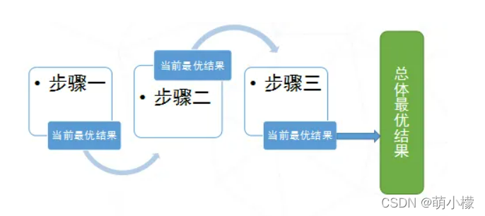

# 贪心算法
## 什么是贪心算法
贪心算法（又称贪婪算法）是指，在对问题求解时，总是做出在当前看来是最好的选择。也就是说，不从整体最优上加以考虑，他所做出的是在某种意义上的局部最优解。 贪心选择是指所求问题的整体最优解可以通过一系列局部最优的选择，即贪心选择来达到。这是贪心算法可行的第一个基本要素。
## 怎么用贪心算法
当一个问题的最优解包含其子问题的最优解时，称此问题具有最优子结构性质。
运用贪心策略在每一次转化时都取得了最优解。问题的最优子结构性质是该问题可用贪心算法求解的关键特征。贪心算法的每一次操作都对结果产生直接影响。贪心算法对每个子问题的解决方案都做出选择，不能回退。
贪心算法的基本思路是从问题的某一个初始解出发一步一步地进行，**根据某个优化测度**，每一步都要确保能获得局部最优解。每一步只考虑一个数据，他的选取应该满足局部优化的条件。若下一个数据和部分最优解连在一起不再是可行解时，就不把该数据添加到部分解中，直到把所有数据枚举完，或者不能再添加算法停止。
一个问题是否需要用到贪心算法，需要找到以下特征：
1. 建立数学模型来描述问题；
2. 把求解的问题分成若干个子问题；
3. 对每一子问题求解，得到子问题的局部最优解；
4. 把子问题的局部最优解合成原来解问题的一个解。

用白话说，即假设一个问题比较复杂，暂时找不到全局最优解，那么我们可以考虑把原问题拆成几个小问题（分而治之思想），分别求每个小问题的最优解，再把这些“局部最优解 ” 叠起来，就 “ 当作 ”整个问题的最优解了。
## 什么时候用贪心算法
//todo  四、跳跃游戏
https://blog.csdn.net/m0_61703823/article/details/124170665?utm_medium=distribute.pc_relevant.none-task-blog-2~default~baidujs_baidulandingword~default-1-124170665-blog-104992385.235^v43^pc_blog_bottom_relevance_base2&spm=1001.2101.3001.4242.2&utm_relevant_index=4

## 贪心算法的总结
我们还要知道的是，贪心算法是一个适用度较小的算法，因为它存在一些缺陷，所以，我们在决定使用贪心算法的时候应该明确：

该算法存在的问题
不能保证求得的最后解是最佳的
不能用来求最大值或最小值的问题
只能求满足某些约束条件的可行解的范围
