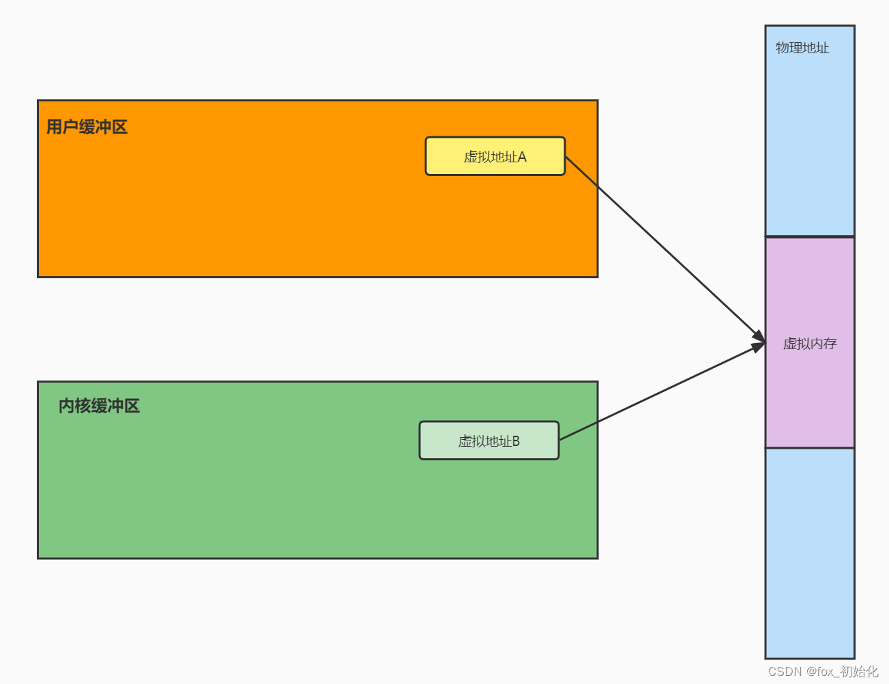

# 1.传统拷贝

FileInputStream、FileOutputStream

read：将数据从磁盘读取到内核态缓冲区，再从内核态缓冲区拷贝到用户缓冲区

write：将数据从用户缓冲区写入到socket缓冲区，再从socket缓冲区写入到网卡设备

内核空间：

主要是提供进程调度、内存分配、连接硬件资源等功能

用户空间：

提供给应用程序的空间，不具有访问内核资源的权限。如果用户程序需要使用到内核空间的资源，则需要通过系统调用来完成。进程从用户空间切换到内核空间，完成相关操作后，再从内核空间切换到用户空间。

内核态：

进程运行在内核空间，被称为进程的内核态

用户态：

进程运行在用户空间，被称为进程的用户态。

## DMA技术

DMA本质上是一块主板上独立的芯片，允许外设设备和内存存储器之间直接进行IO数据传输，**其过程不需要CPU的参与**。

主要流程就是：CPU通知DMA将磁盘数据拷贝到内核态后，CPU就可以无需等待执行其他任务。DMA通知磁盘将数据从磁盘放到磁盘缓冲区，磁盘完成后通知DMA，DMA将数据从磁盘缓冲区放到内内核缓冲区中。完成后，通知CPU来取数据。


1.应用程序调用read函数，向操作系统发起IO调用，**上下文从用户态切换至内核态**
2.DMA控制器把数据从磁盘中读取到内核缓冲区 3.CPU把内核缓冲区数据拷贝到用户应用缓冲区，**上下文从内核态切换至用户态**，此时read函数返回 4.用户应用进程通过write函数，发起IO调用，**上下文从用户态切换至内核态**
5.CPU将缓冲区的数据拷贝到socket缓冲区 6.DMA控制器将数据从socket缓冲区拷贝到网卡设备，**上下文从内核态切换至用户态**，此时write函数返回

从这里可以看到做一次从磁盘到用户缓冲区的数据提取，需要cpu切换2次，cpu拷贝次数1次，DMA拷贝1次，如果是复制那就需要4次CPU切换，2次CPU拷贝，2次DMA拷贝，所以需要减少CPU在用户态与内核态之间的切换次数以及拷贝次数。

# 2. 零拷贝

什么是零拷贝？

零拷贝是指计算机执行IO操作时，CPU不需要将数据从一个存储区域复制到另一个存储区域，进而减少上下文切换以及CPU的拷贝时间，是IO操作优化技术。

### 虚拟内存

虚拟内存远大于物理内存空间。且多个虚拟内存可以映射同一个物理地址。这样当DAM将数据拷贝到内核缓存后，无需cpu将数据再拷贝到用户空间了。



## 实现零拷贝的方式

\1. mmap + write

\2. sendfile

\3. 带有DMA收集拷贝功能的sendfile

### MMAP拷贝

```java
void*mmap(void*addr,size_t length,int prot,int flags,int fd,off_t offset);
```


1.用户进程通过调用mmap方法向操作系统内核发起IO调用，**上下文从用户态切换至内核态**
2.CPU利用DMA控制器，将数据从硬盘拷贝到内核缓冲区 3.**上下文从内核态切换回用户态**，mmap方法返回 4.用户进程通过调用write方法向操作系统内核再次发起IO调用，**上下文从用户态切换至内核态**
5.CPU将内核缓冲区的数据拷贝到socket缓冲区 6.CPU利用DMA控制器，将数据从socket缓冲器拷贝到网卡，**上下文从内核态切换至用户态**，write方法返回

使用mmap + write拷贝，CPU上下文切换4次，拷贝3次（1次CPU拷贝，2次DMA拷贝），由此可见减少了一次CPU拷贝。

### sendfile拷贝

sendfile是Linux2.1版本后内核引入 的一个系统调用函数，原型如下

```java
ssize_t sendfile(int out_fd,int in_fd,off_t*offset,size_t count);
```


sendfile表示两个文件描述符之间传输数据，他是在操作系统内核中操作的，避免了数据从内核缓冲区和用户缓冲区之际七年的拷贝操作，因此可以用它来实现零拷贝。


1.用户进程发起sendfile系统调用，**上下文从用户态切换至内核态**
2.DMA控制器将数据从硬盘拷贝到内核缓冲区 3.CPU将读缓冲区中的数据拷贝到socket缓冲区 4.DMA控制器异步把数据从socket缓冲器拷贝到网卡 5.**上下文从内核态切换至用户态**，sendfile函数返回

使用sendfile拷贝，CPU上下文切换2次，拷贝3次 （1次CPU拷贝，2次DMA拷贝），由此可见减少了两次CPU切换，一次CPU拷贝。

***sendfile +DMA scatter/gather实现的零拷贝***


1.用户进程发起sendfile系统调用，**上下文从用户态切换至内核态**
2.DMA控制器将数据从磁盘拷贝到内核缓冲器 3.CPU把内核缓冲区中的文件描述符信息（包括内核缓冲区的内存地址和偏移量）直接发送到socket缓冲区 4.DMA控制器根据文件描述符信息直接把数据从内核缓冲区拷贝到网卡 5.**
上下文切换至用户态**，sendfile返回

***sendfile +DMA scatter/gather，**只产生2次CPU切换，2次DMA拷贝，这才是真正意义的零拷贝。*

# *拷贝速度对比*

Java中拷贝文件的方式

使用文件大小：2657KB

### 使用FileInputStream、FileOutputStream传统拷贝

```java
private static void fileCopy(){
        FileInputStream fileInputStream=null;
        FileOutputStream fileOutputStream=null;

        try{
        Long t1=System.currentTimeMillis();
        fileInputStream=new FileInputStream(new File("C:\\Users\\XXX\\IdeaProjects\\text.txt"));
        fileOutputStream=new FileOutputStream(new File("C:\\Users\\XXX\\IdeaProjects\\FileOutputStream.txt"));
        int readData=0;
        byte[]buf=new byte[1024*1024*10];
        while(-1!=(readData=fileInputStream.read(buf))){
        fileOutputStream.write(readData);
        }
        Long t2=System.currentTimeMillis();
        System.out.println(t2-t1);
        }catch(Exception e){
        e.printStackTrace();
        }finally{
        try{
        fileInputStream.close();

        }catch(IOException e){
        e.printStackTrace();
        }
        try{
        fileOutputStream.close();

        }catch(IOException e){
        e.printStackTrace();
        }
        }
```


耗时：11

### MMAP（FileChannle的read、write）拷贝

```java
private static void mmapCopy(){
        FileInputStream fileInputStream=null;
        FileOutputStream fileOutputStream=null;
        FileChannel readChannel=null;
        FileChannel wirteChannel=null;

        try{
        Long t1=System.currentTimeMillis();
        fileInputStream=new FileInputStream(new File("C:\\Users\\xxx\\IdeaProjects\\text.txt"));
        fileOutputStream=new FileOutputStream(new File("C:\\Users\\xxx\\IdeaProjects\\MMAP.txt"));
        readChannel=fileInputStream.getChannel();
        wirteChannel=fileOutputStream.getChannel();
        int n=0;

        ByteBuffer buf=ByteBuffer.allocate(1024*1024*10);
        while(readChannel.read(buf)!=-1){
        buf.flip();
        wirteChannel.write(buf);
        buf.clear();
        wirteChannel.force(true);
        }

        Long t2=System.currentTimeMillis();
        System.out.println(t2-t1);
        }catch(IOException e){
        e.printStackTrace();
        }finally{
        try{
        readChannel.close();
        }catch(IOException e){
        e.printStackTrace();
        }
        try{
        wirteChannel.close();
        }catch(IOException e){
        e.printStackTrace();
        }
        try{
        fileInputStream.close();

        }catch(IOException e){
        e.printStackTrace();
        }
        try{
        fileOutputStream.close();

        }catch(IOException e){
        e.printStackTrace();
        }

        }

        }
```


耗时：27

### sendfile拷贝（FileChannle的transferTo）

```java
private static void senfileCopy(){
        FileInputStream fileInputStream=null;
        FileOutputStream fileOutputStream=null;
        FileChannel readChannel=null;
        FileChannel wirteChannel=null;

        try{

        fileInputStream=new FileInputStream(new File("C:\\Users\\XXX\\IdeaProjects\\text.txt"));
        fileOutputStream=new FileOutputStream(new File("C:\\Users\\XXX\\IdeaProjects\\SendFile.txt"));
        readChannel=fileInputStream.getChannel();
        wirteChannel=fileOutputStream.getChannel();

        Long t1=System.currentTimeMillis();
        long len=readChannel.size();
        long position=readChannel.position();
        readChannel.transferTo(position,len,wirteChannel);
        Long t2=System.currentTimeMillis();
        System.out.println(t2-t1);
        }catch(IOException e){
        e.printStackTrace();
        }finally{
        try{
        readChannel.close();
        }catch(IOException e){
        e.printStackTrace();
        }
        try{
        wirteChannel.close();
        }catch(IOException e){
        e.printStackTrace();
        }
        try{
        fileInputStream.close();

        }catch(IOException e){
        e.printStackTrace();
        }
        try{
        fileOutputStream.close();

        }catch(IOException e){
        e.printStackTrace();
        }

        }

        }
```


耗时：3

在小数据量下传统方式和mmap方式没有太大的区别，但是sendFile方式差距还是比较明显的。

|             | 传统拷贝                                                     | mmap+write                                                   | sendfile                      | sendfile+scatter、gather                                     |
| ----------- | ------------------------------------------------------------ | ------------------------------------------------------------ | ----------------------------- | ------------------------------------------------------------ |
| CPU切换次数 | 4                                                            | 4                                                            | 2                             | 2                                                            |
| CPU拷贝次数 | 2                                                            | 1                                                            | 1                             | 0                                                            |
| DMA拷贝次数 | 2                                                            | 2                                                            | 2                             | 2                                                            |
| 原因        | 存在用户缓冲区和内核缓冲区，使用DMA技术，CPU需要将数据从内核缓冲区到用户缓冲区来回读取 | 增加虚拟内存地址映射，CPU直接通过映射招到内核态的数据copy到Socket缓冲区 | 使用sendfile减少CPU的切换次数 | 使用sendfile减少CPU的切换次数，且CPU不再将数据复制到Socket缓冲区，而是把数据的位置和长度给到Socket缓冲区，由DMA根据位置和长度直接从内核缓冲区复制到磁盘 |
| 系统调用    | read/write                                                   | mmap/write                                                   | senfile                       | sendfile+scatter/gather                                      |