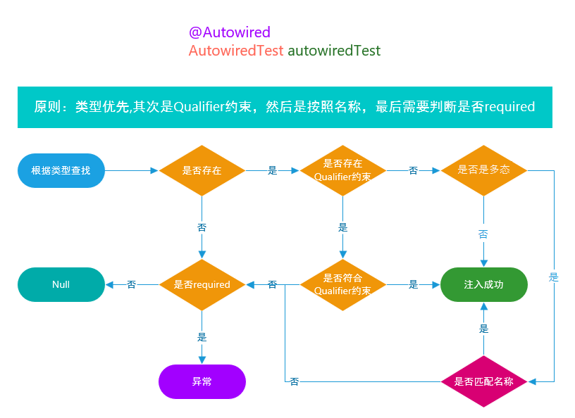

# @Resource 与 @AAutowired、@Inject

## @Resource
全称**javax.annotation.Resource,它属于JSR-250规范的一个注解**，包含Jakarta EE（J2EE）中。Spring提供了对该注解的支持。 
使用方式：
1. 成员属性注入
2. setter方法注入
默认按照则按照**变量名称或者方法中对应的参数名称**进行注入。

   如果我们希望在目标Bean中体现多态我们可以这样写：
```
/**
 * 多态的体现.
 *
 * @author felord.cn
 * @since 9 :26
 */
@Component
public class ResourceTest {
    @Resource
    private ApplicationRunner applicationRunner;    
    @Resource
    private ApplicationRunner runner;
    // ...
}

```
### 参数

## @Autowired
全称**org.springframework.beans.factory.annotation.Autowired**是Spring提供的注解
使用方法：
1. 构造器注入
2. 成员属性注入
3. setter方法注入
默认根据**变量类型**查找注入


### 构造器方式注入
从Spring Framework 4.3开始，@Autowired如果目标Bean只定义一个构造函数，则不再需要在该构造函数上添加@Autowired注解。
如果目标Bean有几个构造函数可用，并且没有主/默认构造函数，则必须至少有一个构造函数被@Autowired标记，以指示Spring IoC容器使用哪个构造函数。
```
@Component
public class AutowiredTest {
 private final ApplicationRunner applicationRunner;

    @Autowired
    public AutowiredTest(ApplicationRunner applicationRunner) {
        this.applicationRunner = applicationRunner;
    }
}
```
### 成员变量注入
```
/**
 * @author felord.cn
 * @since 9:26
 **/
@Component
public class AutowiredTest {
    @Autowired
    private ApplicationRunner applicationRunner;
    
    // ...
    
}

```
### 方法注入
一般setter方法上使用的比较多。而且一个 @Autowired 支持注入多个参数。
```
@Component
public class AutowiredTest {

    private ApplicationRunner applicationRunner;
    private EmployeeMapper employeeMapper;
    private DepartmentMapper departmentMapper;

    /**
     * Sets application runner.
     *
     * @param applicationRunner the application runner
     */
    @Autowired
    public void setApplicationRunner(ApplicationRunner applicationRunner) {
        this.applicationRunner = applicationRunner;
    }


    /**
     * 支持多参数
     *
     * @param employeeMapper   the employee mapper
     * @param departmentMapper the department mapper
     */
    @Autowired
    public void prepare(EmployeeMapper employeeMapper, DepartmentMapper departmentMapper) {
        this.employeeMapper = employeeMapper;
        this.departmentMapper = departmentMapper;
    }

}

```

### 装配可选
1. required属性
   @Resource没有提供可选择装配的特性，一旦无法装配则会抛出异常；而@Autowired提供了required属性（默认值为true）以避免这种情况，设置@Autowired为false。
```
@Component
public class AutowiredTest {
    // 一旦找不到 movieFinder  不会异常  而初始化为 null
    @Autowired(required = false)
    private MovieFinder movieFinder;
    // ...
}

```
2. 通过 Java 8的 java.util.Optional来表明候选Bean可选。
```
@Component
public class AutowiredTest {
public class SimpleMovieLister {
    // 使用 Optional 表明候选Bean可选
    @Autowired
    public void setMovieFinder(Optional<MovieFinder> movieFinder) {
     //   ...
    }
}

```
3. @Nullable注解
```
/**
 * The type Autowired test.
 *
 * @author felord.cn
 * @since 9 :26
 */
@Component
public class AutowiredTest {
public class SimpleMovieLister {
    // 使用 @Nullable 注解表明候选Bean可选
    @Autowired
    public void setMovieFinder(@Nullable MovieFinder movieFinder) {
      //  ...
    }
}

```
### 参数

## @Inject
从Spring 3.0开始，Spring提供对JSR-330标准注解（依赖注入）的支持。 你需要引入依赖
```
<dependency>
    <groupId>javax.inject</groupId>
    <artifactId>javax.inject</artifactId>
    <version>1</version>
</dependency>

```
全类名**javax.inject.Inject**。大部分情况下该注解都可以代替@Autowired使用，但@Inject没有required属性，不过它也可以与java.util.Optional或使用@Nullable来达到同样的效果。
## 总结

|        | Resource                                                                  | Autowired                       |
|--------|---------------------------------------------------------------------------|---------------------------------|
| 来源     | Java （JSR-250）提供                                                          | Spring提供                        |
| 参数     | 7个参数：AuthenticationType、name、lookup、type、shareable、mappedName、description | 1个 ：require                     |
| 使用方式   | 1.Setter注入  2. 字段属性注入                                                     | 1.Setter注入  2. 字段属性注入  3. 构造器注入 |
| 逻辑     | 先看类型再看名称                                                                  | 先看名称再看类型                        |
| Idea报错 | 注入Mapper对象不报错                                                             | 注入Mapper对象报错                    |
