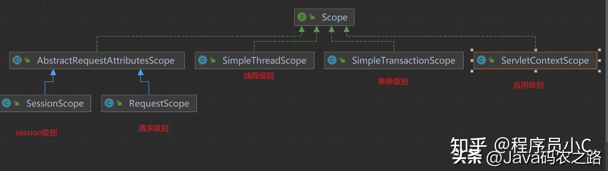

# Spring Bean的生命周期


## Spring的6个生命周期

| 作用域            | 含义   | 生命周期                           | 范围                                                                    |
|----------------|------|--------------------------------|-----------------------------------------------------------------------|
| singleton      | 单例   | 生命周期与Spring容器的启动到Spring容器的销毁一致 | 全局                                                                    |
| prototype      | 原型   | 在调用前创建，调用后销毁                   | 全局                                                                    |
| request        | 请求   | 一次请求发起创建，请求返回结束                | Web层面的ApplicationContext上下文中，如XmlWebApplicationContext                |
| session        | 会话   | 随着一个在会话产生创建，会话结束销毁，默认30min     | Web层面的ApplicationContext上下文中，如XmlWebApplicationContext                |
| application    | 应用   | 随着ServletContext的生命周期创建和销毁     | Web层面的ApplicationContext上下文中，如XmlWebApplicationContext                |
| websocket      | 原型   | 随着一次Websocket连接的生命周期创建和销毁      | Web层面的ApplicationContext上下文中，如XmlWebApplicationContext                |
| global-session | 全局会话 | 容器中的一个应用，随着应用产生创建，所有应用结束销毁     | Web层面的ApplicationContext上下文中，如XmlWebApplicationContext   Spring5中不支持了 |

## singleton
当定义一个bean定义并且它的作用域为单例时，Spring IoC容器只创建由该bean定义定义的对象的一个实例。
这个单一实例存储在这种单例bean的缓存中，所有后续的请求和对该命名bean的引用都会返回缓存的对象。


## prototypeScope
当定义一个bean定义并且它的作用域为原型时， 将bean注入到另一个bean中，或者通过对容器的getBean（）方法调用请求它都会创建一个新的bean。
Spring不会对 prototype的bean的生命周期进行管理，容器实例化、配置和组装一个原型bean，并将其交给客户端后不再缓存该原型实例。
原型的情况下，不会调用配置的销毁生命周期回调。客户端代码需要自定义bean后处理器，清理原型作用域的对象，并释放原型bean持有的昂贵资源。


## SessionScope 和 RequestScope
session 和request 范围
SessionScope 和 RequestScope 都是基于RequestContextHolder（内部使用requestAttributesHolder的ThreadLocal存储请求信息，在FrameworkServlet也就是DispatcherServlet的父类中，每当一个请求访问时就把请求信息存储到ThreadLocal中。
也就是说，**session和request的作用域，必须要求请求时通过DispatcherServlet的实现的**
不同的是：
SessionScope#get会把Session对象作为互斥锁（也许是因为同一个session可以并发发生请求，这时候需要获取互斥锁，避免相同session不同bean实例）
RequestScope#get则不会
二者控制的bean实例都是存储在ThreadLocal中的RequestAttributes对象中，RequestAttributes的子类ServletRequestAttributes会根据Scope的不同选择把bean存在request中还是session中从而实现作用域的控制。


| 作用域            | 相同                                                                                                                           | 不同                               |
|----------------|------------------------------------------------------------------------------------------------------------------------------|----------------------------------|
| request        | 都是基于RequestContextHolder内部的ThreadLocal存储请求信息实现的，二者控制的bean实例都是存储在ThreadLocal中的RequestAttributes对象中。都必须通过DispatcherServlet的实现的 | SessionScope#get会把Session对象作为互斥锁 |
| session        |                                                                                                                              | 无需session互斥锁。                    |

```java
@RequestScope
@Component
public class LoginAction {
	// ...
}

@SessionScope
@Component
public class UserPreferences {
    // ...
}

```
## applicationScope
applicationScope是通过ServletContextScope实现的一个应用只有一个servletContext

与Singleton bean的区别：
1. application bean是每个ServletContext的单例，而不是每个Spring ApplicationContext（在web应用程序中可能存在多个ApplicationContext）
2. application bean实际上是公开的，因此作为ServletContext属性可见

```
@ApplicationScope
@Component
public class AppPreferences {
	// ...
}
```

## WebSocket Scope
WebSocket作用域与WebSocket会话的生命周期相关联，并应用于基于WebSocket应用程序的STOMP。

可以在websocket作用域中声明一个spring管理的bean。
将websocket作用域的bean注入到控制器和注册在clientInboundChannel上的任何通道拦截器中。它们通常是单例的，比任何单独的WebSocket会话都要长。

```java
@Component
@Scope(scopeName = "websocket", proxyMode = ScopedProxyMode.TARGET_CLASS)
public class MyBean {

	@PostConstruct
	public void init() {
		// Invoked after dependencies injected
	}

	// ...

	@PreDestroy
	public void destroy() {
		// Invoked when the WebSocket session ends
	}
}

@Controller
public class MyController {

	private final MyBean myBean;

    //Spring在第一次从控制器访问MyBean实例时初始化它，并将实例存储在WebSocket会话属性中。随后返回相同的实例，直到会话结束。
	@Autowired
	public MyController(MyBean myBean) {
		this.myBean = myBean;
	}

	@MessageMapping("/action")
	public void handle() {
		// this.myBean from the current WebSocket session
	}
}
```

## 线程作用域的生命周期
线程作用域默认是不注册到IoC的。
默认情况下，该线程作用域不会在公共上下文中注册。所以需要在您的设置中显式地将它分配给一个范围键，或者通过ConfigurableBeanFactory.registerScope，org.springframework.beans.factory.config.Scope或通过自定义范围配置来设置bean。

### SimpleThreadScope 
SimpleThreadScope是Spring中的一个自定义作用域，用于创建线程范围的bean，确保线程之间的bean实例隔离。每个线程都有自己的bean实例，当线程结束时bean随之销毁。适用场景包括处理线程本地数据的Web应用程序。了解如何配置和使用SimpleThreadScope，以增强多线程环境下的数据隔离。


```java
public class SimpleThreadScope implements Scope {
    
    private static final Log logger = LogFactory.getLog(SimpleThreadScope.class);
    //基于ThreadLocal来实现Bean的生命周期是线程作用域
    private final ThreadLocal<Map<String, Object>> threadScope = new NamedThreadLocal<Map<String, Object>>("SimpleThreadScope") {
        protected Map<String, Object> initialValue() {
            return new HashMap();
        }
    };

    public SimpleThreadScope() {
    }

    public Object get(String name, ObjectFactory<?> objectFactory) {
        Map<String, Object> scope = (Map)this.threadScope.get();
        Object scopedObject = scope.get(name);
        if (scopedObject == null) {
            scopedObject = objectFactory.getObject();
            scope.put(name, scopedObject);
        }

        return scopedObject;
    }

    @Nullable
    public Object remove(String name) {
        Map<String, Object> scope = (Map)this.threadScope.get();
        return scope.remove(name);
    }

    public void registerDestructionCallback(String name, Runnable callback) {
        logger.warn("SimpleThreadScope does not support destruction callbacks. Consider using RequestScope in a web environment.");
    }

    @Nullable
    public Object resolveContextualObject(String key) {
        return null;
    }

    public String getConversationId() {
        return Thread.currentThread().getName();
    }
}

```
## 事务作用域生命周期
Spring创建的逻辑事务，即使在同一线程上，如果是一个独立的事务，spring会先解绑当前线程上面的信息，挂起当前事务，从而导致两个逻辑事务使用到的bean是不同的bean


如果外部不存在一个事务，并且传播级别是REQUIRED,REQUIRES_NEW,NESTED
如果外部存在一个事务，且传播级别为REQUIRES_NEW
如果外部存在一个事务，且传播级别为嵌套事务，但是此时不是通过保存点来实现嵌套事务

上面三个条件也意味着内部事务和外部事务拿到的bean是不同的

### SimpleTransactionScope
基于TransactionSynchronizationManager实现的，TransactionSynchronizationManager内部基于ThreadLocal
