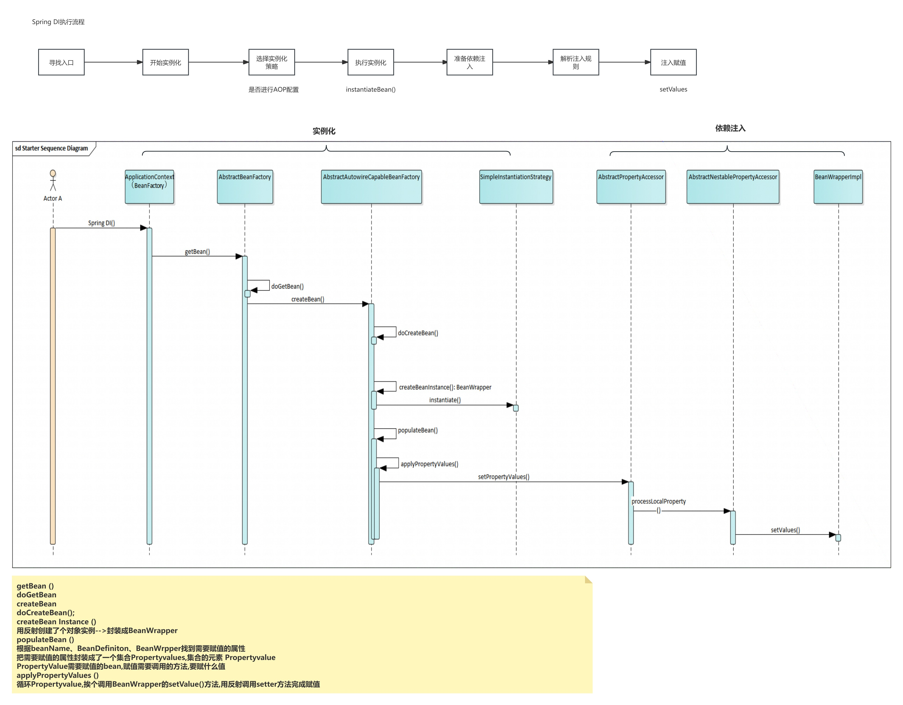

# Spring学习笔记

## IOC（Inversion of control） 控制反转
IOC：**是面向对象编程的一种设计原则，可以减低代码之间的耦合度**。最常见的实现方式是DI（依赖注入）和依赖查找。

使用IOC之前：大多数应用程序都是由两个或多个类彼此合作实现业务逻辑，所以需要每个对象都获取与其合作的对象的引用，如果这个过程需要自身来实现，那么代码的耦合度就会变得很高，难以维护和调试。
采用IOC设计模式后，通过DI技术引用对象不需要程序通过new的方式获取对象，而是通过Spring内部的容器来控制并将对象的引用注入到依赖他的对象中。
简单的总结：IOC把对象创建的控制权从应用程序转移到Spring自身的容器之中，并通过依赖注入或依赖查找的方式将被引用对象的地址注入到引用他的对象中。


## DI（Dependency Injection） 依赖注入
是一种设计模式，也是实现IOC的一种技术。
这种模式能让一个对象接收他所依赖的其他对象。
“依赖”是指接收方（对象和 class）所需的对象。
“注入”是指将“依赖（变量）”传递给接收方的过程。在“注入”之后，接收方才会调用该“依赖”

### 实现方式
建构子注入：依赖由客户对象的构造函数传入。Spring Boot 推荐使用构造器注入的方式
```
@Component
public class MyService {

    private final MyRepository myRepository;

    @Autowired
    public MyService(MyRepository myRepository) {
        this.myRepository = myRepository;
    }
}

```
Setter 注入：客户对象暴露一个能接收依赖的 setter 方法。
存在一些潜在问题：
1. 可能存在部分初始化
2. 可能发生注入遗漏
3. 可能导致空对象或部分依赖：如果有多个依赖通过 setter 注入，且其中某些依赖是必需的，但开发人员并没有为它们提供 setter 注入，这可能导致对象处于不完整的状态，无法正确执行功能。这种情况下，依赖关系的完整性就无法保证，可能会导致运行时异常。
4. 不利于不可变对象的创建
```
@Component
public class MyService {

    private MyRepository myRepository;

    @Autowired
    public void setMyRepository(MyRepository myRepository) {
        this.myRepository = myRepository;
    }
}

```
接口注入：依赖的接口提供一个注入器方法，该方法会把依赖注入到任意一个传给它的客户。客户实现一个setter接口，可设置依赖。不是 Spring 推荐的方式
```
import org.springframework.beans.factory.annotation.Autowired;
import org.springframework.stereotype.Service;

// 注入接口
interface DependencyAware {
    void setDependency(MyRepository myRepository);
}

// 客户端类实现注入接口
@Service
public class MyService implements DependencyAware {

    private MyRepository myRepository;

    @Override
    public void setDependency(MyRepository myRepository) {
        this.myRepository = myRepository;
    }

    public void performTask() {
        // 业务逻辑
        myRepository.doSomething();
    }
}

```
字段注入：最常见的注入方式、注入方式简单明了，类中定义全局变量，可以使用@Autowired、@Resource、@Inject注解来实现
在私有变量前加“@Autowired”等注解，不需要显式的定义以上三种代码，便可以让外部容器传入对应的对象。
该方案相当于定义了public的set方法，但是因为没有真正的set方法，从而不会为了实现依赖注入导致暴露了不该暴露的接口（因为set方法只想让容器访问来注入而并不希望其他依赖此类的对象访问）。
```
@Component
public class MyService {
    @Autowired
    private MyRepository myRepository;
}

```

## DL（Dependency Lookup） 依赖查找
依赖查找更加主动，在需要时通过调用框架提供的方法来获取对象，获取时需要提供相关的额配置文件路径、Key等信息来确定获取对象的状态。


依赖注入和依赖查找的区别：
依赖注入：**被动接收对象**，依赖的对象由外部容器在对象创建时或初始化时自动注入。应用程序不需要关心如何获取对象。
依赖查找：**主动接收对象**，应用程序主动去容器找查找所需的对象，并通过容器接口（如：ApplicationContext）获取所需的对象。


| 特性             | 依赖注入（DI）                                         | 依赖查找（DL）                                           |
|------------------|------------------------------------------------------|--------------------------------------------------------|
| **控制反转的方向** | 容器主动注入依赖对象                                  | 应用程序主动查找容器中的依赖对象                          |
| **依赖对象获取时机** | 对象创建时或初始化时注入依赖                         | 运行时主动查找依赖对象                                   |
| **耦合性**         | 类与容器解耦，依赖关系清晰，便于测试和维护            | 类与容器耦合，依赖关系可能不清晰，影响测试和维护          |
| **灵活性**         | 配置灵活，适用于大多数场景                           | 在运行时动态查找依赖，适用于特殊场景                      |
| **性能**           | 性能较高，依赖关系已在对象创建时注入                 | 每次查找都涉及一定的性能开销                             |


## 源码分析
### 初始化IoC

### DI
Spring第一步先把所有的需要加载的类都放入容器，后续通过getBean触发依赖注入（懒加载）
DI从哪里开始：从getBean()开始，因为Spring默认懒加载@lazy
通过SimpleInstantiationStrategy类处理实例化两种情况:
2. 配置了AOP：实例化的对象是代理类
3. 没配置AOP：实例化原生对象
存储实例相关信息使用BeanWrapper统一一个对外访问对象的入口

由instantiateBean()发起实例化对象的动作

由populateBean()完成依赖注入的动作


beanDefinitionMap用于存beanDefinition的缓存，存储Bean配置信息
factoryBeanObjectCache 用于存原生Bean的缓存，存储反射出来的实际的对象
factoryBeanInstanceCache 用于存BeanWrapper的缓存，存储原生bean的包装类


spring中BeanFactory和FactoryBean的区别
BeanFactory
BeanFactory是个Factory，也就**BeanFactory是IOC容器或对象工厂,用于生产bean**。在Spring中，所有的Bean都是由BeanFactory(也就是IOC容器)来进行管理的。
BeanFactory定义了IOC容器的最基本形式，并提供了IOC容器应遵守的的最基本的接口，也就是Spring IOC所遵守的最底层和最基本的编程规范。在Spring代码中，BeanFactory只是个接口，并不是IOC容器的具体实现，但是Spring容器给出了很多种实现，如 DefaultListableBeanFactory、XmlBeanFactory、ApplicationContext等，都是附加了某种功能的实现。
```
package org.springframework.beans.factory;  
import org.springframework.beans.BeansException;  
public interface BeanFactory {  
    String FACTORY_BEAN_PREFIX = "&";  
    Object getBean(String name) throws BeansException;  
    <T> T getBean(String name, Class<T> requiredType) throws BeansException;  
    <T> T getBean(Class<T> requiredType) throws BeansException;  
    Object getBean(String name, Object... args) throws BeansException;  
    boolean containsBean(String name);  
    boolean isSingleton(String name) throws NoSuchBeanDefinitionException;  
    boolean isPrototype(String name) throws NoSuchBeanDefinitionException;  
    boolean isTypeMatch(String name, Class<?> targetType) throws NoSuchBeanDefinitionException;  
    Class<?> getType(String name) throws NoSuchBeanDefinitionException;  
    String[] getAliases(String name);  
}   
```
FactoryBean
**FactoryBean是个Bean**。对FactoryBean而言，这个Bean不是简单的Bean，而是**一个能生产或者修饰对象生成的工厂Bean**,它的实现与设计模式中的工厂模式和修饰器模式类似。
**一般情况下，Spring通过反射机制利用<bean>的class属性指定实现类实例化Bean**，在某些情况下，实例化Bean过程比较复杂，如果按照传统的方式，则需要在<bean>中提供大量的配置信息。配置方式的灵活性是受限的，这时采用编码的方式可能会得到一个简单的方案。
Spring为此提供了一个org.springframework.bean.factory.FactoryBean的工厂类接口，**用户可以通过实现FactoryBean该接口定制实例化Bean的逻辑**。
```
package org.springframework.beans.factory;  
public interface FactoryBean<T> {  
    T getObject() throws Exception;  
    Class<?> getObjectType();  
    boolean isSingleton();  
}   
```
例：如果使用传统方式配置下面Car的<bean>时，Car的每个属性分别对应一个<property>元素标签。
```
package  com.baobaotao.factorybean;  
    public   class  Car  {  
        private   int maxSpeed ;  
        private  String brand ;  
        private   double price ;  
        public   int  getMaxSpeed ()   {  
            return   this . maxSpeed ;  
        }  
        public   void  setMaxSpeed ( int  maxSpeed )   {  
            this . maxSpeed  = maxSpeed;  
        }  
        public  String getBrand ()   {  
            return   this . brand ;  
        }  
        public   void  setBrand ( String brand )   {  
            this . brand  = brand;  
        }  
        public   double  getPrice ()   {  
            return   this . price ;  
        }  
        public   void  setPrice ( double  price )   {  
            this . price  = price;  
       }  
}   
```
如果用FactoryBean的方式实现就灵活点，下例通过逗号分割符的方式一次性的为Car的所有属性指定配置值：
```
package  com.baobaotao.factorybean;  
import  org.springframework.beans.factory.FactoryBean;  
public   class  CarFactoryBean  implements  FactoryBean<Car>  {  
    private  String carInfo ;  
    public  Car getObject ()   throws  Exception  {  
        Car car =  new  Car () ;  
        String []  infos =  carInfo .split ( "," ) ;  
        car.setBrand ( infos [ 0 ]) ;  
        car.setMaxSpeed ( Integer. valueOf ( infos [ 1 ])) ;  
        car.setPrice ( Double. valueOf ( infos [ 2 ])) ;  
        return  car;  
    }  
    public  Class<Car> getObjectType ()   {  
        return  Car. class ;  
    }  
    public   boolean  isSingleton ()   {  
        return   false ;  
    }  
    public  String getCarInfo ()   {  
        return   this . carInfo ;  
    }  
  
    // 接受逗号分割符设置属性信息  
    public   void  setCarInfo ( String carInfo )   {  
        this . carInfo  = carInfo;  
    }  
}   
```
有了这个CarFactoryBean后，就可以在配置文件中使用下面这种自定义的配置方式配置CarBean了：
```
<beanid="car"class="com.baobaotao.factorybean.CarFactoryBean"

P:carInfo="法拉利,400,2000000"/>
```
当调用getBean("car")时，Spring通过反射机制发现CarFactoryBean实现了FactoryBean的接口，这时Spring容器就调用接口方法CarFactoryBean#getObject()方法返回。
如果希望获取CarFactoryBean的实例，则需要在使用getBean(beanName)方法时在beanName前显示的加上"&"前缀：如getBean("&car");
**总结：
BeanFactory是个Factory，也就是IOC容器或对象工厂，FactoryBean是个Bean。在Spring中，所有的Bean都是由BeanFactory(也就是IOC容器)来进行管理的。
但对FactoryBean而言，这个Bean不是简单的Bean，而是一个能生产或者修饰对象生成的工厂Bean,它的实现与设计模式中的工厂模式和修饰器模式类似。**