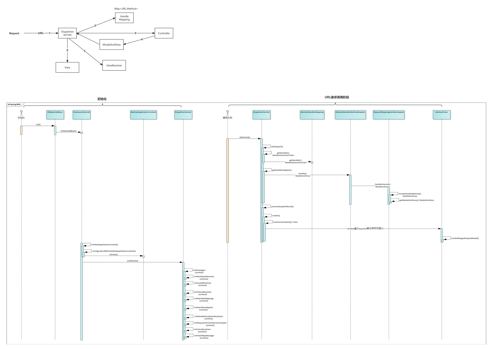

# MVC
WebApplicationContext 与 ApplicationContext 的区别
WebApplicationContext存Web相关的：Listener、Servlet、Filter、Session、Request、Response、Page

FlashMap valueStack 用于解决请求转发过程中的参数丢失问题
redirect 重定向，request参数丢失。所以用valueStack缓存住所有的参数，防止参数丢失
forward 转发，自动携带request参数到下一请求

DispatcherServlet init() 方法初始化九大组件
DispatcherServlet doService()方法
                  getHandler 拿到HandlerMapping chain
                  getHandlerAdapter（HandlerMapping）
                  adapter.handler() 获取到ModelAndView
                  processDispatchResult（） view.render（）
