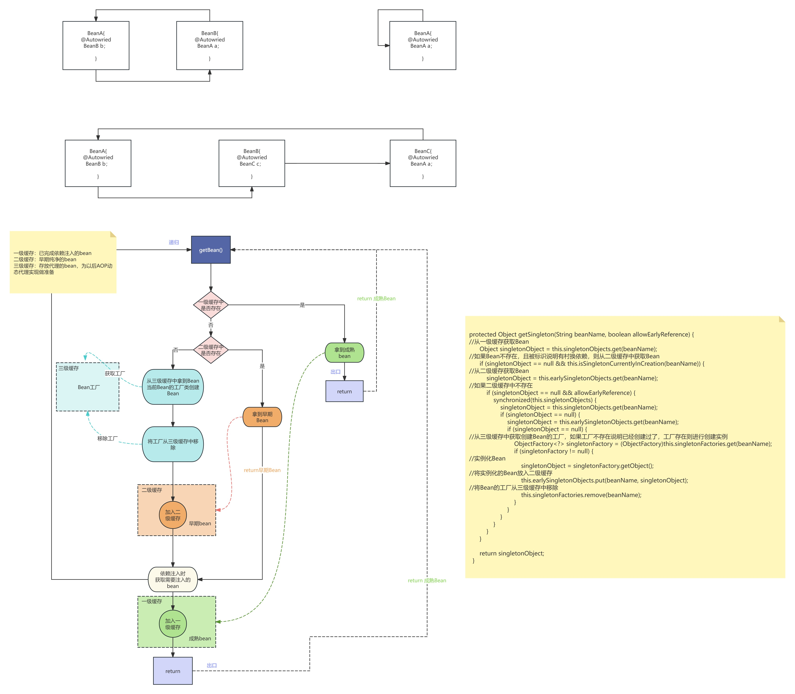

# Spring面试题
## 使用Spring框架可以给我们带来哪些好处？
1. Spring的IoC、DI将创建对象、管理对象的复杂过程交给Spring，开发人员不需要再对Bean进行管理简化了开发
2. Spring的AOP面向切面编程，让开发人员更聚焦业务的处理，将公共需求如审计等与业务代码解耦，也使代码更清晰
3. Spring生态很全面，也提供了很多工具类，可以简化同一开发
4. Spring提供了声明式事务管理，在对事物的开发变得更简洁

## BeanFactory和ApplicationContext有什么区别
BeanFactory生产bean的顶级工厂接口，主要提供获取bean的方法。
ApplicationContext是的BeanFactory的一个面向用户的实现接口，所以功能更加丰富。

## 请解释Spring Bean的生命周期

如果是Singleton，生命周期与Spring容器的启动到Spring容器的销毁一致，如果是延时加载，则在getBean时创建
如果是Prototype，在调用前创建，调用后销毁，作用域决定了生命周期的长短

## Spring Bean各个作用域的区别

| 作用域           | 含义   | 生命周期                           | 范围 |
|---------------|------|--------------------------------|--|
| singleton     | 单例   | 生命周期与Spring容器的启动到Spring容器的销毁一致 | 全局 |
| prototype     | 原型   | 在调用前创建，调用后销毁                   | 全局 |
| request |    请求  |     一次请求发起创建，请求返回结束                           | 全局 |
| session       | 会话   | 随着一个在会话产生创建，会话结束销毁，默认30min             | 全局 |
| global-session    | 全局会话 | 容器中的一个应用，随着应用产生创建，所有应用结束销毁           | 全局 Spring5中不支持了 |

## Spring中Bean是线程安全的吗？
Spring中的Bean不是线程安全的，Spring的Bean的线程安全与在代码中的使用方式有关与Spring无关。

## Spring中用到的设计模式？
1. 工厂模式：BeanFactory
2. 门面模式：BeanFactory
3. 原型模式：容器式多例
4. 代理模式：AOP
5. 装饰器模式：BeanWarpper
6. 适配器模式：ViewAdapter
7. 策略模式：AOP 使用JDK还式CgLib、Resource有很多策略
8. 享元模式：Ioc容器缓存
9. 委派模式：创建Bean，BeanDefinition进行注册通过委派模式执行
10. 包装器模式（包含门面模式和装饰器模式）：
11. 责任链模式：AOP中只用责任链执行before、after、throwing
12. 观察者模式：EventListener监听
13. 解释器模式：MVC中ExpressionParser解析请求，渲染视图

## SpringBoot和SpringCloud有什么区别
Spring是一个已有的生态，可以完成日常开发的所有的功能。
SpringBoot是在Spring的基础上进一步简化开发，而且SpringBoot对其他组件集成十分友好，使用时只需要引用相对应的组件即可，节约了对组件集成的时间
           去Selvet化，能用自运行，无需外部web容器，部署只需要一个Jar包
SpringCloud是基于SpringBoot的主要是针对分布式微服务创建的框架，内置注册中心、服务发现、服务监控、配置中心等组件，是一个全面的生态，具有一站式的微服务解决方案。
Dubbo 是一个主要是针对分布式微服务治理的RPC框架，需要搭配其他的组件，缺少生态。

## Spring事务如何的传播

1. PROPAGATION_REQUIRED（默认传播行为）：
如果当前没有事务，Spring 会创建一个新的事务；如果已经有事务在运行，当前方法会加入到这个事务中。
最常用的传播行为。
举例：一个方法 A 调用方法 B，如果 A 没有事务，B 会开始一个新的事务；如果 A 已经有事务，B 会加入这个事务。

2. PROPAGATION_SUPPORTS：
如果当前有事务，方法会在当前事务中执行；如果没有事务，方法会以非事务方式执行（即没有事务的支持）。
适用于某些方法不要求事务，但如果有事务则加入。
举例：方法 B 如果在方法 A 中调用，方法 B 会判断是否有事务。如果有，则参与事务；如果没有，则不使用事务。

3. PROPAGATION_MANDATORY：
当前必须存在事务，如果没有事务，则抛出异常。
适用于必须在事务中运行的操作，若没有事务则无法执行。
举例：方法 B 如果在方法 A 中调用，A 必须有事务，否则会抛出异常。

4. PROPAGATION_REQUIRES_NEW：
不管当前是否有事务，都会开启一个新的事务，原事务被挂起，新的事务独立执行。
适用于需要独立事务的操作，比如日志记录或审计操作。
举例：方法 B 调用时，不管方法 A 是否有事务，B 总是会启动一个新的事务并且挂起 A 的事务。

5. PROPAGATION_NOT_SUPPORTED：
方法不支持事务，如果当前有事务，事务会被挂起，方法以非事务方式执行。
适用于某些方法不能在事务中运行的情况。
举例：方法 B 调用时，如果方法 A 有事务，A 会挂起事务并让 B 在非事务方式下执行。

6. PROPAGATION_NEVER：
当前方法不能在事务中执行，如果存在事务，抛出异常。
适用于那些不能在事务内执行的操作。
举例：方法 B 调用时，如果方法 A 已经有事务，会抛出异常，因为 B 不允许在事务中执行。

7. PROPAGATION_NESTED：
如果当前存在事务，则开启一个嵌套事务。如果没有事务，则行为类似 PROPAGATION_REQUIRED。
嵌套事务是事务的子事务，子事务的提交或回滚不会影响父事务的提交和回滚，但它可以单独回滚。
举例：方法 B 调用时，如果方法 A 已经有事务，B 会创建一个嵌套事务，子事务的回滚不会影响父事务的回滚，适用于部分操作可能需要独立的回滚。

总结：
PROPAGATION_REQUIRED：最常用，如果有事务就加入当前事务，没有事务则创建新事务。
PROPAGATION_SUPPORTS：支持事务，若没有事务则非事务方式执行。
PROPAGATION_MANDATORY：必须有事务，否则抛出异常。
PROPAGATION_REQUIRES_NEW：总是启动一个新事务，挂起当前事务。
PROPAGATION_NOT_SUPPORTED：不支持事务，挂起当前事务。
PROPAGATION_NEVER：不能在事务中执行，若存在事务则抛出异常。
PROPAGATION_NESTED：支持嵌套事务，能独立回滚。

如果事务挂起、嵌套，那就会从连接池中拿新的连接创建事务。

## Spring如何解决循环依赖
Spring使用三级缓存解决循环依赖。
一级缓存存放成熟的Bean
二级缓存存放未注入依赖的早期Bean
三级缓存存放存放的是 Bean 的工厂实例，处理 AOP 代理等。
因为Spring默认使用懒加载模式，所以Bean的创建是从getBean()开始的。在执行getBean()方法后，会先再在一级缓存中获取，如果存在则返回结束。
不存在则查看是否有创建标识，如果有则表明存在循环依赖。继续到二级缓存获取bean。如果不存在则到三级缓存中获取BeanFactory创建Bean，如果有进行AOP代理则创建代理类的实例，将创建好的实例加入二级缓存中，并将BeanFactory从三级缓存中移除。拿到二级缓存的Bean后进行依赖注入，再次调用getBean的方式获取需要注入的依赖的bean重复上述流程。直到注入完成，返回。

## BeanFactory和FactoryBean的区别
BeanFactory是一个工厂，是IoC创建bean的顶级接口，通过getBean()方法获取Bean。
FactoryBean是一个Bean，也是一个接口，接口的类将提供一个 getObject() 方法来创建 Bean 对象,可以自定义这个Bean的生产过程。

## for循环内操作数据库，是一个数据库连接还是多个
是多个连接，而且多次连接数据库会导致连接池的数量不可控，因为循环的次数不固定。（for100次会占用100个连接，所以无法预估设置连接池资源的数量）
解决方案：
1. 分页：保证每次查询数量可控
2. 缓存：避免多次查询数据库
3. 联合查询：在一个查询中获取数据
批量插入？可以用分页方案

## @Resource 与 @AAutowired 区别
@Autowired 和 @Resource 都是用来实现依赖注入的注解（在 Spring/Spring Boot 项目中），但二者却有着 5 点不同：
1. 来源不同：@Autowired 来自 Spring 框架，而 @Resource 来自于（Java）JSR-250；
2. 依赖查找的顺序不同：@Autowired 先根据类型再根据名称查询，而 @Resource 先根据名称再根据类型查询；
3. 支持的参数不同：@Autowired 只支持设置 1 个参数，而 @Resource 支持设置 7 个参数；
4. 依赖注入的用法支持不同：@Autowired 既支持构造方法注入，又支持属性注入和 Setter 注入，而 @Resource 只支持属性注入和 Setter 注入；
5. 编译器 IDEA 的提示不同：当注入 Mapper 对象时，使用 @Autowired 注解编译器会提示错误，而使用 @Resource 注解则不会提示错误。
