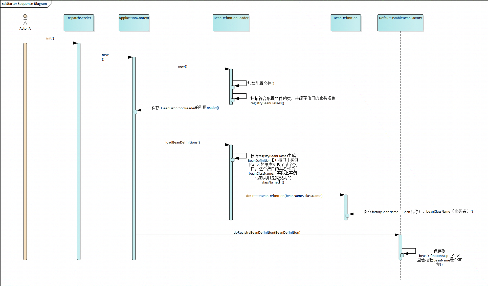
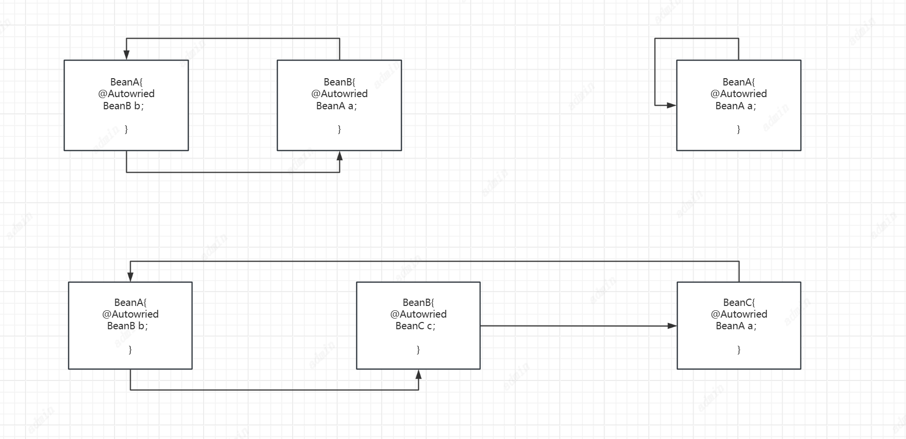
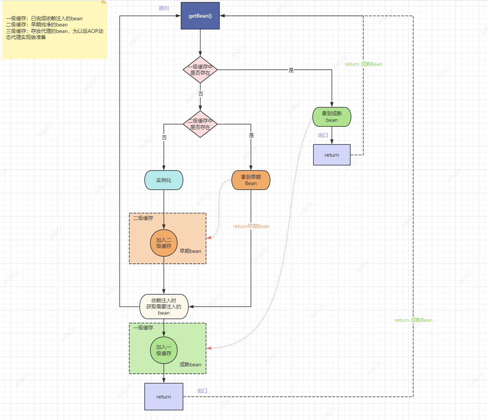
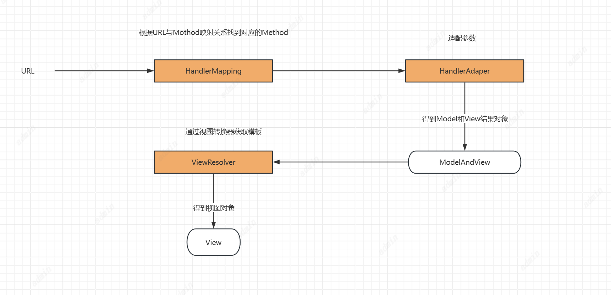

# Spring 六个版本


IoC、DI、MVC、AOP、JDBC...

## V1：实现IoC、DI、MVC
简单的实现Spring
1. 配置阶段
2. 初始化阶段
3. 运行阶段
4. 
### 课后小测

1. Spring为什么轻量级？
三个维度：
侵入性越小越轻
需要的资源越少越轻
开发越便捷越轻

2. Spring最核心的模块：IoC

3. Spring中单例意味者每个**Context**只有一个实例


## V2：用30个类实现IoC
两个核心功能 
1. init


2. getBean

DispatchServlet 持有ApplicationContext的引用
初始化ApplicationContext的时候，ApplicationContext会new一个BeanDefinitionReader的方法，由这个reader进行配置解析和加载beanDefinition，然后再加载Bean


## V3：用30个类实现DI
怎么给对象自动赋值、解决循环依赖注入（组合复用原则）


一级缓存：已完成依赖注入的bean
二级缓存：早期纯净的bean
三级缓存：存放代理的bean，为以后AOP动态代理实现做准备
核心代码
```
    //一级缓存成熟bean
    private Map<String, Object> singletonObjects = new HashMap<>();
    //二级缓存早期bean
    private Map<String, Object> earlySingletonObjects = new HashMap<>();
    //三级缓存为直线AOP做准备（终极缓存）
    private Map<String, HBeanWrapper> factoryBeanInstanceCache = new HashMap<>();
    //循环依赖标记
    private Set<String> singletonCurrentlyCreation = new HashSet<>();
    
        /**
     * 获取单例bean
     *
     * @param beanName
     * @param beanDefinition
     * @return
     */

 private Object getSingleton(String beanName, HBeanDefinition beanDefinition) {
        //先到一级缓存中获取
        Object bean = this.singletonObjects.get(beanName);
        //如果一级缓存中没有，但有创建标识，说明是循环依赖
        if (bean == null && singletonCurrentlyCreation.contains(beanName)) {
            bean = earlySingletonObjects.get(beanName);
            //如果二级缓存中没有，则从三级缓存中获取
            if (null == bean) {
                Object object = instanceBean(beanName, beanDefinition);
                //将创建出的对象重新放入到二级缓存中
                earlySingletonObjects.put(beanName, object);
            }
        }


        return bean;
    }
    
        /**
     * 反射实例化
     *
     * @param beanName
     * @param beanDefinition
     * @return
     */
    private Object instanceBean(String beanName, HBeanDefinition beanDefinition) {
        String className = beanDefinition.getBeanClassName();
        Object instance = null;
        try {
            Class<?> clazz = Class.forName(className);
            instance = clazz.newInstance();
            this.factoryBeanObjectCache.put(beanName, instance);
            //如果是代理对象，触发AOP逻辑 todo


        } catch (Exception exception) {
            exception.printStackTrace();
        }
        return null;
    }
            /**
     * 依赖注入
     *
     * @param beanName
     * @param beanDefinition
     * @return
     */
        private void populateBean(String beanName, HBeanWrapper beanWrapper, HBeanDefinition beanDefinition) {
        Object instance = beanWrapper.getWrapperInstance();
        Class<?> clazz = beanWrapper.getWrapperClass();

        if (!clazz.isAnnotationPresent(HController.class) && !clazz.isAnnotationPresent(HService.class)) {
            return;
        }
        //getDeclaredFields 忽略字段修饰符（private/public/ protected/default都会被拿到）
        for (Field field : clazz.getDeclaredFields()) {
            if (!field.isAnnotationPresent(HAutowired.class)) {
                continue;
            }
            HAutowired autowired = field.getAnnotation(HAutowired.class);
            String autoWiredBeanName = autowired.value();
            if (StringUtils.isBlank(autoWiredBeanName)) {
                autoWiredBeanName = field.getType().getName();
            }
            //强制访问加了private的字段
            field.setAccessible(true);
            try {
                //通过getBean方式获取到依赖的bean
                field.set(instance, getBean(autoWiredBeanName));
            } catch (IllegalAccessException e) {
                e.printStackTrace();
            }
        }
    }
```

**以下三种情况不能循环依赖
1. 通过构造器注入不能支持三级缓存方式解决循环依赖，需要靠延迟加载解决
2. 实例非单例模式不能支持循环依赖**

## V4：用30个类实现MVC
用户输入URL如何与Spring关联，MVC的九大组件（委派、策略）
Spring MVC 九大核心组件初始化
```
  protected void initStrategies(ApplicationContext context) {
        this.initMultipartResolver(context);
        this.initLocaleResolver(context);
        this.initThemeResolver(context);
        this.initHandlerMappings(context);
        this.initHandlerAdapters(context);
        this.initHandlerExceptionResolvers(context);
        this.initRequestToViewNameTranslator(context);
        this.initViewResolvers(context);
        this.initFlashMapManager(context);
    }
```
**九大核心组件**

| 组件明 | 解释                                                                                                                                    |
|-----|---------------------------------------------------------------------------------------------------------------------------------------|
| MultipartResolver    | 多文件上传的组件                                                                                                                              |
|   LocaleResolver  | 用于本地语言环境解析（i18n：用共同的Key指向不同的配置文件的值，解决国际化策略）                                                                                           |
| ThemeResolver    | 主题模板处理器 （主题换肤）                                                                                                                        |
|   HandlerMappings  | 保存URL与Method映射关系                                                                                                                      |
|   HandlerAdapters  | 动态参数适配器（形参、实参）                                                                                                                        |
|  HandlerExceptionResolvers   | 异常拦截器                                                                                                                                 |
|  RequestToViewNameTranslator   | 视图提取器，从Request中获取viewName                                                                                                             |
|  ViewResolvers   | 视图转换器、获取模板引擎，渲染模板                                                                                                                     |
|  FlashMapManager   | 闪存，参数缓存器便于后续转发、重定向携带参数管理URL的参数 (类似于Struts2中的ValueStack 值栈，用于缓存参数，request.forward()转发，自动携带上一次请求的参数  response.redirect()重定向，丢失上一次请求的参数） |


dispatch核心逻辑：
1. 根据URL拿到对应的Handler

2. 根据HandlerMapping拿到HandlerAdapter

3. 根据HandlerAdapter拿到对应的ModelAndView

4. 根据viewResolver找到对应的View对象

5. 通过View对象渲染页面并返回

Spring MVC执行顺序：
1. 浏览器发起请求到前端控制器DispatchServlet
2. 前端控制器DispatchServlet将请求交给处理器映射HadlerMapping
3. 处理映射器HandlerMapping根据请求的URL找到并返回Handler
4. 前端控制器DispatchServlet调用处理适配器HandlerAdapter去执行Handler进行处理并返回ModelAndView
5. 前端控制器DispatchServlet请求视图解析器ViewResolvers进行视图解析，返回具体的视图View
6. 前端控制器DispatchServlet进行视图渲染（将模型数据填入视图中）
7. 前端控制器DispatchServlet向浏览器响应结果


## V5：用30个类实现AOP
面向切面设计、解耦、通知回调（责任链、动态代理）

## V6：用30个类实现JDBC
基于Spring JDBC 实现一个ORM框架（模板方法模式、建造者模式）

看源码的方法：
1. 先猜测后验证


