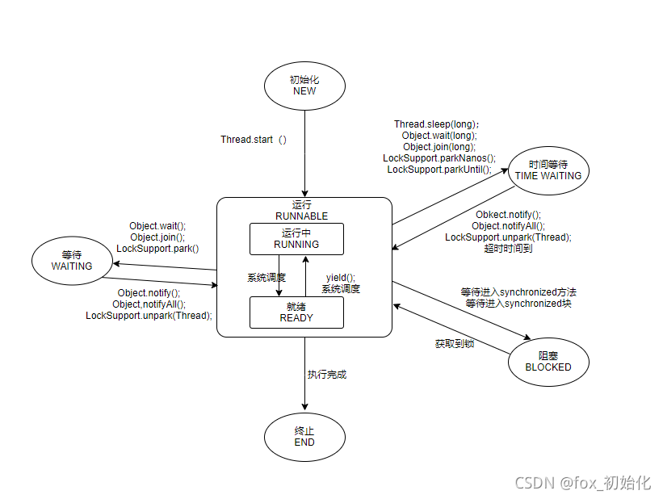
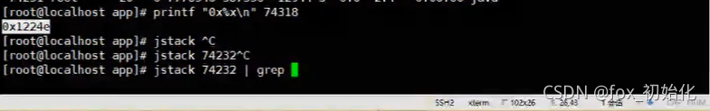

​
1. tps

tps：每秒请求数，就是说服务器在一秒的时间内处理了多少事务数

2. qps

qps：每秒请求数，就是说服务器在一秒的时间内处理了多少请求

如何支撑高并发

硬件资源：

CPU、核心数、并行任务数量

内存

磁盘

网卡

..

软件：

CPU->线程：线程是cpu的最小执行单元

IO->数据库交互->刷到磁盘，内存/缓存/异步刷盘策略

单节点遇到瓶颈，多个计算机组成一个分布计算机

多线程技术

## 什么是线程

线程是操作系统能调度的最小单元，也是cpu执行的最小单元。

Java程序->.java源文件->JVM（编译）.class->main方法运行这个程序->产生一个进程->

CPU来执行这个进程中得指令

CPU是计算机的核心资源（CPU阻塞会造成CPU资源浪费）

多道程序设计：多进程，让多个进程同时加载到内存，进程之间是互相隔离不影响。

分时系统 ：CPU的时间片切换

一个进程中可以存在多个线程。

## 线程的生命周期



线程从开启---结束

start()启动一个线程

当前线程中的执行完毕后自动销毁 run()结束

线程其他状态

阻塞状态 wait、sleep、join ------WAITING ，TIME WAITING
锁阻塞 Synchronized同步锁阻塞，因为没有抢占到锁而阻塞的线程。LockSupport.park(this)------BLOCKED
线程停止

interrupt()停止线程

线程中断复位

使用interrupt()时，线程中断后会进行中断复位，所以并不会直接停止，需要在线程内让他停止,将选择权还给开发者，保证中断是友好的。
```aidl
public class InterruptDemo {
public static void main(String[] args) {
Thread thread = new Thread(new ThreadDemoB());
thread.setName("hbb的线程");
thread.start();
try {
Thread.sleep(5000);
} catch (InterruptedException e) {
e.printStackTrace();
}
thread.interrupt();
}


}

class ThreadDemoB implements Runnable {

    @Override
    public void run() {
        while (!Thread.currentThread().isInterrupted()) {
            try {
                Thread.sleep(1000);
                System.out.println(Thread.currentThread().getName() + "---");
            } catch (InterruptedException e) {
                System.out.println(e.getStackTrace());
                //异常抛出后,会恢复中断状态，把中断标记修改为true

                Thread.currentThread().interrupt();
            }

        }
    }
}
```


除了InterruptedException外，Thread.interrupted()也可以中断复位

排查问题

CPU占用率很高

CPU响应慢

