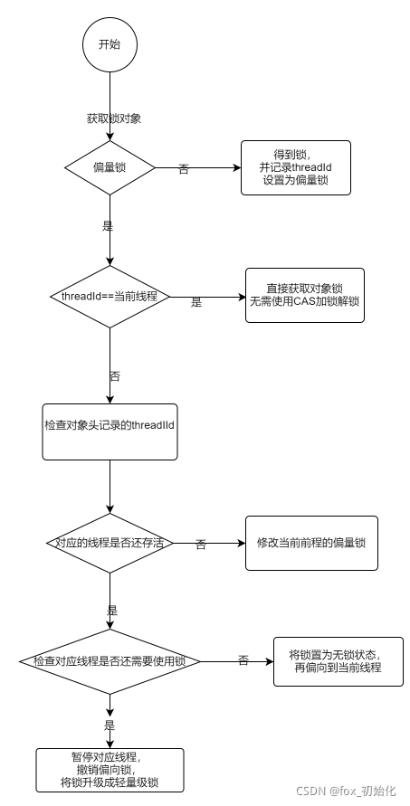
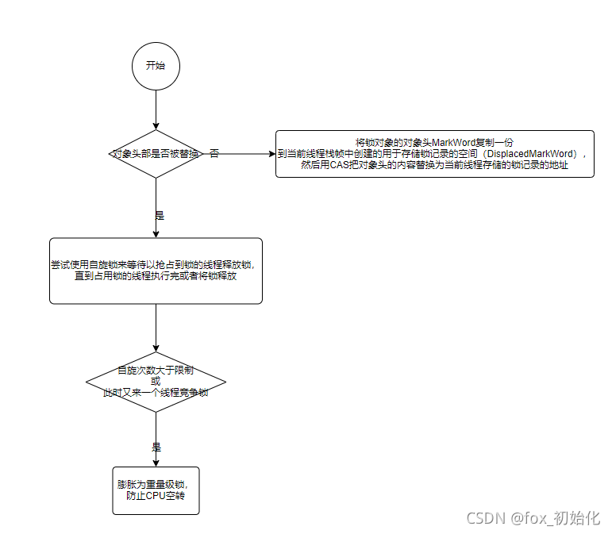

​ 原子性：Synchronized、AtomicXXX、Lock 可见性：Synchronized、volatile 有序性：Synchronized、volatile
Synchronized同步锁：排他锁、互斥锁同一时刻只允许一个线程执行。

```aidl
public synchronized void methodA(){

    }

    public  void methodB(){
        synchronized (this){
            
        }
    }
```

加锁要注意范围，因为加锁一定会带来性能开销

synchronized 作用范围

修饰实例方法 跨对象不互斥 修饰静态方法 无论是否跨对象都互斥 修饰代码块 （）可以存贮任何一个对象作为锁 影响锁的作用范围，就是对象本身的生命周期。

抢占锁的本质是什么？互斥

如何实现互斥？

1. 共享资源
2. 可以是一个标记，0无锁 1有锁
3. 锁存放在对象头

```aidl
<dependency>
<groupId>org.openjdk.jol</groupId>
<artifactId>jol-core</artifactId>
<version>0.9</version>
</dependency>


/**
* @author：hubinbin
* @date：2021/9/3
  */
  public class ClassLayoutDemo {
  public static void main(String[] args) {
  ClassLayoutDemo classLayoutDemo=new ClassLayoutDemo();
  System.out.println(ClassLayout.parseInstance(classLayoutDemo).toPrintable());
  }
  }

```

```aidl
 com.icode.demo.lock.ClassLayoutDemo object internals:
 OFFSET  SIZE   TYPE DESCRIPTION                               VALUE

//存储对象头
      0     4        (object header)  01 00 00 00 (00000001 00000000 00000000 00000000) (1)
      4     4        (object header)  00 00 00 00 (00000000 00000000 00000000 00000000) (0)

//Klass pointer 类型指针描述对象的具体类
      8     4        (object header)  05 c1 00 f8 (00000101 11000001 00000000 11111000) (-134168315)
     12     4        (loss due to the next object alignment)
Instance size: 16 bytes
Space losses: 0 bytes internal + 4 bytes external = 4 bytes total
```

1. Java中对象在内存中的布局

对象头：

1. MarkWord：用于存储对象自身运行时数据。如果是数组对象占用3个字宽，非数字占用2个字宽。对象锁就是放在MarkWord中。
2. Klass Point（类型指针）：是对象指向它的类元数据的指针，虚拟机通过这个歌指针确定这个对象的类信息。 实例变量 填充字符

### 偏向锁

2. 偏向锁升级
   
3. 偏向锁取消

偏向锁是默认开启的，而且开始时间一般是比应用程序启动慢几秒，如果不想有这个延迟，那么可以使用-XX:BiasedLockingStartUpDelay=0；

如果不想要偏向锁，那么可以通过-XX:-UseBiasedLocking = false来设置；

### 轻量级锁

为什么要引入轻量级锁？

轻量级锁考虑的是竞争锁对象的线程不多，而且线程持有锁的时间也不长的情景。因为阻塞线程需要CPU从**用户态**转到**内核态**，代价较大，如果刚刚阻塞不久这个锁就被释放了，那这个代价就有点得不偿失了，因此这个时候就干脆不阻塞这个线程，让它**自旋这等待锁释放**。

轻量锁升级



为了避免不必要的自旋，锁一旦升级（偏量锁——>轻量级锁 / 轻量级锁 ——>重量级锁），就不会主动降级。但偏量锁可以降级到无锁


| 锁状态   | 优点                                             | 缺点                                    | 适用场景                                                     |
| -------- | ------------------------------------------------ | --------------------------------------- | ------------------------------------------------------------ |
| 偏向锁   | 加锁解锁无需额外的消耗，和非同步方法相差纳秒级别 | 竞争多时会带来额外锁撤销开销            | 基本没有线程竞争的同步场景                                   |
| 轻量级锁 | 竞争的线程不会阻塞，使用自旋锁，提高程序响应速度 | 如果一直不能获取锁，长时间自旋让CPU空转 | 适用于少量线程竞争，且线程持有锁时间不长，追求响应速度的场景 |
| 重量级锁 | 线程竞争不使用自旋，不会导致CPU空转消耗资源      | 线程阻塞，响应时间长                    | 很多线程竞争锁，且锁被长时间占有，追求吞吐量的场景           |


### 锁粗化

按理来说，同步块的作用范围应该尽可能小，仅在共享数据的实际作用域中才进行同步，这样做的目的是为了使需要同步的操作数量尽可能缩小，缩短阻塞时间，如果存在锁竞争，那么等待锁的线程也能尽快拿到锁。
但是加锁解锁也需要消耗资源，如果存在一系列的连续加锁解锁操作，可能会导致不必要的性能损耗。 锁粗化就是将多个连续的加锁、解锁操作连接在一起，扩展成一个范围更大的锁，避免频繁的加锁解锁操作。

### 锁消除

Java虚拟机在JIT编译时(可以简单理解为当某段代码即将第一次被执行时进行编译，又称即时编译)，通过对运行上下文的扫描，经过逃逸分析，去除不可能存在共享资源竞争的锁，通过这种方式消除没有必要的锁，可以节省毫无意义的请求锁时间

