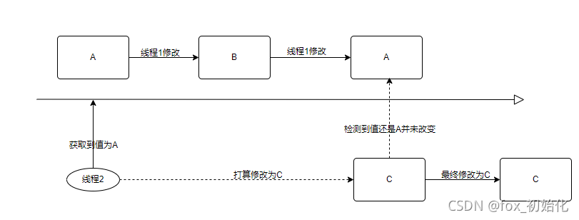
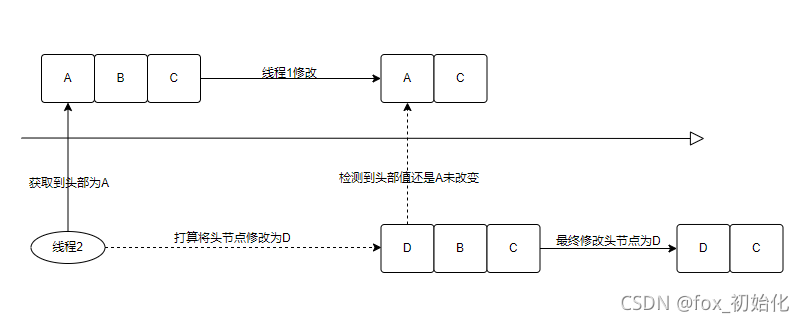

1.  CAS

CAS：Compare And Swap 比较并交换

synchronized关键字是独占锁，属于悲观锁，多线程下会有：a.线程竞争锁会有加锁、释放锁导致比较多的上下文切换；b.当锁被占用的时候，其他线程都是挂起

对应的，还有一种锁叫乐观锁。多线程访问时并不会加锁，只有修改时才会根据版本号对比，有冲突就自旋重试，保证安全性。

Unsafe类中有compareAndSwapObject方法，它通过直接调用本地方法，直接操作内存数据

> ```
> //Object var1 修改对象
> //long var2 偏移量
> //Object var4 期望值
> //Object var5 修改值
> public final native boolean compareAndSwapObject(Object var1, long var2, Object var4, Object var5);
> ```

通过var1和var2（修改对象和偏移量）计算出内存值value，

> if(value==var4){
>
> //将值替换成var5
>
> return true;
>
> }else{
>
> return false;
>
> }

那么以上判断和修改的过程是怎么保证原子性的呢？

其实在Java层面上看起来没有使用锁，但实际上在多道CPU时，**底层C++代码中使用的锁，如果是多核处理器则在指令前加lock**


> ```
> // Adding a lock prefix to an instruction on MP machine
> // VC++ doesn't like the lock prefix to be on a single line
> // so we can't insert a label after the lock prefix.
> // By emitting a lock prefix, we can define a label after it.
> #define LOCK_IF_MP(mp) __asm cmp mp, 0  \
>                        __asm je L0      \
>                        __asm _emit 0xF0 \
>                        __asm L0:
> 
> inline jint     Atomic::cmpxchg    (jint     exchange_value, volatile jint*     dest, jint     compare_value) {
>   // alternative for InterlockedCompareExchange
>   int mp = os::is_MP();
>   __asm {
>     mov edx, dest
>     mov ecx, exchange_value
>     mov eax, compare_value
>     LOCK_IF_MP(mp)
>     cmpxchg dword ptr [edx], ecx
>   }
> }
> ```

其实不光是Java的CAS底层使用到了锁，数据库的CAS也是基于行锁来保证最终的原子性的。

CAS缺点

1. ABA问题

ABA问题是一个很经典的问题，当线程1将A修改为B有修改为A，线程2需要将A修改为C，此时实际上值已经被修改了




从图可以看到，虽然线程2前后读取到的值都是A，但实际上中间已经发生过了修改。CAS成功但没有保证原子性。在Java中不会出现这种情况，因为两个对象地址一致表示两个对象是同一对象，C++等非自动GC语言，内存地址自己分配和释放会有这种问题。

Java会出现这样的问题：

有一个链表ABC，线程1将B删除，**线程1期望的输出是AC**，线程2将头节点修改为D，此时**线程2希望最后的结果是DBC**，但最终得到的是**DC**。


这就是一个严重的问题了，虽然CAS会先判断需要修改的的值是否发生改变，但并未关心其他节点是否发生了变化。

乐观锁通常会使用版本戳version来标记对象被改变的次数，来避免并发问题。除了对别需要修改的对象的值是否发生改变，还会对比版本号，以确保安全性。

**2. 循环空耗cpu**

CAS是通过自旋来进行判断比对，如果符合预期则修改，不符合继续自旋直到成功，这就会产生一个问题，如果自旋长时间不成功们就会给CPU带来很大的开销，所以引入pause指令。

pause指令有两个作用，第一它可以延迟流水线执行指令（de-pipeline）,使CPU不会消耗过多的执行资源，延迟的时间取决于具体实现的版本，在一些处理器上延迟时间是零。第二它可以避免在退出循环的时候因内存顺序冲突（memory order violation）而引起CPU流水线被清空（CPU pipeline flush），从而提高CPU的执行效率。

**3. 只能保证一个共享变量的原子操作**

当对一个共享变量执行操作时，我们可以使用循环CAS的方式来保证原子操作，但是对多个共享变量操作时，循环CAS就无法保证操作的原子性，这个时候就可以用锁，或者有一个取巧的办法，就是把多个共享变量合并成一个共享变量来操作。比如有两个共享变量i＝2,j=a，合并一下ij=2a，然后用CAS来操作ij。从Java1.5开始JDK提供了**AtomicReference类来保证引用对象之间的原子性，你可以把多个变量放在一个对象里来进行CAS操作。**