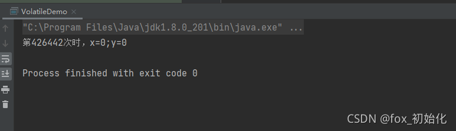
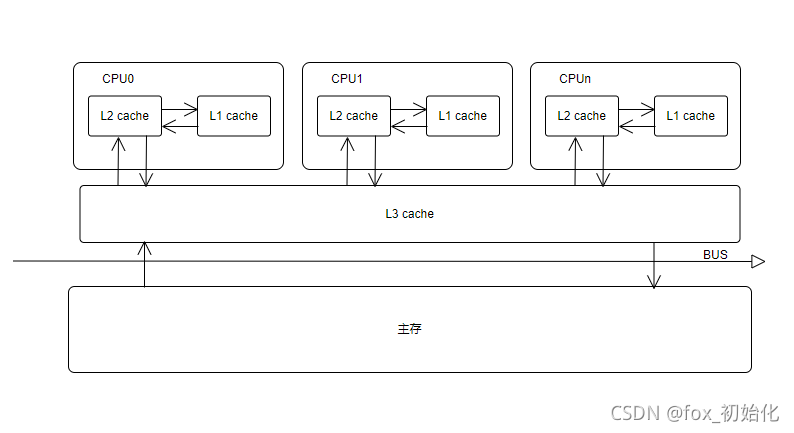
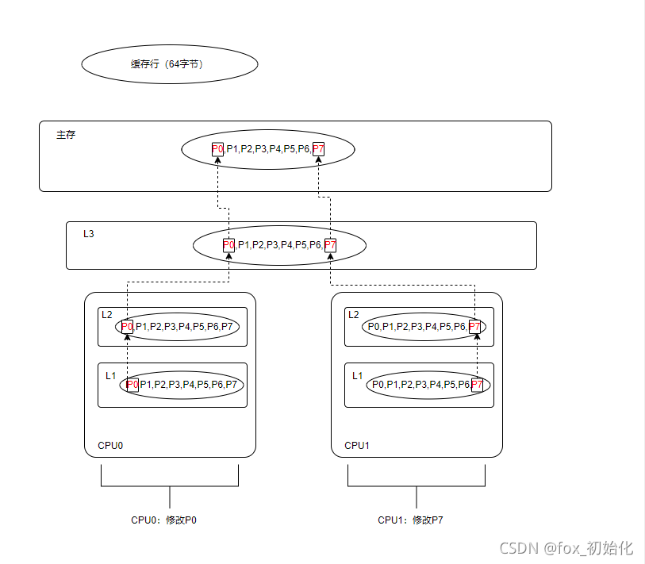
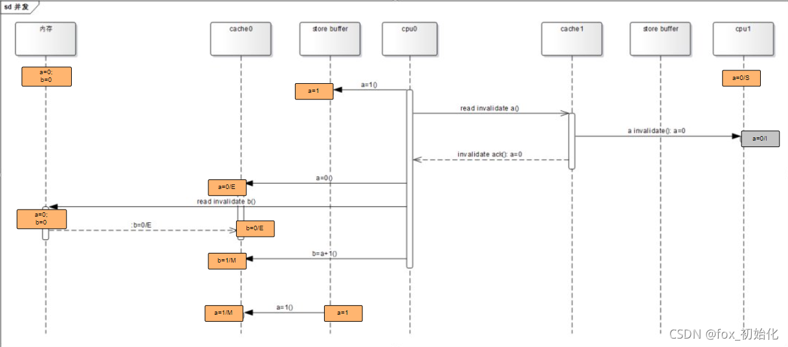
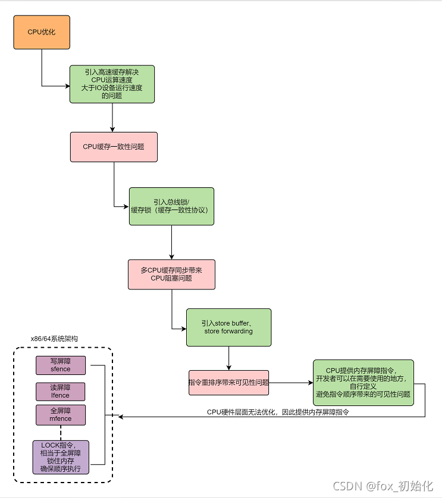

当我声明两个线程，线程1完成：a = 1;x = b;线程2完成：b = 1;y = a;按正常来说可能发生的结果是：x=0 y=1/x=1 y=1/x=1 y=0。从程序上不可能出现x=0 y=0。

> ```
> /**
>  * @author：hubinbin
>  * @date：2021/9/7
>  */
> public class VolatileDemo {
>     private static int a, b;
>     private static int x, y;
> 
>     public static void main(String[] args) throws InterruptedException {
>         int i = 0;
>         for (; ; ) {
>             a = 0;
>             b = 0;
>             x = 0;
>             y = 0;
>             Thread t1 = new Thread(() -> {
>                 a = 1;
>                 x = b;
>             });
>             Thread t2 = new Thread(() -> {
>                 b = 1;
>                 y = a;
>             });
>             t1.start();
>             t2.start();
>             t1.join();
>             t2.join();
>             if (x == 0 && y == 0) {
>                 System.out.println("第" + i + "次时，x=0;y=0");
>                 return;
>             }
> 
>             i++;
>         }
>     }
> }
> ```


执行结果可以看出，居然存在x=0 y=0的情况

只有当：线程1先完成：x = b再执行a = 1，线程2先完成：y = a再执行b = 1才会出现x=0 y=0。

所以可以看出在CPU执行指令时发生了指令重排。

使用关键字**volatile**

可以解决：**可见性**和**有序性**问题。

**关键在于知道如何产生以及如何解决！！！**

想要了解指令重排和为什么会有可见性问题，需要知道CPU与内存的优化过程。

\1. CPU与内存

由于CPU运算速度远大于磁盘加载速度，为了不浪费CPU的性能，所以增加了缓存，现在常见的缓存有三层结构L1,L2,L3。L1最接近CPU存储空间最小（大部分256BKB）延时最小，L3离CPU最远存储空间最大延时也最大。现在的计算机大多数L1，L2是CPU中。


**引入高速缓存就带来了一个问题：缓存一致性**

CPU为了提高处理速度，不直接与内存进行通信，而是先和L1，L2，L3缓存进行交互。操作完成后，更新到主存时间未知，所以这就会引发缓存一致性问题。

为了解决缓存一致性可以有两种办法：

\1. 总线锁

总线锁的引入让CPU获取到某个变量的时候发出一个LOCK#信号，直接将内存加锁，防止其他的CPU读取，可以避免缓存一致性问题，但会造成CPU阻塞，影响性能

2.缓存锁

**缓存锁：**内存区域如果被缓存在的处理器的缓存行中，并且在LOCK#操作期间，那么当他执行操作写回内存时，处理器不在总线上声明LOCK#信号，而是修改内存的内存地址，并允许他通过缓存一致性来保证原子操作。**（也就是说缓存锁的作用范围是在缓存行上而不是总线上，锁的范围缩小了，性能就提升了）**

**缓存锁会带来一个问题：**

**即使CPU1操作时给需要修改的数据上锁，更新后修改主存，但其他CPU中的数据还是旧的，还是会存在问题（类似数据库的脏读）。**

**所以引入一个MESI协议（M：修改，E：独占，S：共享，I：失效）**

MESI 协议是以缓存行的几个状态来命名的(全名是Modified、Exclusive、 Share or Invalid)。该协议要求在每个缓存行上维护两个状态位，使得每个数据单位可能处于M、E、S和I这四种状态之一，各种状态含义如下：
M：被修改的。处于这一状态的数据，只在本CPU中有缓存数据，而其他CPU中没有。同时其状态相对于内存中的值来说，是已经被修改的，且没有更新到内存中。
E：独占的。处于这一状态的数据，只有在本CPU中有缓存，且其数据没有修改，即与内存中一致。
S：共享的。处于这一状态的数据在多个CPU中都有缓存，且与内存一致。
I：无效的。本CPU中的这份缓存已经无效。

当一个CPU在修改数据时，会让发出invalid信息使其他的CPU获取到缓存里的数据失效 ，其他的CPU会通过嗅探在总线上传播的数据检查自己的缓存是否失效，当其他的CPU发现内存地址被修改了，就会将当前缓存设置为失效，当CPU需要修改这个数据时需要重新从内存中加载数据到自己的缓存中。

**CPU从缓存中获取数据是按缓存行获取的。多个线程对同一缓存行**

缓存行：缓存行是CPU加载内存数据的最小单元，在X86机器上，一个缓存行的大小是64字节。（一个long类型是8字节）。

缓存行就带来了一个问题：伪共享

伪共享：

现在有一个long类型数组：P[8]

CPU0需要修改P0，CPU1需要修改P7，由于CPU与内存交互最小单元是缓存行，所以每个CPU都会加载到P0-P7。所以每个线程都需要去竞争缓存行的所有权来更新变量，如果CPU0获得了所有权然后去更新P0，那么CPU1中的缓存行将会失效，那么CPU1就要从新从L3将缓存行加载到CPU1中的缓存里，CPU2先获取了占有权CPU0同理，所以两个CPU来来回回的缓存行失效再从L3同步新的缓存行数据，那么就大大的影响了性能。


这种共享其实就是伪共享，因为虽然两个CPU修改的数据是两个变量，但他们加载的是同一个缓存行。一个CPU修改后会造成另一个失效重新加载，并没有真正的达到共享效果。CPU会竞争缓存行的所有权，

为了避免这种伪共享问题，JAVA中会通过对齐填充来解决这个问题。

**对齐填充：为了避免CPU读取数据64字节包含数据上下文，导致缓存行失效，所带来的数据竞争，每次都从内存获取数据。所以将数据填充到64字节，用空间换时间，减少竞争，提高性能。**

**可以使用@Contended注解 可以自动对齐填充，防止伪共享。**

**CPU的优化空间不止于此！**

可见性问题解决了，但是因为缓存数据和内存不是实时同步的，CPU修改某个数据时，发送通知给其他CPU让他们缓存里的数据失效时，需要等其他CPU失效再返回确认信息，这一来一回，明显也需要CPU处于等待，所以**CPU再次做了优化，再确认这个期间里，CPU会继续加载后续无关该数据的指令，等其他CPU返回确认信息再继续进行修改操作**。


这里就会出现问题！机器指令并不知道逻辑因果关系，那造成了指令乱序，也就是有序性问题。


指令重排其实可以分为不同层面

- 编译器层面

编译器在**不改变单线程程序语义**的前提下，可以重新安排语句的执行顺序。

> a=true;
>
> b=1;


对于单线程来说，指令先执行a=true还是 b=1都不会影响最后的结果，所以编译器认为没有任何问题，所以会优化为先执行b=1再执行a=true 。但是编译器不知道a和b可能存在严格的逻辑关系，所以就可能造成问题。

- 处理器层面

\1. 如果不存在**数据依赖性**，处理器可以改变语句对应机器指令的执行顺序。

\2. 由于处理器使用缓存和读/写缓冲区，这使得加载和存储操作看上去可能是在乱序执行。

> a=0;
>
> b=0;
>
>
>
> method A{
>
> a=1;
>
> b=a+1;
>
> }


关键在于这步异步动作，CPU0通知CPU1让a失效，CPU0要先把要修改的数据放到store buffer中，并通知其他CPU让他们的缓存失效，等其他CPU返回确认失效这段时间，CPU0不阻塞，而是继续工作，执行了b=a+1，这时候CPU0的缓存里的a的值还是0所以最后b=1，这时候其他CPU的确认消息返回回来了，CPU0才把a=1写到缓存行。结果造成了a=1，b=1。

**从这里可以看出来CPU不能直接从store buffer中获取数据，而是从cache中获取数据的。那么可不可以直接从store buffer中获取呢？答案是可以，就是Store Forwarding**

**Store Forwarding**

引入Store Forwarding 似乎解决了以上问题，因为计算b=a+1的时候，a从store buffer中获取，不再是0而是1，那么最后结果时a=1,b=2。看起来单线程的情况下没问题了，但是多线程依然存在问题！

（多线程的太复杂了 我还没想好怎么写这个东西....）

所以正是**因为CPU的优化引入了store buffer和store forwarding造成了CPU层面的指令重排。**

store buffer的引入大大的提高了CPU的利用率，但是store buffer的大小是有限的，store buffer满了还是会阻塞，这时候就又引入了**Invalid Queue ACK**


引入**Invalid Queue ACK，**将需要失效的缓存数据放入失效队列中，这就会再次引发指令重排可能见性问题。

所以一切的一切都是由CPU优化引起的。


最后CPU层面无法解决指令重排的问题，因为CPU不关心业务逻辑，他只是机器指令的执行。所以何时不允许指令重排就交给开发者决定了。

对于开发者而言使用volatile关键字可以解决这个问题。