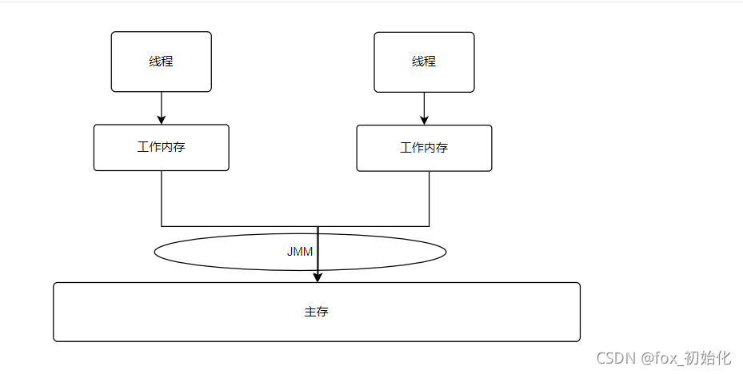

JMM

JMM是Java内存模型

JMM本质上是围绕 原子性、有序性、可见性展开的。

JVM

JVM是Java虚拟机模型.

JVM的重点是运行数据区，所有写出来的程序都会加载到这里，然后运行。因为JVM的缘故使得Java可以实现跨平台运行，一次编译处处运行。那么如何保证跨平台也可以实现线程安全的呢？就是靠JMM了。所以JMM是一种内存模型的规范，屏蔽了操作系统和各种硬件之间的差异。

**JMM是保证了Java在任何平台下对内存的访问都能保证效果一致的机制和规范。**

Java内存模型规定了：所有的变量都存储再主存中，每个线程有自己的工作内存。线程的工作内存是从主存中同步过来的，线程对变量的操作必须在工作内存中进行，不能直接读写主内存。不同的线程之间也不能直接访问对方的工作内存，线程之间的交互是通过主内存进行同步的。




同时 JMM中还定义了共享内存中线程程序读写操作的行为规范：在虚拟机中把共享变量存储到内存以及从内存中去除共享变量的底层实现细节。

**目的是为了解决由于多线程共享内存进行通信时，存在的本地内存数据不一致、编译器会对代码指令重排、处理器对代码乱序执行带来的问题。**

本地内存是JMM的冲向概念，并不真实存在。它涵盖了缓存、写缓冲区、寄存器以及其他的硬件和编译器的优化。

volatile是如何解决可见性和有序性的呢？

volatile是轻量级的同步机制，可以保证可见性、有序性，但不保证原子性。

使用volatile关键字修饰的变量转成汇编代码会有lock关键字，进而来解决可见性、有序性。

**Happens-Before模型**

除了使用关键字保证可见性和有序性，JDK1.5引入了Happens-Before模型来进一步阐述多线程操作共享变量的可见性问题。所以我们可以认为在JMM中，如果一个操作执行的结果需要对另一个操作可见，那么两个操作必然存在Happens-Before关系，两个操作可以是多个线程也可以是同一个线程。

1. 程序顺序规则（as-if-serial）

不管怎么重排序，单线程的执行结果都不能改变。

- 处理器不能对存在依赖关系的操作进行重排序，因为重排序会改变程序的执行结果。
- 对于灭有依赖关系的指令，即使重排序也不能改变单线程下的执行结果。

> int a=2; //A
>
> int b=2; //B
>
> int c=a*b; //C 无论这三行代码怎么拍列都不会影响结果

\2. 传递性规则

- A happens-before B。
- B happens-before C。
- A happens-before C。

JMM不要求A一定要在B之前执行，但是他要求的是前一个操作的执行结果对后一 个操作可见。这里操作A的执行结果不需要对操作B可见，并且重排序操作A和操作B后的执行结果与A happens-before B顺序执行的结果一直，这种情况下，是允许重排序的。

\3. volatile变量规则

对于volatile修饰的变量的写操作，一定happens-befores后续对于volatile变量读操作，这是因为volatile底层通过内存屏障机制防止了指令重排。

```java
public class VolatileExample {
    int a=0;
    volatile boolean flag=false;
    public void writer(){
        a=1; //1
        flag=true; //2
    }
    public void reader(){
        if(flag){ //3
            int i=a; //4
        }
    }
}
```


- 1 happens before 2、 3 happens before 4， 这个是程序顺序规则
- 2 happens before 3、 是由volatile规则产生的，对一个volatile变量的读，总能看到任意线程对这 个volatile变量的写入。
- 1 happens before 4， 基于传递性规则以及volatile的内存屏障策略共同保证。

volatile重排序规则表

| 是否能重排序 | 第二个操作 |            |            |
| ------------ | ---------- | ---------- | ---------- |
| 第一个操作   | 普通读/写  | volatile读 | volatile写 |
| 普通读/写    | 可以       | 可以       | 不可以     |
| volatile读   | 不可以     | 不可以     | 不可以     |
| volatile写   |            | 不可以     | 不可以     |

\4. 监视器锁规则

一个线程对于一个锁的释放操作，一定 happens before 与后续线程对这个锁的加锁操作。

```java
int x=10;
synchronized (this) { // 此处自动加锁
// x 是共享变量, 初始值 =10
if (this.x < 12) {
this.x = 12;
}
} // 此处自动解锁
```


假设x的初始值是10，线程A执行完代码块后，x的值会变成12，执行完成之后会释放锁。 线程B进入代 码块时，能够看到线程A对x的写操作，也就是B线程能够看到x=12。

\5. start规则

如果线程A执行操作ThreadB.start()。那么线程A的ThreadB.start()之前的操作happens-before线程B中的任意操作。

```java
public StartDemo{
        int x=0;
        Thread t1 = new Thread(()->{
// 主线程调用 t1.start() 之前
// 所有对共享变量的修改，此处皆可见
// 此例中，x==10
        });
// 此处对共享变量 x修改
        x = 10;
// 主线程启动子线程
        t1.start();
        }
```


\6. join规则

join规则，如果线程A执行操作ThreadB.join()并返回成功，那么线程B中的任意操作 happens-before于线程A从ThreadB.join()操作成功的返回。

```java
Thread t1 = new Thread(()->{
// 此处对共享变量 x 修改
x= 100;
});
// 例如此处对共享变量修改，
// 则这个修改结果对线程 t1 可见
// 主线程启动子线程
t1.start();
t1.join()
// 子线程所有对共享变量的修改
// 在主线程调用 t1.join() 之后皆可见
// 此例中，x==100
```

