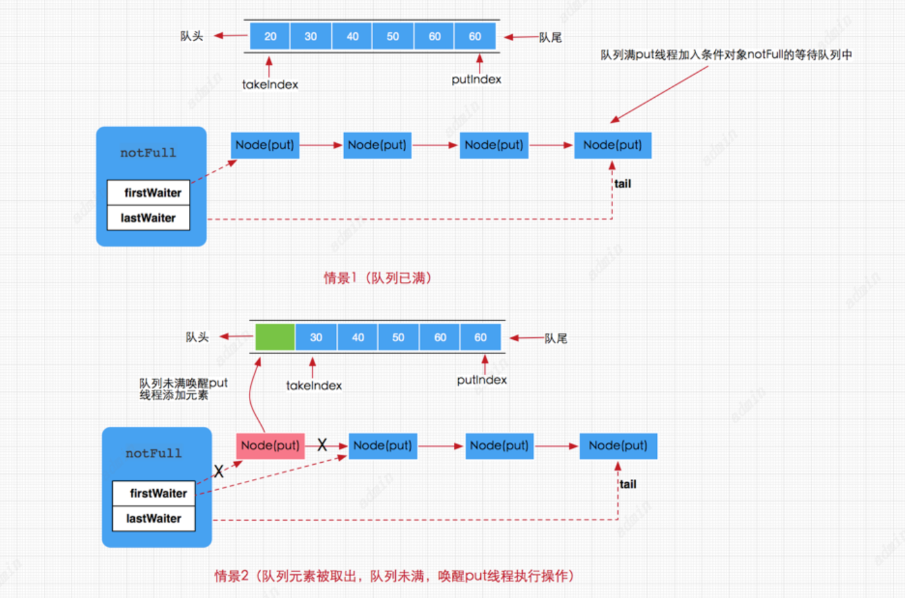
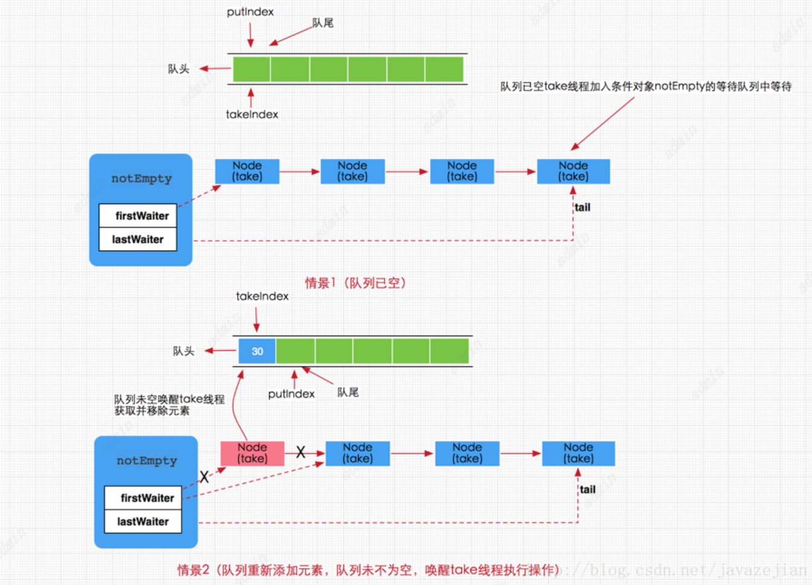
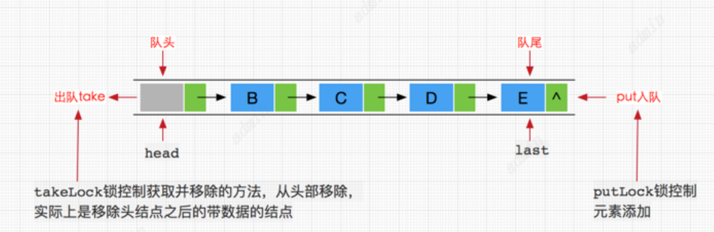

# LinkedBlockingQueue与ArrayBlockingQueue
## 阻塞队列
阻塞队列阻塞得是元素得添加与删除。
阻塞添加
所谓的阻塞添加是指当阻塞队列元素已满时，队列会阻塞加入元素的线程，直队列元素不满时才重新唤醒线程执行元素加入操作。
阻塞删除
阻塞删除是指在队列元素为空时，删除队列元素的线程将被阻塞，直到队列不为空再执行删除操作(一般都会返回被删除的元素)。
## BlockingQueue
```java
public interface BlockingQueue<E> extends Queue<E> {

	//将指定的元素插入到此队列的尾部（如果立即可行且不会超过该队列的容量）
	//在成功时返回 true，如果此队列已满，则抛IllegalStateException。 
	boolean add(E e); 
	
	//将指定的元素插入到此队列的尾部（如果立即可行且不会超过该队列的容量） 
	// 将指定的元素插入此队列的尾部，如果该队列已满， 
	//则在到达指定的等待时间之前等待可用的空间,该方法可中断 
	boolean offer(E e, long timeout, TimeUnit unit) throws InterruptedException; 
	
	//将指定的元素插入此队列的尾部，如果该队列已满，则一直等到（阻塞）。 
	void put(E e) throws InterruptedException; 
	
	//获取并移除此队列的头部，如果没有元素则等待（阻塞）， 
	//直到有元素将唤醒等待线程执行该操作 
	E take() throws InterruptedException; 
	
	//获取并移除此队列的头部，在指定的等待时间前一直等到获取元素， //超过时间方法将结束
	E poll(long timeout, TimeUnit unit) throws InterruptedException; 
	
	//从此队列中移除指定元素的单个实例（如果存在）。 
	boolean remove(Object o);
    //除了上述方法还有继承自Queue接口的方法 
    //获取但不移除此队列的头元素,没有则跑异常NoSuchElementException 
    E element();

    //获取但不移除此队列的头；如果此队列为空，则返回 null。 
    E peek();

    //获取并移除此队列的头，如果此队列为空，则返回 null。 
    E poll();
}
```
| 插入方法                                                    | 删除方法                                                   | 检查方法                                                  |
| ----------------------------------------------------------- | ---------------------------------------------------------- | --------------------------------------------------------- |
| add(E e): 添加成功返回true，失败抛IllegalStateException异常 | remove(Object o) :移除指定元素,成功返回true，失败返回false | element() ：获取但不移除此队列的头元素，没有元素则抛异常  |
| offer(E e): 成功返回 true，如果此队列已满，则返回 false。   | poll() : 获取并移除此队列的头元素，若队列为空，则返回 null | peek() :获取但不移除此队列的头；若队列为空，则返回 null。 |
| put(E e):将元素插入此队列的尾部，如果该队列已满，则一直阻塞 | take()：获取并移除此队列头元素，若没有元素则一直阻塞。     |                                                           |

可以看出，put方法和take方法为添加和删除的阻塞方法
## ArrayBlockingQueue
### 使用ArrayBlockingQueue实现生产者消费者代码
参考ArrayBlockingQueueDemo
ArrayBlockingQueue使用ReenterLock和Condition实现阻塞，所以会存在公平和非公平两种处理方式， 默认为非公平。
对于公平访问队列，被阻塞的线程可以按照阻塞的先后顺序访问队列，即先阻塞的线程先访问队列。而非公平队列，当队列可用时，阻塞的线程将进入争夺访问资源的竞争中，也就是说谁先抢到谁就执行，没有固定的先后顺序。
```
//默认非公平阻塞队列
ArrayBlockingQueue queue = new ArrayBlockingQueue(2);
//公平阻塞队列
ArrayBlockingQueue queue1 = new ArrayBlockingQueue(2,true);

//构造方法源码
public ArrayBlockingQueue(int capacity) {
     this(capacity, false);
 }

public ArrayBlockingQueue(int capacity, boolean fair) {
     if (capacity <= 0)
         throw new IllegalArgumentException();
     this.items = new Object[capacity];
     lock = new ReentrantLock(fair);
     notEmpty = lock.newCondition();
     notFull =  lock.newCondition();
 }

```
其他方法
```
//自动移除此队列中的所有元素。
void clear() 

//如果此队列包含指定的元素，则返回 true。          
boolean contains(Object o) 

//移除此队列中所有可用的元素，并将它们添加到给定collection中。           
int drainTo(Collection<? super E> c) 

//最多从此队列中移除给定数量的可用元素，并将这些元素添加到给定collection 中。       
int drainTo(Collection<? super E> c, int maxElements) 

//返回在此队列中的元素上按适当顺序进行迭代的迭代器。         
Iterator<E> iterator() 

//返回队列还能添加元素的数量
int remainingCapacity() 

//返回此队列中元素的数量。      
int size() 

//返回一个按适当顺序包含此队列中所有元素的数组。
Object[] toArray() 

//返回一个按适当顺序包含此队列中所有元素的数组；返回数组的运行时类型是指定数组的运行时类型。      
<T> T[] toArray(T[] a)

```
### ArrayBlockingQueue原理概要
```java
public class ArrayBlockingQueue<E> extends AbstractQueue<E>
        implements BlockingQueue<E>, java.io.Serializable {

    /** 存储数据的数组 */
    final Object[] items;

    /**获取数据的索引，主要用于take，poll，peek，remove方法 */
    int takeIndex;

    /**添加数据的索引，主要用于 put, offer, or add 方法*/
    int putIndex;

    /** 队列元素的个数 */
    int count;


    /** 控制并发访问的锁 */
    final ReentrantLock lock;

    /**notEmpty条件对象，用于通知take方法队列已有元素，可执行获取操作 */
    private final Condition notEmpty;

    /**notFull条件对象，用于通知put方法队列未满，可执行添加操作 */
    private final Condition notFull;

    /**
       迭代器
     */
    transient Itrs itrs = null;
}
```
ArrayBlockingQueue内部确实是通过数组对象items来存储所有的数据，值得注意的是ArrayBlockingQueue通过一个ReentrantLock来同时控制添加线程与移除线程的并非访问，这点与LinkedBlockingQueue区别很大(稍后会分析)。而对于notEmpty条件对象则是用于存放等待或唤醒调用take方法的线程，告诉他们队列已有元素，可以执行获取操作。同理notFull条件对象是用于等待或唤醒调用put方法的线程，告诉它们，队列未满，可以执行添加元素的操作。takeIndex代表的是下一个方法(take，poll，peek，remove)被调用时获取数组元素的索引，putIndex则代表下一个方法（put, offer, or add）被调用时元素添加到数组中的索引。图示如下

### ArrayBlockingQueue的(阻塞)添加的实现原理
```
//add方法实现，间接调用了offer(e)
public boolean add(E e) {
        if (offer(e))
            return true;
        else
            throw new IllegalStateException("Queue full");
    }

//offer方法
public boolean offer(E e) {
     checkNotNull(e);//检查元素是否为null
     final ReentrantLock lock = this.lock;
     lock.lock();//加锁
     try {
         if (count == items.length)//判断队列是否满
             return false;
         else {
             enqueue(e);//添加元素到队列
             return true;
         }
     } finally {
         lock.unlock();
     }
 }

//入队操作
private void enqueue(E x) {
    //获取当前数组
    final Object[] items = this.items;
    //通过putIndex索引对数组进行赋值
    items[putIndex] = x;
    //索引自增，如果已是最后一个位置，重新设置 putIndex = 0;
    if (++putIndex == items.length)
        putIndex = 0;
    count++;//队列中元素数量加1
    //唤醒调用take()方法的线程，执行元素获取操作。
    notEmpty.signal();
}

```
当putIndex索引大小等于数组长度时，需要将putIndex重新设置为0，这是因为当前队列执行元素获取时总是从队列头部获取，而添加元素从中从队列尾部获取所以当队列索引（从0开始）与数组长度相等时，下次我们就需要从数组头部开始添加了

```
//put方法，阻塞时可中断
 public void put(E e) throws InterruptedException {
     checkNotNull(e);
      final ReentrantLock lock = this.lock;
      lock.lockInterruptibly();//该方法可中断
      try {
          //当队列元素个数与数组长度相等时，无法添加元素
          while (count == items.length)
              //将当前调用线程挂起，添加到notFull条件队列中等待唤醒
              notFull.await();
          enqueue(e);//如果队列没有满直接添加。。
      } finally {
          lock.unlock();
      }
  }

```
put方法是一个阻塞的方法，如果队列元素已满，那么当前线程将会被notFull条件对象挂起加到等待队列中，直到队列有空档才会唤醒执行添加操作。但如果队列没有满，那么就直接调用enqueue(e)方法将元素加入到数组队列中。

### ArrayBlockingQueue的(阻塞)移除实现原理
```
public E poll() {
      final ReentrantLock lock = this.lock;
       lock.lock();
       try {
           //判断队列是否为null，不为null执行dequeue()方法，否则返回null
           return (count == 0) ? null : dequeue();
       } finally {
           lock.unlock();
       }
    }
 //删除队列头元素并返回
 private E dequeue() {
     //拿到当前数组的数据
     final Object[] items = this.items;
      @SuppressWarnings("unchecked")
      //获取要删除的对象
      E x = (E) items[takeIndex];
      将数组中takeIndex索引位置设置为null
      items[takeIndex] = null;
      //takeIndex索引加1并判断是否与数组长度相等，
      //如果相等说明已到尽头，恢复为0
      if (++takeIndex == items.length)
          takeIndex = 0;
      count--;//队列个数减1
      if (itrs != null)
          itrs.elementDequeued();//同时更新迭代器中的元素数据
      //删除了元素说明队列有空位，唤醒notFull条件对象添加线程，执行添加操作
      notFull.signal();
      return x;
    }
```
remove(Object o)方法
```
public boolean remove(Object o) {
    if (o == null) return false;
    //获取数组数据
    final Object[] items = this.items;
    final ReentrantLock lock = this.lock;
    lock.lock();//加锁
    try {
        //如果此时队列不为null，这里是为了防止并发情况
        if (count > 0) {
            //获取下一个要添加元素时的索引
            final int putIndex = this.putIndex;
            //获取当前要被删除元素的索引
            int i = takeIndex;
            //执行循环查找要删除的元素
            do {
                //找到要删除的元素
                if (o.equals(items[i])) {
                    removeAt(i);//执行删除
                    return true;//删除成功返回true
                }
                //当前删除索引执行加1后判断是否与数组长度相等
                //若为true，说明索引已到数组尽头，将i设置为0
                if (++i == items.length)
                    i = 0; 
            } while (i != putIndex);//继承查找
        }
        return false;
    } finally {
        lock.unlock();
    }
}

//根据索引删除元素，实际上是把删除索引之后的元素往前移动一个位置
void removeAt(final int removeIndex) {

     final Object[] items = this.items;
      //先判断要删除的元素是否为当前队列头元素
      if (removeIndex == takeIndex) {
          //如果是直接删除
          items[takeIndex] = null;
          //当前队列头元素加1并判断是否与数组长度相等，若为true设置为0
          if (++takeIndex == items.length)
              takeIndex = 0;
          count--;//队列元素减1
          if (itrs != null)
              itrs.elementDequeued();//更新迭代器中的数据
      } else {
      //如果要删除的元素不在队列头部，
      //那么只需循环迭代把删除元素后面的所有元素往前移动一个位置
          //获取下一个要被添加的元素的索引，作为循环判断结束条件
          final int putIndex = this.putIndex;
          //执行循环
          for (int i = removeIndex;;) {
              //获取要删除节点索引的下一个索引
              int next = i + 1;
              //判断是否已为数组长度，如果是从数组头部（索引为0）开始找
              if (next == items.length)
                  next = 0;
               //如果查找的索引不等于要添加元素的索引，说明元素可以再移动
              if (next != putIndex) {
                  items[i] = items[next];//把后一个元素前移覆盖要删除的元
                  i = next;
              } else {
              //在removeIndex索引之后的元素都往前移动完毕后清空最后一个元素
                  items[i] = null;
                  this.putIndex = i;
                  break;//结束循环
              }
          }
          count--;//队列元素减1
          if (itrs != null)
              itrs.removedAt(removeIndex);//更新迭代器数据
      }
      notFull.signal();//唤醒添加线程
    }
```
remove(Object o)方法的删除过程相对复杂些，因为该方法并不是直接从队列头部删除元素。首先线程先获取锁，再一步判断队列count>0,这点是保证并发情况下删除操作安全执行。接着获取下一个要添加源的索引putIndex以及takeIndex索引 ，作为后续循环的结束判断，因为只要putIndex与takeIndex不相等就说明队列没有结束。然后通过while循环找到要删除的元素索引，执行removeAt(i)方法删除，在removeAt(i)方法中实际上做了两件事，一是首先判断队列头部元素是否为删除元素，如果是直接删除，并唤醒添加线程，二是如果要删除的元素并不是队列头元素，那么执行循环操作，从要删除元素的索引removeIndex之后的元素都往前移动一个位置，那么要删除的元素就被removeIndex之后的元素替换，从而也就完成了删除操作。
接着看take()方法，是一个阻塞方法，直接获取队列头元素并删除。
```
//从队列头部删除，队列没有元素就阻塞，可中断
 public E take() throws InterruptedException {
    final ReentrantLock lock = this.lock;
      lock.lockInterruptibly();//中断
      try {
          //如果队列没有元素
          while (count == 0)
              //执行阻塞操作
              notEmpty.await();
          return dequeue();//如果队列有元素执行删除操作
      } finally {
          lock.unlock();
      }
    }
```
注意这个阻塞是可以中断的，如果队列没有数据那么就加入notEmpty条件队列等待(有数据就直接取走，方法结束)，如果有新的put线程添加了数据，那么put操作将会唤醒take线程，执行take操作。图示如下

peek方法非常简单，直接返回当前队列的头元素但不删除任何元素。
```
public E peek() {
      final ReentrantLock lock = this.lock;
      lock.lock();
      try {
       //直接返回当前队列的头元素，但不删除
          return itemAt(takeIndex); // null when queue is empty
      } finally {
          lock.unlock();
      }
  }

final E itemAt(int i) {
      return (E) items[i];
  }
```
## LinkBlockQueue
LinkedBlockingQueue是一个由链表实现的有界队列阻塞队列，但大小默认值为Integer.MAX_VALUE。使用时建议手动设置容量，避免造成负载过大得情况。
三种方式可以构造LinkedBlockingQueue.通常情况下，我们建议创建指定大小的LinkedBlockingQueue阻塞队列
LinkedBlockingQueue队列也是按 FIFO（先进先出）排序元素。队列的头部是在队列中时间最长的元素，队列的尾部 是在队列中时间最短的元素，新元素插入到队列的尾部，而队列执行获取操作会获得位于队列头部的元素。
```
//默认大小为Integer.MAX_VALUE
public LinkedBlockingQueue() {
       this(Integer.MAX_VALUE);
}

//创建指定大小为capacity的阻塞队列
public LinkedBlockingQueue(int capacity) {
     if (capacity <= 0) throw new IllegalArgumentException();
     this.capacity = capacity;
     last = head = new Node<E>(null);
 }

//创建大小默认值为Integer.MAX_VALUE的阻塞队列并添加c中的元素到阻塞队列
public LinkedBlockingQueue(Collection<? extends E> c) {
     this(Integer.MAX_VALUE);
     final ReentrantLock putLock = this.putLock;
     putLock.lock(); // Never contended, but necessary for visibility
     try {
         int n = 0;
         for (E e : c) {
             if (e == null)
                 throw new NullPointerException();
             if (n == capacity)
                 throw new IllegalStateException("Queue full");
             enqueue(new Node<E>(e));
             ++n;
         }
         count.set(n);
     } finally {
         putLock.unlock();
     }
 }
```
链表队列的吞吐量要高于基于数组的队列（ArrayBlockingQueue），因为其内部实现添加和删除操作使用的两个ReenterLock来控制并发执行，而ArrayBlockingQueue内部只是使用一个ReenterLock控制并发，因此LinkedBlockingQueue的吞吐量要高于ArrayBlockingQueue。
### LinkedBlockingQueue的实现原理剖析
LinkedBlockingQueue是一个基于链表的阻塞队列，其内部维持一个基于链表的数据队列，实际上我们对LinkedBlockingQueue的API操作都是间接操作该数据队列，这里我们先看看LinkedBlockingQueue的内部成员变量
```java
public class LinkedBlockingQueue<E> extends AbstractQueue<E>
        implements BlockingQueue<E>, java.io.Serializable {

    /**
     * 节点类，用于存储数据
     */
    static class Node<E> {
        E item;

        /**
         * 单向
         */
        Node<E> next;

        Node(E x) { item = x; }
    }

    /** 阻塞队列的大小，默认为Integer.MAX_VALUE */
    private final int capacity;

    /** 当前阻塞队列中的元素个数 */
    private final AtomicInteger count = new AtomicInteger();

    /**
     * 阻塞队列的头结点
     */
    transient Node<E> head;

    /**
     * 阻塞队列的尾节点
     */
    private transient Node<E> last;

    /** 获取并移除元素时使用的锁，如take, poll, etc */
    private final ReentrantLock takeLock = new ReentrantLock();

    /** notEmpty条件对象，当队列没有数据时用于挂起执行删除的线程 */
    private final Condition notEmpty = takeLock.newCondition();

    /** 添加元素时使用的锁如 put, offer, etc */
    private final ReentrantLock putLock = new ReentrantLock();

    /** notFull条件对象，当队列数据已满时用于挂起执行添加的线程 */
    private final Condition notFull = putLock.newCondition();

}
```
每个添加到LinkedBlockingQueue队列中的数据都将被封装成Node节点，添加的链表队列中，其中head和last分别指向队列的头结点和尾结点。与ArrayBlockingQueue不同的是，**LinkedBlockingQueue内部分别使用了takeLock 和 putLock 对并发进行控制，也就是说，添加和删除操作并不是互斥操作**，可以同时进行，这样也就可以大大提高吞吐量。这里再次强调如果没有给LinkedBlockingQueue指定容量大小，其**默认值将是Integer.MAX_VALUE，如果存在添加速度大于删除速度时候，有可能会内存溢出**，这点在使用前希望慎重考虑。

### 添加方法的实现原理
```
public boolean add(E e) {
     if (offer(e))
         return true;
     else
         throw new IllegalStateException("Queue full");
}
public boolean offer(E e) {
     //添加元素为null直接抛出异常
     if (e == null) throw new NullPointerException();
      //获取队列的个数
      final AtomicInteger count = this.count;
      //判断队列是否已满
      if (count.get() == capacity)
          return false;
      int c = -1;
      //构建节点
      Node<E> node = new Node<E>(e);
      final ReentrantLock putLock = this.putLock;
      putLock.lock();
      try {
          //再次判断队列是否已满，考虑并发情况
          if (count.get() < capacity) {
              enqueue(node);//添加元素
              c = count.getAndIncrement();//拿到当前未添加新元素时的队列长度
              //如果容量还没满
              if (c + 1 < capacity)
                  notFull.signal();//唤醒下一个添加线程，执行添加操作
          }
      } finally {
          putLock.unlock();
      }
      // 由于存在添加锁和消费锁，而消费锁和添加锁都会持续唤醒等到线程，因此count肯定会变化。
      //这里的if条件表示如果队列中还有1条数据
      if (c == 0) 
        signalNotEmpty();//如果还存在数据那么就唤醒消费锁
    return c >= 0; // 添加成功返回true，否则返回false
  }

//入队操作
private void enqueue(Node<E> node) {
     //队列尾节点指向新的node节点
     last = last.next = node;
}

//signalNotEmpty方法
private void signalNotEmpty() {
      final ReentrantLock takeLock = this.takeLock;
      takeLock.lock();
          //唤醒获取并删除元素的线程
          notEmpty.signal();
      } finally {
          takeLock.unlock();
      }
  }

```
这里的Offer()方法做了两件事
第一件事是判断队列是否满，满了就直接释放锁返回false，没满就将节点封装成Node入队，然后再次判断队列添加完成后是否已满，不满就继续唤醒等到在条件对象notFull上的添加线程。
第二件事是，判断是否需要唤醒等到在notEmpty条件对象上的消费线程。
为什么添加完成后是继续唤醒在条件对象notFull上的**添加线程**而不是像ArrayBlockingQueue那样直接唤醒notEmpty条件对象上的**消费线程**？而又为什么要当if (c == 0)时才去唤醒消费线程呢？
1. 唤醒添加线程的原因，在添加新元素完成后，会判断队列是否已满，不满就继续唤醒在条件对象notFull上的添加线程，这点与前面分析的ArrayBlockingQueue很不相同，在ArrayBlockingQueue内部完成添加操作后，会直接唤醒消费线程对元素进行获取，这是因为ArrayBlockingQueue只用了一个ReenterLock同时对添加线程和消费线程进行控制，这样如果在添加完成后再次唤醒添加线程的话，消费线程可能永远无法执行，而对于LinkedBlockingQueue来说就不一样了，其内部对添加线程和消费线程分别使用了各自的ReenterLock锁对并发进行控制，也就是说添加线程和消费线程是不会互斥的，所以添加锁只要管好自己的添加线程即可，添加线程自己直接唤醒自己的其他添加线程，如果没有等待的添加线程，直接结束了。如果有就直到队列元素已满才结束挂起，当然offer方法并不会挂起，而是直接结束，只有put方法才会当队列满时才执行挂起操作。注意消费线程的执行过程也是如此。这也是为什么LinkedBlockingQueue的吞吐量要相对大些的原因。
2. 为什么要判断if (c == 0)时才去唤醒消费线程呢，这是因为消费线程一旦被唤醒是一直在消费的（前提是有数据），所以c值是一直在变化的，c值是添加完元素前队列的大小，此时c只可能是0或c>0，如果是c=0，那么说明之前消费线程已停止，条件对象上可能存在等待的消费线程，添加完数据后应该是c+1，那么有数据就直接唤醒等待消费线程，如果没有就结束啦，等待下一次的消费操作。如果c>0那么消费线程就不会被唤醒，只能等待下一个消费操作（poll、take、remove）的调用，那为什么不是条件c>0才去唤醒呢？我们要明白的是消费线程一旦被唤醒会和添加线程一样，一直不断唤醒其他消费线程，如果添加前c>0，那么很可能上一次调用的消费线程后，数据并没有被消费完，条件队列上也就不存在等待的消费线程了，所以c>0唤醒消费线程得意义不是很大，当然如果添加线程一直添加元素，那么一直c>0，消费线程执行的换就要等待下一次调用消费操作了（poll、take、remove）。
### 移除方法的实现原理
```
public boolean remove(Object o) {
   if (o == null) return false;
     fullyLock();//同时对putLock和takeLock加锁
     try {
         //循环查找要删除的元素
         for (Node<E> trail = head, p = trail.next;
              p != null;
              trail = p, p = p.next) {
             if (o.equals(p.item)) {//找到要删除的节点
                 unlink(p, trail);//直接删除
                 return true;
             }
         }
         return false;
     } finally {
         fullyUnlock();//解锁
     }
    }

//两个同时加锁
void fullyLock() {
       putLock.lock();
       takeLock.lock();
   }

void fullyUnlock() {
      takeLock.unlock();
      putLock.unlock();
  }

```
remove方法删除指定的对象，这里我们可能会诧异，为什么同时对putLock和takeLock加锁？这是因为remove方法删除的数据的位置不确定，为了避免造成并非安全问题，所以需要对2个锁同时加锁。
```
public E poll() {
         //获取当前队列的大小
        final AtomicInteger count = this.count;
        if (count.get() == 0)//如果没有元素直接返回null
            return null;
        E x = null;
        int c = -1;
        final ReentrantLock takeLock = this.takeLock;
        takeLock.lock();
        try {
            //判断队列是否有数据
            if (count.get() > 0) {
                //如果有，直接删除并获取该元素值
                x = dequeue();
                //当前队列大小减一
                c = count.getAndDecrement();
                //如果队列未空，继续唤醒等待在条件对象notEmpty上的消费线程
                if (c > 1)
                    notEmpty.signal();
            }
        } finally {
            takeLock.unlock();
        }
        //判断c是否等于capacity，这是因为如果满说明NotFull条件对象上
        //可能存在等待的添加线程
        if (c == capacity)
            signalNotFull();
        return x;
    }

  private E dequeue() {
        Node<E> h = head;//获取头结点
        Node<E> first = h.next; 获取头结的下一个节点（要删除的节点）
        h.next = h; // help GC//自己next指向自己，即被删除
        head = first;//更新头结点
        E x = first.item;//获取删除节点的值
        first.item = null;//清空数据，因为first变成头结点是不能带数据的，这样也就删除队列的带数据的第一个节点
        return x;
    }

```
poll方法也比较简单，如果队列没有数据就返回null，如果队列有数据，那么就取出来，如果队列还有数据那么唤醒等待在条件对象notEmpty上的消费线程。然后判断if (c == capacity)为true就唤醒添加线程，这点与前面分析if(c==0)是一样的道理。因为只有可能队列满了，notFull条件对象上才可能存在等待的添加线程。
```
public E take() throws InterruptedException {
        E x;
        int c = -1;
        //获取当前队列大小
        final AtomicInteger count = this.count;
        final ReentrantLock takeLock = this.takeLock;
        takeLock.lockInterruptibly();//可中断
        try {
            //如果队列没有数据，挂机当前线程到条件对象的等待队列中
            while (count.get() == 0) {
                notEmpty.await();
            }
            //如果存在数据直接删除并返回该数据
            x = dequeue();
            c = count.getAndDecrement();//队列大小减1
            if (c > 1)
                notEmpty.signal();//还有数据就唤醒后续的消费线程
        } finally {
            takeLock.unlock();
        }
        //满足条件，唤醒条件对象上等待队列中的添加线程
        if (c == capacity)
            signalNotFull();
        return x;
    }

```
take方法是一个可阻塞可中断的移除方法，主要做了两件事，
一是，如果队列没有数据就挂起当前线程到 notEmpty条件对象的等待队列中一直等待，如果有数据就删除节点并返回数据项，同时唤醒后续消费线程
二是，尝试唤醒条件对象notFull上等待队列中的添加线程。
只有take方法具备阻塞功能。remove方法则是成功返回true失败返回false，poll方法成功返回被移除的值，失败或没数据返回null。
下面再看看两个检查方法，即peek和element
```
//构造方法，head 节点不存放数据
 public LinkedBlockingQueue(int capacity) {
       if (capacity <= 0) throw new IllegalArgumentException();
       this.capacity = capacity;
       last = head = new Node<E>(null);
   }

 public E element() {
        E x = peek();//直接调用peek
        if (x != null)
            return x;
        else
            throw new NoSuchElementException();//没数据抛异常
    }

 public E peek() {
        if (count.get() == 0)
            return null;
        final ReentrantLock takeLock = this.takeLock;
        takeLock.lock();
        try {
            //获取头结节点的下一个节点
            Node<E> first = head.next;
            if (first == null)
                return null;//为null就返回null
            else
                return first.item;//返回值
        } finally {
            takeLock.unlock();
        }
    }


```
head头结节点在初始化时是本身不带数据的，仅仅作为头部head方便我们执行链表的相关操作。peek返回直接获取头结点的下一个节点返回其值，如果没有值就返回null，有值就返回节点对应的值。
element方法内部调用的是peek，有数据就返回，没数据就抛异常。
下面我们最后来看两个根据时间阻塞的方法，比较有意思，利用的Condition来实现的。
```
//在指定时间内阻塞添加的方法，超时就结束
 public boolean offer(E e, long timeout, TimeUnit unit)
        throws InterruptedException {

        if (e == null) throw new NullPointerException();
        //将时间转换成纳秒
        long nanos = unit.toNanos(timeout);
        int c = -1;
        //获取锁
        final ReentrantLock putLock = this.putLock;
        //获取当前队列大小
        final AtomicInteger count = this.count;
        //锁中断(如果需要)
        putLock.lockInterruptibly();
        try {
            //判断队列是否满
            while (count.get() == capacity) {
            //如果时间超时直接返回false
                if (nanos <= 0)
                    return false;
                //如果队列满根据阻塞的等待
                nanos = notFull.awaitNanos(nanos);
            }
            //队列没满直接入队
            enqueue(new Node<E>(e));
            c = count.getAndIncrement();
            //唤醒条件对象上等待的线程
            if (c + 1 < capacity)
                notFull.signal();
        } finally { 
            putLock.unlock();
        }
        //唤醒消费线程
        if (c == 0)
            signalNotEmpty();
        return true;
    }

/CoditionObject（Codition的实现类）中的awaitNanos方法
 public final long awaitNanos(long nanosTimeout)
                throws InterruptedException {
            if (Thread.interrupted())
                throw new InterruptedException();
            //这里是将当前添加线程封装成NODE节点加入Condition的等待队列中
            //注意这里的NODE是AQS的内部类Node
            Node node = addConditionWaiter();
            //加入等待，那么就释放当前线程持有的锁
            int savedState = fullyRelease(node);
            //计算过期时间
            final long deadline = System.nanoTime() + nanosTimeout;
            int interruptMode = 0;

            while (!isOnSyncQueue(node)) {
                if (nanosTimeout <= 0L) {
                    transferAfterCancelledWait(node);
                    break;
                }
                //主要看这里！！由于是while 循环，这里会不断判断等待时间
                //nanosTimeout 是否超时
                //static final long spinForTimeoutThreshold = 1000L;
                if (nanosTimeout >= spinForTimeoutThreshold)
                    LockSupport.parkNanos(this, nanosTimeout);//挂起线程
                if ((interruptMode = checkInterruptWhileWaiting(node)) != 0)
                    break;
                //重新计算剩余等待时间，while循环中继续判断下列公式
                //nanosTimeout >= spinForTimeoutThreshold
                nanosTimeout = deadline - System.nanoTime();
            }
            if (acquireQueued(node, savedState) && interruptMode != THROW_IE)
                interruptMode = REINTERRUPT;
            if (node.nextWaiter != null)
                unlinkCancelledWaiters();
            if (interruptMode != 0)
                reportInterruptAfterWait(interruptMode);
                //更新剩余时间
            return deadline - System.nanoTime();
        }
```
awaitNanos方法中，根据传递进来的时间计算超时阻塞nanosTimeout，然后通过while循环中判断nanosTimeout >= spinForTimeoutThreshold 该公式是否成立，当其为true时则说明超时时间nanosTimeout 还未到期，再次计算nanosTimeout = deadline - System.nanoTime();即nanosTimeout ，持续判断，直到nanosTimeout 小于spinForTimeoutThreshold结束超时阻塞操作，方法也就结束。这里的spinForTimeoutThreshold其实更像一个经验值，因为非常短的超时等待无法做到十分精确，因此采用了spinForTimeoutThreshold这样一个临界值。offer(E e, long timeout, TimeUnit unit)方法内部正是利用这样的Codition的超时等待awaitNanos方法实现添加方法的超时阻塞操作。同样对于poll(long timeout, TimeUnit unit)方法也是一样的道理。
## #LinkedBlockingQueue和ArrayBlockingQueue迥异
|              | ArrayBlockQueue                                          | LinkedBlockQueue                                             |
| ------------ | -------------------------------------------------------- | ------------------------------------------------------------ |
| 队列大小     | 必须指定初始化内存大小                                   | 有默认值Integer.MAX_VALUE，也可以自己设置（当添加速度大于移除速度时，在无界的情况下，可能会造成内存溢出等问题） |
| 数据存储容器 | 数组（插入或删除元素时不会产生或销毁任何额外的对象实例） | 链表（会生成一个额外的Node对象。这可能在长时间内需要高效并发地处理大批量数据的时，对于GC可能存在较大影响） |
| 锁           | 添加或移除的锁都是同一个ReenterLock锁                    | 添加采用的是putLock，移除采用的则是takeLock（在高并发的情况下生产者和消费者可以并行地操作队列中的数据，以此来提高整个队列的并发性能） |

