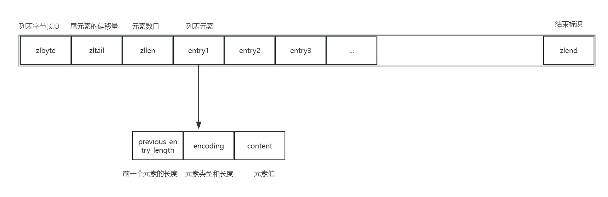
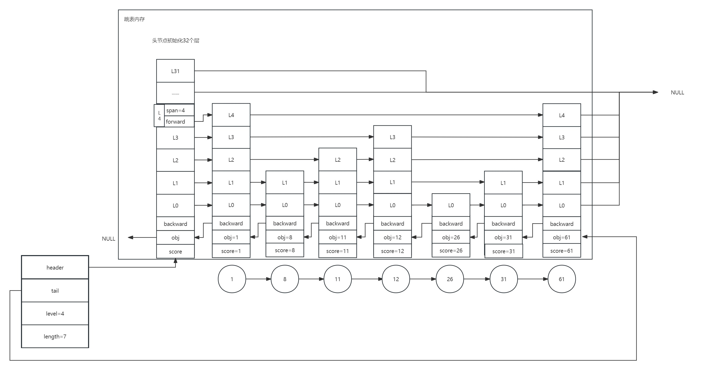

# Redis

## 数据类型与数据结构
学习笔记来源：https://zhuanlan.zhihu.com/p/282784568

.jpg)

Redis集合类型底层使用到的数据结构：双向链表、压缩列表、哈希、跳表、整数数组。

**整数数组和双向链表**：它们的操作特征都是顺序读写，也就是通过数组下标或者链表的指针逐个元素访问，操作复杂度基本是 O(N)，操作效率比较低

**压缩列表**：本质类似于一个数组，与数组不同的是，压缩列表在表头有三个字段zlbytes、zltail、zllen，分别表示列表长度、列表尾的偏移量和列表中entry个数，在压缩列表的表位还有一个字段zlend，表示列表结束。



**跳表**：跳表是在链表的基础上，增加了多级索引，通过索引的位置的几个跳转，快速定位数据。跳表主要由以下部分组成：header（维护跳跃表头节点指针）、tail（尾节点指针）、length（跳表中节点个数）、level（最大支持层数），表节点结构如下：obj（成员对象）、score（分值）、backward（后退指针）、zskiplistLevel （层{forward（前进指针）、span（跨度）}）




| 数据结构       | 时间复杂度 | 数据类型           | 优点                                                         | 缺点                                                         | 使用场景                                                     |
| -------------- | ---------- | ------------------ | ------------------------------------------------------------ | ------------------------------------------------------------ | ------------------------------------------------------------ |
| 简单动态字符串 |            | String             | 1. O(1)时间复杂度获取字符串长度；2. 缓冲区溢出规避；3. 减少内存重新分配次数 | 占用的内存空间可能会比实际字符串长度大，存在一定的空间浪费   | 需要保存文本或二进制数据的场景                               |
| 压缩列表       | O(N)       | Hash、List         | 1. 空间紧凑，提升内存使用率                                  | 1. 元素多时访问性能降低；2. 元素过大，引发连锁更新问题       | 1. 列表数量少2. 元素size较小                                 |
| 跳表           | O(logN)    | SortSet            | 1. 查询性能高；2.与红黑树和AVL树相比 不需要动态平衡，实现简单。 | 1. 针对数据分布特点差异较大的有序集合，Redis跳表的性能并不比平衡树更优 | 需要排序的业务，如热搜榜、点赞榜                             |
| 双向链表       | O(N)       | List               | 1. 插入和删除操作效率高，支持快速在头部和尾部进行操作        | 1. 查找元素的效率较低，需要遍历链表                          | 适用于需要频繁在头部和尾部插入、删除元素的场景，例如消息队列的实现 |
| 哈希           | O(1)       | Hash、Set、SortSet | 1. 快速定位元素，适合存储键值对，并且具有快速的查找和更新能力 | 1. 消耗内存较大，对于小数据集可能会浪费空间                  | 适用于需要快速查找和更新键值对的场景，例如缓存系统、计数器等 |
| 整数数组       | O(N)       | Set                | 支持按索引快速查找元素，适合需要按位置访问元素的场景。       | 插入和删除元素效率较低，需要移动其他元素。                   | 适用于需要按位置索引访问元素的场景，例如固定大小的数据集合或需要频繁遍历的情况。 |

```
整数数组和压缩列表在查找时间复杂度方面并没有很大的优势，那为什么 Redis 还会把它们作为底层数据结构呢？

Redis的List底层使用压缩列表本质上是将所有元素紧挨着存储，所以分配的是一块连续的内存空间，虽然数据结构本身没有时间复杂度的优势，但是这样节省空间而且也能避免一些内存碎片；

两方面原因：

1、内存利用率，数组和压缩列表都是非常紧凑的数据结构，它比链表占用的内存要更少。Redis是内存数据库，大量数据存到内存中，此时需要做尽可能的优化，提高内存的利用率。

2、数组对CPU高速缓存支持更友好，所以Redis在设计时，集合数据元素较少情况下，默认采用内存紧凑排列的方式存储，同时利用CPU高速缓存不会降低访问速度。当数据元素超过设定阈值后，避免查询时间复杂度太高，转为哈希和跳表数据结构存储，保证查询效率。
```


## Redis扩容

Redis本身是键值型数据库，数据值无论是String还是集合类型都是存在一个大的哈希表，也就是全局哈希。当数据越来越多时，就需要扩容。

Redis会存在两个哈希表，一个当前正在使用，另一个在不需要扩容时不分配空间。当数据越来越多，哈希冲突也会变大，会影响到查询性能。所以需要进行**Rehash**。

传统的Rehash需要三步：

1. 初始化备用哈希表，使其容量大于哈希表1
2. 将哈希1数据复制到新的哈希表中
3. 释放哈希1空间

但是在第二步时，会造成Redis线程阻塞，所以Redis使用了**渐进式Hash**。方法就是在第二步时，Redis仍然处理客户端请求，每处理一个请求，从哈希表1中的第一个索引位置开始，顺带着将这个索引上所有的entry都拷贝到新的哈希表中，每处理一个请求就顺带拷贝下一个索引的entry。

## IO模型

### Redis的单线程

Redis的单线程是指**网络IO以及键值对读写使用同一个线程即单线程**，但其他功能，如持久化、异步删除、集群数据同步等是由额外的线程执行的。

Redis的快除了底层数据的优化，如跳表等以外，还有就是Redis的IO模型使用了多路复用，使用select/epoll机制。


为什么用单线程？
多线程会有共享资源的并发访问控制问题，为了避免这些问题，Redis 采用了单线程的模式，而且采用单线程对于 Redis 的内部实现的复杂度大大降低

为什么单线程就挺快？
1.Redis 大部分操作是在内存上完成，并且采用了高效的数据结构如哈希表和跳表
2.Redis 采用多路复用，能保证在网络 IO 中可以并发处理大量的客户端请求，实现高吞吐率

Redis 6.0 版本为什么又引入了多线程？
Redis 的瓶颈不在 CPU ，而在内存和网络，内存不够可以增加内存或通过数据结构等进行优化
但 Redis 的网络 IO 的读写占用了发部分 CPU 的时间，如果可以把网络处理改成多线程的方式，性能会有很大提升
所以总结下 Redis 6.0 版本引入多线程有两个原因
1.充分利用服务器的多核资源
2.多线程分摊 Redis 同步 IO 读写负荷

执行命令还是由单线程顺序执行，只是处理网络数据读写采用了多线程，而且 IO 线程要么同时读 Socket ，要么同时写 Socket ，不会同时读写

## Redis可靠性

Redis如何避免数据丢失？

1. AOF：redis写入内存后，在将指令记录到log中，也就是写后记录
2. RDB：内存快照，将内存中的数据在某一时刻记录下来

### AOF


Redis接收到指令后，先执行命令将缓存数据更新后，再将指令记录到日志中，这样Redis不必对语法进行检查，只有执行成功的指令才会被记录，这样可以避免记录错误指令，另外，他是在执行后记录所以不必阻塞当前操作。

风险：

1. 如果日志还未记录Redis就宕机，会丢失数据。所以此时Redis只是作为缓存使用问题不大，但作为数据库使用就无法恢复丢失的数据了。
2. 虽然写后记录不会对当前操作阻塞，但会对下一个操作带来阻塞风险，因为记录日志的线程也是主线程，当日志文件写入磁盘时，就有可能会导致磁盘写入压力大，后续操作无法进行。

解决方案：

这两个风险都是与写入磁盘有关，所以只要选择好回写机制就可以很好的解除风险。对此，Redis的AOF机制提供三个选择

1. always：同步写回，每个写命令执行后立刻将日志写回磁盘
2. everysec：每秒写回，每个写命令执行后记录到缓冲区，每隔一秒将内容写回磁盘
3. no：操作系统控制的写回，每个命令执行后记录到缓冲区，由操作系统决定何时写回磁盘。

如果向获得高性能就选择NO，如果想得到可靠性就选择Always，如果寄希望性能高有能接受损失一点数据，选择EverySec。

#### 日志文件太大了怎么办？

Redis的AOF日志会随着命令增加而增大，所以Redis引入了重新机制，将同一数据的多次操作合并，最终只保留与当前最新状态相一致的结果命令。比如某个key的值经历过1、2、3，经过重写机制后，命令key的值直接为3


那么 重写会不会阻塞主线程？

和 AOF 日志由主线程写回不同**，重写过程是由后台子进程 bgrewriteaof 来完成的**，这也是为了避免阻塞主线程，导致数据库性能下降。

每次 AOF 重写时，Redis 会先执行一个内存拷贝，用于重写；然后，使用两个日志保证在重写过程中，新写入的数据不会丢失。而且，因为 Redis 采用额外的线程进行数据重写，所以，这个过程并不会阻塞主线程。

### RDB

Redis另一种持久化方法，内存快照。是指内存中的数据在某一时刻将缓存里的数据记录下来。与AOF相比，RDB记录的不是命令而是内存数据，这样恢复数据时，世界将RDB文件读入内存就可以立刻恢复。

此时，需要考虑两个问题

#### 给哪些内存数据做快照？

这关系到快照的执行效率问题

为了保证可靠性，执行的是全量快照，在进行快照时所有的数据都记录的磁盘中。当数据大的时候，要考虑是否会阻塞主线程，因为这影响到Redis的性能。

Redis有两个命令生成RDB文件，分别是save和bgsave

1. save在主线程中执行，所以会阻塞，影响效率
2. bgsave创建一个子进程，专门进行RDB文件写入，不会阻塞。这是RDB的默认配置

#### 做快照时，数据还能被增删改吗？

为了快照而暂停写操作，肯定是不能接受的。所以这个时候，**Redis 就会借助操作系统提供的写时复制技术（Copy-On-Write, COW）**，在执行快照的同时，正常处理写操作。bgsave 子进程是由主线程 fork 生成的，可以共享主线程的所有内存数据。bgsave 子进程运行后，开始读取主线程的内存数据，并把它们写入 RDB 文件。

在bgsave子进程进行复制时，主线程对摸个数据进行了修改的话，这块数据就会被复制一份，bgsave子进程会吧副本数据接入RDB文件，所以主进程可以一直修改，不会影响效率。


#### 多久做一次快照？

如果太频繁进行快照，会有两个方便开销

1. **一方面，频繁将全量数据写入磁盘，会给磁盘带来很大压力，多个快照竞争有限的磁盘带宽，前一个快照还没有做完，后一个又开始做了，容易造成恶性循环。**
2. **另一方面，bgsave 子进程需要通过 fork 操作从主线程创建出来。虽然，子进程在创建后不会再阻塞主线程，但是，fork 这个创建过程本身会阻塞主线程，而且主线程的内存越大，阻塞时间越长。如果频繁 fork 出 bgsave 子进程，这就会频繁阻塞主线程了**。

此时我们可以做增量快照。**所谓增量快照**，就是指，做了一次全量快照后，后续的快照只对修改的数据进行快照记录，这样可以避免每次全量快照的开销。在第一次做完全量快照后，T1 和 T2 时刻如果再做快照，我们只需要将被修改的数据写入快照文件就行。但是，这么做的前提是，**我们需要记住哪些数据被修改了**

**这个方法既能享受到 RDB 文件快速恢复的好处，又能享受到 AOF 只记录操作命令的简单优势，颇有点“鱼和熊掌可以兼得”的感觉，建议你在实践中用起来。**


### AOF和RDB的选择

1. 数据不能丢失：AOF和RDB混用
2. 允许分钟级丢失：RDB
3. **如果只用 AOF**，优先使用**everysec** **的配置选项，因为它在可靠性和性能之间取了一个平衡。**

## Redis的主从数据一致

Redis单节点发生宕机，可以用AOF或者RDB方式恢复数据。但在回复期间会造成服务不可用，不具有可靠性，所以会使用主从模式来提高可靠性。

使用主从会带来一个问题，那就是主从数据一致性问题，

Redis使用的方法是写操作只有主库可以进行写入主库后同步给从库，读操作主从都可以。这样可以避免对于同一个数据的写操作在不同的实例上进行带来数据混乱的问题。


### 何时同步

例如，现在有实例 1（ip：172.16.19.3）和实例 2（ip：172.16.19.5），我们在实例 2 上执行以下这个命令后，实例 2 就变成了实例 1 的从库，并从实例 1 上复制数据：，执行命令

```
replicaof  172.16.19.3  6379
```

这时，是主从库间建立连接、协商同步的过程，主要是为全量复制做准备**。在这一步，从库和主库建立起连接，并告诉主库即将进行同步，主库确认回复后，主从库间就可以开始同步了。**FULLRESYNC 响应表示第一次复制采用的**全量复制**，也就是说，主库会把当前所有的数据都复制给从库。


1. runID，是每个 Redis 实例启动时都会自动生成的一个随机 ID，用来唯一标记这个实例。当从库和主库第一次复制时，因为不知道主库的 runID，所以将 runID 设为“？”。
2. offset，此时设为 -1，表示第一次复制

主库收到命令后会执行bgsave命令，生成RDB文件发给从库。从库接收到主库的数据后，会将自己的数据清空，将主库给的RDB文件的内容加载。主库在于从库同步的过程中，是不会阻塞其他的请求的，而这些新的操作，主库会在内存中使用专门的**replication buffer，记录RDB生成后的所有的写操作**

最后从库同步完RDB文件后，主库会吧replication buffer中的数据再发给从库，这样就完成了主从同步。

### 主从级联模式分担全量复制时的主库压力

当从库多时，主库不断fork子进程会阻塞主线程，以及生成RDB文件和传输RDB文件。这样会降低主库的对客户端的响应效率。所以Redis采用的是**主 - 从 - 从”模式**。在部署主从集群的时候，可以手动选择一个从库（比如选择内存资源配置较高的从库），用于级联其他的从库。然后，我们可以再选择一些从库（例如三分之一的从库），在这些从库上执行如下命令，让它们和刚才所选的从库，建立起主从关系。

```c
replicaof 所选从库的IP 6379
```


### 主从库间网络断了怎么办？

Redis 2.8 开始，网络断了之后，**主从库会采用增量复制的方式继续同步**。在增量复制时，使用repl_backlog_buffer 这个缓冲区。当主从库断连后，主库会把断连期间收到的写操作命令，**写入 replication buffer**，同时也会把这些操作命令也写入 **repl_backlog_buffer 这个缓冲区**。


主库可能会收到新的写操作命令，所以，一般来说，master_repl_offset 会大于 slave_repl_offset。此时，主库只用把 master_repl_offset 和 slave_repl_offset 之间的**命令操作同步给从库就行**。

**repl_backlog_buffer 是一个环形缓冲区**如果从库的读取速度比较慢，就有可能导致从库还未读取的操作被主库新写的操作覆盖了，这会导致主从库间的数据不一致。

```
我们可以调整 repl_backlog_size 这个参数。这个参数和所需的缓冲空间大小有关。缓冲空间的计算公式是：缓冲空间大小 = 主库写入命令速度 * 操作大小 - 主从库间网络传输命令速度 * 操作大小。在实际应用中，考虑到可能存在一些突发的请求压力，我们通常需要把这个缓冲空间扩大一倍，即 repl_backlog_size = 缓冲空间大小 * 2，这也就是 repl_backlog_size 的最终值。
举个例子，如果主库每秒写入 2000 个操作，每个操作的大小为 2KB，网络每秒能传输 1000 个操作，那么，有 1000 个操作需要缓冲起来，这就至少需要 2MB 的缓冲空间。否则，新写的命令就会覆盖掉旧操作了。为了应对可能的突发压力，我们最终把 repl_backlog_size 设为 4MB。这样一来，增量复制时主从库的数据不一致风险就降低了。
```

