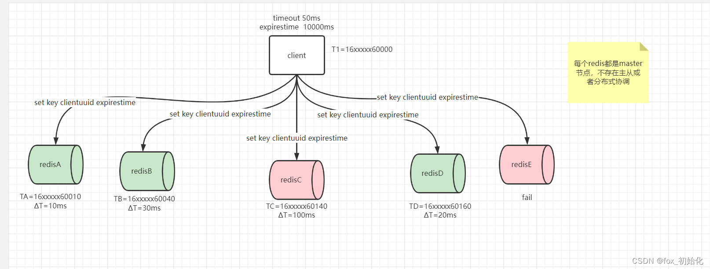

​
分布式锁

三个属性：

1. 安全属性：互斥性 任意时间只有一个客户端可以持有锁

2. 活性属性A：无死锁  即使持有锁的客户端崩溃或者被分区，最终也总是可能获得一个锁

3. 活性属性B：容错 只要redis大部分节点存活，客户端就可以获取锁和释放锁

单实例解决的场景：

正常我们利用redis作为分布式锁，客户端需要占有资源的时候会创建一个key并加上过期时间（满足无死锁特点），当客户端需要释放这个资源时，redis就会删除锁。

大部分情况下是没问题的，当redis的master节点挂了怎么办？这就是单点故障的问题。为了满足高可用，我们可以增加副本节点去解决master不可用带来的问题。但并不行。因为这样做我们不能时间我们的安全属性（互斥性），因为在redis主从数据复制是异步。

这里介绍这个模式下的条件：

1. 客户端A在master节点获取到锁

2. 在将key同步到副本之前，master节点崩溃了

3. 副本节点成为了主节点

4. 其他的客户端在新的master节点上也获取到了资源A的锁。这时候就违反了安全原则

有时，在特殊情况下(例如在故障期间)，多个客户机可以同时持有锁是完全可以的。如果是这种情况，您可以使用基于复制的解决方案。否则，我们建议实现本文档中描述的解决方案。

1. setnx

首先设置一个锁，再加上一个过期时间
```aidl
SET resource_name my_random_value NX PX 30000
```


2.  基本上后续的客户端再去获取这个锁的时候，会去判断这个key是否有值继而判断资源是否被占用。

3. 释放锁，这里会有一个问题：释放别人的锁
```aidl
if redis.call("get",KEYS[1]) == ARGV[1] then
return redis.call("del",KEYS[1])
else
return 0
end
```


a. 当前客户端A设置了锁key=A，过期时间t

b.因为某些原因，客户端A阻塞，锁失效

c. 这时候另一个客户端B来加锁，发现key不存在，又设置了key=A，

d. 这时，客户端A完成了，释放了锁，

e. 但此时持有锁的是客户端B，也就是A释放了B的锁。

所以锁需要加一些唯一标识或者签名表示当前客户端的锁，才能不释放别人的锁。也就是这个key对应的value需要时当前客户端业务的唯一标识。

目前单节点redis作为分布式锁看起来是可以了，但是一旦redis故障，将会不可用，那么就需要redis集群来保障。

解决单点故障带来的Redis可用性问题

RedLock红锁

准备一个五个主节点的Redis集群分别部署在5个机器或者虚拟机上。

1. 获取当前毫秒数为T1

2. 尝试去对这5个事例使用相同的key和value分别获取锁，同时设置超时时间timeout，过期时间exprestime，timeout远小于exprestime，例如，如果自动释放时间为10秒，则超时时间可能在~ 5-50毫秒范围内。如果达到超时时间当前实例还未设置成功则放弃，记为失败继续获取下一个事例的锁。

3. 那么客户端在每一个实例获取锁的时间currentTime-T1。如果成功获取锁的数量大于节点个数的一半，也就是3，且当获取锁所花费的总时间小于锁有效时间，则表示获取成功。

4. 如果获得了锁，那么它的有效时间被认为是初始有效时间减去经过的时间，currentTime-T1。

5. 如果客户端由于某种原因(无法锁定N/2+1个实例或有效时间为负数)而无法获得锁，它将尝试解锁所有实例(即使是它认为无法锁定的实例)。



异步问题：

因为以上获取每个redis节点的锁的过程是不是异步的，所以为了避免更小的误差 需要在ΔT上再减去一些毫秒数，以补偿进程之间的时钟漂移，以获取做大限度的互斥性。

重试和失败问题：

没看懂...

释放锁：

无论是否加锁成功锁是否存在，都可以执行释放锁的命令


​