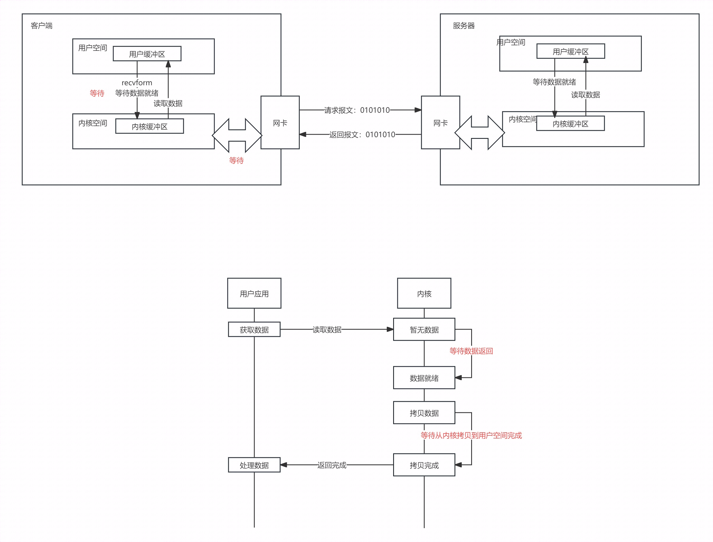
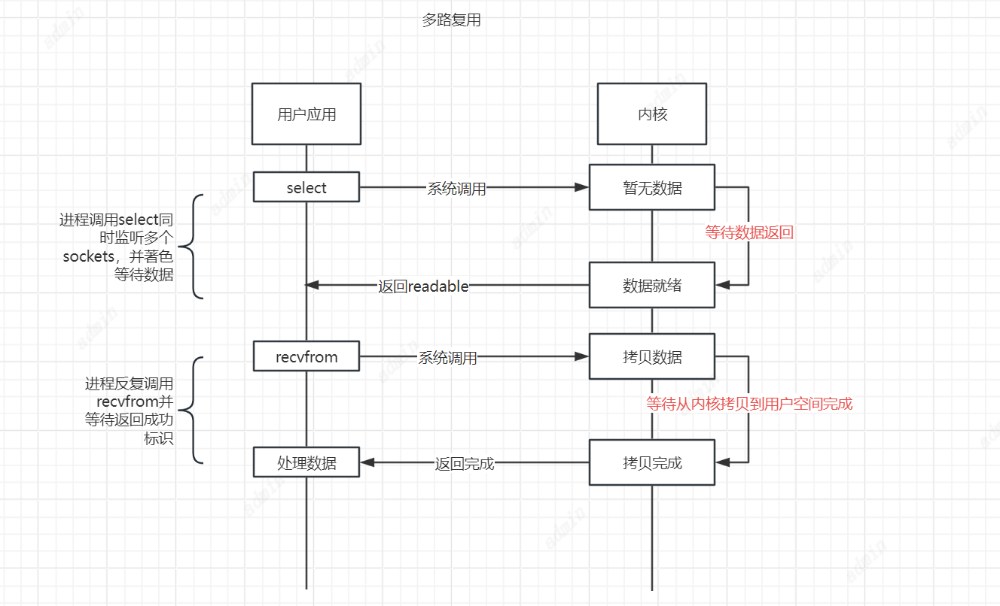
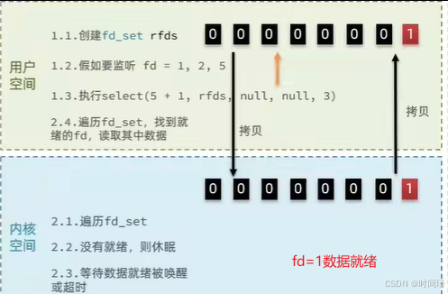
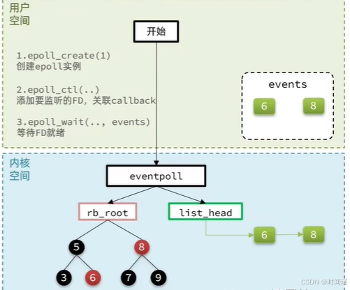
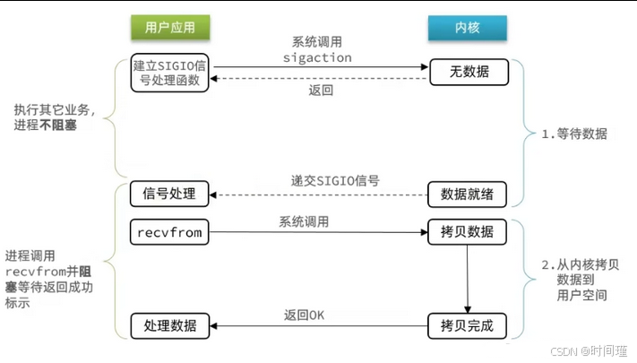
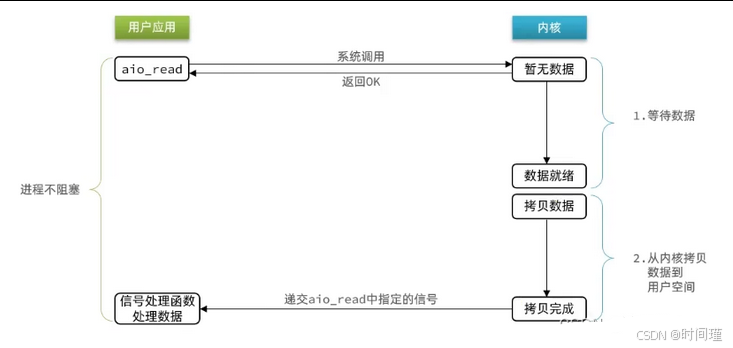
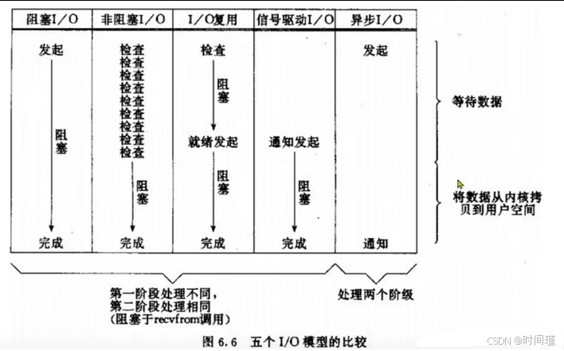

# 5种网络模型
## BIO（阻塞IO）

用户程序想要获取数据需要先去内核缓冲区获取，如果内核缓冲区没有就去硬件或者网卡获取，等内核缓冲区获取到网卡的数据后，在将数据写回用户缓冲区。
具体流程如下图：
用户去读取数据时，会去先发起recvform一个命令，去尝试从内核上加载数据，如果内核没有数据，那么用户就会等待，此时内核会去从硬件上读取数据，内核读取数据之后，会把数据拷贝到用户态，并且返回ok，整个过程，都是阻塞等待的，这就是阻塞IO

阶段一：
用户进程尝试读取数据（比如网卡数据）
此时数据尚未到达，内核需要等待数据
此时用户进程也处于阻塞状态
阶段二：
数据到达并拷贝到内核缓冲区，代表已就绪
将内核数据拷贝到用户缓冲区
拷贝过程中，用户进程依然阻塞等待
拷贝完成，用户进程解除阻塞，处理数据
## NIO （非阻塞IO/新IO）
非阻塞IO的recvfrom操作会立刻返回结果而不是阻塞用户进程。

阶段一：
用户进程尝试读取数据（比如网卡数据）
此时数据尚未到达，内核需要等待数据
就立刻返回异常给用户进程
用户进程拿到error后，再次尝试读取
循环往复，直到数据就绪

阶段二：

将内核数据拷贝到用户缓冲区
拷贝过程中，用户进程依然阻塞等待
拷贝完成，用户进程解除阻塞，处理数据

可以看到，非阻塞IO模型中，**用户进程**在第一个阶段是非阻塞，第二个阶段是阻塞状态。虽然是非阻塞，但性能并没有得到提高。而且忙等机制会导致CPU空转，CPU使用率暴增。

## IO多路复用
无论是阻塞IO还是非阻塞IO，用户应用在一阶段都需要调用recvfrom来获取数据，差别在于无数据时的处理方案：

如果调用recvfrom时，恰好没有数据，阻塞IO会使CPU阻塞，非阻塞IO使CPU空转，都不能充分发挥CPU的作用。
如果调用recvfrom时，恰好有数据，则用户进程可以直接进入第二阶段，读取并处理数据

多路复用模型可以通过文件描述符（File Descriptor）：简称FD（是一个从0 开始的无符号整数，用来关联Linux中的一个文件。在Linux中，一切皆文件，例如常规文件、视频、硬件设备等，当然也包括网络套接字（Socket）），利用一个线程监听多个FD，并在某个FD可读、可写时得到通知，
从而避免无效的等待，充分利用CPU资源。

阶段一：

用户进程调用select，指定要监听的FD集合
内核监听FD对应的多个socket
任意一个或多个socket数据就绪则返回readable
此过程中用户进程阻塞

阶段二：

用户进程找到就绪的socket
依次调用recvfrom读取数据
内核将数据拷贝到用户空间
用户进程处理数据

当用户去读取数据的时候，不再去直接调用recvfrom了，而是调用select的函数，select函数会将需要监听的数据交给内核，由内核去检查这些数据是否就绪了，如果说这个数据就绪了，就会通知应用程序数据就绪，然后来读取数据，再从内核中把数据拷贝给用户态，完成数据处理，如果N多个FD一个都没处理完，此时就进行等待。
用IO复用模式，可以确保去读数据的时候，数据是一定存在的，他的效率比原来的阻塞IO和非阻塞IO性能都要高

IO多路复用 是利用单个线程来同时监听多个FD(文件描述符)，并在某个FD可读、可写时得到通知，从而避免无效的等待，充分利用CPU资源。不过监听FD的方式、通知的方式又有多种实现，常见的有：
1. select
   最早的Linux的I/O多路复用实现方案：
   简单说，就是我们把需要处理的数据封装成FD，然后在用户态时创建一个fd的集合（这个集合的大小是要监听的那个FD的最大值+1，但是大小整体是有限制的 ），这个集合的长度大小是有限制的，同时在这个集合中，标明出来我们要控制哪些数据，
比如要监听的数据，是1,2,5三个数据，此时会执行select函数，然后将整个fd发给内核态，内核态会去遍历用户态传递过来的数据，如果发现这里边都数据都没有就绪，就休眠，直到有数据准备好时，就会被唤醒，唤醒之后，再次遍历一遍，看看谁准备好了，然后再将处理掉没有准备好的数据，最后再将这个FD集合写回到用户态中去，此时用户态就知道了，奥，有人准备好了，但是对于用户态而言，并不知道谁处理好了，所以用户态也需要去进行遍历，然后找到对应准备好数据的节点，再去发起读请求，我们会发现，这种模式下他虽然比阻塞IO和非阻塞IO好，但是依然有些麻烦的事情， 比如说频繁的传递fd集合，频繁的去遍历FD等问题

select 存在的问题:
需要将整个 fd_set 从用户空间拷贝到内核空间, select 结束还要再次拷贝到用户空间
select 无法得知具体的哪个 fd 就绪, 需要遍历整个 fd_set
fd_set 监听的fd数量不能超过 1024

2. poll
poll模式对select模式做了简单改进，但性能提升不明显，部分关键代码如下：
IO流程：
创建pollfd数组，向其中添加关注的fd信息，数组大小自定义
调用poll函数，将pollfd数组拷贝到内核空间，转链表存储，无上限
内核遍历fd，判断是否就绪
数据就绪或超时后，拷贝pollfd数组到用户空间，返回就绪fd数量n
用户进程判断n是否大于0,大于0则遍历pollfd数组，找到就绪的fd

与select对比：
select 模式中的 fd_set 大小固定为1024，而 pollfd 在内核中采用链表，理论上无上限
但监听FD越多，每次遍历消耗时间也越久，性能反而会下降

3. epoll
其中 select 和 pool 相当于是当被监听的数据准备好之后，他会把你监听的FD整个数据都发给你，你需要到整个FD 中去找，哪些是处理好了的，需要通过遍历的方式，所以性能也并不是那么好
而 epoll 模式是对 select 和 poll 的改进，相当于内核准备好了之后，他会把准备好的数据，直接发给你，咱们就省去了遍历的动作。

epoll提供了三个函数
1、 eventpoll函数，他内部包含两种数据结构东西
红黑树-> 记录的事要监听的FD
链表->一个链表，记录的是就绪的FD
2、 紧接着调用epoll_ctl操作，将要监听的数据添加到红黑树上去，并且给每个fd设置一个监听函数，这个函数会在fd数据就绪时触发，就是准备好了，现在就把fd把数据添加到list_head中去
3、 调用epoll_wait函数
就去等待，在用户态创建一个空的events数组，当就绪之后，我们的回调函数会把数据添加到list_head中去，当调用这个函数的时候，会去检查list_head，当然这个过程需要参考配置的等待时间，可以等一定时间，也可以一直等， 如果在此过程中，检查到了list_head中有数据会将数据添加到链表中，此时将数据放入到events数组中，并且返回对应的操作的数量，用户态的此时收到响应后，从events中拿到对应准备好的数据的节点，再去调用方法去拿数据。

## IO路多复用总结
select 模式存在的三个问题：

1. 能监听的FD最大不超过1024
2. 每次select都需要把所有要监听的FD都拷贝到内核空间
3. 每次都要遍历所有FD来判断就绪状态

poll 模式的问题：
1. poll利用链表解决了select中监听FD上限的问题，但依然要遍历所有FD，如果监听较多，性能会下降

epoll 模式中如何解决这些问题的？
1. 基于epoll实例中的红黑树保存要监听的FD，理论上无上限，而且增删改查效率都非常高
2. 每个FD只需要执行一次epoll_ctl添加到红黑树，以后每次epol_wait无需传递任何参数，无需重复拷贝FD到内核空间
3. 利用ep_poll_callback机制来监听FD状态，无需遍历所有FD，因此性能不会随监听的FD数量增多而下降

## 信号驱动IO
信号驱动IO是与内核建立SIGIO的信号关联并设置回调，当内核有FD就绪时，会发出SIGIO信号通知用户，期间用户应用可以执行其它业务，无需阻塞等待。
阶段一：

用户进程调用sigaction，注册信号处理函数
内核返回成功，开始监听FD
用户进程不阻塞等待，可以执行其它业务
当内核数据就绪后，回调用户进程的SIGIO处理函数
阶段二：

收到SIGIO回调信号
调用recvfrom，读取
内核将数据拷贝到用户空间
用户进程处理数据
!
当有大量IO操作时，信号较多，SIGIO处理函数不能及时处理可能导致信号队列溢出，而且内核空间与用户空间的频繁信号交互性能也较低。
## AIO（异步IO）
这种方式，不仅仅是用户态在试图读取数据后，不阻塞，而且当内核的数据准备完成后，也不会阻塞
他会由内核将所有数据处理完成后，由内核将数据写入到用户态中，然后才算完成，所以性能极高，不会有任何阻塞，全部都由内核完成，可以看到，异步IO模型中，用户进程在两个阶段都是非阻塞状态。
AIO（All In One）没有广泛使用的主要原因包括技术复杂性、维护难度和成本问题。

